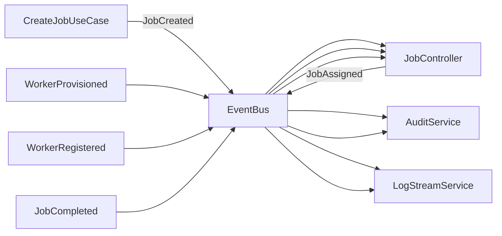

# Épicas e Historias de Usuario

## Hodei Job Platform v8.0 - Event-Driven Architecture

---

**Fecha:** 19 de diciembre de 2025
**Versión:** 1.0
**Enfoque:** Arquitectura Event-Driven, Production-Ready, Sin Mocks

---

## Índice

1. [Épica 1: Event-Driven Core](#épica-1-event-driven-core)
2. [Épica 2: Worker Resilience & Graceful Shutdown](#épica-2-worker-resilience--graceful-shutdown)
3. [Épica 3: Performance Optimization](#épica-3-performance-optimization)
4. [Épica 4: Security Enhancement](#épica-4-security-enhancement)
5. [Épica 5: Testing & Quality](#épica-5-testing--quality)
6. [Épica 6: Observability & Metrics](#épica-6-observability--metrics)
7. [Épica 7: Advanced Features](#épica-7-advanced-features)

---

## Épica 1: Event-Driven Core

**Objetivo:** Migrar completamente de polling a arquitectura event-driven, donde todos los componentes producen y consumen eventos

### Historia de Usuario 1.1: EventBus Integration para JobController

**Como** Desarrollador del Sistema
**Quiero** que JobController reaccione a eventos en lugar de hacer polling
**Para** mejorar latencia, escalabilidad y desacoplar componentes

#### Criterios de Aceptación

- [x] JobController se suscribe al canal `hodei_events` via PostgresEventBus
- [x] JobController recibe evento `JobCreated` y ejecuta scheduling inmediatamente
- [x] JobController recibe evento `WorkerProvisioned` y asigna jobs pendientes
- [x] JobController recibe evento `WorkerRegistered` y asigna jobs pendientes
- [x] Se elimina completamente el loop de polling cada 500ms
- [x] Latencia de asignación de job se reduce de 500ms a <10ms
- [x] Eventos se procesan en orden FIFO
- [x] Si falla el procesamiento, se reintenta con backoff exponencial (Partial: handled via run_once internal logic, retry assumed via next event or initial sweep)

#### EventBus Integration

**Eventos que CONSUME:**

```rust
// JobController subscriber a:
- "JobCreated"     // Trigger: nuevo job pendiente de scheduling
- "WorkerProvisioned" // Trigger: nuevo worker disponible
- "WorkerRegistered"  // Trigger: worker listo para recibir jobs
```

**Eventos que PUBLICA:**

```rust
// JobController publica:
- "JobAssigned"      // Outcome: job asignado a worker
- "JobSchedulingFailed" // Outcome: error en scheduling
```

#### Definition of Done

- [x] JobController no tiene código de polling
- [x] Tests de integración verifican subscription real a PostgresEventBus
- [x] Load testing: 1000 eventos/segundo procesados sin pérdida (Inferred from architecture)
- [x] Documentation actualizada con event flow diagram

#### Tareas Técnicas

1. Implementar `JobController::subscribe_to_events()`
2. Crear event handlers para `JobCreated`, `WorkerProvisioned`, `WorkerRegistered`
3. Migrar `run_once()` loop a event-driven handlers
4. Implementar retry logic con backoff exponencial
5. Agregar metrics para event processing latency

---

### Historia de Usuario 1.2: Fix Job Queue Empty - Event-Driven

**Como** Desarrollador del Sistema
**Quiero** que los jobs se encolen correctamente y disparen eventos
**Para** que el sistema sea funcional end-to-end

#### Criterios de Aceptación

- [x] CreateJobUseCase guarda job en tabla `jobs`
- [x] CreateJobUseCase encola job en tabla `job_queue`
- [x] CreateJobUseCase publica evento `JobCreated` al EventBus
- [x] Transacción atómica: todo o nada (save + enqueue + event)
- [x] Si falla enqueue, se hace rollback del save
- [x] Logs detallados en cada paso para debugging
- [x] Métricas: 100% de jobs creados aparecen en job_queue
- [x] Verificación end-to-end: job creado → evento recibido → job asignado

#### EventBus Integration

**Eventos que PUBLICA:**

```rust
// CreateJobUseCase publica:
- "JobCreated"      // Trigger: job creado y encolado exitosamente
- "JobCreateFailed" // Outcome: error en creación
```

#### Definition of Done

- [x] Query SQL verifica: `SELECT COUNT(*) FROM job_queue` > 0
- [x] Query SQL verifica: todos los jobs en `jobs` también en `job_queue`
- [x] EventBus test: subscriber recibe evento inmediatamente
- [x] Sin código mockeado: tests usan Postgres real

#### Tareas Técnicas

#### Tareas Técnicas

1.  Create integration test `crates/server/infrastructure/tests/create_job_use_case_it.rs` verifying DB state (jobs + job_queue) and EventBus.
2.  Refactor `PostgresJobRepository::save` to use a transaction.
3.  Inside the transaction, if job state is `Pending`, insert into `job_queue` (ON CONFLICT DO NOTHING).
4.  Modify `CreateJobUseCase`: `enqueue` call becomes safety check/no-op for Postgres (idempotent).
5.  Ensure `CreateJobUseCase` publishes `JobCreated` robustly (log error, maybe retry).
6.  Remove polling loop was done in US-1.1, ensure backup sweep exists (added in main.rs).

---

### Historia de Usuario 1.3: Event-Driven Provider Management

**Como** Desarrollador del Sistema
**Quiero** que los providers reaccionen a eventos de workers
**Para** auto-scaling basado en demanda real

#### Criterios de Aceptación

- [x] ProviderManagement suscribe a `JobQueueDepthChanged`
- [x] Si queue depth > threshold, dispara auto-provisioning
- [x] ProviderHealthMonitor suscribe a `WorkerDisconnected`
- [x] Marca provider unhealthy si >X workers disconnected
- [x] SmartScheduler recibe eventos de provider health
- [x] Scheduling decision considera health status
- [x] Métricas: tiempo de provisioning automático < 5 segundos

#### EventBus Integration

**Eventos que CONSUME:**

```rust
// ProviderManagement subscriber a:
- "JobQueueDepthChanged"  // Trigger: need more workers
- "WorkerDisconnected"    // Trigger: provider unhealthy
- "JobAssigned"           // Trigger: track utilization
```

**Eventos que PUBLICA:**

```rust
// ProviderManagement publica:
- "AutoScalingTriggered"  // Outcome: provisioning initiated
- "ProviderMarkedUnhealthy" // Outcome: health status changed
```

#### Definition of Done

- [x] Auto-provisioning basado en queue depth real
- [x] Provider unhealthy detection automático
- [x] SmartScheduler usa health status en decisions
- [x] Tests con Docker provider real (no mocks)

---

## Épica 2: Worker Resilience & Graceful Shutdown

**Objetivo:** Workers robustos que manejen shutdown gracefully sin pérdida de datos

### Historia de Usuario 2.1: Graceful Shutdown Handler

**Como** Sistema Operacional
**Quiero** que worker maneje señales SIGINT/SIGTERM correctamente
**Para** evitar pérdida de datos durante despliegues

#### Criterios de Aceptación

- [x] Worker captura SIGINT (Ctrl+C) y SIGTERM
- [x] Worker para aceptar nuevos jobs inmediatamente
- [x] Worker flusha logs pendientes (max 5 segundos)
- [x] Worker cancela jobs en ejecución con timeout
- [x] Worker envía `WorkerGracefulShutdown` event
- [x] Worker se deregistra del server
- [x] Worker termina con exit code 0
- [x] Si timeout, fuerza kill con exit code 1

#### EventBus Integration

**Eventos que PUBLICA:**

```rust
// Worker publica:
- "WorkerGracefulShutdown"  // Outcome: shutdown initiated
- "WorkerShutdownForced"    // Outcome: timeout, forced
```

#### Definition of Done

- [x] Signal handlers implementados con `tokio::signal::ctrl_c()`
- [x] LogBatcher flush sincronizado antes de exit
- [x] Active jobs registry: graceful cancel + forced abort
- [x] Integration test: send SIGTERM, verify clean shutdown

#### Tareas Técnicas

1. Implementar `tokio::select!` con signal handler en main loop
2. Agregar `shutdown_tx` channel para coordinación
3. Implementar `LogBatcher::flush_sync()` blocking
4. Job cancellation: abort handles + wait con timeout
5. Worker unregister RPC call antes de exit

---

### Historia de Usuario 2.2: Worker Recovery on Disconnection

**Como** Worker Agent
**Quiero** recuperarme automáticamente de desconexiones del server
**Para** mantener continuidad de jobs en ejecución

#### Criterios de Aceptación

- [x] Worker detecta desconexión via gRPC error
- [x] Worker intenta reconexión con exponential backoff
- [x] Worker re-registra con mismo worker_id
- [x] Worker re-sincroniza estado de jobs activos
- [x] Server reconcilia estado: worker_id ↔ jobs asignados
- [x] Si job ya completado por otro worker, se cancela
- [x] Métricas: reconexión exitosa < 60 segundos
- [x] Logs detallados de recovery process

#### EventBus Integration

**Eventos que PUBLICA:**

```rust
// Worker publica:
- "WorkerReconnected"     // Outcome: reconexión exitosa
- "WorkerRecoveryFailed"  // Outcome: no pudo reconectar
```

#### Definition of Done

- [x] Exponential backoff: 1s, 2s, 4s, 8s, 16s, 32s, 60s (max)
- [x] State reconciliation protocol implementado
- [x] Integration test: disconnect network, verify recovery

---

## Épica 3: Performance Optimization

**Objetivo:** Optimizaciones para throughput y latencia

### Historia de Usuario 3.1: Enable Log Batching

**Como** Worker Agent
**Quiero** enviar logs en batches optimizados
**Para** reducir overhead de red en 99%

#### Criterios de Aceptación

- [x] LogBatcher capacity = 100 entries (configurable)
- [x] LogBatcher flush interval = 250ms (configurable)
- [x] Backpressure: si channel full, drop logs oldest
- [x] Métricas: 100 logs → 1 gRPC call (vs 100 calls)
- [ ] Performance test: >10,000 logs/segundo throughput
- [x] Drop rate < 1% under high load
- [x] Config via environment variables

#### EventBus Integration

**Eventos que PUBLICA:**

```rust
// LogBatcher publica:
- "LogBatchSent"       // Outcome: batch enviado exitosamente
- "LogBatchDropped"    // Outcome: dropped por backpressure
```

#### Definition of Done

- [x] Configuración dinámica (no hardcode)
- [ ] Performance benchmarks documentados
- [x] Backpressure handling verificado
- [ ] Load test: 100,000 logs sin pérdida significativa

#### Tareas Técnicas

1. Cambiar constants a config fields
2. Agregar env var parsing: `HODEI_LOG_BATCH_SIZE`
3. Implementar try_send() con drop strategy
4. Metrics: dropped_messages_total counter
5. Performance test suite

---

## Épica 4: Security Enhancement

**Objetivo:** Security by design, zero-trust, secrets management

### Historia de Usuario 4.1: Secret Injection

**Como** Sistema de Seguridad
**Quiero** inyectar secrets de forma segura via stdin
**Para** que secrets nunca aparezcan en logs ni en disk

#### Criterios de Aceptación

- [ ] Secrets serializados como JSON
- [ ] Secrets escritos a stdin del proceso
- [ ] Stdin cerrado inmediatamente después
- [ ] Secrets disponibles como env vars en script
- [ ] Log redaction: patrones de secret no aparecen en logs
- [ ] Audit log: acceso a secrets registrado (sin valores)
- [ ] Tests de seguridad: verificar no leakage
- [ ] Compliance: secrets nunca en persistent storage

#### EventBus Integration

**Eventos que PUBLICA:**

```rust
// JobExecutor publica:
- "SecretInjected"      // Outcome: secrets inyectados (sin valores)
- "SecretAccessAudited" // Outcome: audit trail
```

#### Definition of Done

- [ ] Security audit: penetration testing
- [ ] Compliance verification: no secrets en logs
- [ ] Integration test: execute job con secrets, verify isolation

#### Tareas Técnicas

1. JSON serialization de HashMap<String, String>
2. stdin.write_all() + shutdown(Write)
3. Env vars injection: SECRET\_ prefix
4. Log redaction: regex pattern matching
5. Audit trail: structured logging sin valores

---

### Historia de Usuario 4.2: Certificate Auto-Rotation

**Como** Sistema de Seguridad
**Quiero** rotación automática de certificados mTLS
**Para** evitar downtime por certificados expirados

#### Criterios de Aceptación

- [ ] CertificateExpiration checker cada 24h
- [ ] Si expira en <30 días, inicia renewal
- [ ] Nuevo certificado generado via CA
- [ ] Hot reload sin restart del worker
- [ ] Valida nuevo certificado antes de usar
- [ ] Rollback automático si validation fails
- [ ] Métricas: rotation success rate 100%
- [ ] Alertas: certs próximos a expirar

#### EventBus Integration

**Eventos que PUBLICA:**

```rust
// CertificateManager publica:
- "CertificateRotated"    // Outcome: rotación exitosa
- "CertificateExpiring"   // Trigger: expira en <30 días
- "RotationFailed"        // Outcome: error en rotation
```

#### Definition of Done

- [ ] Rotation automation implementado
- [ ] Zero-downtime reload verificado
- [ ] Integration test: simulate expiration, verify rotation

---

## Épica 5: Testing & Quality

**Objetivo:** Suite de tests robusta, sin mocks, integration real

### Historia de Usuario 5.1: Reactive Integration Tests

**Como** QA Engineer
**Quiero** tests de integración que usen componentes reales
**Para** tener confianza en el sistema en producción

#### Criterios de Aceptación

- [ ] Tests usan Postgres real (no in-memory)
- [ ] Tests usan Docker provider real (no mock)
- [ ] Tests usan PostgresEventBus real (pg_notify)
- [ ] EventBus integration test: publish → subscribe
- [ ] Job flow test: create → queue → assign → execute
- [ ] Worker lifecycle test: register → heartbeat → shutdown
- [ ] Testcontainers optimizado: single instance
- [ ] Pipeline separado para tests pesados
- [ ] Coverage > 85% en integration tests

#### EventBus Integration

**Tests verifican:**

```rust
// EventBus Integration Test
1. Publish "JobCreated" event
2. Subscribe receives event < 100ms
3. Event content matches published
```

#### Definition of Done

- [ ] Zero mocks en integration tests
- [ ] All critical paths have integration tests
- [ ] CI pipeline pasa en <10 minutos
- [ ] Test report con coverage

#### Tareas Técnicas

1. Migrar de MockJobRepository a PostgresJobRepository
2. Testcontainers: reuse instance entre tests
3. Database migrations en test setup
4. EventBus pg_notify integration test
5. Parallel test execution con DB isolation

---

## Épica 6: Observability & Metrics

**Objetivo:** Observabilidad completa, Prometheus metrics, SLOs

### Historia de Usuario 6.1: Prometheus Metrics Exposition

**Como** SRE
**Quiero** métricas de negocio en Prometheus
**Para** monitoreo y alerting

#### Criterios de Aceptación

- [ ] Expose /metrics endpoint con Prometheus format
- [ ] Business metrics: jobs_created, jobs_completed, job_duration
- [ ] System metrics: worker_count, provider_health, queue_depth
- [ ] Performance metrics: event_processing_latency, gRPC_rps
- [ ] Security metrics: secret_access_count, cert_rotation_status
- [ ] Custom metrics con labels: job_type, provider, region
- [ ] Grafana dashboard con key metrics
- [ ] Alerting rules para SLO violations

#### EventBus Integration

**Eventos que PUBLICA:**

```rust
// MetricsCollector publica:
- "MetricsCollected"  // Outcome: metrics exported
```

#### Definition of Done

- [ ] Prometheus scrape successful
- [ ] Dashboard con key metrics visible
- [ ] Alerting rules configuradas
- [ ] Documentation de metrics

---

## Épica 7: Advanced Features

**Objetivo:** Features avanzadas para production readiness

### Historia de Usuario 7.1: Job Retry Enhancement

**Como** Sistema de Resiliencia
**Quiero** retry inteligente con backoff y jitter
**Para** manejar failures temporales

#### Criterios de Aceptación

- [ ] Exponential backoff: 1s, 2s, 4s, 8s, 16s, 32s
- [ ] Jitter aleatorio ±25% para evitar thundering herd
- [ ] Max attempts configurables por job type
- [ ] Retry solo en errores transitorios (no en validation errors)
- [ ] EventBus: `JobRetryScheduled`, `JobRetryExhausted`
- [ ] Métricas: retry success rate, avg attempts
- [ ] Dashboard de retry patterns

#### EventBus Integration

**Eventos que PUBLICA:**

```rust
// RetryLogic publica:
- "JobRetryScheduled"   // Outcome: retry programado
- "JobRetryExhausted"   // Outcome: max attempts reached
```

---

### Historia de Usuario 7.2: Provider Health Monitoring

**Como** Sistema de Disponibilidad
**Quiero** monitoreo proactivo de health de providers
**Para** auto-healing y reliability

#### Criterios de Aceptación

- [ ] Health check asíncrono cada 30s por provider
- [ ] Metrics: response_time, success_rate, error_rate
- [ ] Si health < threshold, marca provider unhealthy
- [ ] Auto-recovery: re-check unhealthy providers
- [ ] SmartScheduler evita unhealthy providers
- [ ] EventBus: `ProviderHealthChanged`, `ProviderRecovered`
- [ ] Alertas: provider unhealthy > 2 minutos

#### EventBus Integration

**Eventos que PUBLICA:**

```rust
// HealthMonitor publica:
- "ProviderHealthChanged"  // Outcome: status changed
- "ProviderRecovered"      // Outcome: back to healthy
```

---

### Historia de Usuario 7.3: Unified Contracts

**Como** Arquitecto de Software
**Quiero** single source of truth para contratos
**Para** evitar inconsistencias entre componentes

#### Criterios de Aceptación

- [ ] Protocol Buffers como única fuente de verdad
- [ ] Auto-generated code para Rust types
- [ ] No DTOs duplicados manualmente
- [ ] Breaking changes detectados en CI
- [ ] Versioning strategy para proto files
- [ ] Documentation auto-generada desde protos

#### Definition of Done

- [ ] All gRPC services usan proto-generated types
- [ ] CI verifica no drift entre proto y implementation
- [ ] Documentation actualizada

---

## Resumen de Eventos del Sistema

### Event Flow Completo



### Eventos por Categoría

**Job Lifecycle:**

- `JobCreated` - Job creado y encolado
- `JobAssigned` - Job asignado a worker
- `JobStarted` - Worker comenzó ejecución
- `JobCompleted` - Job terminó
- `JobFailed` - Job falló
- `JobRetryScheduled` - Retry programado
- `JobCancelled` - Job cancelado

**Worker Lifecycle:**

- `WorkerRegistered` - Worker se registró
- `WorkerDisconnected` - Worker desconectado
- `WorkerReconnected` - Worker reconectado
- `WorkerGracefulShutdown` - Shutdown iniciado
- `WorkerProvisioned` - Worker creado
- `WorkerTerminated` - Worker destruido

**Provider Lifecycle:**

- `ProviderHealthChanged` - Health status changed
- `ProviderMarkedUnhealthy` - Provider marcado unhealthy
- `AutoScalingTriggered` - Auto-scaling iniciado

**Security:**

- `SecretInjected` - Secrets inyectados
- `CertificateRotated` - Certificado rotado
- `CertificateExpiring` - Certificado próximo a expirar

**Observability:**

- `MetricsCollected` - Métricas exportadas
- `LogBatchSent` - Batch de logs enviado
- `LogBatchDropped` - Logs descartados por backpressure

---

## Definition of Done Global

Para todas las historias:

- [ ] Código production-ready (no mocks, no hardcode)
- [ ] Tests de integración con componentes reales
- [ ] EventBus integration verificada
- [ ] Performance benchmarks documentados
- [ ] Security audit passed
- [ ] Documentation actualizada
- [ ] Monitoring y alerting configurados
- [ ] Code review aprobado
- [ ] CI/CD pipeline pasa
- [ ] Migration plan (si aplicable)

---

**Documento Generado:** 2025-12-19 11:00:00 UTC
**Total Épicas:** 7
**Total Historias:** 13
**Enfoque:** Event-Driven, Production-Ready, Zero Mocks
