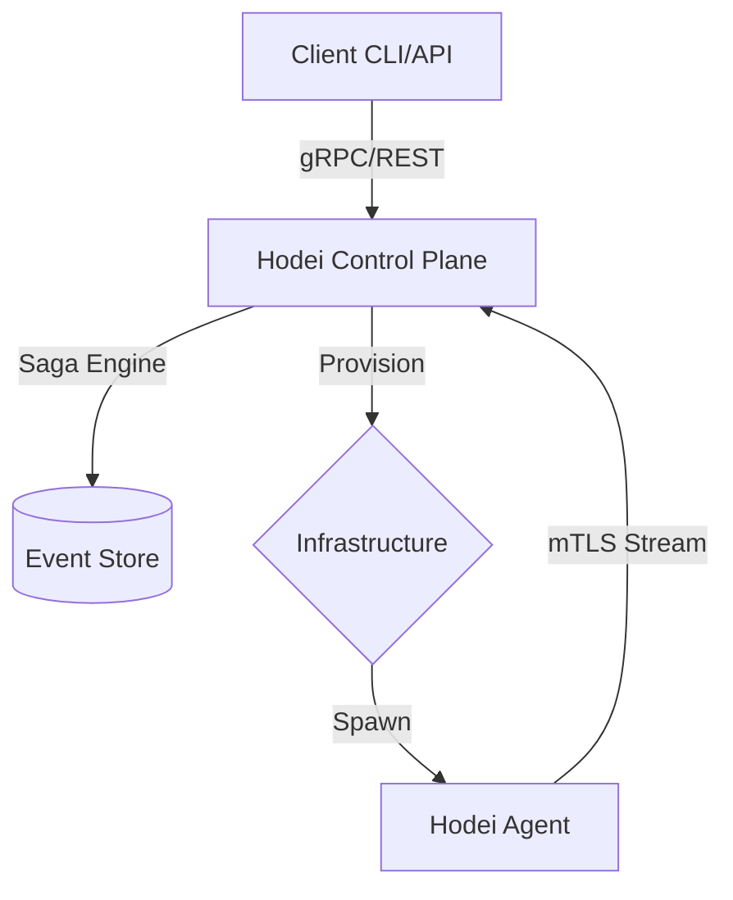

<p align="center">
  
</p>

<h1 align="center">Hodei Jobs Platform</h1>

<p align="center">
  <strong>The High-Performance, Durable, and Universal CI/CD Alternative</strong>
</p>

<p align="center">
  <a href="#-why-hodei">Why Hodei?</a> •
  <a href="#-key-features">Features</a> •
  <a href="#-architecture">Architecture</a> •
  <a href="#-quick-start">Quick Start</a> •
  <a href="#-performance">Performance</a> •
  <a href="#-documentation">Docs</a>
</p>

<p align="center">
  <a href="https://github.com/Rubentxu/hodei-jobs/actions/workflows/ci.yml">
    
  </a>
  <a href="https://github.com/Rubentxu/hodei-jobs/blob/main/LICENSE">
    
  </a>
  <a href="https://rust-lang.org">
    
  </a>
  <a href="./README_ES.md">
    
  </a>
</p>

---

## 🚀 The Future of CI/CD & Job Execution

**Hodei Jobs** is a distributed, high-performance job execution platform built in Rust. It redefines how you run CI/CD pipelines, long-running tasks, and HPC workloads by combining the **Durable Execution** of modern workflow engines with the **Universal Portability** of a multi-provider infrastructure.

### 🛡️ Durable Execution (Saga Engine v4.0)
Unlike traditional CI/CD tools, Hodei is built on a **Saga Engine** with **Event Sourcing**. This means your workflows are not just scripts; they are resilient processes that can survive server crashes, network partitions, and infrastructure failures.

---

## 💡 Why Hodei?

| Feature | **Jenkins** | **Tekton** | **Hodei Jobs** |
| :--- | :---: | :---: | :---: |
| **Language/Runtime** | Java (Bloated) | Go | **Rust (Ultralight)** |
| **Startup Time** | Slow (Minutes) | Medium (K8s Cold Start) | **Sub-second (Firecracker)** |
| **Security** | Plugin-dependent | K8s RBAC | **Native Zero Trust (mTLS)** |
| **Resilience** | Brittle (Lost state) | K8s-dependent | **Durable Sagas (Event Sourcing)** |
| **Infra Support** | VM/Bare Metal | K8s Only | **Universal (K8s, Docker, VMs)** |
| **Logic** | Groovy/DSL | YAML | **Workflows-as-Code** |

---

## ✨ Key Features

### 🔌 Universal Provisioning
Provision workers on-demand across any infrastructure:
- **Docker**: Simple, local, and fast.
- **Kubernetes**: Scale to infinity with cloud-native orchestration.
- **Firecracker**: Hardware-level isolation with sub-250ms startup times.

### ⚡ Extreme Performance (HPC-Ready)
- **LogBatching**: 90-99% reduction in gRPC overhead.
- **Zero-Copy I/O**: Memory-efficient streaming of huge log volumes.
- **Async Metrics**: Non-blocking resource tracking with cgroups integration.

### 🔐 Zero Trust Security
- **Inside-Out Connectivity**: Workers connect to the server; no open ports on executors.
- **mTLS PKI**: End-to-end encryption with automated certificate management.
- **Secret Injection**: Secure stdin injection prevents secrets from ever touching the disk or logs.

---

## 🏗️ Architecture

Hodei follows a **Hexagonal/DDD** architecture powered by an asynchronous Rust runtime.



### The "Inside-Out" Pattern
Every Hodei worker initiates its own connection to the Control Plane. This allows you to run workers in isolated private networks, behind firewalls, or in multi-cloud environments without complex VPNs or open ports.

---

## 📊 Performance Benchmark

| Optimization | Efficiency | Impact |
| :--- | :--- | :--- |
| **Network Overhead** | **95% Reduction** | LogBatching reduces gRPC calls from per-line to batched packets. |
| **Memory Pressure** | **40% Lower** | Zero-copy streaming avoids unnecessary allocations. |
| **Startup Latency** | **< 125ms** | Optimized Firecracker provider for near-instant execution. |
| **Reactivity** | **Instant** | Event-driven architecture replaces polling with reactive events. |

---

## 🚀 Quick Start

### 1. Prerequisites
```bash
# Rust 1.83+
curl --proto '=https' --tlsv1.2 -sSf https://sh.rustup.rs | sh
# Protobuf Compiler
sudo apt install protobuf-compiler
```

### 2. Launch local stack
```bash
# Clone and build
git clone https://github.com/Rubentxu/hodei-jobs.git && cd hodei-jobs
cargo build --release

# Start DB and Server
just dev-db
just db-migrate
cargo run --bin hodei-server-bin
```

### 3. Run Your First Job
```bash
# In a new terminal, execute a hello world in Kubernetes (local)
just job-k8s-hello
```

---

## 🗺️ Roadmap

- [x] **v8.0**: High-Performance Worker Agent & mTLS.
- [x] **v4.0 (Core)**: Saga Engine & Event Sourcing (In Progress).
- [ ] **Web Dashboard**: Modern UI for workflow visualization.
- [ ] **Native Workflows**: DAG support for complex multi-job pipelines.
- [ ] **OpenTelemetry**: Deep observability and distributed tracing.

---

## 🤝 Contributing

We are building the future of distributed execution. Join us!
Check [CONTRIBUTING.md](docs/development.md) for more info.

---

<p align="center">
  <strong>⭐ Star this repo to support the project!</strong>
</p>

<p align="center">
  Made with ❤️ by <a href="https://github.com/Rubentxu">Rubentxu</a>
</p>