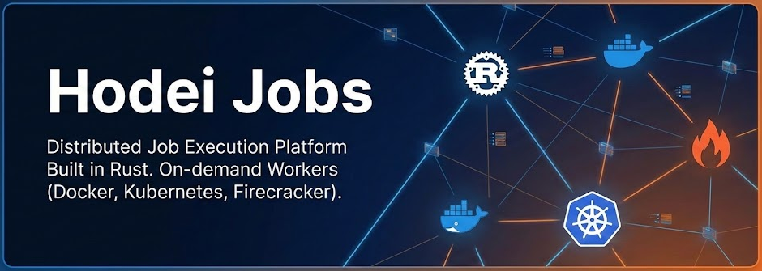
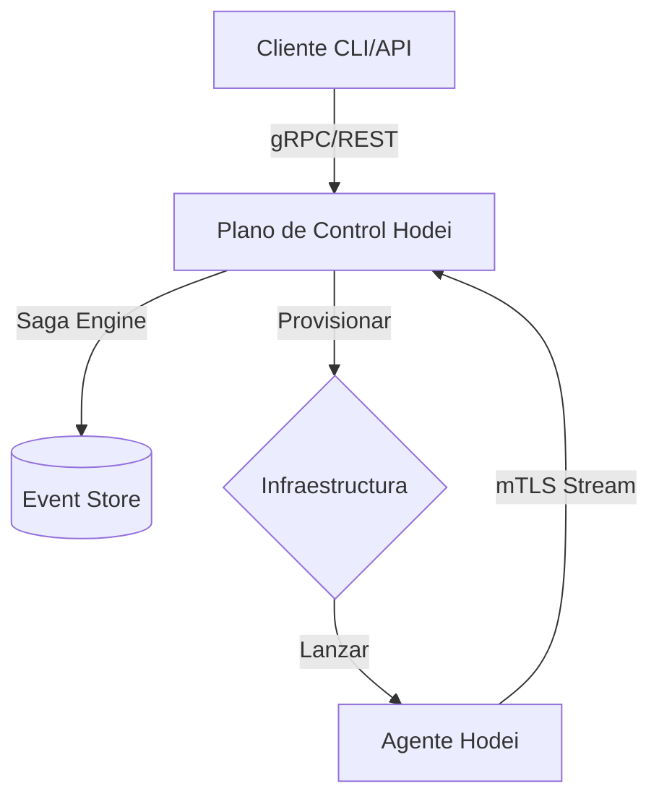

<p align="center">
  
</p>

<h1 align="center">Hodei Jobs Platform</h1>

<p align="center">
  <strong>La alternativa de CI/CD de alto rendimiento, durable y universal</strong>
</p>

<p align="center">
  <a href="#-por-qué-hodei">¿Por qué Hodei?</a> •
  <a href="#-características-clave">Características</a> •
  <a href="#-arquitectura">Arquitectura</a> •
  <a href="#-inicio-rápido">Inicio Rápido</a> •
  <a href="#-rendimiento">Rendimiento</a> •
  <a href="#-documentación">Docs</a>
</p>

<p align="center">
  <a href="https://github.com/Rubentxu/hodei-jobs/actions/workflows/ci.yml">
    
  </a>
  <a href="https://github.com/Rubentxu/hodei-jobs/blob/main/LICENSE">
    
  </a>
  <a href="https://rust-lang.org">
    
  </a>
  <a href="./README.md">
    
  </a>
</p>

---

## 🚀 El Futuro del CI/CD y la Ejecución de Jobs

**Hodei Jobs** es una plataforma de ejecución de jobs distribuidos de alto rendimiento construida en Rust. Redefinimos cómo ejecutas pipelines de CI/CD, tareas de larga duración y cargas de trabajo HPC combinando la **Ejecución Durable** de los motores de workflow modernos con la **Portabilidad Universal** de una infraestructura multi-proveedor.

### 🛡️ Ejecución Durable (Saga Engine v4.0)
A diferencia de las herramientas tradicionales de CI/CD, Hodei se construye sobre un **Saga Engine** con **Event Sourcing**. Esto significa que tus flujos de trabajo no son solo scripts; son procesos resilientes que sobreviven a caídas del servidor, particiones de red y fallos de infraestructura.

---

## 💡 ¿Por qué Hodei?

| Característica | **Jenkins** | **Tekton** | **Hodei Jobs** |
| :--- | :---: | :---: | :---: |
| **Lenguaje/Runtime** | Java (Pesado) | Go | **Rust (Ultraligero)** |
| **Tiempo de Arranque** | Lento (Minutos) | Medio (K8s Cold Start) | **Sub-segundo (Firecracker)** |
| **Seguridad** | Basada en Plugins | K8s RBAC | **Zero Trust Nativo (mTLS)** |
| **Resiliencia** | Frágil (Pérdida estado) | Dependiente de K8s | **Sagas Durables (Event Sourcing)** |
| **Infraestructura** | VM/Bare Metal | Solo K8s | **Universal (K8s, Docker, VMs)** |
| **Lógica** | Groovy/DSL | YAML | **Workflows-as-Code** |

---

## ✨ Características Clave

### 🔌 Aprovisionamiento Universal
Aprovisiona workers bajo demanda en cualquier infraestructura:
- **Docker**: Simple, local y rápido.
- **Kubernetes**: Escala al infinito con orquestación cloud-native.
- **Firecracker**: Aislamiento a nivel de hardware con arranque inferior a 250ms.

### ⚡ Rendimiento Extremo (HPC-Ready)
- **LogBatching**: Reducción del 90-99% en el overhead de gRPC.
- **I/O Zero-Copy**: Streaming de logs eficiente en memoria para grandes volúmenes.
- **Métricas Async**: Seguimiento de recursos no bloqueante con integración cgroups.

### 🔐 Seguridad Zero Trust
- **Conectividad Inside-Out**: Los workers se conectan al servidor; sin puertos abiertos en los ejecutores.
- **PKI mTLS**: Encriptación de extremo a extremo con gestión automatizada de certificados.
- **Inyección de Secretos**: La inyección segura vía stdin evita que los secretos toquen el disco o los logs.

---

## 🏗️ Arquitectura

Hodei sigue una arquitectura **Hexagonal/DDD** impulsada por un runtime asíncrono en Rust.



### El Patrón "Inside-Out"
Cada worker de Hodei inicia su propia conexión con el Plano de Control. Esto permite ejecutar workers en redes privadas aisladas, detrás de firewalls o en entornos multi-cloud sin necesidad de VPNs complejas ni puertos abiertos.

---

## 📊 Benchmark de Rendimiento

| Optimización | Eficiencia | Impacto |
| :--- | :--- | :--- |
| **Overhead de Red** | **95% de Reducción** | LogBatching reduce llamadas gRPC de línea a línea a paquetes agrupados. |
| **Presión de Memoria** | **40% Menor** | El streaming zero-copy evita asignaciones innecesarias. |
| **Latencia de Arranque** | **< 125ms** | Proveedor Firecracker optimizado para ejecución casi instantánea. |
| **Reactividad** | **Instantánea** | La arquitectura dirigida por eventos reemplaza el polling por eventos reactivos. |

---

## 🚀 Inicio Rápido

### 1. Requisitos Previos
```bash
# Rust 1.83+
curl --proto '=https' --tlsv1.2 -sSf https://sh.rustup.rs | sh
# Compilador Protobuf
sudo apt install protobuf-compiler
```

### 2. Lanzar stack local
```bash
# Clonar y compilar
git clone https://github.com/Rubentxu/hodei-jobs.git && cd hodei-jobs
cargo build --release

# Iniciar DB y Servidor
just dev-db
just db-migrate
cargo run --bin hodei-server-bin
```

### 3. Ejecuta tu Primer Job
```bash
# En una nueva terminal, ejecuta un hola mundo en Kubernetes (local)
just job-k8s-hello
```

---

## 🗺️ Roadmap

- [x] **v8.0**: Agente de Worker de Alto Rendimiento y mTLS.
- [x] **v4.0 (Core)**: Saga Engine y Event Sourcing (En progreso).
- [ ] **Dashboard Web**: Interfaz moderna para visualización de workflows.
- [ ] **Workflows Nativos**: Soporte para DAG en pipelines complejos multi-job.
- [ ] **OpenTelemetry**: Observabilidad profunda y trazabilidad distribuida.

---

## 🤝 Contribuir

Estamos construyendo el futuro de la ejecución distribuida. ¡Únete!
Consulta [CONTRIBUTING.md](docs/development.md) para más información.

---

<p align="center">
  <strong>⭐ ¡Dale una estrella a este repo para apoyar el proyecto!</strong>
</p>

<p align="center">
  Hecho con ❤️ por <a href="https://github.com/Rubentxu">Rubentxu</a>
</p>
