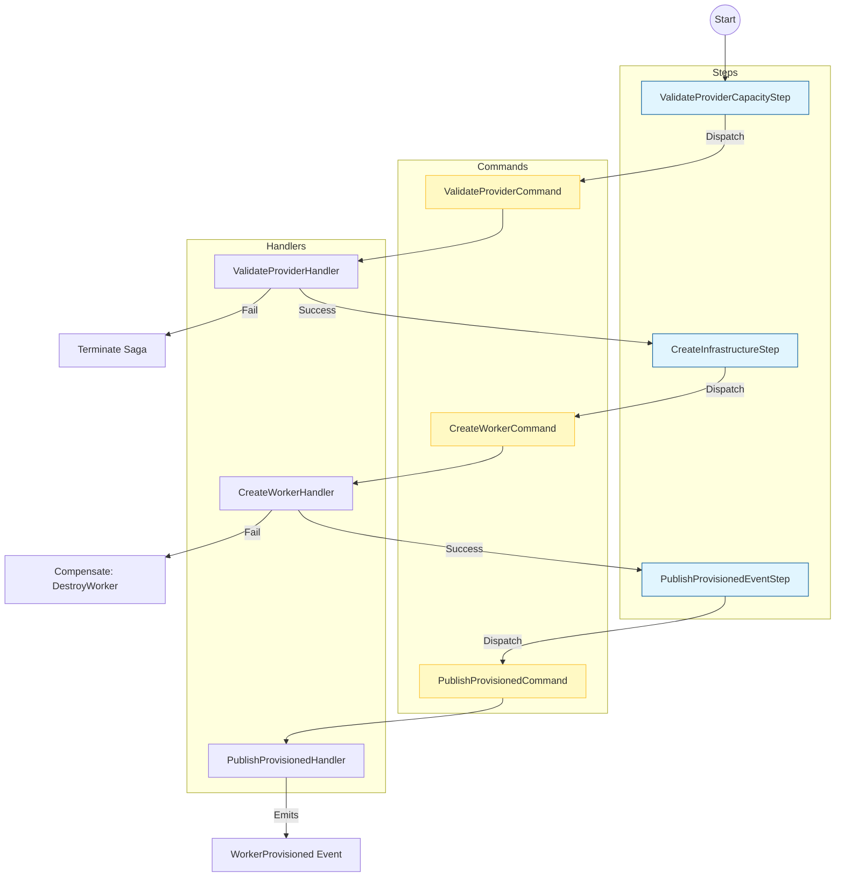
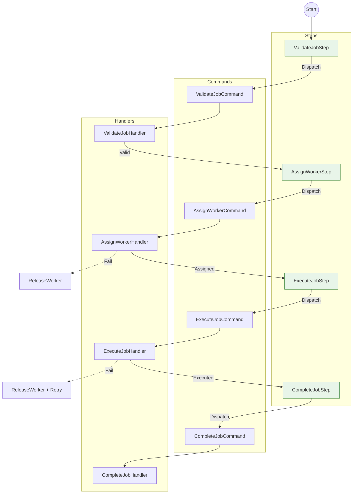
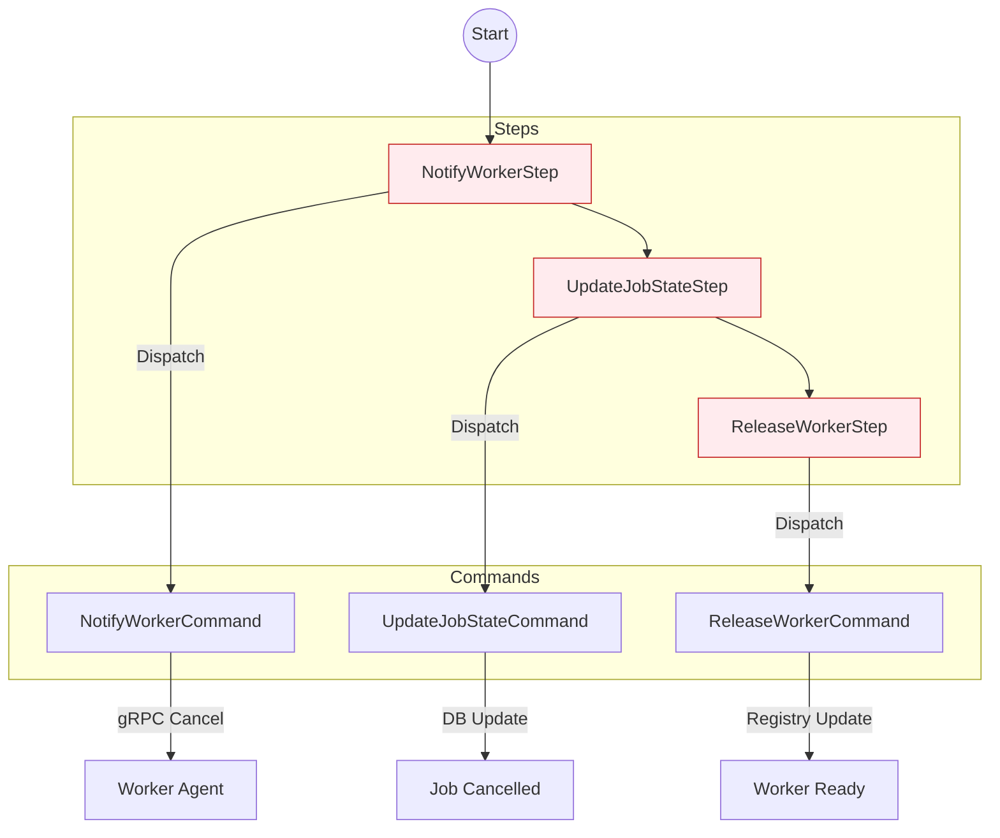
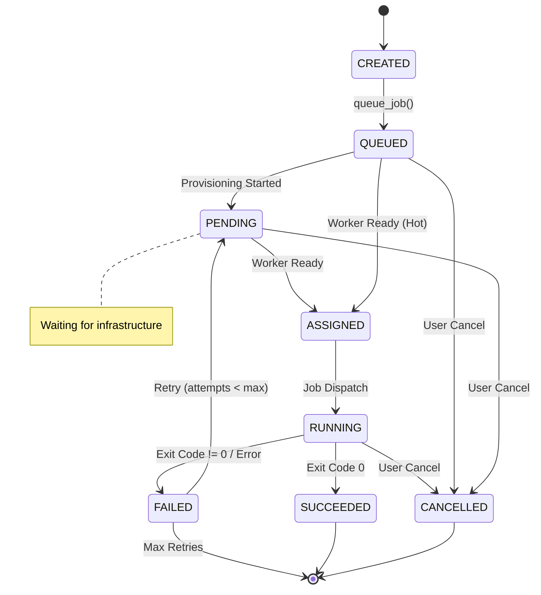
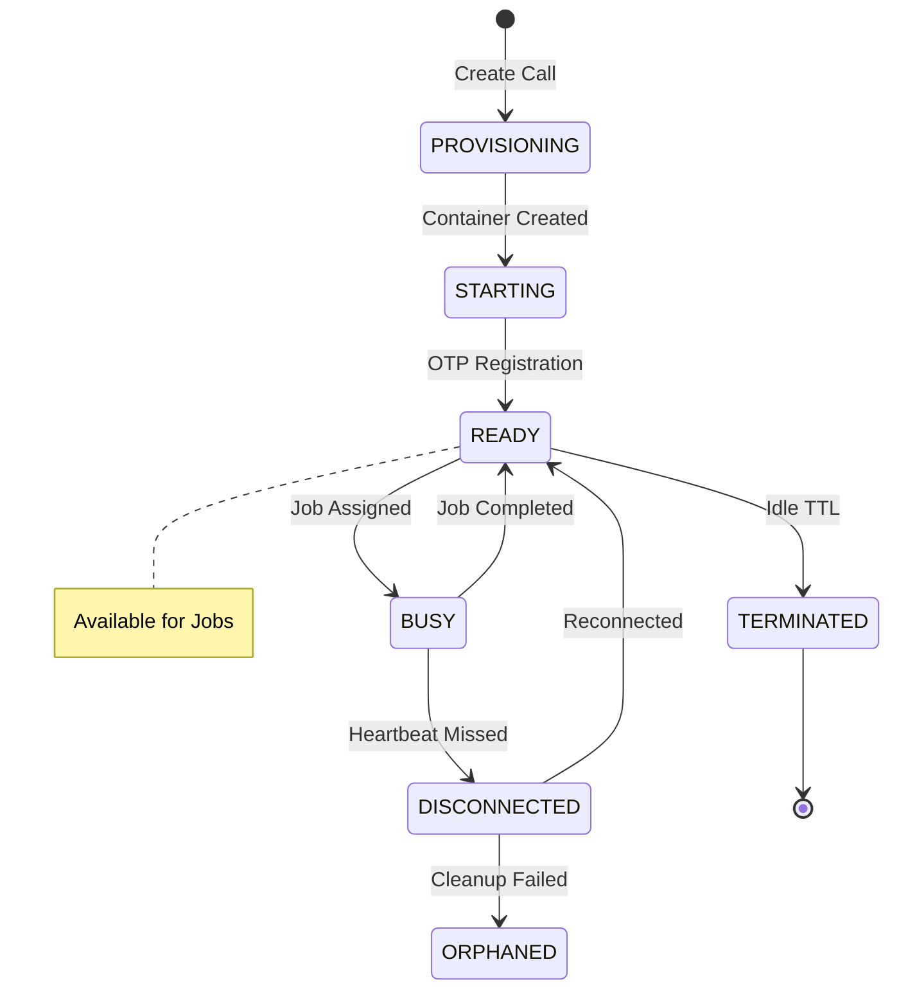
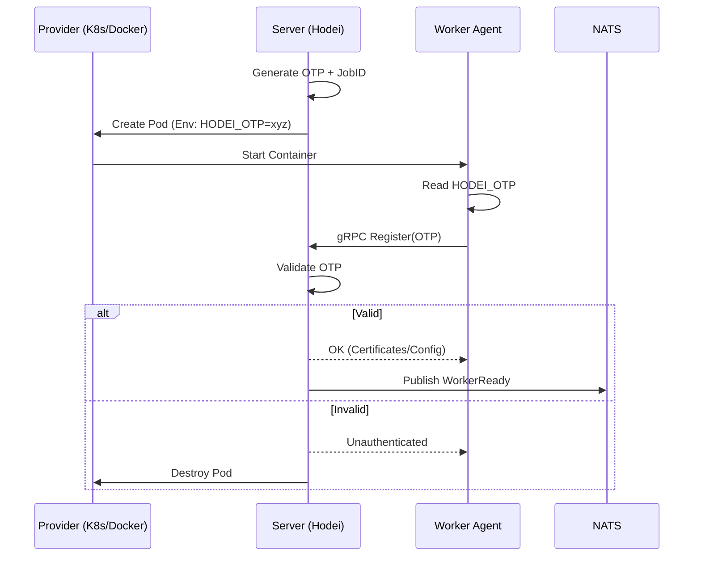
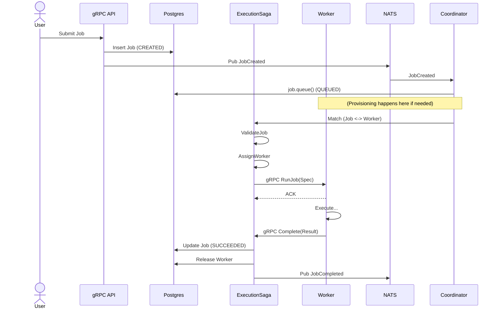

# Hodei Job Platform - V2 System Architecture

**Version**: 2.0 (Consolidated)
**Date**: 2026-01-10
**Status**: Definitive Reference

---

## 1. System Overview

Hodei Jobs Platform is a **distributed, event-driven job execution system** designed for High Performance Computing (HPC) workloads. It abstracts infrastructure providers (Docker, Kubernetes, Firecracker) to provide a uniform execution layer.

### 1.1 Architectural Style
*   **Hexagonal Architecture**: Core domain logic is isolated from infrastructure (Ports & Adapters).
*   **Hybrid Orchestration & Choreography**:
    *   **Orchestration (Sagas)** for complex, compensatable workflows (Job Execution).
    *   **Choreography (Events)** for reactive, fire-and-forget actions (Worker Registration).
*   **Zero Trust Security**: Workers are ephemeral and authenticated via OTP.

### 1.2 Technology Stack
*   **Core**: Rust 2024 (Tokio, Tonic, Axum)
*   **Messaging**: NATS JetStream (Durable Streams)
*   **Persistence**: PostgreSQL (SQLx)
*   **Consistency**: Transactional Outbox Pattern

---

## 2. Hybrid Event-Driven Architecture

The system uses a **Command-Event Pipeline** to maintain strict consistency while enabling loose coupling.

```mermaid
graph TD
    subgraph "Orchestration Layer (Strict Control)"
        SAGA[Saga Coordinator]
        CMD[Command Bus]
    end

    subgraph "Domain Core (Business Logic)"
        HANDLER[Command Handlers]
        AGG[Aggregates (Job/Worker)]
        REPO[Repositories]
    end

    subgraph "Choreography Layer (Reactive)"
        OUTBOX[Outbox Table]
        RELAY[Outbox Relay]
        NATS[NATS JetStream]
        CONSUMER[Event Consumers]
    end

    SAGA -->|Dispatches| CMD
    CMD -->|Routes to| HANDLER
    HANDLER -->|Updates| AGG
    AGG -->|Emits| OUTBOX
    OUTBOX -->|1. Polled by| RELAY
    RELAY -->|2. Publishes to| NATS
    NATS -->|3. Triggers| CONSUMER
    CONSUMER -->|4. Feeds back to| SAGA
```

---

## 3. Saga Catalogue (Visual Graphs)

### 3.1 Provisioning Saga
**Goal**: Create infrastructure for a worker when no capacity exists.
**Trigger**: `trigger_provisioning` (via `JobQueued`)



### 3.2 Execution Saga
**Goal**: Execute a job on a ready worker.
**Trigger**: `WorkerReady` (matched with `JobQueued`)



### 3.3 Cancellation Saga
**Goal**: Safely abort a running or queued job.
**Trigger**: User API Call (`CancelJob`)



---

## 4. Lifecycle State Machines

### 4.1 Job Lifecycle
Tracks the progress of a computational task.



### 4.2 Worker Lifecycle
Tracks the ephemeral infrastructure life.



---

## 5. Component Architecture (Bounded Contexts)

### 5.1 Jobs Context (`crates/server/domain/src/jobs`)
*   **Aggregate**: `Job`
*   **Responsibilities**: Job Specifications, State Transitions, Retry Logic.
*   **Events**: `JobQueued`, `JobStarted`, `JobCompleted`.

### 5.2 Workers Context (`crates/server/domain/src/workers`)
*   **Aggregate**: `Worker`
*   **Responsibilities**: Registry, Heartbeats, Resource Usage, OTP Validation.
*   **Events**: `WorkerReady`, `WorkerTerminated`.

### 5.3 Infrastructure Context (`crates/server/infrastructure`)
*   **Providers**: `DockerProvider`, `K8sProvider`.
*   **Messaging**: `NatsEventBus` (Durable, At-least-once).
*   **Persistence**: `PostgresRepository`.

---

## 6. Critical Flows

### 6.1 Worker Self-Registration (OTP Flow)
This flow ensures Zero Trust security by requiring workers to authenticate with a one-time token injected during provisioning.



### 6.2 Job Execution Flow
End-to-end flow from user submission to results.


