# Arquitectura del Sistema

**Versión**: 8.0
**Última Actualización**: 2025-12-18

## Domain-Driven Design (DDD)

El proyecto sigue una arquitectura DDD hexagonal con las siguientes capas:


## Worker Agent - Optimizaciones v8.0

### LogBatching & Backpressure (T1.1-T1.5)

El worker agent implementa un sistema de batching de logs para reducir significativamente la sobrecarga de red:

```mermaid
graph TD
    A[LogEntry generada] --> B{Buffer lleno?}
    B -->|No| C[Agregar a buffer]
    B -->|Sí| D[Flush LogBatch]
    D --> E[Enviar LogBatch vía gRPC]
    E --> F[Reset buffer]
    C --> G[Timer flush interval]
    G --> H{Timeout?}
    H -->|Sí| D
    H -->|No| I[Aguardar]
    I --> G

    J[ServerMessage] --> K[try_send()?]
    K -->|Full| L[Drop message<br/>Backpressure]
    K -->|OK| M[Continuar]
```

**Beneficios:**
- **90-99% reducción** en llamadas gRPC (de línea por línea a batches)
- **Backpressure handling** con `try_send()` para evitar bloqueos
- **Flush automático** por capacidad o intervalo de tiempo
- **Thread-safe** usando `Arc<Mutex<LogBatcher>>`

### Write-Execute Pattern (T1.6-T1.7)

Patrón robusto de ejecución de scripts inspirado en Jenkins/K8s:


**Características:**
- Inyección automática de safety headers (`set -euo pipefail`)
- Gestión segura de archivos temporales
- Cleanup asíncrono no bloqueante
- Ejecución robusta con manejo de errores

### Secret Injection (T2.1-T2.3)

Inyección segura de secretos via stdin:


**Seguridad:**
- Secrets nunca aparecen en logs (redacción automática)
- Transmisión via stdin con cierre inmediato
- JSON serializado para múltiples secretos
- Auditoría de acceso a secretos

### Zero-Copy I/O (T3.1-T3.2)

Optimización de lectura de logs:

```rust
// FramedRead + BytesCodec para zero-copy
let mut framed = FramedRead::new(source, BytesCodec::new());
while let Some(chunk) = framed.next().await {
    // Direct Bytes slice - no copy
    let bytes = chunk?;
    // Process directly from Bytes
}
```

**Beneficios:**
- **Zero-copy** de datos de log
- **BytesCodec** para decodificación eficiente
- **FramedRead** para manejo de límites
- Reducción de allocaciones de memoria

### Métricas Asíncronas (T3.3-T3.5)

Sistema de métricas con cache TTL:

```mermaid
graph LR
    A[Métricas Request] --> B{Cache válido?}
    B -->|Sí| C[Return cached]
    B -->|No| D[Spawn blocking task]
    D --> E[Recolectar desde cgroups]
    E --> F[Update cache + timestamp]
    F --> G[Return fresh metrics]
    G --> H[Background update]

    subgraph "Cache TTL"
        I[35 segundos TTL]
        J[Instant timestamp]
        K[Atomic update]
    end

    F --> I
```



**Características:**
- **Cache TTL** de 35 segundos
- **spawn_blocking** para tareas intensivas
- **yield_now** para permitir preemption
- Integración cgroups para containers

### mTLS Infrastructure (T4.1-T4.5)

Infraestructura completa de mTLS para Zero Trust:


**Nota:** Requiere upgrade a `tonic >= 0.15` para habilitar TLS features.

## Comunicación Server ↔ Worker Agent (PRD v8.0)


## Bounded Contexts

### 1. Job Execution Context

Responsable del ciclo de vida completo de un job.


### 2. Provider Management Context

Gestiona los workers/providers que ejecutan jobs.


### 3. Shared Kernel

Tipos y conceptos compartidos entre contextos.


## Estructura de Crates
No actualizado a la estructura actual. Tenerlo como referencia pero no es real.
```
hodei-job-platform/
├── crates/
│   ├── domain/           # hodei-jobs-domain - Lógica de negocio pura
│   │   ├── shared_kernel.rs      # JobId, WorkerId, ProviderId, States, Errors
│   │   ├── job_execution.rs      # Job aggregate, JobSpec, JobQueue trait
│   │   ├── job_template.rs       # JobTemplate aggregate
│   │   ├── worker.rs             # Worker aggregate, WorkerSpec, WorkerHandle
│   │   ├── worker_provider.rs    # WorkerProvider trait, ProviderCapabilities
│   │   ├── worker_registry.rs    # WorkerRegistry trait
│   │   ├── job_scheduler.rs      # Scheduling strategies
│   │   ├── provider_config.rs    # ProviderConfig
│   │   └── otp_token_store.rs    # OTP authentication
│   │
│   ├── application/      # hodei-jobs-application - Use Cases
│   │   ├── job_execution_usecases.rs  # CreateJob, CancelJob
│   │   ├── job_controller.rs          # Control loop
│   │   ├── smart_scheduler.rs         # Scheduling service
│   │   ├── worker_provisioning.rs     # Worker provisioning trait
│   │   ├── worker_provisioning_impl.rs # Default implementation
│   │   ├── worker_lifecycle.rs        # Worker lifecycle management
│   │   └── provider_registry.rs       # Provider management
│   │
│   ├── infrastructure/   # hodei-jobs-infrastructure - Adapters
│   │   ├── providers/
│   │   │   ├── docker.rs         # DockerProvider (bollard)
│   │   │   ├── kubernetes.rs     # KubernetesProvider (kube-rs)
│   │   │   └── firecracker.rs    # FirecrackerProvider (KVM)
│   │   ├── persistence.rs        # Postgres repositories (sqlx)
│   │   └── repositories.rs       # In-memory repositories
│   │
│   ├── grpc/             # hodei-jobs-grpc - gRPC Services
│   │   ├── services/             # Service implementations
│   │   ├── proto/                # Protocol Buffers (LogBatch message)
│   │   └── bin/
│   │       ├── server.rs         # Control plane server (mTLS ready)
│   │       └── worker.rs         # Worker agent (HPC-ready)
│   │
│   ├── interface/        # hodei-jobs-interface - REST API (Axum)
│   │
│   └── cli/              # hodei-jobs-cli - Command line interface
│
├── proto/                # Protocol Buffers definitions
├── deploy/
│   └── kubernetes/       # K8s manifests (RBAC, NetworkPolicy)
├── scripts/
│   ├── docker/           # Docker image build scripts
│   ├── kubernetes/       # K8s image build scripts
│   ├── firecracker/      # Firecracker rootfs build scripts
│   └── generate-certificates.sh  # PKI certificate generation
└── docs/security/
    ├── PKI-DESIGN.md     # mTLS PKI architecture
    └── CERTIFICATE-MANAGEMENT.md  # Operations guide
```


## Worker Agent - Componentes Internos (v8.0)

El worker agent es un sistema de alta performance con los siguientes componentes:

### Core Components


### Data Structures

```rust
// LogBatcher - Batched log transmission
struct LogBatcher {
    tx: mpsc::Sender<WorkerMessage>,
    buffer: Vec<LogEntry>,
    capacity: usize,
    flush_interval: Duration,
    last_flush: Instant,
}

// CachedResourceUsage - TTL cache for metrics
struct CachedResourceUsage {
    usage: ResourceUsage,
    timestamp: Instant,
}
const METRICS_CACHE_TTL_SECS: u64 = 35;

// CertificatePaths - mTLS configuration
struct CertificatePaths {
    pub client_cert_path: PathBuf,
    pub client_key_path: PathBuf,
    pub ca_cert_path: PathBuf,
}

// LogBatch message - Reduced network overhead
message LogBatch {
    string job_id = 1;
    repeated LogEntry entries = 2;
}
```

### Performance Characteristics

| Componente | Optimización | Beneficio |
|-----------|--------------|-----------|
| **LogBatcher** | Batch de 100 entries, flush cada 100ms | 90-99% reducción gRPC calls |
| **Backpressure** | try_send() con drop en full | Prevenir blocking del async runtime |
| **Zero-Copy I/O** | FramedRead + BytesCodec | Reducción allocaciones memoria |
| **Metrics Cache** | TTL 35s + spawn_blocking | Non-blocking metrics collection |
| **Write-Execute** | Temp files + async cleanup | Robustez en ejecución scripts |
| **Secret Injection** | stdin + JSON serialization | Seguridad sin exposición logs |

## Worker Providers

El sistema soporta múltiples providers para ejecutar workers:

| Provider | Aislamiento | Startup | GPU | Requisitos |
|----------|-------------|---------|-----|------------|
| **Docker** | Container | ~1s | Sí | Docker daemon |
| **Kubernetes** | Container (Pod) | ~5-15s | Sí | K8s cluster |
| **Firecracker** | Hardware (KVM) | ~125ms | No | Linux + KVM |

### WorkerProvider Trait (ISP Refactoring - DEBT-001)

**Estado**: 🟡 Fase 1 Completada - ISP traits segregados, trait combinado deprecated

```rust
// ISP Traits - Segregados (recomendado para nuevo código)
#[async_trait]
pub trait WorkerLifecycle: Send + Sync {
    async fn create_worker(&self, spec: &WorkerSpec) -> Result<WorkerHandle, ProviderError>;
    async fn get_worker_status(&self, handle: &WorkerHandle) -> Result<WorkerState, ProviderError>;
    async fn destroy_worker(&self, handle: &WorkerHandle) -> Result<(), ProviderError>;
}

#[async_trait]
pub trait WorkerHealth: Send + Sync {
    async fn health_check(&self) -> Result<HealthStatus, ProviderError>;
}

#[async_trait]
pub trait WorkerLogs: Send + Sync {
    async fn get_worker_logs(&self, handle: &WorkerHandle, tail: Option<u32>) 
        -> Result<Vec<LogEntry>, ProviderError>;
}

pub trait WorkerCost: Send + Sync {
    fn estimate_cost(&self, spec: &WorkerSpec, duration: Duration) -> Option<CostEstimate>;
    fn estimated_startup_time(&self) -> Duration;
}

// ... más ISP traits: WorkerEligibility, WorkerMetrics, WorkerEventSource, WorkerProviderIdentity

// Trait combinado (DEPRECATED - solo para backward compatibility)
#[deprecated(
    since = "0.83.0",
    note = "Use specific ISP traits (WorkerLifecycle, WorkerHealth, etc.) instead"
)]
#[async_trait]
pub trait WorkerProvider:
    WorkerProviderIdentity
    + WorkerLifecycle
    + WorkerLogs
    + WorkerCost
    + WorkerHealth
    + WorkerEligibility
    + WorkerMetrics
    + WorkerEventSource
    + Send
    + Sync
{
}
```

**Uso Recomendado (ISP-compliant)**:
```rust
// Cliente que solo necesita crear/destruir workers
struct SagaWorkerProvisioner {
    provider: Arc<dyn WorkerLifecycle + WorkerProviderIdentity>,
}

// Cliente que solo necesita health checks
struct MonitoringService {
    providers: Vec<Arc<dyn WorkerHealth>>,
}
```

**Migración**: Ver `docs/analysis/TECHNICAL_DEBT_SOLID_DDD.md#debt-001` para guía completa

### Variables de Entorno por Provider

**Docker:**
```bash
HODEI_DOCKER_ENABLED=1
HODEI_WORKER_IMAGE=hodei-worker:latest
```

**Kubernetes:**
```bash
HODEI_K8S_ENABLED=1
HODEI_K8S_NAMESPACE=hodei-workers
HODEI_K8S_KUBECONFIG=/path/to/kubeconfig  # opcional
```

**Firecracker:**
```bash
HODEI_FC_ENABLED=1
HODEI_FC_KERNEL_PATH=/var/lib/hodei/vmlinux
HODEI_FC_ROOTFS_PATH=/var/lib/hodei/rootfs.ext4
HODEI_FC_USE_JAILER=true
```

## Servicios gRPC

| Servicio | Descripción | RPCs |
|----------|-------------|------|
| **WorkerAgentService** | Comunicación Server↔Worker | `Register`, `WorkerStream`, `UpdateWorkerStatus`, `UnregisterWorker` |
| **JobExecutionService** | Ciclo de vida de ejecución | `QueueJob`, `AssignJob`, `StartJob`, `UpdateProgress`, `CompleteJob`, `FailJob`, `CancelJob`, `ExecutionEventStream` |
| **SchedulerService** | Scheduling inteligente | `ScheduleJob`, `GetSchedulingDecision`, `ConfigureScheduler`, `GetQueueStatus`, `GetAvailableWorkers`, `SchedulingDecisionStream` |
| **ProviderManagementService** | Gestión de providers | `RegisterProvider`, `ListProviders`, `GetProviderHealth` |
| **MetricsService** | Métricas | `StreamMetrics`, `GetAggregatedMetrics`, `GetTimeSeriesMetrics` |
| **LogStreamService** | Logs de job | `SubscribeLogs`, `GetLogs` |

> Nota: el `MetricsService` requiere un backend explícito. Por defecto el backend está deshabilitado.

## Persistencia (Postgres)

El sistema persiste su estado en Postgres mediante repositorios SQLx (infraestructura):

- `JobRepository` (jobs)
- `JobQueue` (cola de jobs)
- `WorkerRegistry` (workers)
- `ProviderConfigRepository` (providers)

Tanto el servidor gRPC como el adaptador REST ejecutan migraciones al arrancar.

### Variables de entorno (DB)

- `HODEI_DATABASE_URL` (o `DATABASE_URL`) **obligatoria**
- `HODEI_DB_MAX_CONNECTIONS` (default `10`)
- `HODEI_DB_CONNECTION_TIMEOUT_SECS` (default `30`)

## Puertos y entrypoints

- gRPC server: `crates/grpc/src/bin/server.rs` (default `GRPC_PORT=50051`)
- Worker Agent: `crates/grpc/src/bin/worker.rs` (conecta a `HODEI_SERVER`, default `http://localhost:50051`)
- REST API: `crates/interface` (Axum). Requiere Postgres (mismas variables DB).

### WorkerAgentService - Flujo Principal

```protobuf
service WorkerAgentService {
    // Registro con OTP token (PRD v6.0)
    rpc Register(RegisterWorkerRequest) returns (RegisterWorkerResponse);

    // Stream bidireccional para comandos y respuestas
    rpc WorkerStream(stream WorkerMessage) returns (stream ServerMessage);

    // Legacy RPCs
    rpc UpdateWorkerStatus(UpdateWorkerStatusRequest) returns (UpdateWorkerStatusResponse);
    rpc UnregisterWorker(UnregisterWorkerRequest) returns (UnregisterWorkerResponse);
}
```

### Mensajes del Stream

**Worker → Server:**
- `WorkerHeartbeat` - Estado y recursos
- `LogEntry` - Logs de ejecución en tiempo real
- `JobResultMessage` - Resultado de job completado
- `WorkerStatsMessage` - Estadísticas del worker

**Server → Worker:**
- `RunJobCommand` - Ejecutar un job
- `CancelJobCommand` - Cancelar job en ejecución
- `AckMessage` - Confirmación de recepción
- `KeepAliveMessage` - Mantener conexión activa

## Comunicación entre Componentes


