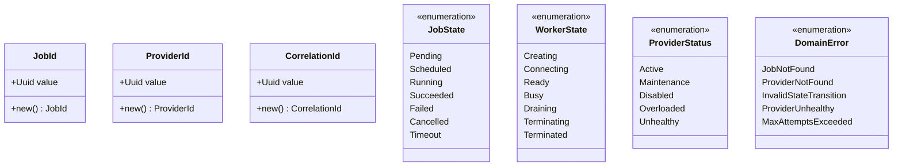

# Arquitectura del Sistema

**Versión**: 7.0  
**Última Actualización**: 2025-12-14

## Domain-Driven Design (DDD)

El proyecto sigue una arquitectura DDD hexagonal con las siguientes capas:


## Comunicación Server ↔ Worker Agent (PRD v6.0)


## Bounded Contexts

### 1. Job Execution Context

Responsable del ciclo de vida completo de un job.


### 2. Provider Management Context

Gestiona los workers/providers que ejecutan jobs.


### 3. Shared Kernel

Tipos y conceptos compartidos entre contextos.



## Estructura de Crates

```
hodei-job-platform/
├── crates/
│   ├── domain/           # hodei-jobs-domain - Lógica de negocio pura
│   │   ├── shared_kernel.rs      # JobId, WorkerId, ProviderId, States, Errors
│   │   ├── job_execution.rs      # Job aggregate, JobSpec, JobQueue trait
│   │   ├── job_template.rs       # JobTemplate aggregate
│   │   ├── worker.rs             # Worker aggregate, WorkerSpec, WorkerHandle
│   │   ├── worker_provider.rs    # WorkerProvider trait, ProviderCapabilities
│   │   ├── worker_registry.rs    # WorkerRegistry trait
│   │   ├── job_scheduler.rs      # Scheduling strategies
│   │   ├── provider_config.rs    # ProviderConfig
│   │   └── otp_token_store.rs    # OTP authentication
│   │
│   ├── application/      # hodei-jobs-application - Use Cases
│   │   ├── job_execution_usecases.rs  # CreateJob, CancelJob
│   │   ├── job_controller.rs          # Control loop
│   │   ├── smart_scheduler.rs         # Scheduling service
│   │   ├── worker_provisioning.rs     # Worker provisioning trait
│   │   ├── worker_provisioning_impl.rs # Default implementation
│   │   ├── worker_lifecycle.rs        # Worker lifecycle management
│   │   └── provider_registry.rs       # Provider management
│   │
│   ├── infrastructure/   # hodei-jobs-infrastructure - Adapters
│   │   ├── providers/
│   │   │   ├── docker.rs         # DockerProvider (bollard)
│   │   │   ├── kubernetes.rs     # KubernetesProvider (kube-rs)
│   │   │   └── firecracker.rs    # FirecrackerProvider (KVM)
│   │   ├── persistence.rs        # Postgres repositories (sqlx)
│   │   └── repositories.rs       # In-memory repositories
│   │
│   ├── grpc/             # hodei-jobs-grpc - gRPC Services
│   │   ├── services/             # Service implementations
│   │   └── bin/
│   │       ├── server.rs         # Control plane server
│   │       └── worker.rs         # Worker agent
│   │
│   ├── interface/        # hodei-jobs-interface - REST API (Axum)
│   │
│   └── cli/              # hodei-jobs-cli - Command line interface
│
├── proto/                # Protocol Buffers definitions
├── deploy/
│   └── kubernetes/       # K8s manifests (RBAC, NetworkPolicy)
└── scripts/
    ├── docker/           # Docker image build scripts
    ├── kubernetes/       # K8s image build scripts
    └── firecracker/      # Firecracker rootfs build scripts
```


## Worker Providers

El sistema soporta múltiples providers para ejecutar workers:

| Provider | Aislamiento | Startup | GPU | Requisitos |
|----------|-------------|---------|-----|------------|
| **Docker** | Container | ~1s | Sí | Docker daemon |
| **Kubernetes** | Container (Pod) | ~5-15s | Sí | K8s cluster |
| **Firecracker** | Hardware (KVM) | ~125ms | No | Linux + KVM |

### WorkerProvider Trait

```rust
#[async_trait]
pub trait WorkerProvider: Send + Sync {
    fn provider_id(&self) -> &ProviderId;
    fn provider_type(&self) -> ProviderType;
    fn capabilities(&self) -> &ProviderCapabilities;
    
    async fn create_worker(&self, spec: &WorkerSpec) -> Result<WorkerHandle, ProviderError>;
    async fn get_worker_status(&self, handle: &WorkerHandle) -> Result<WorkerState, ProviderError>;
    async fn destroy_worker(&self, handle: &WorkerHandle) -> Result<(), ProviderError>;
    async fn get_worker_logs(&self, handle: &WorkerHandle, tail: Option<u32>) -> Result<Vec<LogEntry>, ProviderError>;
    async fn health_check(&self) -> Result<HealthStatus, ProviderError>;
    fn estimated_startup_time(&self) -> Duration;
}
```

### Variables de Entorno por Provider

**Docker:**
```bash
HODEI_DOCKER_ENABLED=1
HODEI_WORKER_IMAGE=hodei-worker:latest
```

**Kubernetes:**
```bash
HODEI_K8S_ENABLED=1
HODEI_K8S_NAMESPACE=hodei-workers
HODEI_K8S_KUBECONFIG=/path/to/kubeconfig  # opcional
```

**Firecracker:**
```bash
HODEI_FC_ENABLED=1
HODEI_FC_KERNEL_PATH=/var/lib/hodei/vmlinux
HODEI_FC_ROOTFS_PATH=/var/lib/hodei/rootfs.ext4
HODEI_FC_USE_JAILER=true
```

## Servicios gRPC

| Servicio | Descripción | RPCs |
|----------|-------------|------|
| **WorkerAgentService** | Comunicación Server↔Worker | `Register`, `WorkerStream`, `UpdateWorkerStatus`, `UnregisterWorker` |
| **JobExecutionService** | Ciclo de vida de ejecución | `QueueJob`, `AssignJob`, `StartJob`, `UpdateProgress`, `CompleteJob`, `FailJob`, `CancelJob`, `ExecutionEventStream` |
| **SchedulerService** | Scheduling inteligente | `ScheduleJob`, `GetSchedulingDecision`, `ConfigureScheduler`, `GetQueueStatus`, `GetAvailableWorkers`, `SchedulingDecisionStream` |
| **ProviderManagementService** | Gestión de providers | `RegisterProvider`, `ListProviders`, `GetProviderHealth` |
| **MetricsService** | Métricas | `StreamMetrics`, `GetAggregatedMetrics`, `GetTimeSeriesMetrics` |
| **LogStreamService** | Logs de job | `SubscribeLogs`, `GetLogs` |

> Nota: el `MetricsService` requiere un backend explícito. Por defecto el backend está deshabilitado.

## Persistencia (Postgres)

El sistema persiste su estado en Postgres mediante repositorios SQLx (infraestructura):

- `JobRepository` (jobs)
- `JobQueue` (cola de jobs)
- `WorkerRegistry` (workers)
- `ProviderConfigRepository` (providers)

Tanto el servidor gRPC como el adaptador REST ejecutan migraciones al arrancar.

### Variables de entorno (DB)

- `HODEI_DATABASE_URL` (o `DATABASE_URL`) **obligatoria**
- `HODEI_DB_MAX_CONNECTIONS` (default `10`)
- `HODEI_DB_CONNECTION_TIMEOUT_SECS` (default `30`)

## Puertos y entrypoints

- gRPC server: `crates/grpc/src/bin/server.rs` (default `GRPC_PORT=50051`)
- Worker Agent: `crates/grpc/src/bin/worker.rs` (conecta a `HODEI_SERVER`, default `http://localhost:50051`)
- REST API: `crates/interface` (Axum). Requiere Postgres (mismas variables DB).

### WorkerAgentService - Flujo Principal

```protobuf
service WorkerAgentService {
    // Registro con OTP token (PRD v6.0)
    rpc Register(RegisterWorkerRequest) returns (RegisterWorkerResponse);
    
    // Stream bidireccional para comandos y respuestas
    rpc WorkerStream(stream WorkerMessage) returns (stream ServerMessage);
    
    // Legacy RPCs
    rpc UpdateWorkerStatus(UpdateWorkerStatusRequest) returns (UpdateWorkerStatusResponse);
    rpc UnregisterWorker(UnregisterWorkerRequest) returns (UnregisterWorkerResponse);
}
```

### Mensajes del Stream

**Worker → Server:**
- `WorkerHeartbeat` - Estado y recursos
- `LogEntry` - Logs de ejecución en tiempo real
- `JobResultMessage` - Resultado de job completado
- `WorkerStatsMessage` - Estadísticas del worker

**Server → Worker:**
- `RunJobCommand` - Ejecutar un job
- `CancelJobCommand` - Cancelar job en ejecución
- `AckMessage` - Confirmación de recepción
- `KeepAliveMessage` - Mantener conexión activa

## Comunicación entre Componentes


