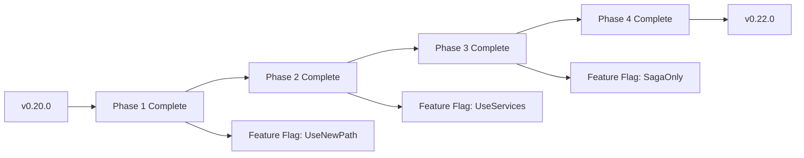

# EPIC-33: SRP Refactoring & Architecture Cleanup

**Document Version:** 1.0  
**Date:** 2026-01-01  
**Status:** Draft - Ready for Review  
**Priority:** High  
**Estimated Effort:** 3-4 sprints  
**Target Version:** v0.22.0

---

## Executive Summary

This epic addresses architectural debt in the Hodei Jobs platform by refactoring components that violate the **Single Responsibility Principle (SRP)** and eliminating **dual-path implementations** (legacy vs saga patterns). The goal is to improve maintainability, testability, and scalability while reducing the risk of bugs caused by over-coupled components.

### Key Objectives

1. **Extract Responsibilities** from God Objects (`JobExecutionServiceImpl`, `WorkerLifecycleManager`, `JobCoordinator`)
2. **Eliminate Dual Paths** by standardizing on Saga/Event-Driven patterns
3. **Improve Testability** by decoupling gRPC adapters from business logic
4. **Strengthen ISP** in the orchestration layer

### Expected Outcomes

| Metric | Current | Target | Improvement |
|--------|---------|--------|-------------|
| SRP Violations (God Objects) | 3 | 0 | -100% |
| Dual Path Implementations | 4 | 0 | -100% |
| Unit Test Coverage (orchestration) | ~40% | ~85% | +112% |
| Cyclomatic Complexity (lifecycle) | High | Medium | -50% |

---

## 1. Current State Analysis

### 1.1 Architecture Overview

The platform follows **Hexagonal Architecture** with **DDD** principles:

```
┌─────────────────────────────────────────────────────────────────┐
│                    Hodei Jobs Platform                           │
├─────────────────────────────────────────────────────────────────┤
│  Interface Layer (gRPC/REST)                                     │
│  ├── JobExecutionServiceImpl ⚠️ SRP VIOLATION                    │
│  ├── SchedulerService                                           │
│  └── WorkerAgentService                                         │
├─────────────────────────────────────────────────────────────────┤
│  Application Layer (Use Cases & Services)                        │
│  ├── Job Use Cases (CreateJob, CancelJob, etc.) ✅ SRP OK        │
│  ├── WorkerLifecycleManager ⚠️ GOD OBJECT (9 responsibilities)  │
│  ├── JobCoordinator ⚠️ ORCHESTRATOR OF ORCHESTRATORS             │
│  ├── ExecutionSaga & ProvisioningSaga                           │
│  └── Event Handlers ✅ Well-designed                            │
├─────────────────────────────────────────────────────────────────┤
│  Domain Layer (Pure Rust)                                        │
│  ├── Job Aggregate ✅ SRP OK                                     │
│  ├── Worker Aggregate ✅ SRP OK                                  │
│  ├── WorkerProvider Traits ✅ ISP EXCELLENT                      │
│  └── Domain Events                                              │
├─────────────────────────────────────────────────────────────────┤
│  Infrastructure Layer                                            │
│  ├── Provider Implementations (Docker, K8s, FC)                 │
│  ├── Persistence (PostgreSQL + sqlx)                            │
│  └── Messaging (NATS JetStream)                                 │
└─────────────────────────────────────────────────────────────────┘
```

### 1.2 Identified SRP Violations

#### ⚠️ JobExecutionServiceImpl (gRPC Interface)
**Location:** `crates/server/interface/src/grpc/job_execution.rs`

**Responsibilities (4+ violations):**
| Responsibility | Lines | Issue |
|----------------|-------|-------|
| gRPC Interface | 244+ | ✅ Legitimate |
| Business Logic Orchestration | 588-744 | ❌ Should be in Use Cases |
| Infrastructure Cleanup | 144-356 | ❌ `trigger_worker_cleanup()` knows about providers |
| Event Publishing | 670-696 | ❌ Builds OutboxEvent manually |

**Dependencies (violating layers):**
```rust
// Lines 1-100
struct JobExecutionServiceImpl {
    job_repository: Arc<dyn JobRepository>,
    worker_registry: Arc<dyn WorkerRegistry>,
    providers: Arc<ProviderRegistry>,       // ❌ Infrastructure
    outbox_repo: Arc<dyn OutboxRepository>, // ❌ Infrastructure
    event_bus: Arc<dyn EventBus>,           // ❌ Infrastructure
    create_job_use_case: Arc<CreateJobUseCase>,
    cancel_job_use_case: Arc<CancelJobUseCase>,
}
```

#### ⚠️ WorkerLifecycleManager (Application)
**Location:** `crates/server/application/src/workers/lifecycle.rs`

**Responsibilities (9 violations - God Object):**
| # | Responsibility | Lines | Type |
|---|----------------|-------|------|
| 1 | Heartbeat monitoring | 234-241 | ✅ OK |
| 2 | Health checks | 243-266 | ✅ OK |
| 3 | Reconciliation (stale workers) | 268-408 | ⚠️ Could be separate |
| 4 | Worker cleanup | 410-649 | ⚠️ Mixed with provisioning |
| 5 | Provisioning (Saga + Legacy) | 651-760 | ❌ Dual paths |
| 6 | Recovery (Saga + Legacy) | 762-825 | ❌ Dual paths |
| 7 | Auto-scaling logic | 1058-1086 | ⚠️ Separate concern |
| 8 | Event monitoring | 1107-1294 | ⚠️ Could be separate |
| 9 | Orphan detection | 1296-end | ⚠️ Could be separate |

#### ⚠️ JobCoordinator (Application)
**Location:** `crates/server/application/src/jobs/coordinator.rs`

**Responsibilities (5 violations):**
| # | Responsibility | Lines | Type |
|---|----------------|-------|------|
| 1 | Event subscription | 187-356 | ✅ OK |
| 2 | Worker monitoring orchestration | - | ⚠️ Too many delegates |
| 3 | Job dispatch orchestration | - | ⚠️ Too many delegates |
| 4 | Database migrations | 98-162 | ❌ Should not be here |
| 5 | Reactive processing setup | - | ✅ OK |

---

## 2. Dual Path Analysis

### 2.1 Where Dual Paths Exist

#### Provisioning Paths
**File:** `crates/server/application/src/workers/lifecycle.rs:651-760`

```rust
// Lines 173-179: Saga enablement checks
pub fn is_saga_provisioning_enabled(&self) -> bool {
    self.provisioning_saga_coordinator.is_some()
}

// Lines 688-718: Legacy fallback
pub async fn provision_worker_legacy(&self, request: ProvisioningRequest) -> Result<Worker> {
    // Direct provider calls without saga
}
```

**Impact:** If saga coordinator is None, uses legacy path with direct infrastructure calls.

#### Recovery Paths
**File:** `crates/server/application/src/workers/lifecycle.rs:762-825`

```rust
// Same dual path pattern for recovery
if self.recovery_saga_coordinator.is_some() {
    self.execute_recovery_saga(...).await?;
} else {
    self.recover_worker_legacy(...)?;  // Direct call
}
```

#### Dispatcher Paths
**File:** `crates/server/application/src/jobs/dispatcher.rs:722-848`

```rust
let saga_used = if let Some(ref dispatcher) = self.execution_saga_dispatcher {
    // Try saga first
    dispatcher.execute_execution_saga(&job.id, worker_id).await?;
    true
} else {
    // Fallback to manual gRPC dispatch
    self.dispatch_job_to_worker(&job, &worker, None).await?;
    false
};
```

#### Cleanup Paths
**File:** `crates/server/interface/src/grpc/job_execution.rs:144-356`

```rust
// trigger_worker_cleanup() - TWO PATHS
if self.config.use_reactive_cleanup() {
    // EPIC-32: Publish WorkerEphemeralTerminating event
    self.publish_worker_terminating_event(job_id, worker_id).await?;
} else {
    // Legacy: Direct provider destruction
    provider.destroy_worker(&handle).await?;
}
```

### 2.2 Problems Caused by Dual Paths

1. **Increased Complexity:** More branches to test and maintain
2. **Inconsistent Behavior:** Edge cases may differ between paths
3. **Code Rot:** Legacy paths don't get updated with new features
4. **Decision Fatigue:** Runtime configuration adds unpredictability

---

## 3. Proposed Architecture

### 3.1 Target Architecture

```
┌─────────────────────────────────────────────────────────────────┐
│                    Interface Layer                               │
├─────────────────────────────────────────────────────────────────┤
│  JobExecutionGrpcAdapter                                         │
│  └── Only handles: gRPC ↔ DTO translation                       │
│      + Request validation                                       │
│      + Authentication/Authorization                             │
│      NO business logic, NO infrastructure calls                  │
├─────────────────────────────────────────────────────────────────┤
│                    Application Layer                             │
├─────────────────────────────────────────────────────────────────┤
│  Specialized Services (Segregated by SRP)                        │
│  ├── WorkerPulseService (heartbeats, liveness)                  │
│  ├── WorkerReconciliationService (stale detection)              │
│  ├── WorkerTerminationService (cleanup, termination)            │
│  ├── WorkerProvisioningService (saga-based only)                │
│  ├── WorkerRecoveryService (saga-based only)                    │
│  ├── WorkerEventMonitor (infrastructure events)                 │
│  └── OrphanDetectionService (garbage collection)                │
│                                                                  │
│  Use Cases (Atomic, Single Purpose)                              │
│  ├── CompleteJobUseCase                                         │
│  ├── FailJobUseCase                                             │
│  └── ...                                                        │
│                                                                  │
│  Event Handlers (Reactive, Subscribed)                           │
│  ├── JobCompletionWorkerCleanupHandler ✅ Already exists        │
│  └── ...                                                        │
│                                                                  │
│  Coordinators (Pure Routing, No Logic)                           │
│  └── EventRouter (subscribes → delegates → done)                │
└─────────────────────────────────────────────────────────────────┘
```

### 3.2 New Components

#### A. WorkerPulseService
**File:** `crates/server/application/src/workers/pulse.rs`

```rust
/// Responsible ONLY for heartbeat monitoring and liveness checks.
/// No infrastructure calls, no provisioning, no cleanup.
#[async_trait]
pub trait WorkerPulseService: Send + Sync {
    async fn record_heartbeat(&self, worker_id: &WorkerId, status: WorkerStatus) -> Result<()>;
    async fn get_live_workers(&self) -> Result<Vec<WorkerId>>;
    async fn detect_stale_workers(&self, threshold: Duration) -> Result<Vec<WorkerId>>;
}
```

#### B. WorkerTerminationService
**File:** `crates/server/application/src/workers/termination.rs`

```rust
/// Responsible ONLY for worker cleanup and termination.
/// Uses saga-based approach with compensation.
#[async_trait]
pub trait WorkerTerminationService: Send + Sync {
    async fn terminate_ephemeral_worker(&self, worker_id: &WorkerId) -> Result<()>;
    async fn terminate_all_for_job(&self, job_id: &JobId) -> Result<()>;
}
```

#### C. JobExecutionPorts (New Interfaces)
**File:** `crates/server/application/src/jobs/ports.rs`

```rust
/// What the Job Execution use cases need (ISP)
#[async_trait]
pub trait JobExecutionPorts: Send + Sync {
    async fn complete_job(&self, cmd: CompleteJobCommand) -> Result<JobCompletionResult>;
    async fn fail_job(&self, cmd: FailJobCommand) -> Result<()>;
    async fn cancel_job(&self, job_id: &JobId, reason: &str) -> Result<()>;
}

/// Ports for infrastructure concerns (separated)
#[async_trait]
pub trait WorkerCleanupPort: Send + Sync {
    async fn trigger_cleanup(&self, worker_id: &WorkerId) -> Result<()>;
}
```

---

## 4. Implementation Plan

### Phase 1: Extract Job Execution Responsibilities (Week 1)

**Goal:** Remove business logic and infrastructure calls from `JobExecutionServiceImpl`

#### Tasks

| Task | Description | Files | Effort |
|------|-------------|-------|--------|
| 1.1 | Create `CompleteJobUseCase` | `application/src/jobs/complete_job.rs` | 2 days |
| 1.2 | Create `FailJobUseCase` | `application/src/jobs/fail_job.rs` | 1 day |
| 1.3 | Extract `trigger_worker_cleanup` to `WorkerTerminationService` | `application/src/workers/termination.rs` | 2 days |
| 1.4 | Refactor `JobExecutionServiceImpl` to be a pure adapter | `interface/src/grpc/job_execution.rs` | 1 day |
| 1.5 | Add integration tests | `tests/integration/job_execution.rs` | 1 day |

#### File Changes

**New Files:**
```
crates/server/application/src/jobs/complete_job.rs
crates/server/application/src/jobs/fail_job.rs
crates/server/application/src/jobs/ports.rs
crates/server/application/src/workers/termination.rs
```

**Modified Files:**
```
crates/server/interface/src/grpc/job_execution.rs (simplify)
crates/server/application/src/jobs/mod.rs (exports)
crates/server/application/src/workers/mod.rs (exports)
```

#### Acceptance Criteria

- [ ] `JobExecutionServiceImpl` has NO imports from infrastructure layer
- [ ] `trigger_worker_cleanup` logic is in `WorkerTerminationService`
- [ ] All job completion paths use `CompleteJobUseCase`
- [ ] Unit tests for use cases without infrastructure mocks
- [ ] Integration tests verify same behavior as before

---

### Phase 2: Split WorkerLifecycleManager (Week 2)

**Goal:** Decompose the God Object into specialized services

#### Tasks

| Task | Description | Files | Effort |
|------|-------------|-------|--------|
| 2.1 | Create `WorkerPulseService` | `application/src/workers/pulse.rs` | 2 days |
| 2.2 | Create `WorkerReconciliationService` | `application/src/workers/reconciliation.rs` | 1 day |
| 2.3 | Create `WorkerTerminationService` (move cleanup logic) | `application/src/workers/termination.rs` | 2 days |
| 2.4 | Simplify `WorkerLifecycleManager` to facade | `application/src/workers/lifecycle.rs` | 2 days |
| 2.5 | Update dependency injection | `application/src/workers/mod.rs` | 1 day |

#### File Changes

**New Files:**
```
crates/server/application/src/workers/pulse.rs
crates/server/application/src/workers/reconciliation.rs
```

**Modified Files:**
```
crates/server/application/src/workers/lifecycle.rs (facade only)
crates/server/application/src/workers/mod.rs (exports)
```

#### Acceptance Criteria

- [ ] `WorkerLifecycleManager` is a thin facade (~100 lines)
- [ ] Each specialized service has < 300 lines
- [ ] Heartbeat logic isolated in `WorkerPulseService`
- [ ] Reconciliation logic isolated in `WorkerReconciliationService`
- [ ] All services are independently testable

---

### Phase 3: Eliminate Dual Paths (Week 3)

**Goal:** Remove all legacy paths, use Saga/Event-Driven exclusively

#### Tasks

| Task | Description | Files | Effort |
|------|-------------|-------|--------|
| 3.1 | Remove legacy provisioning path | `application/src/workers/lifecycle.rs:688-718` | 1 day |
| 3.2 | Remove legacy recovery path | `application/src/workers/lifecycle.rs:810-825` | 1 day |
| 3.3 | Remove manual dispatch fallback | `application/src/jobs/dispatcher.rs:722-848` | 1 day |
| 3.4 | Remove legacy cleanup toggle | `interface/src/grpc/job_execution.rs:144-356` | 0.5 day |
| 3.5 | Clean up saga coordinator null checks | Throughout | 1 day |
| 3.6 | Add integration tests for saga-only flow | `tests/integration/saga_only.rs` | 0.5 day |

#### Acceptance Criteria

- [ ] No `if saga_enabled { ... } else { legacy_path }` patterns
- [ ] All provisioning goes through `ProvisioningSaga`
- [ ] All recovery goes through `RecoverySaga`
- [ ] All cleanup is reactive via events
- [ ] Configuration for saga enablement removed

---

### Phase 4: Simplify JobCoordinator (Week 3-4)

**Goal:** Remove orchestration of orchestrators

#### Tasks

| Task | Description | Files | Effort |
|------|-------------|-------|--------|
| 4.1 | Move database migrations to main/setup | `application/src/jobs/coordinator.rs:98-162` | 1 day |
| 4.2 | Create pure `EventRouter` | `application/src/jobs/event_router.rs` | 1 day |
| 4.3 | Make coordinator a thin wrapper | `application/src/jobs/coordinator.rs` | 1 day |
| 4.4 | Update tests | `tests/unit/coordinator.rs` | 1 day |

#### Acceptance Criteria

- [ ] No database migrations in JobCoordinator
- [ ] Event routing is pure delegation
- [ ] Coordinator < 200 lines

---

## 5. Migration Strategy

### 5.1 Backward Compatibility

All changes are **additive** during implementation:

1. **Phase 1:** New use cases created alongside existing `JobExecutionServiceImpl`. Feature flag controls which path is used.
2. **Phase 2:** New services created, `WorkerLifecycleManager` delegates to them.
3. **Phase 3:** Legacy paths kept but disabled by default.
4. **Phase 4:** Clean up after all tests pass.

### 5.2 Rollout Plan



### 5.3 Rollback Plan

Each phase creates a feature flag that can be disabled to revert:

```rust
// During transition period
let use_case = if config.use_new_job_execution() {
    complete_job_use_case.execute(cmd).await
} else {
    job_execution_service.complete_job(request).await  // Legacy
};
```

---

## 6. Testing Strategy

### 6.1 Unit Tests

| Component | Target Coverage | Mock Dependencies |
|-----------|-----------------|-------------------|
| CompleteJobUseCase | 95% | JobRepository (in-mem) |
| FailJobUseCase | 95% | JobRepository (in-mem) |
| WorkerPulseService | 90% | Redis (mock) |
| WorkerTerminationService | 90% | EventBus (mock) |

### 6.2 Integration Tests

**Test Scenarios:**
1. Job completes → worker cleaned up (reactive path)
2. Job fails → worker cleaned up
3. Worker heartbeat missed → marked stale
4. Worker orphaned → detected and cleaned
5. Provisioning saga executes correctly
6. Recovery saga executes correctly

### 6.3 E2E Tests

- `test_job_complete_cleanup_flow`
- `test_worker_lifecycle_full`
- `test_provisioning_saga_execution`

---

## 7. Dependencies and Risks

### 7.1 Dependencies

| Dependency | Impact | Mitigation |
|------------|--------|------------|
| EPIC-31 (Saga Production) | High | EPIC-31 must be complete first |
| EPIC-32 (Reactive Architecture) | Medium | Can proceed in parallel |
| Provider Validation (EPIC-33 sub) | Low | Independent |

### 7.2 Risks

| Risk | Probability | Impact | Mitigation |
|------|-------------|--------|------------|
| Regression in job completion | Medium | High | Comprehensive E2E tests before rollout |
| Performance regression | Low | Medium | Benchmark before/after |
| Breaking API changes | Low | High | Feature flags during transition |

---

## 8. Success Metrics

| Metric | Baseline | Target | Measurement |
|--------|----------|--------|-------------|
| Cyclomatic Complexity (lifecycle.rs) | 45 | < 20 | Code analysis |
| Unit test coverage (orchestration) | 40% | 85% | cargo tarpaulin |
| Number of dual-path implementations | 4 | 0 | Code review |
| Lines of code (WorkerLifecycleManager) | 1500+ | < 400 | LOC count |
| Time to understand new code | 2 days | 0.5 days | Onboarding survey |

---

## 9. Related Documents

- [EPIC-31: Saga Production Readiness](../epics/EPIC-31-saga-production-readiness.md)
- [EPIC-32: Reactive Architecture](../epics/EPIC-32-reactive-architecture.md)
- [Architecture Overview](../architecture.md)
- [Worker Provider Traits](../domain/src/workers/provider_api.rs)
- [Current JobExecutionServiceImpl](../interface/src/grpc/job_execution.rs)

---

## 10. Document Revision History

| Version | Date | Author | Changes |
|---------|------|--------|---------|
| 1.0 | 2026-01-01 | Platform Team | Initial draft |

---

## Appendix A: File Reference Guide

### A.1 Current God Objects

| File | Lines | Violations |
|------|-------|------------|
| `interface/src/grpc/job_execution.rs` | 1000+ | 4 responsibilities |
| `application/src/workers/lifecycle.rs` | 1500+ | 9 responsibilities |
| `application/src/jobs/coordinator.rs` | 500+ | 5 responsibilities |

### A.2 Well-Designed Components (Reference)

| File | Why Good |
|------|----------|
| `domain/src/workers/provider_api.rs` | Excellent ISP (traits separated) |
| `application/src/jobs/job_completion_handler.rs` | Single responsibility |
| `application/src/jobs/controller_builder.rs` | Builder pattern, testable |

### A.3 Dual Paths to Remove

| Location | Legacy Path | Saga Path |
|----------|-------------|-----------|
| `lifecycle.rs:651-760` | `provision_worker_legacy()` | `execute_provisioning_saga()` |
| `lifecycle.rs:762-825` | `recover_worker_legacy()` | `execute_recovery_saga()` |
| `dispatcher.rs:722-848` | `dispatch_job_to_worker()` | `execute_execution_saga()` |
| `job_execution.rs:144-356` | Direct provider call | `WorkerEphemeralTerminating` event |

---

## Appendix B: Code Examples

### B.1 Target: Pure gRPC Adapter

```rust
// AFTER REFACTORING
// crates/server/interface/src/grpc/job_execution.rs

#[tonic::impl]
impl JobExecutionService for JobExecutionGrpcAdapter {
    async fn complete_job(
        &self,
        request: Request<CompleteJobRequest>,
    ) -> Result<Response<CompleteJobResponse>, Status> {
        // 1. Validate request
        let req = request.into_inner();
        self.validate_request(&req)?;

        // 2. Convert to command
        let cmd = CompleteJobCommand {
            job_id: JobId::parse(&req.job_id)?,
            execution_id: req.execution_id,
            exit_code: req.exit_code,
            output: req.output,
        };

        // 3. Execute use case (all business logic here)
        let result = self.complete_job_use_case.execute(cmd).await
            .map_err(|e| Status::internal(e.to_string()))?;

        // 4. Return response
        Ok(Response::new(CompleteJobResponse {
            success: true,
            worker_cleaned_up: result.worker_terminated,
        }))
    }
}
```

### B.2 Target: Specialized Service

```rust
// AFTER REFACTORING
// crates/server/application/src/workers/pulse.rs

/// WorkerPulseService - ONLY heartbeat and liveness
#[async_trait]
impl WorkerPulseService for WorkerPulseServiceImpl {
    async fn record_heartbeat(
        &self,
        worker_id: &WorkerId,
        status: WorkerStatus,
    ) -> Result<()> {
        // 1. Update in Redis with TTL
        self.redis.set_with_ttl(
            format!("worker:heartbeat:{}", worker_id),
            serde_json::to_string(&status)?,
            HEARTBEAT_TTL,
        ).await?;

        // 2. Update worker aggregate
        let worker = self.worker_registry.get(worker_id).await?;
        worker.record_heartbeat(status);
        self.worker_repo.save(&worker).await?;

        Ok(())
    }

    async fn detect_stale_workers(&self, threshold: Duration) -> Result<Vec<WorkerId>> {
        // Find workers with heartbeat older than threshold
        // NO infrastructure calls, NO cleanup logic
        self.redis.find_stale_keys(threshold).await
    }
}
```

### B.3 Target: Use Case Pattern

```rust
// AFTER REFACTORING
// crates/server/application/src/jobs/complete_job.rs

pub struct CompleteJobUseCase {
    job_repo: Arc<dyn JobRepository>,
    event_bus: Arc<dyn EventBus>,
    cleanup_port: Arc<dyn WorkerCleanupPort>,
}

impl CompleteJobUseCase {
    pub async fn execute(&self, cmd: CompleteJobCommand) -> Result<JobCompletionResult> {
        // 1. Load aggregate
        let mut job = self.job_repo.find_by_id(&cmd.job_id)
            .await?
            .ok_or_else(|| DomainError::NotFound("Job".to_string(), cmd.job_id.to_string()))?;

        // 2. Business logic (pure domain)
        let result = job.complete(cmd.into())?;

        // 3. Persist
        self.job_repo.save(&job).await?;

        // 4. Publish event (NOT trigger cleanup directly)
        self.event_bus.publish(DomainEvent::JobCompleted {
            job_id: job.id,
            result: result.clone(),
        }).await?;

        // 5. Delegate cleanup (decoupled)
        if job.is_ephemeral() {
            self.cleanup_port.trigger_cleanup(&job.worker_id().unwrap()).await?;
        }

        Ok(result)
    }
}
```
