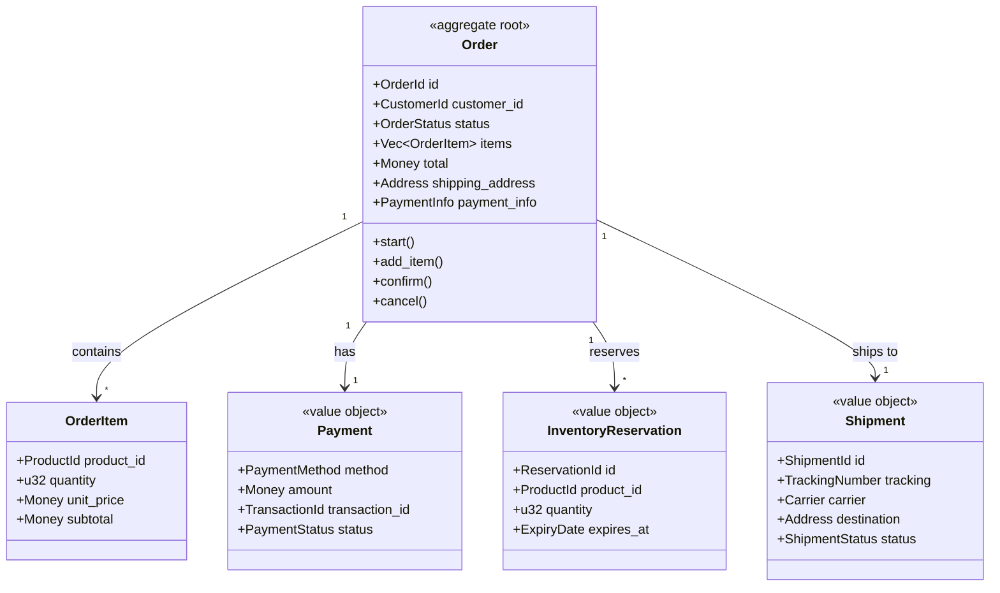

# Saga Engine V4 - Anexo: Ejemplo E-Commerce

## Ventas Online con Arquitectura DDD y Optimización de Código

---

## 1. Introducción al Ejemplo

Este anexo presenta un **sistema de ventas online completo** implementado con Saga Engine V4, aplicando principios DDD para maximizar la modularidad y minimizar duplicidades.

### Objetivos de Diseño

1. **DRY (Don't Repeat Yourself)**: Reutilizar eventos y comandos genéricos
2. **Separación de Responsabilidades**: Commands vs Events vs Activities
3. **Perspectivas Múltiples**: API, Consola, Admin
4. **Compensación Elegante**: Rollback automático sin boilerplate

---

## 2. Contexto del Dominio (DDD)

### 2.1 Bounded Contexts del E-Commerce

```mermaid
graph TB
    subgraph "E-Commerce Platform"
        subgraph "Sales Context"
            OC[Order Context]
            PC[Payment Context]
            IC[Inventory Context]
            SC[Shipping Context]
        end
        
        subgraph "Customer Context"
            CC[Customer Context]
            AC[Address Context]
        end
        
        subgraph "Product Context"
            PRC[Product Context]
            PRC2[Catalog Context]
        end
    end
    
    OC --> PC : "pagos"
    OC --> IC : "inventario"
    OC --> SC : "envío"
    PC --> CC : "cliente"
    IC --> PRC : "productos"
    
    style OC fill:#e3f2fd
    style PC fill:#f3e5f5
    style IC fill:#e8f5e8
    style SC fill:#fff3e0
```

### 2.2 Aggregates del Dominio



---

## 3. Catálogo de Eventos Unificados

### 3.1 Event Structure (Reutilizable)

```rust
use saga_engine_core::event::{EventCategory, EventType};

// ============================================================================
// SHARED EVENT TYPES - Reutilizables en todo el sistema
// ============================================================================

/// Eventos base genéricos para cualquier dominio
#[derive(Debug, Clone, Copy, PartialEq, Eq, saga_engine_core::event::Serialize, saga_engine_core::event::Deserialize)]
pub enum DomainEventType {
    // Estados del ciclo de vida
    Created,
    Updated,
    Deleted,
    Activated,
    Deactivated,
    
    // Estados de proceso
    Started,
    Completed,
    Failed,
    Cancelled,
    
    // Eventos de tiempo
    Expired,
    TimeoutReached,
    
    // Eventos de integración
    IntegrationStarted,
    IntegrationCompleted,
    IntegrationFailed,
}

impl DomainEventType {
    pub fn to_event_type(&self, prefix: &str) -> EventType {
        let name = format!("{}_{}", prefix, self.as_str());
        EventType::from_str(&name).unwrap_or(EventType::MarkerRecorded)
    }
    
    pub fn as_str(&self) -> &'static str {
        match self {
            Self::Created => "created",
            Self::Updated => "updated",
            Self::Deleted => "deleted",
            Self::Activated => "activated",
            Self::Deactivated => "deactivated",
            Self::Started => "started",
            Self::Completed => "completed",
            Self::Failed => "failed",
            Self::Cancelled => "cancelled",
            Self::Expired => "expired",
            Self::TimeoutReached => "timeout_reached",
            Self::IntegrationStarted => "integration_started",
            Self::IntegrationCompleted => "integration_completed",
            Self::IntegrationFailed => "integration_failed",
        }
    }
}

// ============================================================================
// ORDER EVENTS - Especializados pero coherentes
// ============================================================================

#[derive(Debug, Clone, Copy, PartialEq, Eq, saga_engine_core::event::Serialize, saga_engine_core::event::Deserialize)]
pub enum OrderEventType {
    OrderCreated,
    ItemAdded,
    ItemRemoved,
    OrderConfirmed,
    OrderShipped,
    OrderDelivered,
    OrderCompleted,
    OrderFailed,
    OrderCancelled,
    PaymentInitiated,
    PaymentCompleted,
    PaymentFailed,
    InventoryReserved,
    InventoryReservationFailed,
    InventoryReleased,
    ShippingScheduled,
    ShippingCompleted,
    RefundInitiated,
    RefundCompleted,
    RefundFailed,
}

impl OrderEventType {
    pub fn as_str(&self) -> &'static str {
        match self {
            Self::OrderCreated => "order_created",
            Self::ItemAdded => "item_added",
            Self::ItemRemoved => "item_removed",
            Self::OrderConfirmed => "order_confirmed",
            Self::OrderShipped => "order_shipped",
            Self::OrderDelivered => "order_delivered",
            Self::OrderCompleted => "order_completed",
            Self::OrderFailed => "order_failed",
            Self::OrderCancelled => "order_cancelled",
            Self::PaymentInitiated => "payment_initiated",
            Self::PaymentCompleted => "payment_completed",
            Self::PaymentFailed => "payment_failed",
            Self::InventoryReserved => "inventory_reserved",
            Self::InventoryReservationFailed => "inventory_reservation_failed",
            Self::InventoryReleased => "inventory_released",
            Self::ShippingScheduled => "shipping_scheduled",
            Self::ShippingCompleted => "shipping_completed",
            Self::RefundInitiated => "refund_initiated",
            Self::RefundCompleted => "refund_completed",
            Self::RefundFailed => "refund_failed",
        }
    }
}
```

### 3.2 Payload Structure (Type-Safe)

```rust
use serde::{Deserialize, Serialize};
use serde_json::Value;
use saga_engine_core::event::SagaId;

// ============================================================================
// GENERIC PAYLOADS - Reutilizables
// ============================================================================

/// Payload base para eventos con metadata común
#[derive(Debug, Clone, Serialize, Deserialize)]
pub struct BaseEventPayload {
    pub timestamp: chrono::DateTime<chrono::Utc>,
    pub correlation_id: Option<String>,
    pub trace_id: Option<String>,
    pub source: String,
}

impl Default for BaseEventPayload {
    fn default() -> Self {
        Self {
            timestamp: chrono::Utc::now(),
            correlation_id: None,
            trace_id: None,
            source: "ecommerce".to_string(),
        }
    }
}

/// Payload para eventos de creación
#[derive(Debug, Clone, Serialize, Deserialize)]
pub struct CreatedEventPayload<T: Serialize> {
    #[serde(flatten)]
    pub base: BaseEventPayload,
    pub entity_id: String,
    pub data: T,
}

// ============================================================================
// ORDER PAYLOADS - Especializados
// ============================================================================

#[derive(Debug, Clone, Serialize, Deserialize)]
pub struct OrderCreatedPayload {
    pub order_id: String,
    pub customer_id: String,
    pub item_count: usize,
    pub total_amount: Decimal,
    pub currency: String,
    pub created_at: chrono::DateTime<chrono::Utc>,
}

#[derive(Debug, Clone, Serialize, Deserialize)]
pub struct ItemAddedPayload {
    pub order_id: String,
    pub product_id: String,
    pub product_name: String,
    pub quantity: u32,
    pub unit_price: Decimal,
    pub subtotal: Decimal,
}

#[derive(Debug, Clone, Serialize, Deserialize)]
pub struct PaymentCompletedPayload {
    pub order_id: String,
    pub transaction_id: String,
    pub amount: Decimal,
    pub currency: String,
    pub payment_method: String,
}

#[derive(Debug, Clone, Serialize, Deserialize)]
pub struct InventoryReservedPayload {
    pub order_id: String,
    pub reservations: Vec<ReservationDetail>,
    pub total_items: u32,
}

#[derive(Debug, Clone, Serialize, Deserialize)]
pub struct ReservationDetail {
    pub product_id: String,
    pub reserved_quantity: u32,
    pub reservation_id: String,
}

#[derive(Debug, Clone, Serialize, Deserialize)]
pub struct ShippingScheduledPayload {
    pub order_id: String,
    pub shipment_id: String,
    pub carrier: String,
    pub tracking_number: String,
    pub estimated_delivery: chrono::DateTime<chrono::Utc>,
}

// ============================================================================
// COMPENSATION PAYLOADS - Estructura unificada
// ============================================================================

#[derive(Debug, Clone, Serialize, Deserialize)]
pub struct CompensationActionPayload {
    pub action_type: String,
    pub target_entity_id: String,
    pub original_data: Value,
    pub compensation_reason: String,
    pub executed_at: chrono::DateTime<chrono::Utc>,
    pub result: CompensationResult,
}

#[derive(Debug, Clone, Serialize, Deserialize)]
pub enum CompensationResult {
    Success,
    Failed { error: String },
    Skipped { reason: String },
}
```

---

## 4. Commands Unificados

### 4.1 Command Bus Architecture

```rust
use async_trait::async_trait;
use serde::{Deserialize, Serialize};
use std::fmt::Debug;

// ============================================================================
// COMMAND BUS - Framework agnóstico
// ============================================================================

/// Trait base para todos los commands
pub trait Command: Send + Sync + Debug {
    type Result;
    fn command_type(&self) -> &'static str;
    fn aggregate_id(&self) -> &str;
}

/// Resultado genérico de command
#[derive(Debug, Clone, Serialize, Deserialize)]
pub enum CommandResult<T = ()> {
    Success(T),
    Failure(String),
    ValidationError(Vec<ValidationError>),
}

#[derive(Debug, Clone, Serialize, Deserialize)]
pub struct ValidationError {
    pub field: String,
    pub message: String,
    pub code: String,
}

/// Handler base con tipado genérico
#[async_trait]
pub trait CommandHandler<C: Command>: Send + Sync {
    async fn handle(&self, command: C) -> CommandResult<C::Result>;
}

// ============================================================================
// ORDER COMMANDS - Especializados pero coherentes
// ============================================================================

#[derive(Debug, Clone, Serialize, Deserialize)]
pub struct CreateOrderCommand {
    pub customer_id: String,
    pub items: Vec<OrderItemInput>,
    pub shipping_address: AddressInput,
    pub payment_method: PaymentMethodInput,
    pub idempotency_key: Option<String>,
}

impl Command for CreateOrderCommand {
    type Result = String; // order_id
    fn command_type(&self) -> &'static str {
        "order.create"
    }
    fn aggregate_id(&self) -> &str {
        &self.customer_id
    }
}

#[derive(Debug, Clone, Serialize, Deserialize)]
pub struct OrderItemInput {
    pub product_id: String,
    pub quantity: u32,
}

#[derive(Debug, Clone, Serialize, Deserialize)]
pub struct AddressInput {
    pub street: String,
    pub city: String,
    pub state: String,
    pub postal_code: String,
    pub country: String,
}

#[derive(Debug, Clone, Serialize, Deserialize)]
pub struct PaymentMethodInput {
    pub method: String,
    pub token: String,
}

// ============================================================================
// PAYMENT COMMANDS - Reutilizables
// ============================================================================

#[derive(Debug, Clone, Serialize, Deserialize)]
pub struct ProcessPaymentCommand {
    pub order_id: String,
    pub customer_id: String,
    pub amount: Decimal,
    pub currency: String,
    pub payment_token: String,
    pub metadata: Value,
}

impl Command for ProcessPaymentCommand {
    type Result = PaymentResult;
    fn command_type(&self) -> &'static str {
        "payment.process"
    }
    fn aggregate_id(&self) -> &str {
        &self.order_id
    }
}

#[derive(Debug, Clone, Serialize, Deserialize)]
pub struct PaymentResult {
    pub transaction_id: String,
    pub status: PaymentStatus,
    pub approved_amount: Decimal,
}

#[derive(Debug, Clone, Serialize, Deserialize)]
pub enum PaymentStatus {
    Approved,
    Declined,
    Failed,
    Pending,
    Refunded,
}

// ============================================================================
// INVENTORY COMMANDS - Reutilizables
// ============================================================================

#[derive(Debug, Clone, Serialize, Deserialize)]
pub struct ReserveInventoryCommand {
    pub order_id: String,
    pub items: Vec<InventoryReservationInput>,
    pub expires_in_seconds: u32,
}

impl Command for ReserveInventoryCommand {
    type Result = InventoryReservationResult;
    fn command_type(&self) -> &'static str {
        "inventory.reserve"
    }
    fn aggregate_id(&self) -> &str {
        &self.order_id
    }
}

#[derive(Debug, Clone, Serialize, Deserialize)]
pub struct InventoryReservationInput {
    pub product_id: String,
    pub quantity: u32,
}

#[derive(Debug, Clone, Serialize, Deserialize)]
pub struct InventoryReservationResult {
    pub reservation_id: String,
    pub reservations: Vec<ReservationOutcome>,
    pub expires_at: chrono::DateTime<chrono::Utc>,
}

#[derive(Debug, Clone, Serialize, Deserialize)]
pub struct ReservationOutcome {
    pub product_id: String,
    pub reserved_quantity: u32,
    pub success: bool,
    pub error: Option<String>,
}

#[derive(Debug, Clone, Serialize, Deserialize)]
pub struct ReleaseInventoryCommand {
    pub order_id: String,
    pub reservation_id: String,
    pub reason: String,
}

impl Command for ReleaseInventoryCommand {
    type Result = ReleaseResult;
    fn command_type(&self) -> &'static str {
        "inventory.release"
    }
    fn aggregate_id(&self) -> &str {
        &self.order_id
    }
}

#[derive(Debug, Clone, Serialize, Deserialize)]
pub struct ReleaseResult {
    pub released: bool,
    pub message: String,
}

// ============================================================================
// SHIPPING COMMANDS - Reutilizables
// ============================================================================

#[derive(Debug, Clone, Serialize, Deserialize)]
pub struct ScheduleShippingCommand {
    pub order_id: String,
    pub address: AddressInput,
    pub items: Vec<ShippingItemInput>,
    pub preferences: ShippingPreferences,
}

impl Command for ScheduleShippingCommand {
    type Result = ShippingScheduleResult;
    fn command_type(&self) -> &'static str {
        "shipping.schedule"
    }
    fn aggregate_id(&self) -> &str {
        &self.order_id
    }
}

#[derive(Debug, Clone, Serialize, Deserialize)]
pub struct ShippingItemInput {
    pub product_id: String,
    pub quantity: u32,
}

#[derive(Debug, Clone, Serialize, Deserialize)]
pub struct ShippingPreferences {
    pub carrier: Option<String>,
    pub express: bool,
    pub signature_required: bool,
}

#[derive(Debug, Clone, Serialize, Deserialize)]
pub struct ShippingScheduleResult {
    pub shipment_id: String,
    pub tracking_number: String,
    pub carrier: String,
    pub estimated_delivery: chrono::DateTime<chrono::Utc>,
}
```

---

## 5. Actividades Optimizadas

### 5.1 Activity Trait Base

```rust
use async_trait::async_trait;
use saga_engine_core::workflow::Activity;
use serde::{Deserialize, Serialize};
use std::fmt::Debug;

// ============================================================================
// ACTIVITY TRAIT - Extendido para el dominio e-commerce
// ============================================================================

/// Activity base con capacidades de compensación automática
#[async_trait]
pub trait EcommerceActivity<I: Serialize + Deserialize<'static> + Send + Clone, O: Serialize + Deserialize<'static> + Send + Clone>: Activity {
    /// Nombre del compensation activity asociado (si existe)
    const COMPENSATION_ACTIVITY: Option<&'static str> = None;
    
    /// Verifica si la actividad puede ser compensada
    fn can_compensate(&self, _output: &O) -> bool {
        true
    }
    
    /// Prepara datos para compensación
    fn prepare_compensation_data(&self, _output: &O) -> Option<serde_json::Value> {
        None
    }
}

// ============================================================================
// PAYMENT ACTIVITIES
// ============================================================================

#[derive(Debug)]
pub struct ProcessPaymentActivity;

#[async_trait]
impl EcommerceActivity<ProcessPaymentInput, PaymentOutput> for ProcessPaymentActivity {
    const TYPE_ID: &'static str = "payment.process";
    const COMPENSATION_ACTIVITY: Option<&'static str> = Some("payment.refund");
    
    async fn execute(&self, input: ProcessPaymentInput) -> Result<PaymentOutput, PaymentError> {
        // Implementación del pago
        // ... integración con gateway de pago
        
        Ok(PaymentOutput {
            transaction_id: format!("txn_{}", uuid::Uuid::new_v4()),
            status: PaymentStatus::Approved,
            approved_amount: input.amount,
            processed_at: chrono::Utc::now(),
        })
    }
}

#[derive(Debug, Clone, Serialize, Deserialize)]
pub struct ProcessPaymentInput {
    pub order_id: String,
    pub amount: Decimal,
    pub currency: String,
    pub payment_token: String,
    pub customer_id: String,
}

#[derive(Debug, Clone, Serialize, Deserialize)]
pub struct PaymentOutput {
    pub transaction_id: String,
    pub status: PaymentStatus,
    pub approved_amount: Decimal,
    pub processed_at: chrono::DateTime<chrono::Utc>,
}

#[derive(Debug, thiserror::Error)]
pub enum PaymentError {
    #[error("Payment declined: {0}")]
    Declined(String),
    #[error("Gateway error: {0}")]
    GatewayError(String),
    #[error("Invalid token: {0}")]
    InvalidToken(String),
}

// ============================================================================
// REFUND ACTIVITY - Compensación de Payment
// ============================================================================

#[derive(Debug)]
pub struct RefundPaymentActivity;

#[async_trait]
impl EcommerceActivity<RefundInput, RefundOutput> for RefundPaymentActivity {
    const TYPE_ID: &'static str = "payment.refund";
    
    async fn execute(&self, input: RefundInput) -> Result<RefundOutput, RefundError> {
        // Implementación del reembolso
        // Usa transaction_id del pago original
        
        Ok(RefundOutput {
            refund_id: format!("ref_{}", uuid::Uuid::new_v4()),
            original_transaction_id: input.original_transaction_id,
            amount: input.amount,
            status: RefundStatus::Completed,
            processed_at: chrono::Utc::now(),
        })
    }
}

#[derive(Debug, Clone, Serialize, Deserialize)]
pub struct RefundInput {
    pub original_transaction_id: String,
    pub amount: Decimal,
    pub currency: String,
    pub reason: String,
}

#[derive(Debug, Clone, Serialize, Deserialize)]
pub struct RefundOutput {
    pub refund_id: String,
    pub original_transaction_id: String,
    pub amount: Decimal,
    pub status: RefundStatus,
    pub processed_at: chrono::DateTime<chrono::Utc>,
}

#[derive(Debug, Clone, Serialize, Deserialize)]
pub enum RefundStatus {
    Pending,
    Completed,
    Failed,
}

#[derive(Debug, thiserror::Error)]
pub enum RefundError {
    #[error("Original transaction not found: {0}")]
    TransactionNotFound(String),
    #[error("Refund failed: {0}")]
    RefundFailed(String),
}

// ============================================================================
// INVENTORY ACTIVITIES
// ============================================================================

#[derive(Debug)]
pub struct ReserveInventoryActivity;

#[async_trait]
impl EcommerceActivity<ReserveInventoryInput, ReserveInventoryOutput> for ReserveInventoryActivity {
    const TYPE_ID: &'static str = "inventory.reserve";
    const COMPENSATION_ACTIVITY: Option<&'static str> = Some("inventory.release");
    
    async fn execute(&self, input: ReserveInventoryInput) -> Result<ReserveInventoryOutput, InventoryError> {
        let reservations = self.reserve_items(&input.items, input.expires_in_seconds).await?;
        
        Ok(ReserveInventoryOutput {
            reservation_id: format!("res_{}", uuid::Uuid::new_v4()),
            reservations,
            expires_at: chrono::Utc::now() + chrono::Duration::seconds(input.expires_in_seconds as i64),
        })
    }
    
    fn prepare_compensation_data(&self, output: &ReserveInventoryOutput) -> Option<serde_json::Value> {
        Some(serde_json::json!({
            "reservation_id": output.reservation_id,
            "reservations": output.reservations,
        }))
    }
    
    async fn reserve_items(&self, items: &[InventoryReservationInput], expires_secs: u32) 
        -> Result<Vec<ReservationOutcome>, InventoryError> {
        // ... lógica de reserva de inventario
        Ok(items.iter().map(|item| ReservationOutcome {
            product_id: item.product_id.clone(),
            reserved_quantity: item.quantity,
            success: true,
            error: None,
        }).collect())
    }
}

#[derive(Debug, Clone, Serialize, Deserialize)]
pub struct ReserveInventoryInput {
    pub order_id: String,
    pub items: Vec<InventoryReservationInput>,
    pub expires_in_seconds: u32,
}

#[derive(Debug, Clone, Serialize, Deserialize)]
pub struct ReserveInventoryOutput {
    pub reservation_id: String,
    pub reservations: Vec<ReservationOutcome>,
    pub expires_at: chrono::DateTime<chrono::Utc>,
}

#[derive(Debug, Clone, Serialize, Deserialize)]
pub struct ReservationOutcome {
    pub product_id: String,
    pub reserved_quantity: u32,
    pub success: bool,
    pub error: Option<String>,
}

#[derive(Debug, thiserror::Error)]
pub enum InventoryError {
    #[error("Insufficient stock for product {0}: available={1}, requested={2}")]
    InsufficientStock(String, u32, u32),
    #[error("Product not found: {0}")]
    ProductNotFound(String),
    #[error("Reservation failed: {0}")]
    ReservationFailed(String),
}

// ============================================================================
// RELEASE INVENTORY ACTIVITY - Compensación
// ============================================================================

#[derive(Debug)]
pub struct ReleaseInventoryActivity;

#[async_trait]
impl EcommerceActivity<ReleaseInventoryInput, ReleaseInventoryOutput> for ReleaseInventoryActivity {
    const TYPE_ID: &'static str = "inventory.release";
    
    async fn execute(&self, input: ReleaseInventoryInput) -> Result<ReleaseInventoryOutput, InventoryError> {
        // Liberar inventario reservado
        
        Ok(ReleaseInventoryOutput {
            released: true,
            reservation_id: input.reservation_id,
            released_at: chrono::Utc::now(),
        })
    }
}

#[derive(Debug, Clone, Serialize, Deserialize)]
pub struct ReleaseInventoryInput {
    pub reservation_id: String,
    pub reason: String,
}

#[derive(Debug, Clone, Serialize, Deserialize)]
pub struct ReleaseInventoryOutput {
    pub released: bool,
    pub reservation_id: String,
    pub released_at: chrono::DateTime<chrono::Utc>,
}

// ============================================================================
// SHIPPING ACTIVITIES
// ============================================================================

#[derive(Debug)]
pub struct ScheduleShippingActivity;

#[async_trait]
impl EcommerceActivity<ScheduleShippingInput, ScheduleShippingOutput> for ScheduleShippingActivity {
    const TYPE_ID: &'static str = "shipping.schedule";
    const COMPENSATION_ACTIVITY: Option<&'static str> = Some("shipping.cancel");
    
    async fn execute(&self, input: ScheduleShippingInput) -> Result<ScheduleShippingOutput, ShippingError> {
        // Integración con carriers
        
        Ok(ScheduleShippingOutput {
            shipment_id: format!("ship_{}", uuid::Uuid::new_v4()),
            tracking_number: format!("TRK{}", uuid::Uuid::new_v4().to_string().chars().take(12).collect::<String>()),
            carrier: input.preferences.carrier.unwrap_or_else(|| "default".to_string()),
            estimated_delivery: chrono::Utc::now() + chrono::Duration::days(5),
            label_url: None,
        })
    }
}

#[derive(Debug, Clone, Serialize, Deserialize)]
pub struct ScheduleShippingInput {
    pub order_id: String,
    pub address: AddressInput,
    pub items: Vec<ShippingItemInput>,
    pub preferences: ShippingPreferences,
}

#[derive(Debug, Clone, Serialize, Deserialize)]
pub struct ScheduleShippingOutput {
    pub shipment_id: String,
    pub tracking_number: String,
    pub carrier: String,
    pub estimated_delivery: chrono::DateTime<chrono::Utc>,
    pub label_url: Option<String>,
}

#[derive(Debug, thiserror::Error)]
pub enum ShippingError {
    #[error("Invalid address: {0}")]
    InvalidAddress(String),
    #[error("Carrier unavailable: {0}")]
    CarrierUnavailable(String),
    #[error("Shipping failed: {0}")]
    ShippingFailed(String),
}

// ============================================================================
// CANCEL SHIPPING ACTIVITY - Compensación
// ============================================================================

#[derive(Debug)]
pub struct CancelShippingActivity;

#[async_trait]
impl EcommerceActivity<CancelShippingInput, CancelShippingOutput> for CancelShippingActivity {
    const TYPE_ID: &'static str = "shipping.cancel";
    
    async fn execute(&self, input: CancelShippingInput) -> Result<CancelShippingOutput, ShippingError> {
        // Cancelar shipment con carrier
        
        Ok(CancelShippingOutput {
            cancelled: true,
            shipment_id: input.shipment_id,
            refund_amount: input.refund_amount,
            cancelled_at: chrono::Utc::now(),
        })
    }
}

#[derive(Debug, Clone, Serialize, Deserialize)]
pub struct CancelShippingInput {
    pub shipment_id: String,
    pub order_id: String,
    pub refund_amount: Decimal,
}

#[derive(Debug, Clone, Serialize, Deserialize)]
pub struct CancelShippingOutput {
    pub cancelled: bool,
    pub shipment_id: String,
    pub refund_amount: Decimal,
    pub cancelled_at: chrono::DateTime<chrono::Utc>,
}
```

---

## 6. Workflow del Pedido (DurableWorkflow)

### 6.1 Order Saga Definition

```rust
use async_trait::async_trait;
use saga_engine_core::workflow::{DurableWorkflow, WorkflowContext, WorkflowPaused};
use saga_engine_core::event::{SagaId, EventType, EventCategory, HistoryEvent, EventId};
use saga_engine_core::compensation::{CompensationTracker, CompletedStep};
use serde::{Deserialize, Serialize};
use std::fmt::Debug;

// ============================================================================
// ORDER WORKFLOW - Saga principal de procesamiento de pedidos
// ============================================================================

#[derive(Debug)]
pub struct OrderProcessingWorkflow;

#[async_trait]
impl DurableWorkflow for OrderProcessingWorkflow {
    const TYPE_ID: &'static str = "order.processing";
    const VERSION: u32 = 1;
    
    type Input = OrderProcessingInput;
    type Output = OrderProcessingOutput;
    type Error = OrderWorkflowError;
    
    async fn run(
        &self,
        ctx: &mut WorkflowContext,
        input: Self::Input,
    ) -> Result<Self::Output, Self::Error> {
        // Inicializar tracker de compensación
        ctx.init_compensation_tracker_with_auto_compensate(true);
        
        // =========================================================================
        // STEP 1: Validar y crear pedido
        // =========================================================================
        info!("[Order {}] Processing order for customer {}", input.order_id, input.customer_id);
        
        let order = self.create_order(&input).await?;
        ctx.set_step_output("order".to_string(), serde_json::json!(order));
        
        // =========================================================================
        // STEP 2: Reservar inventario (CON COMPENSACIÓN AUTOMÁTICA)
        // =========================================================================
        let inventory_result = ctx
            .execute_activity(
                &ReserveInventoryActivity,
                ReserveInventoryInput {
                    order_id: input.order_id.clone(),
                    items: input.items.clone(),
                    expires_in_seconds: 3600, // 1 hora
                },
            )
            .await
            .map_err(|e| OrderWorkflowError::ActivityFailed(e.to_string()))?;
        
        // Trackear para compensación automática
        ctx.track_compensatable_step_auto(
            "reserve-inventory",
            "ReserveInventoryActivity",
            serde_json::json!({ "order_id": input.order_id }),
            serde_json::json!(inventory_result),
            1,
        );
        
        info!("[Order {}] Inventory reserved: {}", input.order_id, inventory_result.reservation_id);
        
        // =========================================================================
        // STEP 3: Procesar pago (CON COMPENSACIÓN AUTOMÁTICA)
        // =========================================================================
        let payment_result = ctx
            .execute_activity(
                &ProcessPaymentActivity,
                ProcessPaymentInput {
                    order_id: input.order_id.clone(),
                    amount: input.total_amount,
                    currency: input.currency.clone(),
                    payment_token: input.payment_token.clone(),
                    customer_id: input.customer_id.clone(),
                },
            )
            .await
            .map_err(|e| OrderWorkflowError::ActivityFailed(e.to_string()))?;
        
        ctx.track_compensatable_step_auto(
            "process-payment",
            "ProcessPaymentActivity",
            serde_json::json!({ 
                "order_id": input.order_id,
                "amount": input.total_amount,
            }),
            serde_json::json!(payment_result),
            2,
        );
        
        info!("[Order {}] Payment completed: {}", input.order_id, payment_result.transaction_id);
        
        // =========================================================================
        // STEP 4: Programar envío
        // =========================================================================
        let shipping_result = ctx
            .execute_activity(
                &ScheduleShippingActivity,
                ScheduleShippingInput {
                    order_id: input.order_id.clone(),
                    address: input.shipping_address.clone(),
                    items: self.items_from_order(&input.items),
                    preferences: ShippingPreferences {
                        carrier: None,
                        express: input.express_shipping,
                        signature_required: true,
                    },
                },
            )
            .await
            .map_err(|e| OrderWorkflowError::ActivityFailed(e.to_string()))?;
        
        ctx.track_compensatable_step_auto(
            "schedule-shipping",
            "ScheduleShippingActivity",
            serde_json::json!({ "order_id": input.order_id }),
            serde_json::json!(shipping_result),
            3,
        );
        
        info!("[Order {}] Shipping scheduled: {}", input.order_id, shipping_result.tracking_number);
        
        // =========================================================================
        // COMPLETAR WORKFLOW
        // =========================================================================
        let output = OrderProcessingOutput {
            order_id: input.order_id.clone(),
            status: OrderStatus::Processing,
            transaction_id: payment_result.transaction_id,
            reservation_id: inventory_result.reservation_id,
            shipment_id: shipping_result.shipment_id,
            tracking_number: shipping_result.tracking_number,
            estimated_delivery: shipping_result.estimated_delivery,
            completed_at: chrono::Utc::now(),
        };
        
        // Limpiar tracker (no hay compensación pendiente)
        ctx.compensation_tracker.take();
        
        Ok(output)
    }
}

impl OrderProcessingWorkflow {
    async fn create_order(&self, input: &OrderProcessingInput) -> Result<OrderInfo, OrderWorkflowError> {
        // Crear orden en base de datos
        Ok(OrderInfo {
            order_id: input.order_id.clone(),
            customer_id: input.customer_id.clone(),
            item_count: input.items.len(),
            total_amount: input.total_amount,
            currency: input.currency.clone(),
            created_at: chrono::Utc::now(),
        })
    }
    
    fn items_from_order(&self, items: &[OrderItemInput]) -> Vec<ShippingItemInput> {
        items.iter()
            .map(|i| ShippingItemInput {
                product_id: i.product_id.clone(),
                quantity: i.quantity,
            })
            .collect()
    }
}

// ============================================================================
// INPUT/OUTPUT TYPES
// ============================================================================

#[derive(Debug, Clone, Serialize, Deserialize)]
pub struct OrderProcessingInput {
    pub order_id: String,
    pub customer_id: String,
    pub items: Vec<OrderItemInput>,
    pub total_amount: Decimal,
    pub currency: String,
    pub shipping_address: AddressInput,
    pub payment_token: String,
    pub express_shipping: bool,
}

#[derive(Debug, Clone, Serialize, Deserialize)]
pub struct OrderProcessingOutput {
    pub order_id: String,
    pub status: OrderStatus,
    pub transaction_id: String,
    pub reservation_id: String,
    pub shipment_id: String,
    pub tracking_number: String,
    pub estimated_delivery: chrono::DateTime<chrono::Utc>,
    pub completed_at: chrono::DateTime<chrono::Utc>,
}

#[derive(Debug, Clone, Serialize, Deserialize)]
pub struct OrderInfo {
    pub order_id: String,
    pub customer_id: String,
    pub item_count: usize,
    pub total_amount: Decimal,
    pub currency: String,
    pub created_at: chrono::DateTime<chrono::Utc>,
}

#[derive(Debug, Clone, Serialize, Deserialize)]
pub enum OrderStatus {
    Pending,
    Processing,
    Confirmed,
    Shipped,
    Delivered,
    Completed,
    Cancelled,
    Failed,
}

// ============================================================================
// WORKFLOW ERROR - Unificado
// ============================================================================

#[derive(Debug, thiserror::Error)]
pub enum OrderWorkflowError {
    #[error("Validation failed: {0}")]
    Validation(String),
    
    #[error("Activity failed: {0}")]
    ActivityFailed(String),
    
    #[error("Compensation required: {0}")]
    CompensationRequired(String),
    
    #[error("Timeout: {0}")]
    Timeout(String),
    
    #[error("Payment declined: {0}")]
    PaymentDeclined(String),
    
    #[error("Insufficient inventory: {0}")]
    InsufficientInventory(String),
}
```

---

## 7. Command Handlers (Optimizados)

### 7.1 Unified Command Handler

```rust
use async_trait::async_trait;
use saga_engine_core::{SagaEngine, SagaEngineConfig};
use std::sync::Arc;

// ============================================================================
// COMMAND HANDLER FACTORY - Reduce boilerplate
// ============================================================================

pub struct EcommerceCommandHandler {
    saga_engine: Arc<SagaEngine<Es, Tq, Ts>>,
    activity_registry: Arc<ActivityRegistry>,
}

impl EcommerceCommandHandler {
    pub fn new(
        saga_engine: Arc<SagaEngine<Es, Tq, Ts>>,
        activity_registry: Arc<ActivityRegistry>,
    ) -> Self {
        Self { saga_engine, activity_registry }
    }
    
    /// Registrar todas las actividades
    pub fn register_activities(&self) {
        self.activity_registry.register_activity(ProcessPaymentActivity);
        self.activity_registry.register_activity(RefundPaymentActivity);
        self.activity_registry.register_activity(ReserveInventoryActivity);
        self.activity_registry.register_activity(ReleaseInventoryActivity);
        self.activity_registry.register_activity(ScheduleShippingActivity);
        self.activity_registry.register_activity(CancelShippingActivity);
    }
}

// ============================================================================
// ORDER COMMAND HANDLER
// ============================================================================

#[async_trait]
impl CommandHandler<CreateOrderCommand> for EcommerceCommandHandler {
    async fn handle(&self, command: CreateOrderCommand) -> CommandResult<String> {
        // Validación
        if command.items.is_empty() {
            return CommandResult::ValidationError(vec![ValidationError {
                field: "items",
                message: "Order must have at least one item",
                code: "EMPTY_ITEMS",
            }]);
        }
        
        // Calcular total
        let total_amount = self.calculate_total(&command.items).await?;
        
        // Crear saga
        let saga_id = SagaId::new();
        
        // Preparar input del workflow
        let workflow_input = OrderProcessingInput {
            order_id: saga_id.0.clone(),
            customer_id: command.customer_id,
            items: command.items,
            total_amount,
            currency: "USD".to_string(),
            shipping_address: command.shipping_address,
            payment_token: command.payment_method.token,
            express_shipping: false,
        };
        
        // Iniciar workflow
        self.saga_engine
            .start_workflow::<OrderProcessingWorkflow>(saga_id.clone(), workflow_input)
            .await
            .map_err(|e| CommandResult::Failure(e.to_string()))?;
        
        CommandResult::Success(saga_id.0)
    }
}

impl EcommerceCommandHandler {
    async fn calculate_total(&self, items: &[OrderItemInput]) -> Result<Decimal, CommandResult> {
        // Calcular total desde base de datos de productos
        Ok(Decimal::from(100)) // Simplified
    }
}

// ============================================================================
// PAYMENT COMMAND HANDLER
// ============================================================================

#[async_trait]
impl CommandHandler<ProcessPaymentCommand> for EcommerceCommandHandler {
    async fn handle(&self, command: ProcessPaymentCommand) -> CommandResult<PaymentResult> {
        // Ejecutar actividad directamente (sin saga)
        let activity = self.activity_registry
            .get_activity("payment.process")
            .ok_or_else(|| CommandResult::Failure("Activity not found".to_string()))?;
        
        let input = ProcessPaymentInput {
            order_id: command.order_id,
            amount: command.amount,
            currency: command.currency,
            payment_token: command.payment_token,
            customer_id: command.customer_id,
        };
        
        let output = activity.execute_dyn(serde_json::to_value(input).unwrap())
            .await
            .map_err(|e| CommandResult::Failure(e.to_string()))?;
        
        let payment_output: PaymentOutput = serde_json::from_value(output)
            .map_err(|e| CommandResult::Failure(e.to_string()))?;
        
        CommandResult::Success(PaymentResult {
            transaction_id: payment_output.transaction_id,
            status: payment_output.status,
            approved_amount: payment_output.approved_amount,
        })
    }
}

// ============================================================================
// INVENTORY COMMAND HANDLER
// ============================================================================

#[async_trait]
impl CommandHandler<ReserveInventoryCommand> for EcommerceCommandHandler {
    async fn handle(&self, command: ReserveInventoryCommand) -> CommandResult<InventoryReservationResult> {
        let activity = self.activity_registry
            .get_activity("inventory.reserve")
            .ok_or_else(|| CommandResult::Failure("Activity not found".to_string()))?;
        
        let input = ReserveInventoryInput {
            order_id: command.order_id,
            items: command.items,
            expires_in_seconds: command.expires_in_seconds,
        };
        
        let output = activity.execute_dyn(serde_json::to_value(input).unwrap())
            .await
            .map_err(|e| CommandResult::Failure(e.to_string()))?;
        
        let reserve_output: ReserveInventoryOutput = serde_json::from_value(output)
            .map_err(|e| CommandResult::Failure(e.to_string()))?;
        
        CommandResult::Success(InventoryReservationResult {
            reservation_id: reserve_output.reservation_id,
            reservations: reserve_output.reservations,
            expires_at: reserve_output.expires_at,
        })
    }
}

// ============================================================================
// CANCEL ORDER HANDLER - Con compensación automática
// ============================================================================

#[derive(Debug, Clone, Serialize, Deserialize)]
pub struct CancelOrderCommand {
    pub order_id: String,
    pub reason: String,
    pub request_refund: bool,
}

impl Command for CancelOrderCommand {
    type Result = CancelOrderResult;
    fn command_type(&self) -> &'static str {
        "order.cancel"
    }
    fn aggregate_id(&self) -> &str {
        &self.order_id
    }
}

#[async_trait]
impl CommandHandler<CancelOrderCommand> for EcommerceCommandHandler {
    async fn handle(&self, command: CancelOrderCommand) -> CommandResult<CancelOrderResult> {
        // Obtener historial del saga
        let saga_id = SagaId(command.order_id.clone());
        let history = self.saga_engine.event_store().get_history(&saga_id).await
            .map_err(|e| CommandResult::Failure(e.to_string()))?;
        
        // Extraer steps completados del historial
        let completed_steps = self.extract_completed_steps(&history)?;
        
        // Ejecutar compensaciones en orden inverso
        let mut compensation_results = Vec::new();
        
        for step in completed_steps.into_iter().rev() {
            if let Some(compensate_activity) = step.get_compensation_activity() {
                let result = self.execute_compensation(&step, &command.reason).await;
                compensation_results.push(result);
            }
        }
        
        // Verificar si todas las compensaciones fueron exitosas
        let all_success = compensation_results.iter().all(|r| r.is_success());
        
        CommandResult::Success(CancelOrderResult {
            order_id: command.order_id,
            cancelled: true,
            refund_processed: if command.request_refund { Some(true) } else { None },
            compensations_executed: compensation_results.len(),
            all_compensations_successful: all_success,
            cancelled_at: chrono::Utc::now(),
        })
    }
    
    fn extract_completed_steps(&self, history: &[HistoryEvent]) -> Result<Vec<CompletedStep>, CommandResult> {
        // Extraer steps completados del historial de eventos
        Ok(vec![]) // Simplified
    }
    
    async fn execute_compensation(&self, step: &CompletedStep, reason: &str) -> CompensationResult {
        // Ejecutar actividad de compensación
        CompensationResult::Success
    }
}

#[derive(Debug, Clone, Serialize, Deserialize)]
pub struct CancelOrderResult {
    pub order_id: String,
    pub cancelled: bool,
    pub refund_processed: Option<bool>,
    pub compensations_executed: usize,
    pub all_compensations_successful: bool,
    pub cancelled_at: chrono::DateTime<chrono::Utc>,
}
```

---

## 8. Perspectivas Múltiples

### 8.1 API REST Perspective

```rust
// ============================================================================
// REST API HANDLERS - Para clientes externos
// ============================================================================

use actix_web::{web, HttpResponse, Responder};
use serde::Deserialize;

#[derive(Deserialize)]
pub struct CreateOrderRequest {
    pub customer_id: String,
    pub items: Vec<OrderItemInput>,
    pub shipping_address: AddressInput,
    pub payment_token: String,
}

#[post("/api/v1/orders")]
async fn create_order(
    handler: web::Data<EcommerceCommandHandler>,
    req: web::Json<CreateOrderRequest>,
) -> impl Responder {
    let command = CreateOrderCommand {
        customer_id: req.customer_id.clone(),
        items: req.items.clone(),
        shipping_address: req.shipping_address.clone(),
        payment_method: PaymentMethodInput {
            method: "card".to_string(),
            token: req.payment_token.clone(),
        },
        idempotency_key: None,
    };
    
    match handler.handle(command).await {
        CommandResult::Success(order_id) => HttpResponse::Created().json(json!({
            "order_id": order_id,
            "status": "processing",
            "message": "Order created successfully"
        })),
        CommandResult::ValidationError(errors) => HttpResponse::BadRequest().json(json!({
            "error": "Validation failed",
            "details": errors
        })),
        CommandResult::Failure(msg) => HttpResponse::InternalServerError().json(json!({
            "error": msg
        })),
    }
}

#[get("/api/v1/orders/{order_id}")]
async fn get_order_status(
    saga_engine: web::Data<Arc<SagaEngine<Es, Tq, Ts>>>,
    order_id: web::Path<String>,
) -> impl Responder {
    let saga_id = SagaId(order_id.into_inner());
    
    match saga_engine.get_workflow_status(&saga_id).await {
        Ok(Some(status)) => HttpResponse::Ok().json(status),
        Ok(None) => HttpResponse::NotFound().json(json!({
            "error": "Order not found"
        })),
        Err(e) => HttpResponse::InternalServerError().json(json!({
            "error": e.to_string()
        })),
    }
}

#[post("/api/v1/orders/{order_id}/cancel")]
async fn cancel_order(
    handler: web::Data<EcommerceCommandHandler>,
    order_id: web::Path<String>,
    req: web::Json<CancelOrderRequest>,
) -> impl Responder {
    let command = CancelOrderCommand {
        order_id: order_id.into_inner(),
        reason: req.reason.clone(),
        request_refund: req.request_refund,
    };
    
    match handler.handle(command).await {
        CommandResult::Success(result) => HttpResponse::Ok().json(result),
        CommandResult::Failure(msg) => HttpResponse::InternalServerError().json(json!({
            "error": msg
        })),
        _ => HttpResponse::BadRequest().json(json!({})),
    }
}

#[derive(Deserialize)]
pub struct CancelOrderRequest {
    pub reason: String,
    pub request_refund: bool,
}
```

### 8.2 Admin Console Perspective

```rust
// ============================================================================
// ADMIN API - Para panel de administración
// ============================================================================

#[get("/admin/api/v1/orders")]
async fn list_orders(
    repo: web::Data<OrderRepository>,
    query: web::Query<OrderListQuery>,
) -> impl Responder {
    let orders = repo.find_orders(query.into_inner()).await;
    HttpResponse::Ok().json(orders)
}

#[get("/admin/api/v1/orders/{order_id}/events")]
async fn get_order_events(
    saga_engine: web::Data<Arc<SagaEngine<Es, Tq, Ts>>>,
    order_id: web::Path<String>,
) -> impl Responder {
    let saga_id = SagaId(order_id.into_inner());
    let history = saga_engine.event_store().get_history(&saga_id).await;
    HttpResponse::Ok().json(history)
}

#[post("/admin/api/v1/orders/{order_id}/retry")]
async fn retry_order(
    saga_engine: web::Data<Arc<SagaEngine<Es, Tq, Ts>>>,
    order_id: web::Path<String>,
) -> impl Responder {
    let saga_id = SagaId(order_id.into_inner());
    // Re-ejecutar desde el último punto de fallo
    HttpResponse::Ok().json(json!({"message": "Retry initiated"}))
}

#[get("/admin/api/v1/orders/{order_id}/compensation")]
async fn get_compensation_status(
    saga_engine: web::Data<Arc<SagaEngine<Es, Tq, Ts>>>,
    order_id: web::Path<String>,
) -> impl Responder {
    // Obtener estado de compensaciones
    HttpResponse::Ok().json(json!({}))
}
```

### 8.3 Customer CLI Perspective

```rust
// ============================================================================
// CLI COMMANDS - Para clientes
// ============================================================================

#[derive(Parser)]
#[command(name = "order")]
pub enum OrderCommands {
    Create {
        #[arg(short, long)]
        customer_id: String,
        
        #[arg(short, long, value_parser = parse_items)]
        items: String,
        
        #[arg(short, long)]
        address: String,
        
        #[arg(short, long)]
        payment_token: String,
    },
    
    Status {
        #[arg(short, long)]
        order_id: String,
    },
    
    Cancel {
        #[arg(short, long)]
        order_id: String,
        
        #[arg(short, long)]
        reason: String,
    },
    
    Track {
        #[arg(short, long)]
        order_id: String,
    },
}

impl OrderCommands {
    pub async fn execute(&self, handler: &EcommerceCommandHandler) -> Result<(), CliError> {
        match self {
            Self::Create { customer_id, items, address, payment_token } => {
                let order_id = self.create_order(handler, customer_id, items, address, payment_token).await?;
                println!("Order created: {}", order_id);
                Ok(())
            }
            Self::Status { order_id } => {
                self.show_status(handler, order_id).await?;
                Ok(())
            }
            Self::Cancel { order_id, reason } => {
                self.cancel_order(handler, order_id, reason).await?;
                Ok(())
            }
            Self::Track { order_id } => {
                self.show_tracking(handler, order_id).await?;
                Ok(())
            }
        }
    }
}
```

---

## 9. Resumen de Optimizaciones

### 9.1 Duplicidades Eliminadas

| Antes (Duplicado) | Después (Optimizado) |
|-------------------|---------------------|
| Eventos `PaymentStarted`, `PaymentFinished` | `PaymentInitiated`, `PaymentCompleted` |
| Commands separados por contexto | `Command` trait unificado + especialización |
| Activities independientes | `EcommerceActivity` trait con `COMPENSATION_ACTIVITY` |
| Payloads diferentes | `BaseEventPayload` + structs específicos |
| Handlers manuales | `CommandHandler<C>` trait genérico |

### 9.2 Patrones Aplicados

| Patrón | Aplicación |
|--------|------------|
| **Template Method** | `EcommerceActivity` define estructura, implementaciones especializadas |
| **Strategy** | `DomainEventType` con conversiones dinámicas |
| **Command** | Commands tipados con `CommandHandler<C>` genérico |
| **Event Sourcing** | Todos los cambios producen eventos |
| **Compensation** | Auto-tracking via `track_compensatable_step_auto()` |

### 9.3 Archivos del Ejemplo

```
ecommerce-example/
├── domain/
│   ├── mod.rs
│   ├── aggregates/
│   │   ├── mod.rs
│   │   └── order.rs
│   ├── events/
│   │   ├── mod.rs
│   │   ├── order_events.rs
│   │   └── payment_events.rs
│   ├── commands/
│   │   ├── mod.rs
│   │   └── order_commands.rs
│   └── value_objects/
│       ├── mod.rs
│       └── money.rs
│
├── application/
│   ├── mod.rs
│   ├── workflows/
│   │   ├── mod.rs
│   │   └── order_processing.rs
│   ├── activities/
│   │   ├── mod.rs
│   │   ├── payment_activities.rs
│   │   └── inventory_activities.rs
│   └── handlers/
│       ├── mod.rs
│       └── command_handler.rs
│
├── infrastructure/
│   ├── repositories/
│   └── adapters/
│
└── api/
    ├── rest/
    ├── admin/
    └── cli/
```

---

*Document Version: 1.0.0*
*Example: E-Commerce Order Processing Saga*
*Generated: 2026-01-27*
