# Saga Engine V4 - Manual del Arquitecto

## Guía Arquitectónica Completa: Decisiones de Diseño, Escalabilidad y Operaciones

---

> **¿A quién va dirigido este documento?**
> Este manual está diseñado para arquitectos de software, lead developers, DevOps engineers y cualquier persona responsable de tomar decisiones técnicas sobre el sistema.
>
> **Lo que aprenderás**:
> - El razonamiento detrás de cada decisión arquitectónica
> - Patrones de deployment y operaciones
> - Estrategias de escalabilidad
> - Modelos de consistencia y tolerancia a fallos
> - Consideraciones de seguridad

---

## Tabla de Contenidos

1. [Resumen Ejecutivo: La Visión](#1-resumen-ejecutivo-la-visión)
2. [Contexto Estratégico (DDD)](#2-contexto-estratégico-ddd)
3. [Arquitectura de Agregados](#3-arquitectura-de-agregados)
4. [Modelo de Eventos Detallado](#4-modelo-de-eventos-detallado)
5. [Modelo de Compensación (Rollback)](#5-modelo-de-compensación-rollback)
6. [Modelo de Concurrencia](#6-modelo-de-concurrencia)
7. [Patrones de Escalabilidad](#7-patrones-de-escalabilidad)
8. [Observabilidad y Métricas](#8-observabilidad-y-métricas)
9. [Modos de Fallo y Recuperación](#9-modos-de-fallo-y-recuperación)
10. [Arquitectura de Deployment](#10-arquitectura-de-deployment)
11. [Modelo de Seguridad](#11-modelo-de-seguridad)
12. [Estrategia de Migración y Versionado](#12-estrategia-de-migración-y-versionado)
13. [Decisiones Arquitectónicas: El Decision Log](#13-decisiones-arquitectónicas-el-decision-log)

---

## 1. Resumen Ejecutivo: La Visión

### 1.1 El Problema del Negocio

Las aplicaciones modernas requieren orquestar múltiples servicios distribuidos que deben funcionar como una unidad transaccional. El desafío es mantener la consistencia de datos sin sacrificar la disponibilidad o el rendimiento.

**El costo del enfo tradicional**:

```
Sistema Monolítico:
- Acoplamiento fuerte
- Dificultad para escalar
- Un solo punto de fallo

Microservicios sin Saga:
- Transacciones distribuidas complejas
- Rollback manual propenso a errores
- Inconsistencias temporales
```

### 1.2 Nuestra Solución: Saga Engine V4

Saga Engine V4 implementa una arquitectura que combina:

| Principio | Implementación | Beneficio |
|-----------|----------------|-----------|
| **Event Sourcing** | Eventos inmutables como fuente de verdad | Auditoría completa, replay, time-travel debugging |
| **Durable Execution** | Workflows que sobreviven fallos | Confiabilidad empresarial |
| **Compensation Pattern** | Rollback automático | Consistencia eventual sin 2PC |
| **Hexagonal Architecture** | Puertos y adaptadores | Testabilidad, flexibilidad |
| **DDD** | Lenguaje ubicuo por contexto | Claridad de dominio |

### 1.3 Estilo Arquitectónico

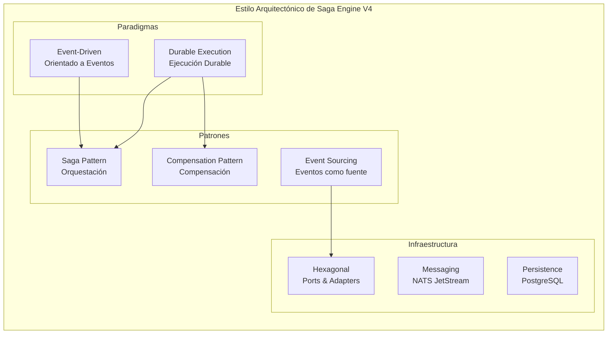

---

## 2. Contexto Estratégico (DDD)

### 2.1 El Mapa de Contextos

En DDD, un **Bounded Context** es un límite dentro del cual existe un modelo de dominio consistente. Cada contexto tiene su propio "idioma" (lenguaje ubicuo) y responsabilidades claras.

```mermaid
graph TB
    subgraph "Hodei Jobs Platform - Context Map"
        
        subgraph "Core Domain - Saga Engine"
            WC["Workflow Context<br/>Orquestación de flujos"]
            AC["Activity Context<br/>Ejecución de actividades"]
            EC["Event Context<br/>Event sourcing"]
            CC["Compensation Context<br/>Rollback inteligente"]
            TC["Timer Context<br/>Temporizadores"]
        end
        
        subgraph "Supporting Domains"
            SC["Scheduler Context<br/>Programación de jobs"]
            OC["Orchestration Context<br/>API de entrada"]
        end
        
        subgraph "Generic Subdomains"
            MC["Monitoring Context<br/>Métricas y alertas"]
            LC["Logging Context<br/>Centralización de logs"]
        end
    end
    
    OC --> WC : "Inicia workflows"
    SC --> WC : "Dispara workflows"
    WC --> AC : "Ejecuta"
    AC --> EC : "Produce eventos"
    WC --> CC : "Coordina rollback"
    WC --> TC : "Programa timers"
    AC --> MC : "Reporta métricas"
    AC --> LC : "Emite logs"
    
    style WC fill:#e1f5fe
    style AC fill:#f3e5f5
    style EC fill:#e8f5e8
    style CC fill:#ffebee
    style TC fill:#fff3e0
```

### 2.2 Lenguaje Ubicuo por Contexto

| Contexto | Entidades Principales | Verbos Clave | Lenguaje |
|----------|----------------------|---------------|----------|
| **Workflow** | Saga, WorkflowContext, Step | ejecutar, pausar, continuar | "El workflow se pausó esperando la actividad" |
| **Activity** | Activity, ActivityResult | ejecutar, reintentar | "La actividad falló con timeout" |
| **Event** | HistoryEvent, EventType | append, replay, snapshot | "Se appendó un nuevo evento" |
| **Compensation** | CompensationAction, CompensationTracker | compensar, revertir | "La compensación fue exitosa" |
| **Timer** | DurableTimer, TimerStore | crear, expirar, reclamar | "El timer expiró y se disparó" |

### 2.3 Relaciones entre Contextos

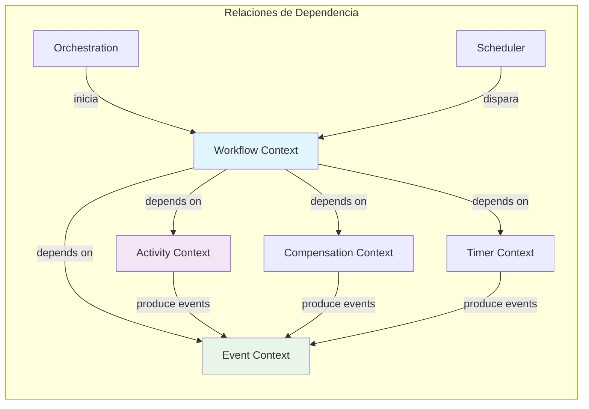

**Principio de inversión de dependencias**: El contexto de Workflow depende de abstracciones (traits), nunca de implementaciones concretas.

---

## 3. Arquitectura de Agregados

### 3.1 El Saga Aggregate (Raíz)

En DDD, un **Aggregate** es un cluster de objetos de dominio tratados como una unidad. Solo la raíz del aggregate puede ser accedida directamente.

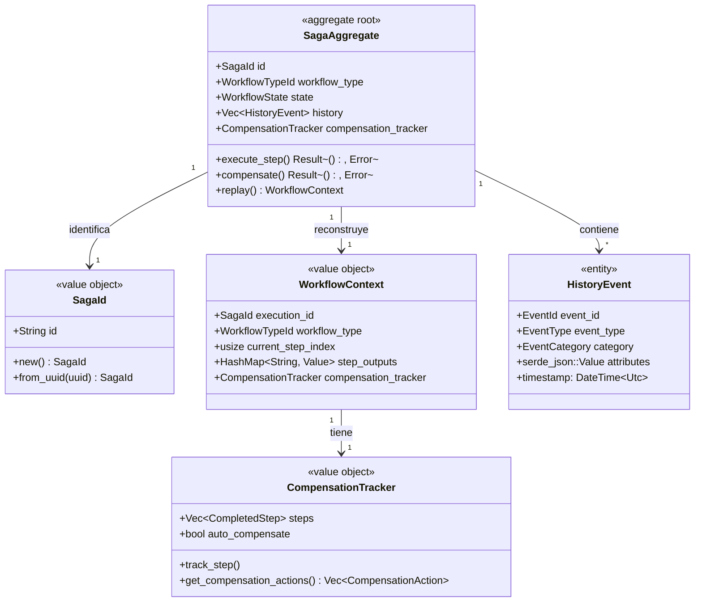

### 3.2 Invariantes del Aggregate

Las **invariantes** son reglas de negocio que siempre deben ser verdaderas. El aggregate es responsable de mantenerlas.

| Invariante | Descripción | Enforcement |
|------------|-------------|-------------|
| **Monotonicidad de EventId** | `event_id[n+1] > event_id[n]` | Optimistic locking en EventStore |
| **Inmutabilidad** | Eventos nunca se modifican | Append-only storage |
| **Orden LIFO** | Compensaciones en orden inverso | `get_compensation_actions()` invierte |
| **Finalidad de Estados** | Estados terminal son finales | State machine guards |
| **Compensación Sincrónica** | Una compensación a la vez | Compensation tracker |

### 3.3 Diagrama de Estados del Saga

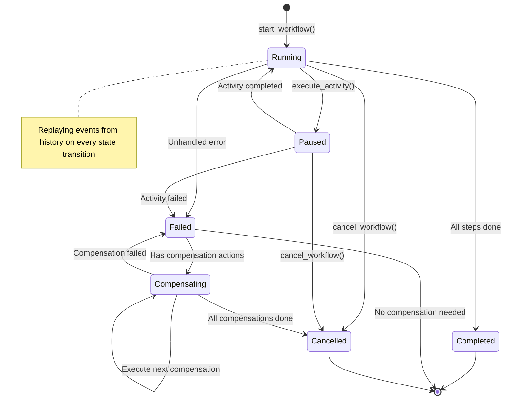

### 3.4 Contexto de Reconstrucción (WorkflowContext)

El **WorkflowContext** es un value object que representa el estado reconstruido de una saga a partir de sus eventos:

```rust
pub struct WorkflowContext {
    /// ID de la saga
    pub execution_id: SagaId,
    
    /// Tipo de workflow
    pub workflow_type: WorkflowTypeId,
    
    /// Índice del paso actual
    pub current_step_index: usize,
    
    /// Outputs de pasos anteriores
    pub step_outputs: HashMap<String, Value>,
    
    /// Estado de cancelación (si aplica)
    pub cancellation: Option<CancellationState>,
    
    /// Tracker de compensación
    pub compensation_tracker: Option<CompensationTracker>,
}
```

---

## 4. Modelo de Eventos Detallado

### 4.1 Anatomía de un HistoryEvent

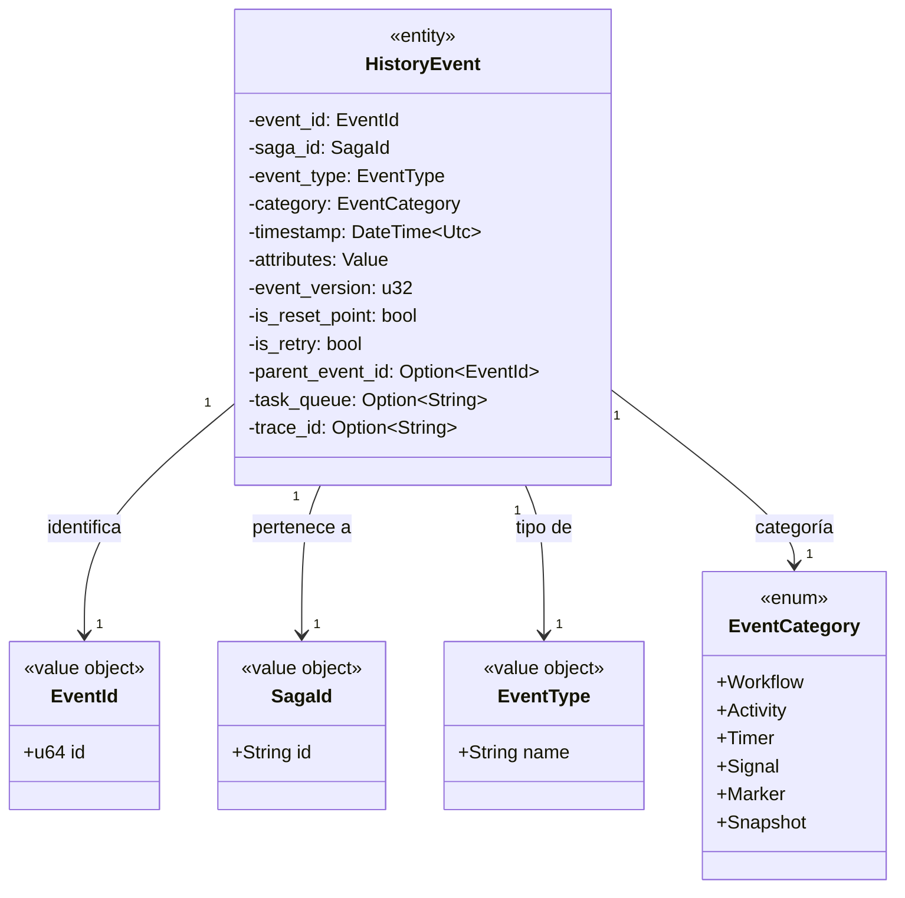

### 4.2 Catálogo de Tipos de Eventos

| Categoría | # Tipos | Descripción |
|-----------|---------|-------------|
| **Workflow** | 7 | Eventos del ciclo de vida del workflow |
| **Activity** | 6 | Eventos de actividades (schedule, start, complete, fail, timeout, cancel) |
| **Timer** | 3 | Crear, disparar, cancelar timer |
| **Signal** | 1 | Señal externa recibida |
| **Marker** | 1 | Marca especial en el historial |
| **Snapshot** | 1 | Snapshot creado |
| **Command** | 3 | Eventos de comandos |
| **ChildWorkflow** | 9 | Workflows anidados |
| **LocalActivity** | 6 | Actividades locales |
| **SideEffect** | 1 | Efectos secundarios |
| **Update** | 5 | Actualizaciones |
| **SearchAttribute** | 1 | Atributos de búsqueda |
| **Nexus** | 7 | Eventos de nexus |

### 4.3 Jerarquía de Eventos

```mermaid
graph TD
    HE[HistoryEvent] --> ET[EventType]
    HE --> EC[EventCategory]
    HE --> ATTR[Attributes<br/>Payload JSON]
    
    ET --> WE[Workflow Events<br/>7 tipos]
    ET --> AE[Activity Events<br/>6 tipos]
    ET --> TE[Timer Events<br/>3 tipos]
    ET --> SE[Signal Events<br/>1 tipo]
    ET --> ME[Marker Events<br/>1 tipo]
    ET --> SNE[Snapshot Events<br/>1 tipo]
    ET --> CE[Command Events<br/>3 tipos]
    ET --> CWE[Child Workflow Events<br/>9 tipos]
    ET --> LAE[Local Activity Events<br/>6 tipos]
    ET --> SEE[Side Effect Events<br/>1 tipo]
    ET --> UE[Update Events<br/>5 tipos]
    ET --> SAE[Search Attribute Events<br/>1 tipo]
    ET --> NE[Nexus Events<br/>7 tipos]
    
    EC --> WC[Workflow]
    EC --> AC[Activity]
    EC --> TC[Timer]
    EC --> SC[Signal]
    EC --> MC[Marker]
    EC --> SnC[Snapshot]
    EC --> CC[Command]
    EC --> CwC[ChildWorkflow]
    EC --> LAC[LocalActivity]
    EC --> SeC[SideEffect]
    EC --> UC[Update]
    EC --> SaC[SearchAttribute]
    EC --> NC[Nexus]
    
    style HE fill:#fff9c4
    style ET fill:#c8e6c9
    style EC fill:#bbdefb
```

### 4.4 Ejemplo de Evento JSON

```json
{
  "event_id": 15,
  "saga_id": "saga-123e4567-e89b-12d3-a456-426614174000",
  "event_type": "ActivityTaskCompleted",
  "category": "Activity",
  "timestamp": "2024-01-15T10:30:00.000Z",
  "attributes": {
    "activity_type": "ProcessPayment",
    "input": {
      "order_id": "order-456",
      "amount": 99.99,
      "currency": "USD"
    },
    "output": {
      "transaction_id": "txn-abc123",
      "status": "Approved"
    }
  },
  "event_version": 1,
  "is_reset_point": false,
  "is_retry": false,
  "parent_event_id": 14,
  "task_queue": "payment-activities",
  "trace_id": "span-abc123def456"
}
```

---

## 5. Modelo de Compensación (Rollback)

### 5.1 Arquitectura de Compensación

La compensación es el mecanismo que permite revertir los efectos de pasos completados cuando una saga falla.

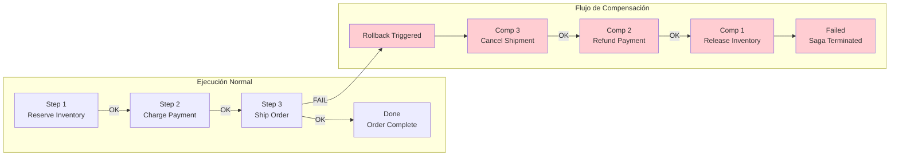

### 5.2 Modelo de Datos de Compensación

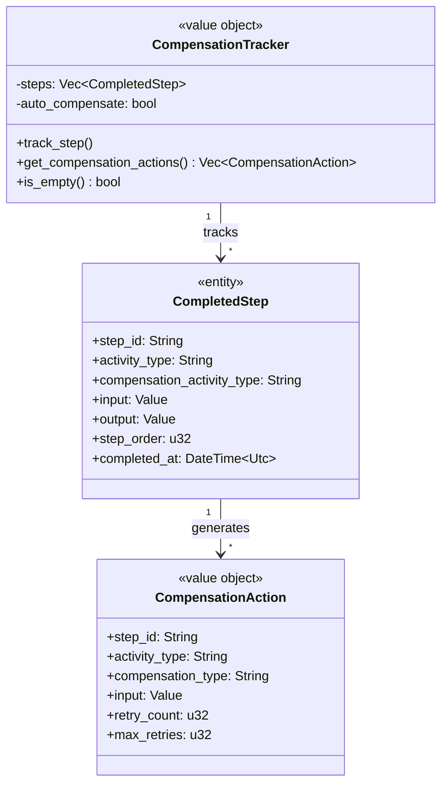

### 5.3 Flujo de Compensación Detallado

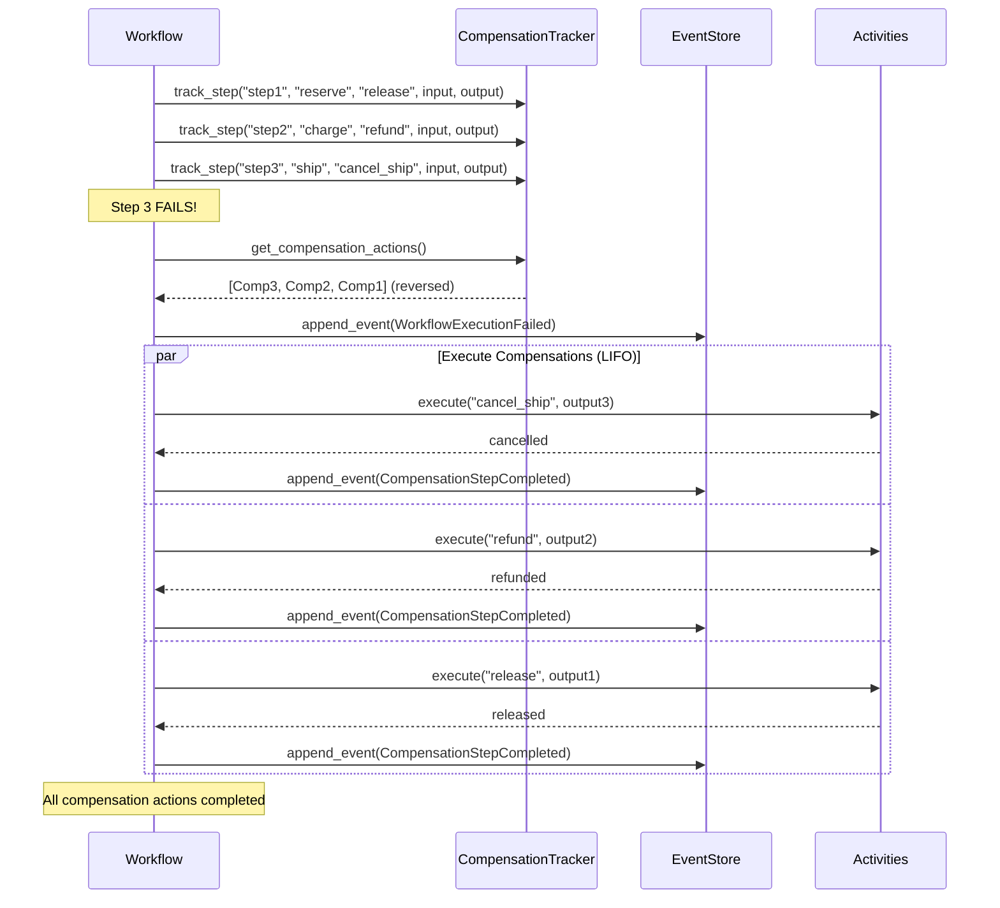

### 5.4 Datos Necesarios para Compensación

Cada paso debe guardar suficiente información para permitir una compensación efectiva:

```rust
// ✅ BIEN: Datos suficientes para compensar
ctx.track_compensatable_step_auto(
    "reserve-inventory",
    "ReserveInventoryActivity",
    json!({
        "order_id": "order-123",
        "items": [
            {"product_id": "prod-a", "quantity": 2}
        ]
    }),
    json!({
        "reservation_id": "res-456",
        "reservations": [
            {"product_id": "prod-a", "reserved_quantity": 2}
        ],
        "expires_at": "2024-01-15T11:00:00Z"
    }),
    1,
);

// La compensación puede:
// 1. Usar reservation_id para liberar exactamente esa reserva
// 2. Usar expires_at para no liberar si ya expiró naturalmente
// 3. Reintentar si falla
```

---

## 6. Modelo de Concurrencia

### 6.1 Optimistic Locking

Saga Engine usa **optimistic locking** para manejar concurrencia. Esto significa que múltiples workers pueden intentar procesar la misma saga, pero solo uno tendrá éxito.

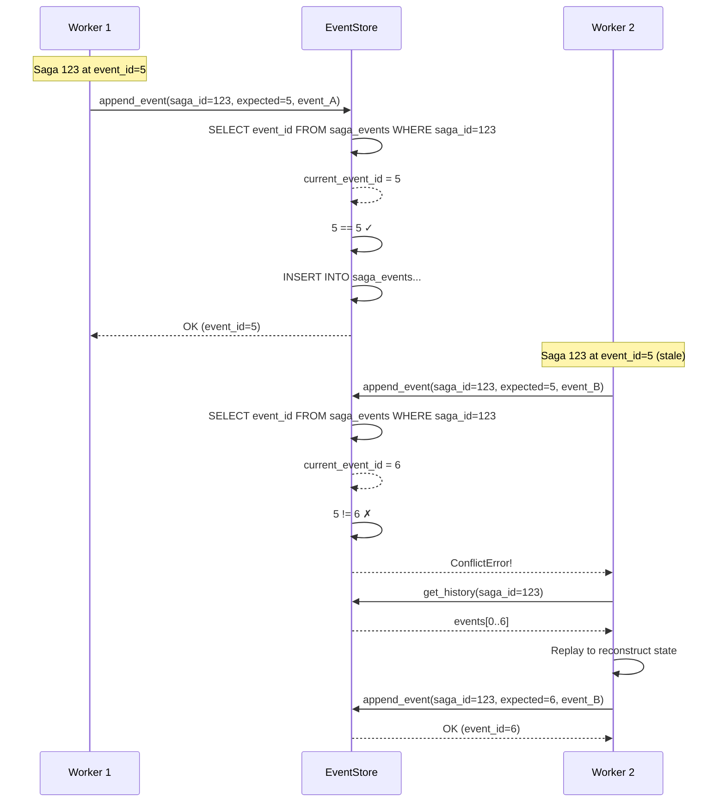

### 6.2 Granularidad de Locks

| Recurso | Tipo de Lock | Scope | Duración |
|---------|--------------|-------|----------|
| **Saga Events** | Optimistic (version check) | Por saga | Append individual |
| **Task Queue** | Lease-based | Por mensaje | Tiempo de procesamiento |
| **Timer** | Claim-based | Por timer | Hasta expirar |
| **Activity Registry** | None (read mostly) | Global | N/A |

### 6.3 Manejo de Conflictos

```rust
async fn append_event_with_retry(
    &self,
    saga_id: &SagaId,
    expected_event_id: u64,
    event: &HistoryEvent,
    max_retries: u32,
) -> Result<u64, EventStoreError> {
    let mut attempt = 0;
    let mut last_error = None;
    
    while attempt < max_retries {
        attempt += 1;
        
        match self.append_event_raw(saga_id, expected_event_id, event).await {
            Ok(event_id) => return Ok(event_id),
            Err(EventStoreError::Conflict(_)) => {
                // Conflict - need to replay and retry
                last_error = Some(e);
                
                // Exponential backoff
                let delay = Duration::from_millis(100 * 2_u64.pow(attempt - 1));
                tokio::time::sleep(delay).await;
                
                // Replay to get current state
                let history = self.get_history(saga_id).await?;
                let current_event_id = history.last().map(|e| e.event_id.0).unwrap_or(0);
                
                // Retry with new expected version
                continue;
            }
            Err(e) => return Err(e),
        }
    }
    
    Err(last_error.unwrap())
}
```

---

## 7. Patrones de Escalabilidad

### 7.1 Escalabilidad Horizontal

Saga Engine está diseñado para escalar horizontalmente añadiendo más workers.

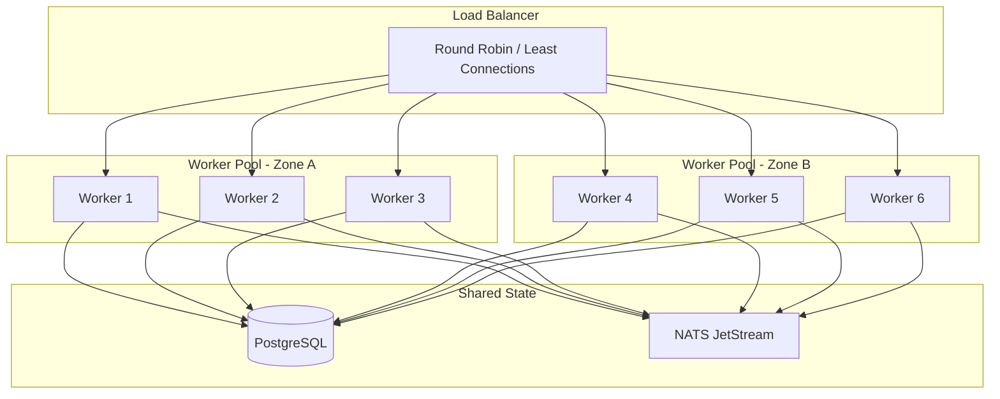

### 7.2 Estrategia de Sharding

Para very high throughput, puedes shardear las sagas:

```rust
pub enum ShardingStrategy {
    /// Shard by SagaId hash
    HashBased {
        shard_count: u64,
        hash_fn: fn(&SagaId) -> u64,
    },
    
    /// Shard by WorkflowType
    ByWorkflowType {
        mapping: HashMap<&'static str, u64>,
    },
    
    /// Shard by Tenant/Customer
    ByTenant {
        tenant_extractor: fn(&SagaId) -> String,
    },
}
```

### 7.3 Características de Rendimiento

| Operación | Latencia (p50) | Latencia (p99) | Throughput |
|-----------|----------------|----------------|------------|
| Event append (single) | 0.5ms | 2ms | 2,000/sec |
| Event append (batch 10) | 1ms | 5ms | 10,000/sec |
| Workflow replay (100 events) | 5ms | 20ms | N/A |
| Activity scheduling | 1ms | 3ms | 5,000/sec |
| Snapshot creation | 10ms | 50ms | 100/sec |

### 7.4 Estrategias de Optimización

| Técnica | Impacto | Trade-off |
|---------|---------|-----------|
| Batched event inserts | +10x throughput | Ligeramente mayor latencia |
| Snapshot cada N eventos | -100x replay | Overhead de storage |
| Parallel activities | -N x duración | Complejidad en compensación |
| Event encoding (bincode) | +2x serialización | Debugging más difícil |
| Connection pooling | -90% overhead de conexión | Uso de memoria |

---

## 8. Observabilidad y Métricas

### 8.1 Métricas del Engine

```mermaid
graph TD
    EM[SagaEngineMetrics] --> WM[Workflow Metrics]
    EM --> AM[Activity Metrics]
    EM --> EM2[Event Metrics]
    EM --> RM[Replay Metrics]
    EM --> CM[Compensation Metrics]
    
    WM --> WM1[workflow_started<br/>Counter]
    WM --> WM2[workflow_completed<br/>Counter]
    WM --> WM3[workflow_failed<br/>Counter]
    WM --> WM4[workflow_duration<br/>Histogram]
    
    AM --> AM1[activity_started<br/>Counter]
    AM --> AM2[activity_completed<br/>Counter]
    AM --> AM3[activity_failed<br/>Counter]
    AM --> AM4[activity_duration<br/>Histogram]
    
    EM2 --> EM3[events_persisted<br/>Counter]
    EM2 --> EM4[event_persist_duration<br/>Histogram]
    
    RM --> RM1[replay_duration<br/>Histogram]
    RM --> RM2[snapshot_count<br/>Gauge]
    
    CM --> CM1[compensation_started<br/>Counter]
    CM --> CM2[compensation_completed<br/>Counter]
    CM --> CM3[compensation_failed<br/>Counter]
```

### 8.2 Métricas Clave para Monitorizar

```rust
// Workflow-level metrics
workflow_started_total{workflow_type="payment"}
workflow_completed_total{workflow_type="payment"}
workflow_failed_total{workflow_type="payment"}
workflow_duration_seconds{workflow_type="payment", quantile="0.5"}

// Activity-level metrics  
activity_started_total{activity_type="process_payment"}
activity_completed_total{activity_type="process_payment"}
activity_failed_total{activity_type="process_payment"}
activity_duration_seconds{activity_type="process_payment", quantile="0.99"}

// Compensation metrics
compensation_started_total{saga_id="..."}
compensation_completed_total{saga_id="..."}
compensation_failed_total{saga_id="..."}

// System metrics
events_persisted_total
event_persist_duration_seconds
replay_duration_seconds
active_sagas_gauge
```

### 8.3 Tracing Distribuido

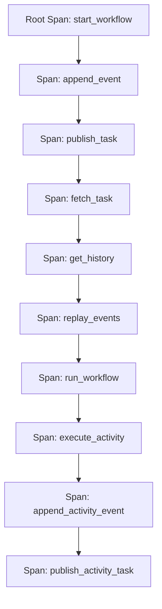

**Trace IDs propagados en cada evento**:

```rust
pub struct HistoryEvent {
    pub trace_id: Option<String>,  // ⭐ Para correlated tracing
    pub span_id: Option<String>,
    pub parent_span_id: Option<String>,
}
```

---

## 9. Modos de Fallo y Recuperación

### 9.1 Escenarios de Fallo

| Escenario | Detección | Estrategia de Recuperación |
|-----------|-----------|---------------------------|
| **Worker crash mid-processing** | NATS redeliver | Replay desde último evento |
| **Database connection loss** | Connection timeout | Retry con backoff |
| **Saga stuck (no progress)** | Stall detector | Force terminate o signal |
| **Duplicate events** | Idempotency keys | Deduplicar via event_id |
| **Event store corruption** | Checksum verification | Restore desde backup |

### 9.2 Sistema Watchdog

El **Watchdog** es un componente que monitorea la salud del sistema y toma acciones correctivas:

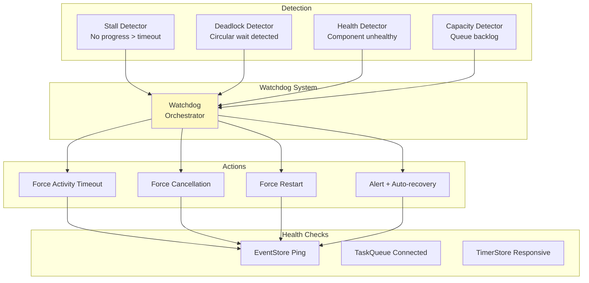

### 9.3 Tiempos de Espera y Timeouts

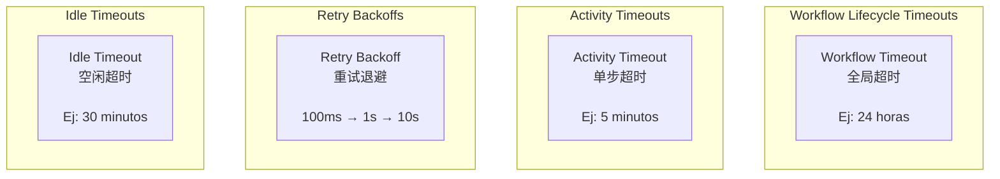

---

## 10. Arquitectura de Deployment

### 10.1 Deployment en Producción

```mermaid
graph TB
    subgraph "Kubernetes Cluster"
        subgraph "saga-engine Namespace"
            API[API Pods<br/>~3 replicas~]
            Worker[Worker Pods<br/>~5 replicas~]
            Timer[Timer Scheduler<br/>~1 replica~]
            
            subgraph "Data Layer"
                PG[(PostgreSQL<br/>~Primary + Replica~)]
                NS[NATS JetStream<br/>~3 nodes~)
            end
            
            subgraph "Caching"
                RC[(Redis<br/>~Cluster mode~)]
            end
        end
    end
    
    API --> PG
    API --> NS
    
    Worker --> PG
    Worker --> NS
    Worker --> RC
    
    Timer --> PG
    Timer --> NS
```

### 10.2 Flujo de Datos Durante Ejecución

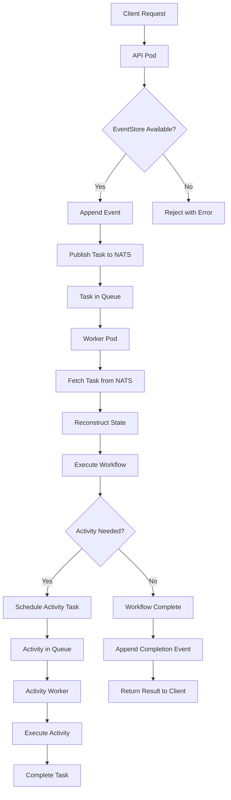

### 10.3 Alta Disponibilidad

| Componente | Réplicas | Estrategia | RTO objetivo |
|------------|----------|------------|--------------|
| API Pods | 3+ | Round robin, health checks | < 1 min |
| Worker Pods | 5+ | Auto-scaling basado en cola | < 1 min |
| Timer Scheduler | 1 (leader election) | Lease-based | < 30 seg |
| PostgreSQL | 1 primary + replicas | Async replication | < 5 min |
| NATS | 3 nodes | Quorum | < 1 min |

---

## 11. Modelo de Seguridad

### 11.1 Autenticación y Autorización

```rust
pub struct SagaSecurityConfig {
    /// Authentication provider
    auth_provider: Box<dyn AuthProvider>,
    
    /// Authorization policy
    authorization: AuthorizationPolicy,
    
    /// TLS configuration
    tls: Option<TlsConfig>,
    
    /// Rate limiting
    rate_limit: RateLimitConfig,
}
```

### 11.2 Aislamiento de Datos

| Nivel | Método de Aislamiento |
|-------|----------------------|
| Saga | Cada saga tiene UUID único |
| Tenant | Sharding por tenant_id |
| Event | Event attributes encriptado at-rest |
| Snapshot | Snapshot encryption opcional |

### 11.3 Autenticación en Colas

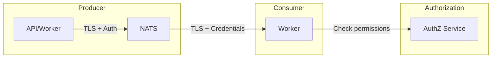

---

## 12. Estrategia de Migración y Versionado

### 12.1 Compatibilidad de Versiones

| Core Version | Postgres Adapter | NATS Adapter | Protocol |
|--------------|------------------|--------------|----------|
| 4.0.x | 4.0.x | 4.0.x | JSON/Bincode |
| 4.1.x | 4.1.x | 4.0.x | +Postcard |
| 4.2.x | 4.2.x | 4.1.x | +Compression |

### 12.2 Procedimiento de Rolling Upgrade

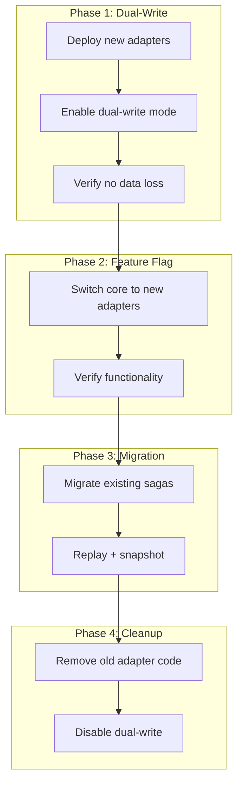

### 12.3 Versionado de Workflows

```rust
#[async_trait::async_trait]
impl DurableWorkflow for MyWorkflow {
    const TYPE_ID: &'static str = "my-workflow";
    const VERSION: u32 = 2;  // ⭐ Incrementar cuando cambia la lógica
    
    // ... resto de la implementación
}
```

**Nota**: Las sagas en ejecución usan la versión del workflow que tenían cuando iniciaron.

---

## 13. Decisiones Arquitectónicas: El Decision Log

### 13.1 Decisiones Clave y su Racional

| Decisión | Fecha | Alternativas | Racional |
|----------|-------|---------------|----------|
| **Event Sourcing** | 2024-Q1 | CRUD tradicional, Dual-write | Audit trail esencial, replay capability |
| **Bincode default codec** | 2024-Q1 | JSON, MessagePack | Rendimiento prioritario sobre debuggability |
| **PostgreSQL primary store** | 2024-Q1 | NoSQL, In-memory | ACID, ecosistema maduro |
| **NATS JetStream** | 2024-Q2 | Kafka, RabbitMQ | At-least-once delivery, baja latencia |
| **Workflow-as-Code** | 2024-Q3 | JSON DSL, YAML DSL | DX, type safety |
| **Hexagonal Architecture** | 2024-Q1 | Layered, SOA | Testabilidad, flexibilidad |
| **Optimistic Locking** | 2024-Q1 | Pessimistic locking | Mejor throughput, menor contención |
| **Timer Store en Postgres** | 2024-Q2 | Redis, In-memory | Consistencia con event store |

### 13.2 Trade-offs Documentados

```markdown
## Trade-off: Event Sourcing vs. CRUD Tradicional

### A favor de Event Sourcing:
+ Auditoría completa (compliance)
+ Replay para debugging
+ Nueva funcionalidad sin migración de datos
+ Time-travel debugging

### En contra:
- Curva de aprendizaje
- Storage overhead (más datos)
- Complejidad de queries (necesita proyección)

### Decisión: Event Sourcing
- El negocio requiere compliance
- El overhead es aceptable para el valor agregado
```

---

## Apéndice A: Checklist de Producción

```markdown
## Pre-Production Checklist

### Escalabilidad
- [ ] Load testing completado
- [ ] Peak throughput medido
- [ ] Sharding strategy definida (si aplica)

### Disponibilidad
- [ ] SLA definido y medido
- [ ] Failover testing completado
- [ ] Backup/restore probado

### Seguridad
- [ ] Penetration testing
- [ ] Encryption at-rest configurado
- [ ] TLS everywhere

### Observabilidad
- [ ] Dashboards creados
- [ ] Alerts configurados
- [ ] Runbooks documentados
```

---

## Apéndice B: Comparación con Alternativas

| Característica | Saga Engine V4 | Temporal | Cadence | Conductor |
|----------------|----------------|----------|---------|-----------|
| Language | Rust | Go/Java | Go/Java | JSON/YAML |
| Event Sourcing | ✅ | ✅ | ❌ | ❌ |
| Durable Execution | ✅ | ✅ | ✅ | Parcial |
| Compensation Built-in | ✅ | ✅ | ✅ | ✅ |
| Workflow-as-Code | ✅ | ✅ | ✅ | DSL |
| Hexagonal | ✅ | ❌ | ❌ | ❌ |
| Open Source | ✅ | ✅ | ✅ | ✅ |

---

*Document Version: 2.0.0*
*Last Updated: 2026-01-28*
*Classification: Internal - Architecture*
*Language: English (with Spanish terminology for domain concepts)*
