# Saga Engine V4 - Manual del Desarrollador

## Guía Completa: De Cero a Experto en Orquestación de Sagas

---

> **¿Qué es este documento?**
> Este manual está diseñado para desarrolladores de todos los niveles. Si nunca has escuchado hablar de Event Sourcing o el Patrón Saga, estás en el lugar correcto. Si ya eres un experto, encontrarás secciones avanzadas sobre optimización y patrones específicos.
>
> **Nuestra promesa**: Al terminar este manual, podrás diseñar, implementar y depurar sistemas distribuidos usando Saga Engine V4 con confianza.

---

## Tabla de Contenidos

1. [Introducción: El Problema que Resolvemos](#1-introducción-el-problema-que-resolvemos)
2. [Conceptos Fundamentales: Explicados para Humanos](#2-conceptos-fundamentales-explicados-para-humanos)
3. [Arquitectura Hexagonal: Puertos y Adaptadores](#3-arquitectura-hexagonal-puertos-y-adaptadores)
4. [Diseño Guiado por el Dominio (DDD)](#4-diseño-guiado-por-el-dominio-ddd)
5. [Event Sourcing: Tu Historia Completa](#5-event-sourcing-tu-historia-completa)
6. [El Patrón Saga: Transacciones Distribuidas](#6-el-patrón-saga-transacciones-distribuidas)
7. [Tu Primer Workflow: Tutorial Paso a Paso](#7-tu-primer-workflow-tutorial-paso-a-paso)
8. [Actividades: Los Bloques de Construcción](#8-actividades-los-bloques-de-construcción)
9. [Compensación: El Rollback Inteligente](#9-compensación-el-rollback-inteligente)
10. [Manejo de Errores y Recuperación](#10-manejo-de-errores-y-recuperación)
11. [Configuración y Rendimiento](#11-configuración-y-rendimiento)
12. [Patrones Avanzados y Mejores Prácticas](#12-patrones-avanzados-y-mejores-prácticas)
13. [Referencia Rápida de API](#13-referencia-rápida-de-api)

---

## 1. Introducción: El Problema que Resolvemos

### 1.1 El Desafío de los Sistemas Distribuidos

Imagina que estás construyendo un sistema de comercio electrónico. Cuando un cliente realiza una compra, necesitas:

1. **Crear el pedido** en tu base de datos
2. **Reducir el inventario** de los productos
3. **Procesar el pago** con el gateway
4. **Programar el envío** con el transportista
5. **Enviar email de confirmación** al cliente

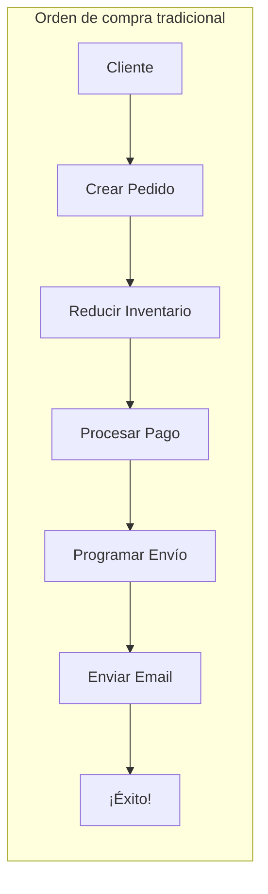

**El problema**: ¿Qué pasa si el paso 4 falla (el transportista no responde) después de que el pago ya fue procesado?

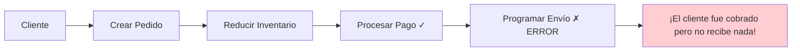

### 1.2 La Solución: Patrón Saga

El **Patrón Saga** es como tener un "plan de respaldo" para cada paso. Si algo falla, ejecutamos las operaciones inversas en orden inverso:

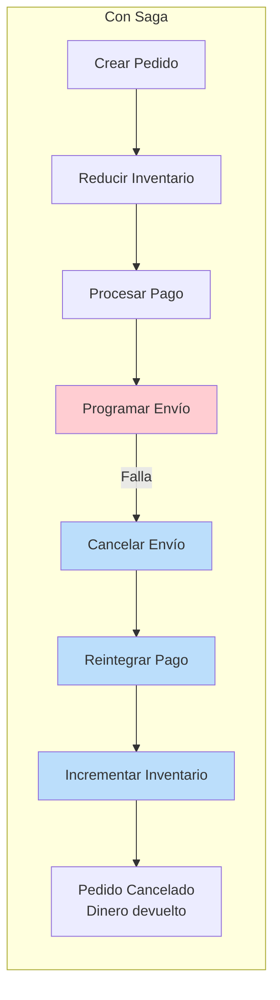

### 1.3 Saga Engine V4: Nuestra Implementación

Saga Engine V4 no solo implementa el patrón Saga, sino que añade:

| Característica | Descripción | Beneficio |
|----------------|-------------|-----------|
| **Event Sourcing** | Guardamos cada cambio como un evento | Auditoría completa, travel en el tiempo |
| **Durable Execution** | Los workflows sobreviven reinicios | Confiabilidad empresarial |
| **Compensación Automática** | Rollback inteligente | Menos código, menos errores |
| **Infraestructura Enchufable** | PostgreSQL, NATS, etc. | Flexibilidad de deployment |

---

## 2. Conceptos Fundamentales: Explicados para Humanos

### 2.1 Event Sourcing: Tu Diario Personal

**La analogía del diario**: Imagina que en lugar de guardar tu saldo actual en el banco, guardaran cada transacción que ever has hecho:

```
2024-01-01: Depósito +1000 USD (Saldo: 1000)
2024-01-05: Café -5 USD (Saldo: 995)
2024-01-10: Alquiler -800 USD (Saldo: 195)
```

Para saber tu saldo actual, simplemente sumas todas las transacciones. Esto es **Event Sourcing**.

**En el Saga Engine**:

```rust
// En lugar de guardar esto:
struct Order {
    status: OrderStatus,
    total: Decimal,
}

// Guardamos esto:
HistoryEvent {
    event_id: 0,
    event_type: OrderCreated,
    attributes: { "total": 100, "items": [...] }
}

HistoryEvent {
    event_id: 1,
    event_type: PaymentCompleted,
    attributes: { "transaction_id": "txn_123" }
}

HistoryEvent {
    event_id: 2,
    event_type: OrderShipped,
    attributes: { "tracking": "TRK456" }
}
```

**¿Por qué es esto poderoso?**

1. **Auditoría completa**: Puedes ver exactamente qué pasó y cuándo
2. **Debugging temporal**: Reproduce cualquier momento del pasado
3. **Nueva funcionalidad sin migración**: Agrega eventos nuevos, reconstruye el estado

### 2.2 Durable Execution: La Ejecución que Sobrevive

**La analogía del libro de cocina**: Estás siguiendo una receta compleja y anotas en qué paso vas. Si alguien te interrumpe, puedes continuar exactamente donde estabas porque tienes todo registrado.

```mermaid
flowchart TB
    subgraph "Sin Durable Execution"
        A[Tarea 1] --> B[Tarea 2]
        B --> C[Tarea 3]
        C --> D[Reinicio del servidor]
        D -.-> E[¡Perdemos el estado!]
    end
    
    subgraph "Con Durable Execution"
        F[Tarea 1] --> G[Grabar: Terminé Tarea 1]
        G --> H[Tarea 2]
        H --> I[Grabar: Terminé Tarea 2]
        I --> J[Reinicio del servidor]
        J --> K[Leer: Estoy en Tarea 3]
        K --> L[Continuar desde Tarea 3]
    end
```

### 2.3 Compensación: El Plan B

**La analogía del строитель (constructor)**: Cuando montas un mueble de IKEA y un tornillo no entra, desatas todo lo que has atornillado antes. Eso es compensación.

```rust
// Pseudocódigo de compensación
fn procesar_orden(orden) {
    try {
        // Paso 1: Crear orden
        orden = crear_orden(orden)
        
        // Paso 2: Reservar inventario (puede fallar)
        inventario = reservar_inventario(orden.items)
        
        // Paso 3: Procesar pago (puede fallar)
        pago = procesar_pago(orden.total)
        
        // Paso 4: Enviar (puede fallar)
        envio = enviar_productos(orden.direccion)
        
    } catch error {
        // ¡Algo falló! Ejecutar compensaciones en reversa
        if inventario.exists() {
            liberar_inventario(inventario)  // Paso 4 de rollback
        }
        if pago.exists() {
            reembolsar_pago(pago)           // Paso 3 de rollback
        }
        if orden.exists() {
            cancelar_orden(orden)           // Paso 2 de rollback
        }
        throw error  // Notificar el fallo
    }
}
```

### 2.4 Vocabulario Esencial

| Término | Definición Simple | Ejemplo Real |
|---------|-------------------|--------------|
| **Saga** | Una secuencia de transacciones con compensaciones | "Proceso de compra completo" |
| **Workflow** | La definición de cómo se ejecuta una saga | `OrderProcessingWorkflow` |
| **Activity** | Una operación individual | `ProcessPaymentActivity` |
| **Event** | Algo que ya ocurrió | "Pago completado" |
| **Command** | Algo que queremos que ocurra | "Procesar pago" |
| **Aggregate** | Una entidad del dominio con comportamiento | `Order`, `Payment` |

---

## 3. Arquitectura Hexagonal: Puertos y Adaptadores

### 3.1 ¿Por qué Hexagonal Architecture?

**El problema original**: En arquitecturas tradicionales, tu lógica de negocio está acoplada a la base de datos, al framework web, etc. Si quieres cambiar de MySQL a PostgreSQL, o de REST a gRPC, necesitas reescribir mucho código.

**La solución de Hexagonal**: Imagina un núcleo puro (tu lógica de negocio) conectado al mundo exterior a través de "puertos". Los "adaptadores" conectan los puertos a tecnologías específicas.

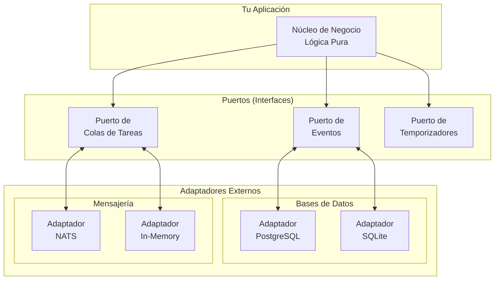

### 3.2 Estructura de Directorios Explicada

```
crates/saga-engine/
├── core/src/                    # ⭐ DOMINIO PURO (sin dependencias externas)
│   ├── event/                   # Definiciones de eventos
│   ├── workflow/                # Definiciones de workflows
│   ├── activity_registry/       # Registro de actividades
│   ├── compensation/            # Lógica de compensación
│   ├── port/                    # ⭐ PUERTOS (traits/interfaces)
│   ├── codec/                   # Serialización
│   └── snapshot/                # Persistencia de estado
│
├── pg/src/                      # Adaptadores PostgreSQL
│   ├── event_store.rs           # Implementa EventStore
│   ├── timer_store.rs           # Implementa TimerStore
│   └── replayer.rs              # Implementa HistoryReplayer
│
├── nats/src/                    # Adaptadores NATS
│   ├── task_queue.rs            # Implementa TaskQueue
│   ├── event_bus.rs             # Publicación de eventos
│   └── signal_dispatcher.rs     # Señales
│
└── local/src/                   # Adaptadores para testing
```

**¿Por qué esta estructura?**

1. **core/src es puro**: No sabe nada de PostgreSQL ni NATS
2. **Los puertos definen contratos**: Qué debe hacer la infraestructura
3. **Los adaptadores implementan contratos**: Cómo lo hace cada tecnología

### 3.3 Ejemplo: El Puerto EventStore

```rust
// En core/src/port/event_store.rs - SOLO INTERFAZ

/// ⭐ Este archivo define el CONTRATO, no la implementación
/// No hay código de base de datos aquí

#[async_trait::async_trait]
pub trait EventStore: Send + Sync {
    /// El tipo de error específico de cada implementación
    type Error: Display + Debug + Send + Sync + 'static;
    
    /// Guardar un evento en el store
    async fn append_event(
        &self,
        saga_id: &SagaId,
        expected_next_event_id: u64,
        event: &HistoryEvent,
    ) -> Result<u64, EventStoreError<Self::Error>>;
    
    /// Obtener todos los eventos de una saga
    async fn get_history(&self, saga_id: &SagaId) 
        -> Result<Vec<HistoryEvent>, Self::Error>;
    
    /// Guardar un snapshot del estado
    async fn save_snapshot(&self, saga_id: &SagaId, event_id: u64, state: &[u8]) 
        -> Result<(), Self::Error>;
    
    /// Obtener el snapshot más reciente
    async fn get_latest_snapshot(&self, saga_id: &SagaId) 
        -> Result<Option<(u64, Vec<u8>)>, Self::Error>;
}
```

```rust
// En pg/src/event_store.rs - LA IMPLEMENTACIÓN CONCRETA

/// ⭐ Aquí está el código real de PostgreSQL
/// Solo necesita implementar el trait anterior

pub struct PostgresEventStore {
    pool: sqlx::Pool<Postgres>,
    codec: Arc<dyn Codec>,
}

#[async_trait::async_trait]
impl EventStore for PostgresEventStore {
    type Error = PostgresEventStoreError;
    
    async fn append_event(
        &self,
        saga_id: &SagaId,
        expected_next_event_id: u64,
        event: &HistoryEvent,
    ) -> Result<u64, PostgresEventStoreError> {
        // ⭐ Código real de PostgreSQL aquí
        // 1. Iniciar transacción
        // 2. Verificar versión optimista
        // 3. Insertar evento
        // 4. Commit
    }
    
    // ... resto de métodos
}
```

**El beneficio clave**: Tu lógica de dominio puede testearse con `InMemoryEventStore` y producción usa `PostgresEventStore` sin cambiar una línea de código de negocio.

---

## 4. Diseño Guiado por el Dominio (DDD)

### 4.1 ¿Qué es DDD y por qué importa?

**La analogía del traductor**: Imagina que estás construyendo un sistema médico. Si usas términos técnicos ("el paciente presenta sintomatología dispéptica"), todos los médicos te entenderán. Si usas términos genéricos ("el paciente tiene dolor de estómago"), pierdes precisión.

DDD te ayuda a hablar el mismo idioma que los expertos del dominio:

| Término Técnico | Equivalente en DDD |
|-----------------|-------------------|
| "Tabla de pedidos" | `Order` Aggregate |
| "ID del cliente" | `CustomerId` Value Object |
| "Estado del pedido" | `OrderStatus` Enum |

### 4.2 Bounded Contexts (Contextos Delimitados)

**Definición simple**: Cada parte de tu sistema tiene su propio "idioma" y responsabilidades claras.

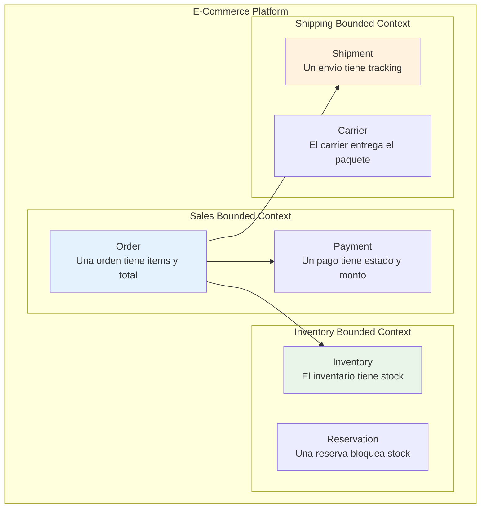

### 4.3 Aggregates (Agregados)

**Definición**: Un Aggregate es un cluster de objetos de dominio que se tratan como una unidad. Solo un objeto (el Aggregate Root) puede ser accedido desde fuera.

```mermaid
classDiagram
    class Order {
        <<Aggregate Root>>
        +OrderId id
        +OrderStatus status
        +add_item(product, qty)
        +confirm()
        +cancel()
    }
    
    class OrderItem {
        +ProductId product_id
        +u32 quantity
        +Money unit_price
    }
    
    class Payment {
        +PaymentStatus status
        +Money amount
    }
    
    Order "1" --> "*" OrderItem : contains
    Order "1" --> "1" Payment : has
    
    note right of Order
        Solo puedes acceder a OrderItem
        a través de Order (no existe solo)
    end note
```

### 4.4 Value Objects (Objetos de Valor)

**Definición**: Objetos que describen características pero no tienen identidad propia.

```rust
// ❌ MAL: Usar tipos primitivos
struct Order {
    customer_id: String,      // ¿Qué formato? UUID? Email?
    total_amount: f64,        // ¿Qué moneda? ¿Precisión?
    status: String,           // ¿Valores válidos?
}

// ✅ BIEN: Value Objects con semántica
struct CustomerId(uuid::Uuid);
struct Money {
    amount: rust_decimal::Decimal,
    currency: &'static str,
}
struct OrderStatus(OrderStatusEnum);

impl CustomerId {
    fn new(id: &str) -> Result<Self, ValidationError> {
        // Validación del formato
    }
}
```

---

## 5. Event Sourcing: Tu Historia Completa

### 5.1 El Problema con el Enfoque Tradicional

**Enfoque tradicional (CRUD)**:

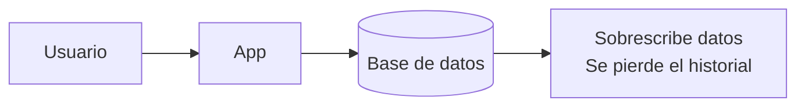

**Enfoque Event Sourcing**:

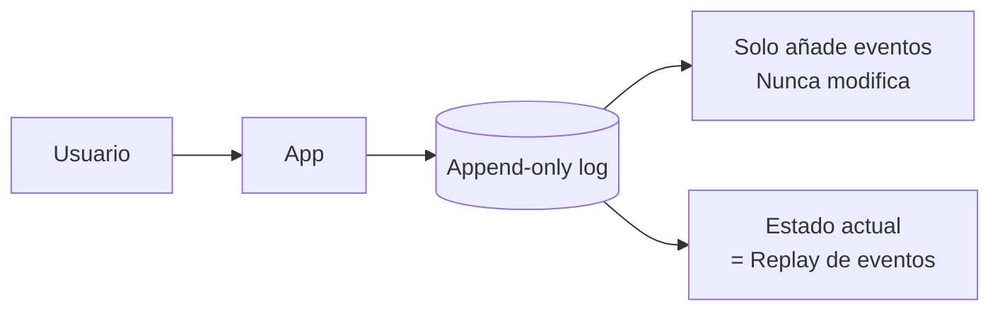

### 5.2 Estructura de un Evento

```rust
pub struct HistoryEvent {
    /// ⭐ ID único y monotónico (0, 1, 2, 3...)
    pub event_id: EventId,
    
    /// ⭐ ID de la saga a la que pertenece
    pub saga_id: SagaId,
    
    /// ⭐ Tipo del evento (60+ tipos disponibles)
    pub event_type: EventType,
    
    /// ⭐ Categoría para filtrado
    pub category: EventCategory,
    
    /// ⭐ Cuándo ocurrió
    pub timestamp: DateTime<Utc>,
    
    /// ⭐ Los datos del evento (JSON flexible)
    pub attributes: Value,
    
    /// ⭐ Versión del schema para migraciones
    pub event_version: u32,
    
    /// ⭐ Es un punto de restauración (snapshot)?
    pub is_reset_point: bool,
    
    /// ⭐ Para tracing distribuido
    pub trace_id: Option<String>,
}
```

### 5.3 Categorías de Eventos

| Categoría | Propósito | Ejemplos |
|-----------|-----------|----------|
| **Workflow** | Eventos del ciclo de vida del workflow | Started, Completed, Failed |
| **Activity** | Eventos de actividades individuales | Scheduled, Started, Completed, Failed |
| **Timer** | Eventos de temporizadores | Created, Fired, Canceled |
| **Signal** | Señales externas recibidas | SignalReceived |
| **Marker** | Marcas especiales en el historial | MarkerRecorded |
| **Snapshot** | Estado persistido | SnapshotCreated |

### 5.4 Replay: Reconstruyendo el Estado

**La analogía del video**: El estado actual es como el frame actual de un video. Los eventos son todos los frames anteriores. Para obtener cualquier frame, reproduces todos los frames anteriores.

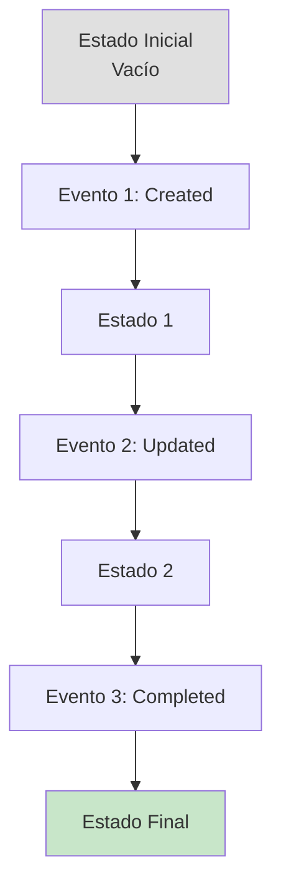

```rust
// Ejemplo de replay en Rust
impl OrderAggregate {
    fn replay(events: &[HistoryEvent]) -> Self {
        let mut aggregate = OrderAggregate::default();
        
        for event in events {
            aggregate.apply(event);
        }
        
        aggregate
    }
    
    fn apply(&mut self, event: &HistoryEvent) {
        match event.event_type {
            EventType::OrderCreated => {
                let payload: OrderCreatedPayload = 
                    serde_json::from_value(event.attributes.clone()).unwrap();
                self.id = payload.order_id;
                self.status = OrderStatus::Pending;
                self.total = payload.total_amount;
            }
            EventType::OrderConfirmed => {
                self.status = OrderStatus::Confirmed;
            }
            EventType::OrderCompleted => {
                self.status = OrderStatus::Completed;
            }
            _ => {} // Ignorar eventos desconocidos
        }
    }
}
```

### 5.5 Snapshots: Optimización del Replay

**El problema**: Si tienes 10,000 eventos, reproducir todos cada vez es lento.

**La solución**: Un snapshot es como un "capítulo" del libro. Puedes saltar al capítulo 5 en lugar de leer desde el principio.

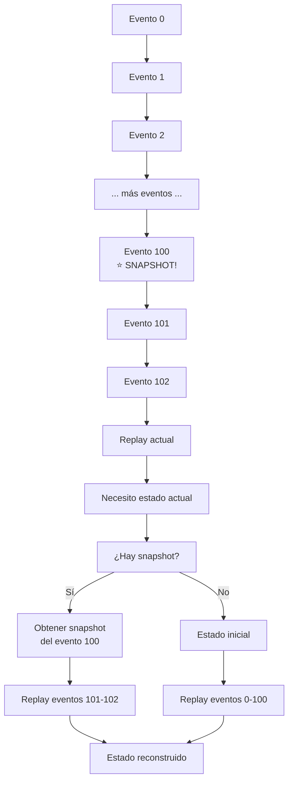

---

## 6. El Patrón Saga: Transacciones Distribuidas

### 6.1 El Problema de las Transacciones ACID

En una base de datos tradicional, una transacción asegura que múltiples operaciones se completen todas o ninguna:

```sql
BEGIN TRANSACTION;
INSERT INTO orders ...;
UPDATE inventory ... WHERE product_id = ...;
UPDATE accounts ... WHERE customer_id = ...;
COMMIT;  -- Todo o nada
```

**El problema**: Esto solo funciona dentro de UNA base de datos. ¿Qué pasa cuando el inventario está en un servicio separado?

### 6.2 Saga al Rescate

**Definición**: Una Saga es una secuencia de transacciones locales donde cada transacción actualiza datos y publica un evento. Si una transacción falla, la saga ejecuta "transacciones compensatorias" para deshacer los cambios.

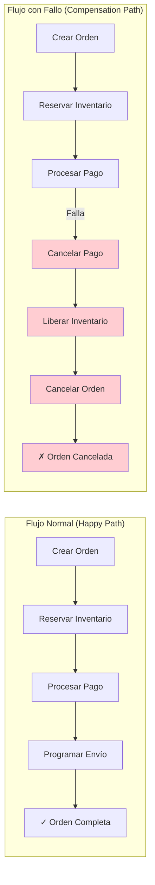

### 6.3 Orden de Compensación (LIFO)

**Importante**: Las compensaciones se ejecutan en **orden inverso** (Last In, First Out):

```
Orden de ejecución:
1. Crear Orden     ✅
2. Reservar Inv.   ✅
3. Procesar Pago   ❌ FALLA AQUÍ

Orden de compensación:
1. Reintegrar Pago (compensation de paso 3)
2. Liberar Inv.    (compensation de paso 2)
3. Cancelar Orden  (compensation de paso 1)
```

### 6.4 Datos de Compensación

Cada paso debe guardar suficiente información para poder compensarlo:

```rust
struct CompletedStep {
    step_id: String,                    // ID del paso
    activity_type: String,              // Qué activity ejecutó
    compensation_activity_type: String, // Qué activity compensa
    input: Value,                       // Input original
    output: Value,                      // Output (necesario para compensar)
    step_order: u32,                    // Orden de ejecución
    completed_at: DateTime<Utc>,        // Cuándo se completó
}

// Ejemplo:
// Step: "Reservar Inventario"
// Input: { "items": [{"product_id": "A", "qty": 2}] }
// Output: { "reservation_id": "res_123", "reserved": [...] }
// Compensation puede usar esto para liberar exactamente lo reservado
```

---

## 7. Tu Primer Workflow: Tutorial Paso a Paso

### 7.1 Objetivo del Tutorial

Vamos a construir un **Workflow de Procesamiento de Pagos** que:

1. Valida el pago
2. Procesa el pago con un gateway
3. Registra el resultado

### 7.2 Paso 1: Definir los Types

```rust
// src/types.rs

use serde::{Deserialize, Serialize};
use thiserror::Error;

/// ⭐ INPUT: Lo que recibe el workflow
#[derive(Debug, Clone, Serialize, Deserialize)]
pub struct PaymentInput {
    pub order_id: String,
    pub customer_id: String,
    pub amount: rust_decimal::Decimal,
    pub currency: String,
    pub payment_token: String,
}

/// ⭐ OUTPUT: Lo que devuelve el workflow
#[derive(Debug, Clone, Serialize, Deserialize)]
pub struct PaymentOutput {
    pub transaction_id: String,
    pub status: PaymentStatus,
    pub approved_amount: rust_decimal::Decimal,
    pub processed_at: chrono::DateTime<chrono::Utc>,
}

#[derive(Debug, Clone, Serialize, Deserialize)]
pub enum PaymentStatus {
    Approved,
    Declined,
    Failed,
    Refunded,
}

/// ⭐ ERROR: Tipos de error específicos del dominio
#[derive(Debug, Error, Serialize, Deserialize)]
pub enum PaymentError {
    #[error("Payment declined: {0}")]
    Declined(String),
    
    #[error("Gateway error: {0}")]
    GatewayError(String),
    
    #[error("Invalid token: {0}")]
    InvalidToken(String),
    
    #[error("Insufficient funds")]
    InsufficientFunds,
}
```

### 7.3 Paso 2: Definir la Actividad

```rust
// src/activities/process_payment.rs

use async_trait::async_trait;
use saga_engine_core::workflow::Activity;

use crate::types::{PaymentInput, PaymentOutput, PaymentError};

/// ⭐ Una Activity es una operación atómica que puede fallar
/// y ser compensada independientemente
#[derive(Debug)]
pub struct ProcessPaymentActivity;

#[async_trait::async_trait]
impl Activity for ProcessPaymentActivity {
    // ⭐ Identificador único de la actividad
    const TYPE_ID: &'static str = "payment.process";
    
    // ⭐ Tipos de input/output
    type Input = PaymentInput;
    type Output = PaymentOutput;
    type Error = PaymentError;
    
    async fn execute(&self, input: Self::Input) 
        -> Result<Self::Output, Self::Error> {
        
        // ═══════════════════════════════════════════════════
        // AQUÍ VA LA LÓGICA REAL DE NEGOCIO
        // ═══════════════════════════════════════════════════
        
        // 1. Validar el token (simulado)
        if input.payment_token.is_empty() {
            return Err(PaymentError::InvalidToken(
                "Payment token cannot be empty".to_string()
            ));
        }
        
        // 2. Simular llamada al gateway de pago
        // En producción, esto sería una llamada HTTP real
        let gateway_response = simulate_gateway_call(
            &input.payment_token,
            input.amount,
            &input.currency
        ).await?;
        
        // 3. Retornar el resultado
        Ok(PaymentOutput {
            transaction_id: gateway_response.transaction_id,
            status: map_gateway_status(gateway_response.status),
            approved_amount: gateway_response.approved_amount,
            processed_at: chrono::Utc::now(),
        })
    }
}

// Funciones helper simuladas
async fn simulate_gateway_call(
    token: &str,
    amount: rust_decimal::Decimal,
    currency: &str,
) -> Result<GatewayResponse, PaymentError> {
    // Simulación: siempre exitoso
    Ok(GatewayResponse {
        transaction_id: format!("txn_{}", uuid::Uuid::new_v4()),
        status: "approved",
        approved_amount: amount,
    })
}

struct GatewayResponse {
    transaction_id: String,
    status: &'static str,
    approved_amount: rust_decimal::Decimal,
}

fn map_gateway_status(status: &'static str) -> PaymentStatus {
    match status {
        "approved" => PaymentStatus::Approved,
        "declined" => PaymentStatus::Declined,
        "failed" => PaymentStatus::Failed,
        _ => PaymentStatus::Failed,
    }
}
```

### 7.4 Paso 3: Definir el Workflow

```rust
// src/workflows/payment_workflow.rs

use async_trait::async_trait;
use saga_engine_core::workflow::{DurableWorkflow, WorkflowContext};
use saga_engine_core::event::{EventType, EventCategory, HistoryEvent, EventId};
use saga_engine_core::SagaId;

use crate::types::{PaymentInput, PaymentOutput, PaymentError};
use crate::activities::ProcessPaymentActivity;

/// ⭐ El Workflow define LA SECUENCIA de actividades
/// y cómo manejar errores y compensaciones
#[derive(Debug)]
pub struct PaymentWorkflow;

#[async_trait::async_trait]
impl DurableWorkflow for PaymentWorkflow {
    // ⭐ Identificadores del workflow
    const TYPE_ID: &'static str = "payment.processing";
    const VERSION: u32 = 1;
    
    // ⭐ Tipos de input/output/error
    type Input = PaymentInput;
    type Output = PaymentOutput;
    type Error = PaymentError;
    
    async fn run(
        &self,
        ctx: &mut WorkflowContext,
        input: Self::Input,
    ) -> Result<Self::Output, Self::Error> {
        // ═══════════════════════════════════════════════════
        // LOGICA DEL WORKFLOW
        // ═══════════════════════════════════════════════════
        
        // 1. Loggear que iniciando workflow
        tracing::info!(
            saga_id = %ctx.saga_id(),
            order_id = %input.order_id,
            "Iniciando procesamiento de pago"
        );
        
        // 2. Ejecutar la actividad de procesamiento de pago
        // ⭐ El ctx se encarga de:
        //   - Grabar eventos antes y después
        //   - Manejar reintentos si falla
        //   - Pausar el workflow hasta que termine
        let output = ctx
            .execute_activity(&ProcessPaymentActivity, input.clone())
            .await
            .map_err(|e| PaymentError::GatewayError(e.to_string()))?;
        
        // 3. Listo, retornar el resultado
        tracing::info!(
            saga_id = %ctx.saga_id(),
            transaction_id = %output.transaction_id,
            "Pago procesado exitosamente"
        );
        
        Ok(output)
    }
}
```

### 7.5 Paso 4: Registrar en el Engine

```rust
// src/lib.rs

use saga_engine_core::workflow::ActivityRegistry;

pub struct PaymentSagaModule;

impl PaymentSagaModule {
    /// ⭐ Registrar todas las actividades y workflows
    pub fn register(registry: &mut ActivityRegistry) {
        // Registrar actividades
        registry.register_activity(super::activities::ProcessPaymentActivity);
        
        // El engine descubrirá los workflows automáticamente
        // por sus implementaciones de DurableWorkflow
    }
}
```

### 7.6 Paso 5: Usar el Workflow

```rust
// src/main.rs

use saga_engine_core::{SagaEngine, SagaEngineConfig};
use saga_engine_core::event::{EventCategory, EventType, HistoryEvent};
use saga_engine_pg::PostgresEventStore;
use saga_engine_nats::NatsTaskQueue;

use crate::types::{PaymentInput, PaymentOutput};
use crate::workflows::PaymentWorkflow;

#[tokio::main]
async fn main() -> Result<(), Box<dyn std::error::Error>> {
    // 1. Configurar
    let config = SagaEngineConfig::default();
    
    // 2. Crear adaptadores (dependencias externas)
    let event_store = PostgresEventStore::connect("postgresql://...").await?;
    let task_queue = NatsTaskQueue::connect("nats://...").await?;
    let timer_store = PostgresTimerStore::connect("postgresql://...").await?;
    
    // 3. Crear el engine
    let engine = SagaEngine::new(
        config,
        event_store,
        task_queue,
        timer_store,
    );
    
    // 4. Registrar actividades
    let mut registry = ActivityRegistry::default();
    PaymentSagaModule::register(&mut registry);
    
    // 5. Crear input
    let input = PaymentInput {
        order_id: "order_123".to_string(),
        customer_id: "customer_456".to_string(),
        amount: rust_decimal::Decimal::from(99),
        currency: "USD".to_string(),
        payment_token: "tok_visa_4242".to_string(),
    };
    
    // 6. Iniciar el workflow
    let saga_id = SagaId::new();
    let output = engine
        .start_workflow::<PaymentWorkflow>(saga_id, input)
        .await?;
    
    println!("Pago completado: {:?}", output);
    
    Ok(())
}
```

### 7.7 Resumen del Flujo

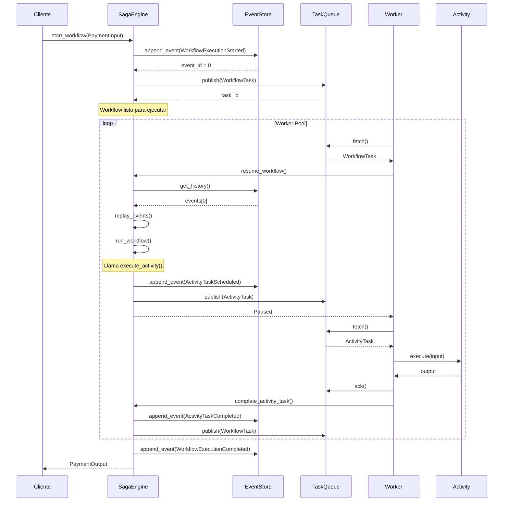

---

## 8. Actividades: Los Bloques de Construcción

### 8.1 ¿Qué es una Activity?

Una **Activity** es la unidad más pequeña de trabajo en Saga Engine. Es una operación atómica que:

- Recibe un **Input**
- Produce un **Output** o un **Error**
- Puede ser **ejecutada múltiples veces** (idempotente)
- Puede tener una **actividad compensatoria**

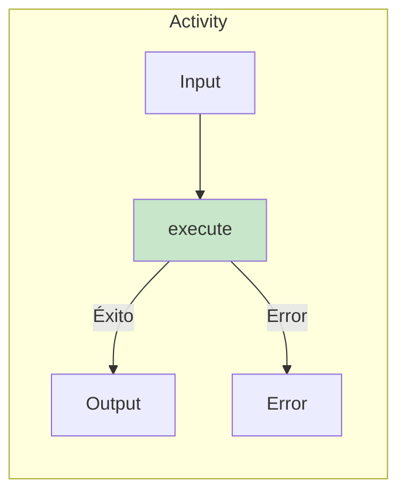

### 8.2 Características de una Buena Activity

```rust
// ✅ BIEN: Activity bien diseñada
struct ReserveInventoryActivity;

#[async_trait::async_trait]
impl Activity for ReserveInventoryActivity {
    const TYPE_ID: &'static str = "inventory.reserve";
    
    type Input = ReserveInventoryInput;
    type Output = ReserveInventoryOutput;
    type Error = InventoryError;
    
    async fn execute(&self, input: Self::Input) 
        -> Result<Self::Output, Self::Error> {
        
        // 1. Idempotente: Si ejecutas dos veces, no pasa nada malo
        //    (Verificamos si ya existe la reserva)
        
        // 2. Atómica: O se reserva todo o no se reserva nada
        
        // 3. Bien documentada: Input/Output claros
    }
}
```

### 8.3 Actividades Compensables

Si una actividad modifica el mundo exterior (base de datos, APIs externas), necesita una compensación:

```rust
// ⭐ Activity de pago con su compensación
struct ProcessPaymentActivity;

#[async_trait::async_trait]
impl EcommerceActivity<PaymentInput, PaymentOutput> for ProcessPaymentActivity {
    const TYPE_ID: &'static str = "payment.process";
    
    // ⭐ Esta actividad puede ser compensada con un reembolso
    const COMPENSATION_ACTIVITY: Option<&'static str> = Some("payment.refund");
    
    async fn execute(&self, input: PaymentInput) 
        -> Result<PaymentOutput, PaymentError> {
        // Procesar pago real
    }
    
    // ⭐ Preparar datos para la compensación
    fn prepare_compensation_data(&self, output: &PaymentOutput) 
        -> Option<serde_json::Value> {
        Some(serde_json::json!({
            "transaction_id": output.transaction_id,
            "amount": output.approved_amount,
        }))
    }
}

struct RefundPaymentActivity;

#[async_trait::async_trait]
impl EcommerceActivity<RefundInput, RefundOutput> for RefundPaymentActivity {
    const TYPE_ID: &'static str = "payment.refund";
    // ⭐ No tiene compensación (no compensamos reembolsos)
    const COMPENSATION_ACTIVITY: Option<&'static str> = None;
    
    async fn execute(&self, input: RefundInput) 
        -> Result<RefundOutput, RefundError> {
        // Reintegrar el dinero
    }
}
```

### 8.4 Catálogo de Actividades Comunes

| Actividad | Tipo | Compensación | Caso de uso |
|-----------|------|--------------|-------------|
| `ProcessPayment` | Sincrónica | `RefundPayment` | Cobrar tarjeta |
| `ReserveInventory` | Sincrónica | `ReleaseInventory` | Bloquear stock |
| `SendEmail` | Asincrónica | None | Notificaciones |
| `CreateFile` | Sincrónica | `DeleteFile` | Generar reportes |
| `CallExternalAPI` | Sincrónica | Depends | Integraciones |

---

## 9. Compensación: El Rollback Inteligente

### 9.1 ¿Por qué no usar transacciones tradicionales?

En sistemas distribuidos, no hay una transacción global:

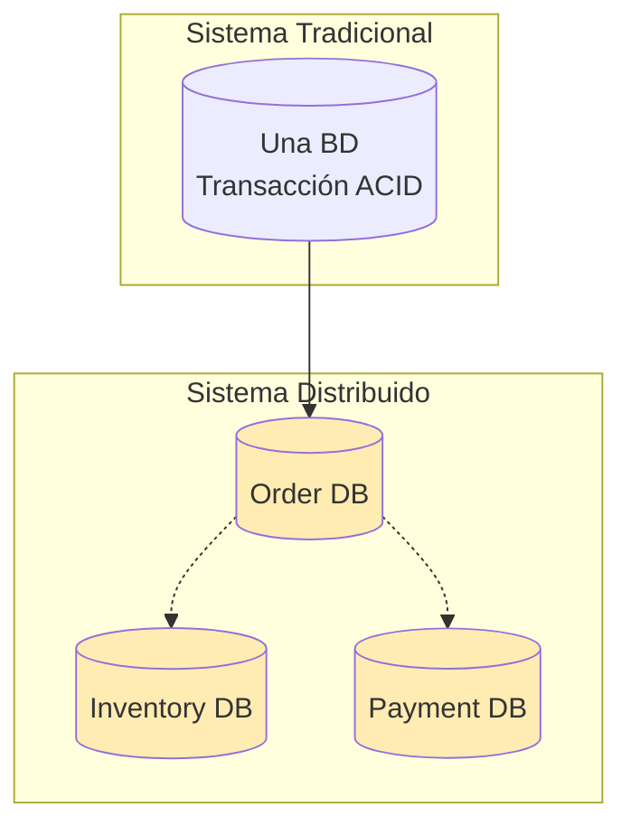

### 9.2 El Patrón de Compensación

```rust
// ⭐ Trackear cada paso para poder compensar
ctx.track_compensatable_step_auto(
    step_id: "reserve-inventory",
    activity_type: "ReserveInventoryActivity",
    input: json!({ "items": [...] }),
    output: json!({ "reservation_id": "res_123" }),
    order: 1,
);
```

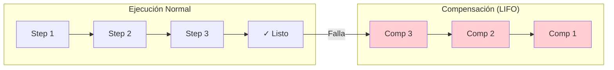

### 9.3 Datos de Compensación

Cada compensación necesita suficientes datos:

```rust
// ❌ MAL: Datos insuficientes
ctx.track_compensatable_step(
    "payment",
    "ProcessPayment",
    json!({ "amount": 100 }),  // Solo el monto
    // No tenemos el transaction_id para reembolsar!
);

// ✅ BIEN: Datos completos
ctx.track_compensatable_step(
    "payment",
    "ProcessPayment",
    json!({ "amount": 100 }),
    json!({ 
        "transaction_id": "txn_abc123",
        "gateway": "stripe",
        "last_four": "4242"
    }),
);
```

### 9.4 Compensación con Errores

¿Qué pasa si la compensación también falla?

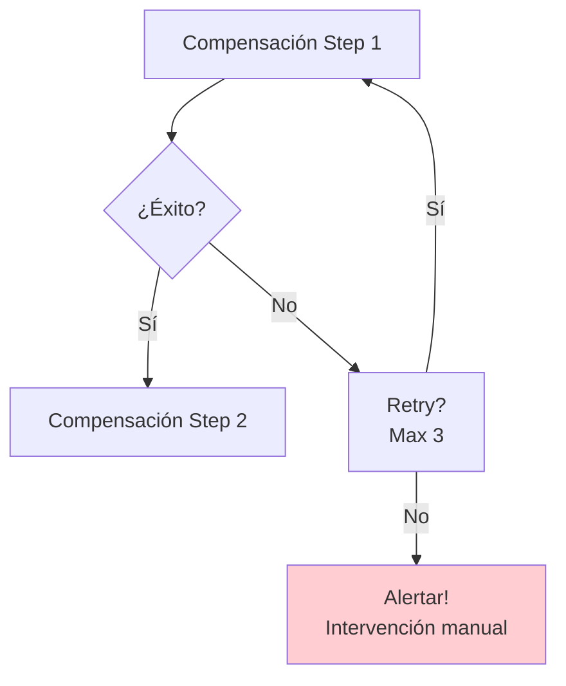

```rust
// ⭐ Configurar comportamiento de compensación
ctx.init_compensation_tracker_with_auto_compensate(true);

// ⭐ Opcional: Retry manual
let compensation_actions = ctx
    .compensation_tracker
    .get_compensation_actions();

for action in compensation_actions {
    let mut retries = 0;
    loop {
        match execute_compensation(&action).await {
            Ok(()) => break,
            Err(e) if retries < action.max_retries => {
                retries += 1;
                tokio::time::sleep(Duration::from_secs(2_u64.pow(retries))).await;
            }
            Err(e) => {
                // ⭐ Alertar! Requiere intervención manual
                tracing::error!("Compensation failed: {:?}", e);
                return Err(OrderWorkflowError::CompensationRequired(
                    action.step_id.clone()
                ));
            }
        }
    }
}
```

---

## 10. Manejo de Errores y Recuperación

### 10.1 Jerarquía de Errores

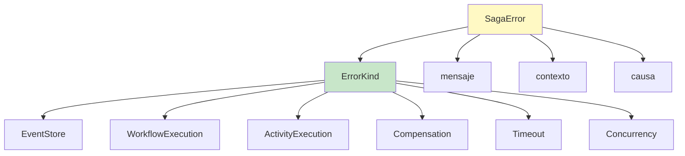

### 10.2 Tipos de Errores y Estrategias

| Error Kind | Causa Común | Estrategia |
|------------|-------------|------------|
| **ActivityExecution** | Bug en actividad | Fix código, replay |
| **Timeout** | Gateway lento | Retry con backoff |
| **Concurrency** | Dos workers misma saga | Replay automático |
| **Compensation** | Compensación falla | Alerta manual |
| **EventStore** | DB temporalmente no disponible | Retry con backoff |

### 10.3 Errores Contextuales

```rust
// ⭐ Agregar contexto para debugging
let error = Error::activity_execution("Activity failed")
    .with_context("saga_id", saga_id.to_string())
    .with_context("activity_type", "ProcessPayment")
    .with_context("attempt", attempt.to_string())
    .with_context("last_error", last_error.to_string());

// Resultado estructurado:
// {
//   "kind": "ActivityExecution",
//   "message": "Activity failed",
//   "context": {
//     "saga_id": "abc-123",
//     "activity_type": "ProcessPayment",
//     "attempt": "3"
//   }
// }
```

### 10.4 Recuperación Automática

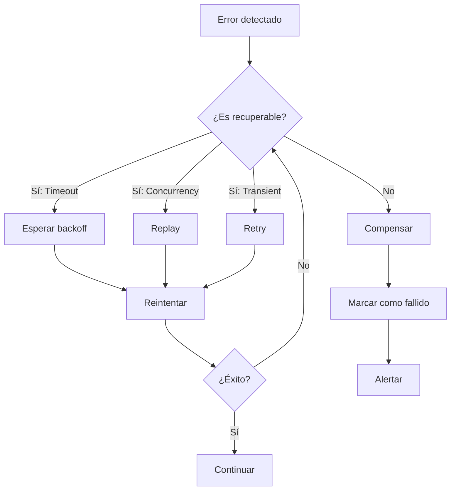

---

## 11. Configuración y Rendimiento

### 11.1 Configuración del Engine

```rust
pub struct SagaEngineConfig {
    /// ⭐ Cada cuántos eventos crear un snapshot
    /// Valor típico: 100-500
    /// - Muy bajo: overhead de almacenamiento
    /// - Muy alto: replay lento
    pub max_events_before_snapshot: u64,
    
    /// ⭐ Timeout por defecto para actividades
    /// Valor típico: 300s (5 minutos)
    pub default_activity_timeout: Duration,
    
    /// ⭐ Cola de tareas para workflows
    pub workflow_task_queue: String,
    
    /// ⭐ Máximo reintentos para actividades
    pub max_activity_retries: u32,
    
    /// ⭐ Delay entre reintentos (backoff)
    pub retry_backoff_initial: Duration,
    pub retry_backoff_max: Duration,
}
```

### 11.2 Optimización de Rendimiento

| Parámetro | Valor Recomendado | Razón |
|-----------|-------------------|-------|
| `max_events_before_snapshot` | 100 | Balance entre replay y storage |
| `default_activity_timeout` | 300s | Timeout generoso para APIs |
| `max_activity_retries` | 3 | Suficiente para errores transitorios |
| `batch_size` | 10 | Throughput vs latencia |

### 11.3 Comparación de Codecs

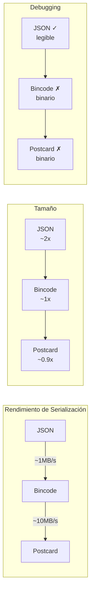

**Recomendación**:
- Desarrollo: **JSON** (legible, fácil debugging)
- Producción: **Bincode** o **Postcard** (10x más rápido)

---

## 12. Patrones Avanzados y Mejores Prácticas

### 12.1 Paralelización de Actividades

```rust
#[async_trait::async_trait]
impl DurableWorkflow for ParallelWorkflow {
    async fn run(
        &self,
        ctx: &mut WorkflowContext,
        input: Input,
    ) -> Result<Output, Error> {
        // ⭐ Ejecutar actividades en paralelo
        let (result_a, result_b) = tokio::join!(
            ctx.execute_activity(&ActivityA, &input),
            ctx.execute_activity(&ActivityB, &input)
        );
        
        let a = result_a?;
        let b = result_b?;
        
        // ⭐ Ahora ejecutar dependiente
        ctx.execute_activity(&ActivityC, &(a, b)).await
    }
}
```

### 12.2 Ciclos de Retry

```rust
// ⭐ Retry con exponential backoff
let max_retries = 3;
let mut last_error = None;

for attempt in 1..=max_retries {
    match ctx.execute_activity(&UnreliableActivity, &input).await {
        Ok(result) => return Ok(result),
        Err(e) => {
            last_error = Some(e);
            if attempt < max_retries {
                let delay = Duration::from_secs(2_u64.pow(attempt - 1));
                tokio::time::sleep(delay).await;
            }
        }
    }
}

Err(last_error.unwrap())
```

### 12.3 Manejo de Tiempos

```rust
// ⭐ Crear un timer para esperar
ctx.create_timer(
    "wait_for_approval",
    Duration::from_hours(24),
    Some("approval_timeout".to_string()),
).await?;

// ⭐ O esperar por señal externa
let signal = ctx.wait_for_signal("approval_received").await?;
```

### 12.4 Mejores Prácticas Checklist

```markdown
✅ DISEÑO
- [ ] Usar Value Objects (no primitivos)
- [ ] Un Aggregate Root por Bounded Context
- [ ] Eventos nombrados en pasado (OrderCreated, no CreateOrder)
- [ ] Activities idempotentes

✅ IMPLEMENTACIÓN
- [ ] Compensación para cada paso que modifica estado
- [ ] Timeouts apropiados para cada actividad
- [ ] Contexto rico en errores (saga_id, step, etc.)
- [ ] Snapshots configurados correctamente

✅ OPERACIONES
- [ ] Monitorear duración de workflows
- [ ] Alertar en stuck workflows
- [ ] Plan de recuperación para cada tipo de error
- [ ] Tests de chaos (fallos injected)
```

---

## 13. Referencia Rápida de API

### 13.1 Traits Principales

```rust
// ⭐ Workflow definition
trait DurableWorkflow {
    const TYPE_ID: &'static str;
    const VERSION: u32;
    type Input: Serialize + DeserializeOwned;
    type Output: Serialize + DeserializeOwned;
    type Error: std::error::Error + Send + Sync;
    
    async fn run(
        &self,
        ctx: &mut WorkflowContext,
        input: Self::Input,
    ) -> Result<Self::Output, Self::Error>;
}

// ⭐ Activity definition  
trait Activity {
    const TYPE_ID: &'static str;
    type Input: Serialize + DeserializeOwned;
    type Output: Serialize + DeserializeOwned;
    type Error: std::error::Error + Send + Sync;
    
    async fn execute(&self, input: Self::Input) 
        -> Result<Self::Output, Self::Error>;
}

// ⭐ Ports (infraestructura)
trait EventStore { ... }
trait TaskQueue { ... }
trait TimerStore { ... }
trait HistoryReplayer { ... }
```

### 13.2 WorkflowContext Methods

```rust
impl WorkflowContext {
    // ⭐ Ejecución de actividades
    async fn execute_activity<A: Activity>(
        &mut self,
        activity: &A,
        input: A::Input,
    ) -> Result<A::Output, A::Error>;
    
    // ⭐ Compensación
    fn track_compensatable_step_auto(
        &mut self,
        step_id: &str,
        activity_type: &str,
        input: Value,
        output: Value,
        order: u32,
    );
    
    // ⭐ Timers
    async fn create_timer(
        &mut self,
        timer_id: &str,
        duration: Duration,
        callback: Option<String>,
    ) -> Result<(), Error>;
    
    // ⭐ Señales
    async fn wait_for_signal(&mut self, signal_id: &str) -> Result<Value, Error>;
    
    // ⭐ Estado
    fn set_step_output(&mut self, key: String, value: Value);
    fn get_step_output(&self, key: &str) -> Option<&Value>;
}
```

### 13.3 Eventos Comunes

| Evento | Categoría | Descripción |
|--------|-----------|-------------|
| `WorkflowExecutionStarted` | Workflow | Inicio del workflow |
| `WorkflowExecutionCompleted` | Workflow | Éxito total |
| `WorkflowExecutionFailed` | Workflow | Fallo irrecuperable |
| `ActivityTaskScheduled` | Activity | Actividad asignada |
| `ActivityTaskCompleted` | Activity | Éxito |
| `ActivityTaskFailed` | Activity | Fallo |
| `TimerCreated` | Timer | Timer creado |
| `TimerFired` | Timer | Timer expirado |
| `CompensationStepStarted` | Compensation | Inicio de rollback |
| `CompensationStepCompleted` | Compensation | Rollback exitoso |

---

## Apéndice A: Glosario

| Término | Definición |
|---------|------------|
| **Aggregate** | Cluster de objetos tratados como unidad |
| **Bounded Context** | Límite de un dominio específico |
| **Domain Event** | Algo significativo que ocurrió en el dominio |
| **Event Sourcing** | Guardar estado como secuencia de eventos |
| **Idempotente** | Seguro ejecutar múltiples veces |
| **Saga** | Transacción distribuida con compensaciones |
| **Snapshot** | Estado persistido para optimizar replay |
| **Value Object** | Objeto sin identidad que describe características |

---

## Apéndice B: Recursos Adicionales

### Lectura Recomendada
- "Domain-Driven Design" - Eric Evans
- "Implementing Domain-Driven Design" - Vaughn Vernon
- "Enterprise Integration Patterns" - Gregor Hohpe

### Ссылки (Links)
- [Saga Pattern - Microsoft](https://learn.microsoft.com/en-us/azure/architecture/patterns/saga-pattern)
- [Event Sourcing - Martin Fowler](https://martinfowler.com/eaaDev/EventSourcing.html)

---

*Manual Version: 2.0.0*
*Last Updated: 2026-01-28*
*Language: English (with Spanish terminology for domain concepts)*
