# Saga Engine V4 - Manual de Diagramas

## Guía Visual Completa: Entendiendo la Arquitectura a través de Diagramas

---

> **¿Qué es este documento?**
> Este manual utiliza diagramas Mermaid para visualizar los conceptos clave de Saga Engine V4. Cada diagrama incluye una explicación detallada de qué representa, por qué es importante, y cómo se relaciona con los demás.
>
> **Cómo usar este manual**:
> 1. Lee la descripción de cada diagrama
> 2. Observa cómo los componentes se conectan
> 3. Consulta el código fuente referenciado para ver la implementación

---

## Tabla de Contenidos

1. [Contexto General del Sistema](#1-contexto-general-del-sistema)
2. [Arquitectura Hexagonal (Ports & Adapters)](#2-arquitectura-hexagonal-ports--adapters)
3. [Estructura de Directorios](#3-estructura-de-directorios)
4. [Flujo de Ejecución de un Workflow](#4-flujo-de-ejecución-de-un-workflow)
5. [Modelo de Eventos](#5-modelo-de-eventos)
6. [Patrón de Compensación (Rollback)](#6-patrón-de-compensación-rollback)
7. [Diagrama de Estados del Workflow](#7-diagrama-de-estados-del-workflow)
8. [Concurrencia: Optimistic Locking](#8-concurrencia-optimistic-locking)
9. [Estrategia de Snapshots](#9-estrategia-de-snapshots)
10. [Arquitectura de Timers](#10-arquitectura-de-timers)
11. [Task Queue con NATS JetStream](#11-task-queue-con-nats-jetstream)
12. [Registro de Actividades](#12-registro-de-actividades)
13. [Jerarquía de Errores](#13-jerarquía-de-errores)
14. [Comparación de Codecs](#14-comparación-de-codecs)
15. [Sistema Watchdog](#15-sistema-watchdog)
16. [Cómo Leer y Crear Diagramas Mermaid](#16-cómo-leer-y-crear-diagramas-mermaid)

---

## 1. Contexto General del Sistema

### 1.1 Vista Panorámica

Este diagrama muestra cómo Saga Engine V4 encaja en la plataforma Hodei Jobs y sus dependencias externas.

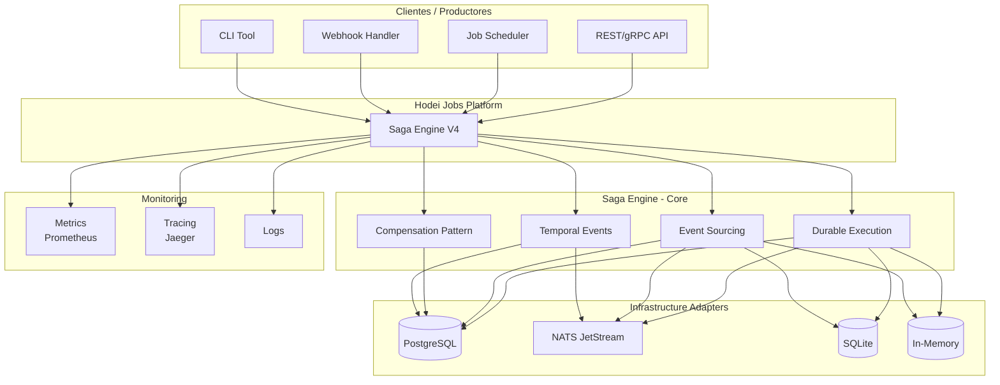

**Explicación detallada**:

| Componente | Descripción | Rol |
|------------|-------------|-----|
| **API/Scheduler/Webhook/CLI** | Productores de workflows |发起 (inician) nuevos workflows |
| **Durable Execution** | Motor de ejecución | 保证 (asegura) que los workflows completan |
| **Event Sourcing** | Persistencia de eventos | 记录 (registra) cada cambio |
| **Compensation Pattern** | Manejo de fallos | 回滚 (revierte) en caso de error |
| **Temporal Events** | Timers y delays | 定时 (programa) acciones futuras |
| **PostgreSQL** | Persistencia primaria | 存储 (almacena) eventos y estado |
| **NATS JetStream** | Colas de mensajes | 传递 (transmite) tareas |
| **SQLite/In-Memory** | Testing adapters | 测试 (permite tests) |

### 1.2 Flujo de Datos Principal

```
Productores → Saga Engine → Infrastructure → Consumidores

  API           Durable              PostgreSQL        Metrics
  Scheduler  →  Execution      →      NATS        →   Tracing
  Webhook        Event                 SQLite          Logs
  CLI            Sourcing
                 Compensation
                 Timers
```

---

## 2. Arquitectura Hexagonal (Ports & Adapters)

### 2.1 El Patrón de Puertos y Adaptadores

Este diagrama muestra cómo Saga Engine separa la lógica de negocio de la infraestructura.

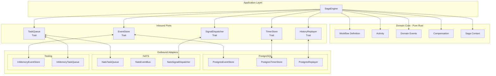

**Conceptos clave**:

- **Domain Core (Verde)**: Lógica de negocio pura, sin dependencias externas
- **Inbound Ports (Amarillo)**: Contratos (traits) que definen qué necesita el dominio
- **Outbound Adapters (Azul/Naranja)**: Implementaciones concretas para cada tecnología

### 2.2 Beneficios de Esta Arquitectura

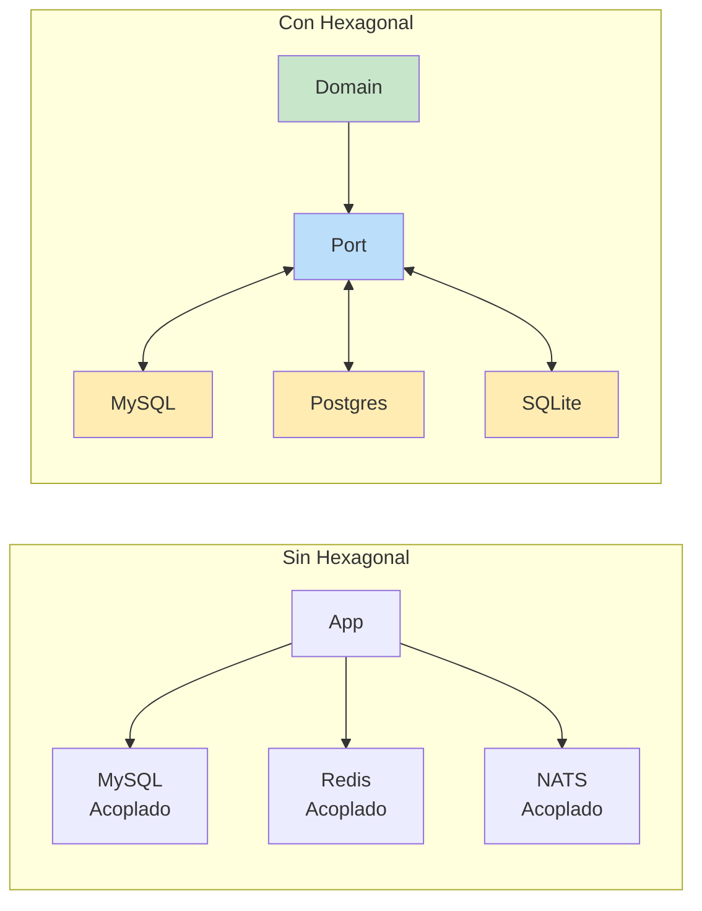

**Desacoplamiento**: Puedes cambiar la base de datos sin modificar el dominio.

---

## 3. Estructura de Directorios

### 3.1 Organización del Código

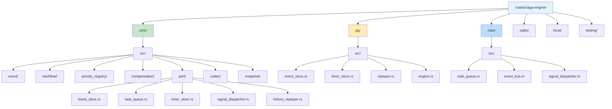

**Jerarquía de colores**:

| Color | Significado | Contenido |
|-------|-------------|-----------|
| **Azul claro** | Raíz | Punto de entrada |
| **Verde** | Core domain | Lógica pura |
| **Amarillo** | PostgreSQL | Implementación persistente |
| **Azul** | NATS | Implementación de mensajería |

### 3.2 Correspondencia con Capas

```
┌─────────────────────────────────────────────┐
│           Application Layer                  │
│           (SagaEngine facade)                │
├─────────────────────────────────────────────┤
│              Domain Core                     │
│  ┌──────────┬──────────┬──────────┐        │
│  │ workflow │ activity │event     │        │
│  └──────────┴──────────┴──────────┘        │
├─────────────────────────────────────────────┤
│              Ports (Traits)                  │
│  ┌──────────┬──────────┬──────────┐        │
│  │EventStore│TaskQueue │TimerStore│        │
│  └──────────┴──────────┴──────────┘        │
├─────────────────────────────────────────────┤
│          Adapters (Infrastructure)           │
│  ┌──────────┬──────────┬──────────┐        │
│  │Postgres  │  NATS    │ InMemory │        │
│  └──────────┴──────────┴──────────┘        │
└─────────────────────────────────────────────┘
```

---

## 4. Flujo de Ejecución de un Workflow

### 4.1 Secuencia Completa

Este diagrama de secuencia muestra paso a paso cómo se ejecuta un workflow.

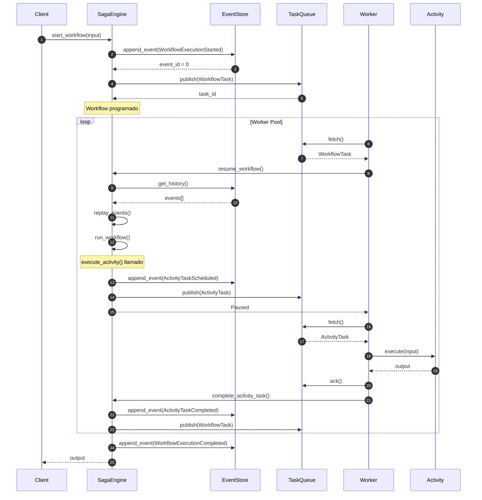

### 4.2 Paso a Paso

| Paso | Descripción | Qué Sucede |
|------|-------------|-----------|
| 1 | **Iniciar Workflow** | Cliente envía input al engine |
| 2 | **Grabar Evento Inicial** | Se persiste `WorkflowExecutionStarted` |
| 3 | **Publicar Tarea** | El task va a la cola de NATS |
| 4 | **Worker Fetch** | Un worker pickea la tarea |
| 5 | **Replay** | Se reconstruye el estado desde eventos |
| 6 | **Ejecutar Workflow** | Se corre la lógica del workflow |
| 7 | **Actividad Schedule** | Se programa una actividad |
| 8 | **Worker Procesa** | La actividad se ejecuta |
| 9 | **Activity Completed** | Se graba el resultado |
| 10 | **Workflow Continúa** | El workflow retoma |
| 11 | **Workflow Complete** | Se graba el evento final |

### 4.3 Durabilidad Garantizada

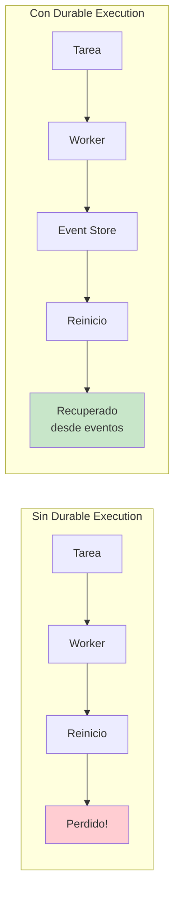

---

## 5. Modelo de Eventos

### 5.1 Taxonomía de Eventos

```mermaid
graph TD
    HE[HistoryEvent<br/>Historia del SAGA] --> ET[EventType<br/>Tipo de Evento]
    HE --> EC[EventCategory<br/>Categoría]
    HE --> ATTR[Attributes<br/>Payload JSON]
    
    ET --> WE[Workflow Events<br/>7 tipos]
    ET --> AE[Activity Events<br/>6 tipos]
    ET --> TE[Timer Events<br/>3 tipos]
    ET --> SE[Signal Events<br/>1 tipo]
    ET --> ME[Marker Events<br/>1 tipo]
    ET --> SNE[Snapshot Events<br/>1 tipo]
    ET --> CE[Command Events<br/>3 tipos]
    ET --> CWE[Child Workflow Events<br/>9 tipos]
    ET --> LAE[Local Activity Events<br/>6 tipos]
    ET --> SEE[Side Effect Events<br/>1 tipo]
    ET --> UE[Update Events<br/>5 tipos]
    ET --> SAE[Search Attribute Events<br/>1 tipo]
    ET --> NE[Nexus Events<br/>7 tipos]
    
    EC --> WC[Workflow]
    EC --> AC[Activity]
    EC --> TC[Timer]
    EC --> SC[Signal]
    EC --> MC[Marker]
    EC --> SnC[Snapshot]
    EC --> CC[Command]
    EC --> CwC[ChildWorkflow]
    EC --> LAC[LocalActivity]
    EC --> SeC[SideEffect]
    EC --> UC[Update]
    EC --> SaC[SearchAttribute]
    EC --> NC[Nexus]
    
    style HE fill:#fff9c4
    style ET fill:#c8e6c9
    style EC fill:#bbdefb
```

### 5.2 Detalle de Categorías

| Categoría | Eventos Principales | Propósito |
|-----------|--------------------|-----------|
| **Workflow** | Started, Completed, Failed, TimedOut, Canceled | Ciclo de vida del workflow |
| **Activity** | Scheduled, Started, Completed, Failed, TimedOut, Canceled | Ejecución de actividades |
| **Timer** | Created, Fired, Canceled | Temporizadores |
| **Signal** | SignalReceived | Señales externas |
| **Marker** | MarkerRecorded | Marcas especiales |

### 5.3 Ejemplo de Evento JSON

```json
{
  "event_id": 15,
  "saga_id": "saga-123e4567-e89b-12d3-a456-426614174000",
  "event_type": "ActivityTaskCompleted",
  "category": "Activity",
  "timestamp": "2024-01-15T10:30:00.000Z",
  "attributes": {
    "activity_type": "ProcessPayment",
    "input": { "order_id": "order-456", "amount": 99.99 },
    "output": { "transaction_id": "txn-abc123" }
  },
  "event_version": 1,
  "is_reset_point": false,
  "is_retry": false,
  "trace_id": "span-abc123def456"
}
```

---

## 6. Patrón de Compensación (Rollback)

### 6.1 Flujo Normal vs. Flujo de Compensación

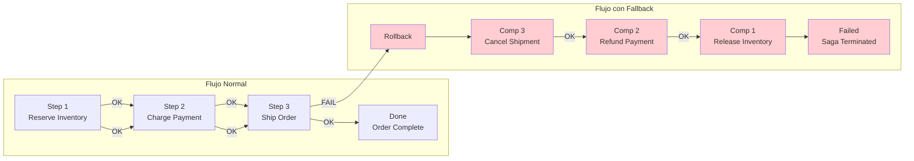

### 6.2 Orden de Compensación (LIFO)

```mermaid
flowchart TD
    A[Orden de ejecución] --> B[1. Reserve Inventory]
    B --> C[2. Charge Payment]
    C --> D[3. Ship Order]
    D -->|FALLA| E[Fallo detected]
    
    E --> F[Orden de compensación]
    F --> G[1. Cancel Shipment<br/>(compensation del paso 3)]
    G --> H[2. Refund Payment<br/>(compensation del paso 2)]
    H --> I[3. Release Inventory<br/>(compensation del paso 1)]
    
    style E fill:#ffcdd2
    style F fill:#ffecb3
    style G fill:#ffcdd2
    style H fill:#ffcdd2
    style I fill:#ffcdd2
```

**Importante**: Las compensaciones se ejecutan en **orden inverso** (LIFO - Last In, First Out).

### 6.3 Datos de Compensación

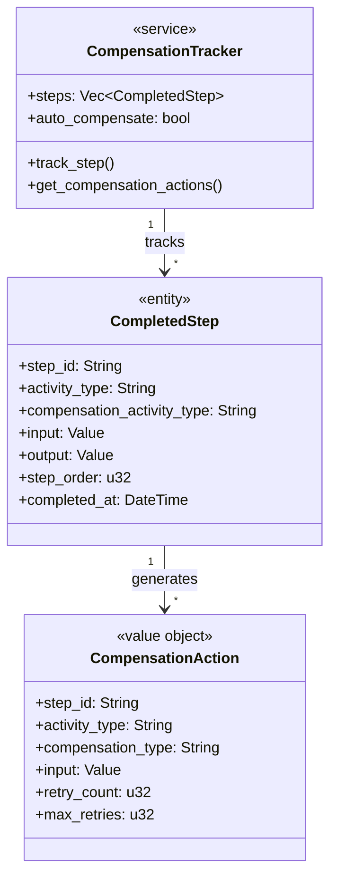

---

## 7. Diagrama de Estados del Workflow

### 7.1 Máquina de Estados

```mermaid
stateDiagram-v2
    [*] --> Running : start_workflow()
    
    Running --> Paused : execute_activity()
    Running --> Completed : All steps done
    Running --> Failed : Unhandled error
    Running --> Cancelled : cancel_workflow()
    
    Paused --> Running : Activity completed
    Paused --> Failed : Activity failed
    Paused --> Cancelled : cancel_workflow()
    
    Completed --> [*]
    Failed --> Compensating : Has compensation actions
    Failed --> [*] : No compensation needed
    
    Compensating --> Compensating : Execute next compensation
    Compensating --> Cancelled : All compensations done
    Compensating --> Failed : Compensation failed
    
    Cancelled --> [*]
    
    note "Replaying events from history on every state transition" right of Running
```

### 7.2 Transiciones de Estado

| De | A | Trigger |
|----|---|---------|
| Initial | Running | `start_workflow()` |
| Running | Paused | `execute_activity()` |
| Running | Completed | Todos los pasos completados |
| Running | Failed | Error no manejado |
| Running | Cancelled | `cancel_workflow()` |
| Paused | Running | Activity completada |
| Paused | Failed | Activity falló |
| Paused | Cancelled | Cancelado mientras estaba pausado |
| Failed | Compensating | Hay acciones de compensación |
| Failed | Terminal | No hay compensación needed |
| Compensating | Cancelled | Todas las compensaciones completadas |
| Compensating | Failed | Una compensación falló |

### 7.3 Replay en Cada Transición

```mermaid
flowchart TD
    A[Estado actual] --> B[Nueva transición]
    B --> C[get_history() desde DB]
    C --> D[Reconstruir estado]
    D --> E[Aplicar transición]
    E --> F[Nuevo estado]
    
    style C fill:#bbdefb
    style D fill:#c8e6c9
```

---

## 8. Concurrencia: Optimistic Locking

### 8.1 Cómo Funciona

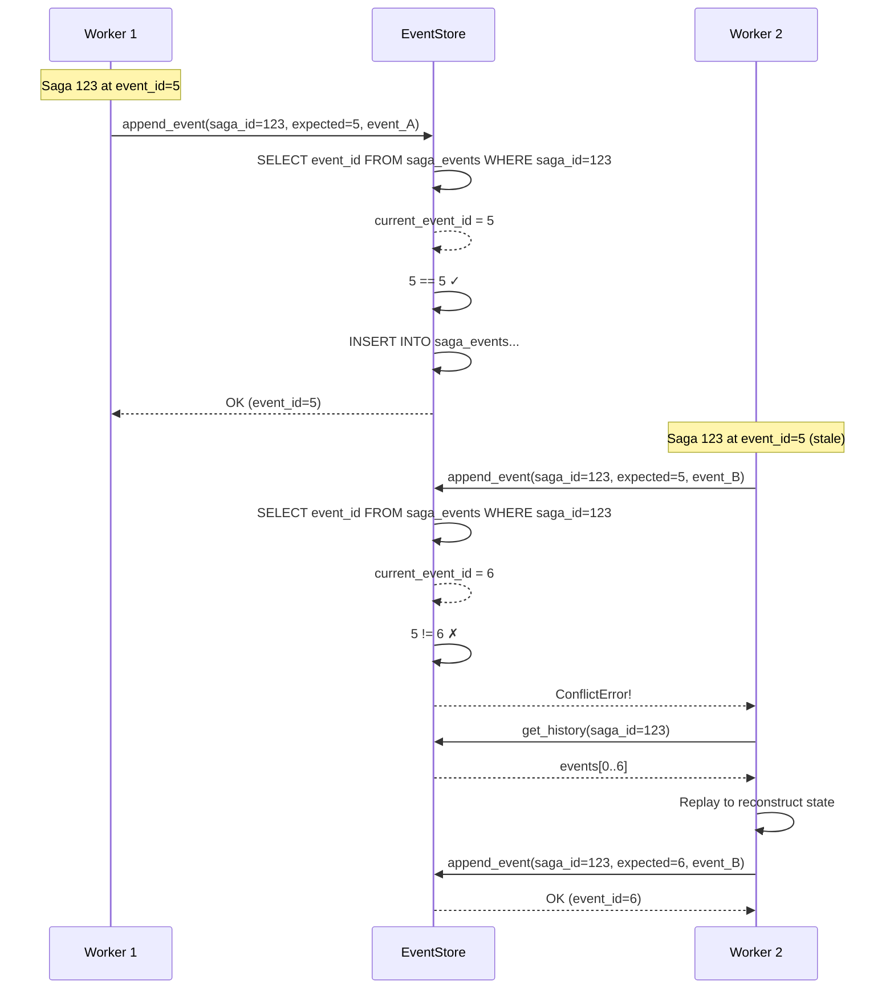

### 8.2 Por Qué Optimistic en Lugar de Pessimistic

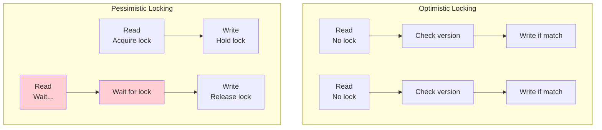

| Aspecto | Optimistic | Pessimistic |
|---------|------------|-------------|
| **Throughput** | Alto | Bajo (contención) |
| **Complejidad** | Manejar conflictos | Simpler código |
| **Cuándo usar** | Baja contención | Alta contención |
| **Saga Engine** | ✅ Elegido | ❌ |

---

## 9. Estrategia de Snapshots

### 9.1 El Problema del Replay Completo

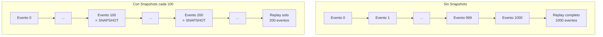

### 9.2 Flujo de Snapshot

```mermaid
flowchart TB
    subgraph "Reconstrucción de Estado"
        A[Iniciar replay] --> B{¿Existe snapshot?}
        B -->|Sí| C[Obtener snapshot<br/>last_event_id=50]
        B -->|No| D[Estado inicial vacío]
        
        C --> E[get_history_from(event_id=50)]
        D --> F[get_history()]
        
        E --> G[Eventos 51..100]
        F --> H[Eventos 0..100]
        
        G --> I[replayer.replay(snapshot, events)]
        H --> I
        
        I --> J[Estado reconstruido<br/>al evento 100]
    end
    
    subgraph "Creación de Snapshot"
        K[Evento nuevo appendado] --> L[Contador++]
        L --> M{¿contador >= intervalo?}
        M -->|Sí| N[Crear snapshot]
        M -->|No| O[Continuar]
        N --> P[Guardar en EventStore]
        P --> Q[Resetear contador]
    end
    
    style C fill:#c8e6c9
    style N fill:#bbdefb
```

### 9.3 Configuración de Snapshot

```rust
pub struct SnapshotConfig {
    /// Intervalo de eventos (default: 100)
    pub interval: u64,
    
    /// Máximo snapshots por saga (default: 5)
    pub max_snapshots: u32,
    
    /// Habilitar checksums SHA-256 (default: true)
    pub enable_checksum: bool,
}
```

---

## 10. Arquitectura de Timers

### 10.1 Componentes del Sistema de Timers

```mermaid
flowchart TD
    subgraph "Timer Scheduler"
        TS[Timer Scheduler<br/>Polling Loop]
    end
    
    subgraph "Timer Store"
        TS --> TSQ[Timer Store Query<br/>SELECT WHERE fire_at <= NOW()]
        TSQ --> CLAIM[claim_timers()<br/>UPDATE status = Processing]
        CLAIM --> TIMERS[Expired Timers List]
    end
    
    subgraph "Event Processing"
        TIMERS --> LOOP[For each timer]
        LOOP --> E1[append_event(TimerFired)]
        E1 --> E2[SignalDispatcher.notify()]
        E2 --> E3[Workflow resumes]
    end
    
    subgraph "Timer Types"
        TT1[WorkflowTimeout<br/>SAGA level]
        TT2[ActivityTimeout<br/>ACTIVITY level]
        TT3[Sleep<br/>User delay]
        TT4[RetryBackoff<br/>Exponential backoff]
        TT5[Scheduled<br/>Cron-style]
    end
    
    TT1 --> TS
    TT2 --> TS
    TT3 --> TS
    TT4 --> TS
    TT5 --> TS
```

### 10.2 Tipos de Timers

| Tipo | Descripción | Caso de Uso |
|------|-------------|-------------|
| **WorkflowTimeout** | Timeout a nivel de saga completa | Cancelar sagas abandonadas |
| **ActivityTimeout** | Timeout por actividad individual | Fail-fast en actividades lentas |
| **Sleep** | Delay definido por el usuario | Esperar antes de continuar |
| **RetryBackoff** | Delay exponencial para reintentos | Reintentos con backoff |
| **Scheduled** | Ejecución en fecha específica | Jobs programados |

### 10.3 Flujo de un Timer

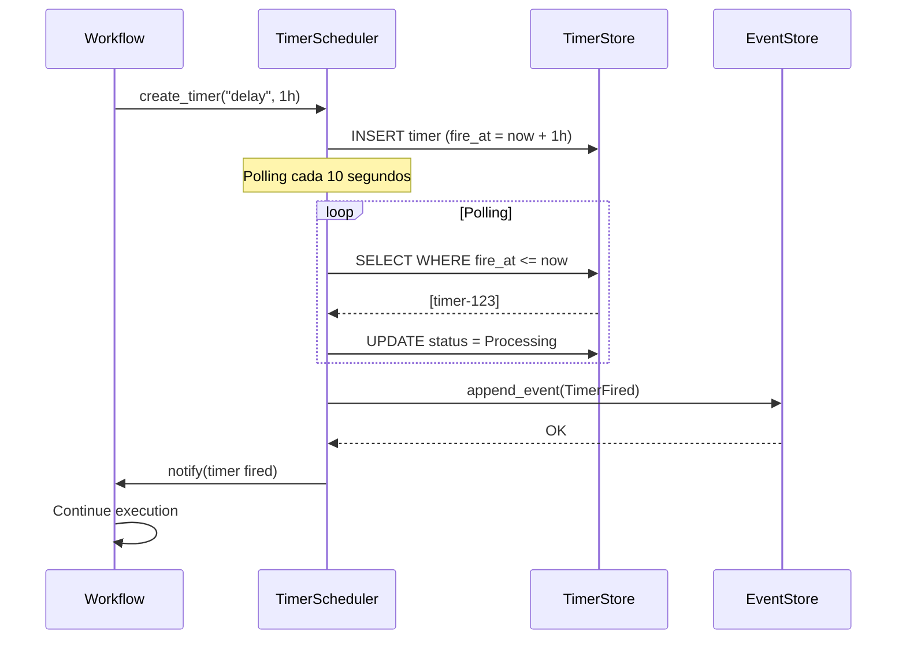

---

## 11. Task Queue con NATS JetStream

### 11.1 Arquitectura de la Cola

```mermaid
flowchart TB
    subgraph "Publish Path"
        P[Publisher] --> EN[Encode Task<br/>JSON/Bincode]
        EN --> PUB[Publish to Subject<br/>saga.tasks.workflow-id]
        PUB --> JS[NATS JetStream]
        JS --> STREAM[Stream: SAGA_TASKS]
    end
    
    subgraph "Consumer Path"
        WORKER[Worker] --> FETCH[pull().max_messages(N)]
        FETCH --> SUB[Subscribe Consumer<br/>Durable: saga-workers]
        SUB --> JS
        JS --> MSGS[Batch Messages]
        MSGS --> WORKER
        WORKER --> ACK[ack() or nak(delay)]
        ACK --> JS
    end
    
    subgraph "Message Lifecycle"
        NEW[New Message] --> PROCESS[Processing]
        PROCESS --> ACKED[Acked<br/>Removed from queue]
        PROCESS --> NAKED[Nak'd<br/>Redeliver after delay]
        PROCESS --> TERM[Terminated<br/>To DLQ]
    end
```

### 11.2 Conceptos de NATS JetStream

| Concepto | Descripción |
|----------|-------------|
| **Stream** | Persistencia de mensajes (como un topic de Kafka) |
| **Consumer** | Suscripción con estado (tracked offset) |
| **Durable Consumer** | Consumer que persiste su posición |
| **Ack/NAK** | Confirmar o rechazar mensaje |
| **Pull Consumer** | Worker pide mensajes explícitamente |

### 11.3 Garantías de Entrega

```mermaid
flowchart LR
    subgraph "At-Least-Once Delivery"
        A[Publisher] -->|1| N[NATS]
        N -->|2| W1[Worker 1]
        N -->|3| W2[Worker 2]
        W1 -->|4| ACK[NATS]
        W2 -->|5| NAK[NATS]
        ACK -->|6| Remove
        NAK -->|7| Redeliver to W2
    end
```

---

## 12. Registro de Actividades

### 12.1 Diagrama de Clases del Registry

```mermaid
classDiagram
    class ActivityRegistry {
        <<service>>
        +activities: DashMap~String, Arc~dyn DynActivity~~
        +default_timeout: Duration
        +register_activity~A~()
        +has_activity~str~ bool
        +get_activity~str~ Option~Arc~dyn DynActivity~~
    }
    
    class ActivityTypeId {
        <<value object>>
        +String id
        +new~String~ ActivityTypeId
    }
    
    class DynActivity {
        <<interface>>
        +execute_dyn~Value~ Result~Value, ActivityError~
    }
    
    class Activity~T~ {
        <<interface>>
        +TYPE_ID: &'static str
        +Input
        +Output
        +Error
        +execute~Input~ Result~Output, Error~
    }
    
    class PaymentActivity {
        +TYPE_ID: "process-payment"
    }
    
    class InventoryActivity {
        +TYPE_ID: "reserve-inventory"
    }
    
    ActivityRegistry --> ActivityTypeId
    ActivityRegistry --> DynActivity
    DynActivity <|.. Activity~T~
    Activity~T~ <|-- PaymentActivity
    Activity~T~ <|-- InventoryActivity
```

### 12.2 Registro de Actividades

```rust
// ⭐ Registrar una actividad
registry.register_activity(PaymentActivity);
registry.register_activity(ReserveInventoryActivity);
registry.register_activity(ShipOrderActivity);

// ⭐ Usar la actividad
let activity = registry.get_activity("process-payment");
let result = activity.execute(input).await;
```

---

## 13. Jerarquía de Errores

### 13.1 Estructura del Error

```mermaid
graph TD
    E[Error<br/>Central Error Type] --> EK[ErrorKind<br/>Enum ~17 variants~]
    E --> EM[message: String]
    E --> EC[context: HashMap~String, String~]
    E --> ES[source: Option~Box~Error~~]
    E --> ET[timestamp: SystemTime]
    
    EK --> EK1[EventStore]
    EK --> EK2[Codec]
    EK --> EK3[WorkflowExecution]
    EK --> EK4[StepExecution]
    EK --> EK5[ActivityExecution]
    EK --> EK6[TimerStore]
    EK --> EK7[SignalDispatcher]
    EK --> EK8[TaskQueue]
    EK --> EK9[Snapshot]
    EK --> EK10[Replay]
    EK --> EK11[Configuration]
    EK --> EK12[Validation]
    EK --> EK13[Timeout]
    EK --> EK14[Cancelled]
    EK --> EK15[Concurrency]
    EK --> EK16[Compensation]
    EK --> EK17[Unknown]
    
    style E fill:#fff9c4
    style EK fill:#c8e6c9
```

### 13.2 Tipos de Error y Causas

| Error Kind | Causa Típica | Estrategia |
|------------|--------------|------------|
| **EventStore** | DB temporalmente no disponible | Retry con backoff |
| **WorkflowExecution** | Bug en la lógica del workflow | Fix código |
| **ActivityExecution** | Bug en actividad o servicio externo | Fix o retry |
| **Timeout** | Actividad demasiado lenta | Aumentar timeout |
| **Concurrency** | Dos workers同一 saga | Replay automático |
| **Compensation** | Compensación falló | Intervención manual |
| **Validation** | Input inválido | Validar antes |

---

## 14. Comparación de Codecs

### 14.1 Rendimiento de Serialización

```mermaid
graph LR
    subgraph "Encode Performance"
        E1[JSON] -->|~1MB/s| E2[Bincode]
        E2 -->|~10MB/s| E3[Postcard]
    end
    
    subgraph "Decode Performance"
        D1[JSON] -->|~1MB/s| D2[Bincode]
        D2 -->|~10MB/s| D3[Postcard]
    end
    
    subgraph "Size"
        S1[JSON<br/>~2x original] --> S2[Bincode<br/>~1x original]
        S2 --> S3[Postcard<br/>~0.9x original]
    end
    
    subgraph "Human Readable"
        H1[JSON ✓] --> H2[Bincode ✗]
        H2 --> H3[Postcard ✗]
    end
    
    style E3 fill:#c8e6c9
    style D3 fill:#c8e6c9
    style S3 fill:#c8e6c9
```

### 14.2 Recomendaciones

| Escenario | Codec Recomendado | Razón |
|-----------|-------------------|-------|
| Desarrollo | JSON | Legible, fácil debugging |
| Producción | Bincode | Balance rendimiento/tamaño |
| Alta throughput | Postcard | Máxima velocidad |
| Storage limitado | Postcard | Menor tamaño |

---

## 15. Sistema Watchdog

### 15.1 Arquitectura del Watchdog

```mermaid
flowchart TB
    subgraph "Watchdog Components"
        WD[Watchdog<br/>Orchestrator]
    end
    
    subgraph "Detection"
        SD[Stall Detector<br/>No progress > timeout]
        DD[Deadlock Detector<br/>Circular wait detected]
        HD[Health Detector<br/>Component unhealthy]
        CD[Capacity Detector<br/>Queue backlog]
    end
    
    subgraph "Actions"
        FA[Force Activity Timeout]
        FC[Force Cancellation]
        FR[Force Restart]
        AA[Alert + Auto-recovery]
    end
    
    subgraph "Health Checks"
        HC1[EventStore Ping]
        HC2[TaskQueue Connected]
        HC3[TimerStore Responsive]
    end
    
    SD --> WD
    DD --> WD
    HD --> WD
    CD --> WD
    
    WD --> FA
    WD --> FC
    WD --> FR
    WD --> AA
    
    FA --> HC1
    FC --> HC1
    FR --> HC1
    AA --> HC1
    
    style WD fill:#fff9c4
```

### 15.2 Detectores y Respuestas

| Detector | Qué Detecta | Respuesta |
|----------|-------------|-----------|
| **Stall Detector** | Saga sin progreso por tiempo | Alert + force timeout |
| **Deadlock Detector** | Esperas circulares | Terminate + compensar |
| **Health Detector** | Componente no responde | Circuit breaker |
| **Capacity Detector** | Cola saturada | Scale workers |

---

## 16. Cómo Leer y Crear Diagramas Mermaid

### 16.1 Guía Rápida de Mermaid

```mermaid
flowchart TD
    A[Start] --> B{Decision?}
    B -->|Yes| C[Do something]
    B -->|No| D[Do other thing]
    C --> E[End]
    D --> E
```

**Sintaxis básica**:

| Tipo | Sintaxis | Descripción |
|------|----------|-------------|
| Nodo | `A[Nombre]` | Nodo con texto |
| Flecha | `A --> B` | Conexión |
| Decisión | `B{?}` | Diamante de decisión |
| Subgraph | `subgraph X ... end` | Agrupación |
| Estilo | `style A fill:#color` | Color |

### 16.2 Colores Semánticos

| Color | Significado | Uso |
|-------|-------------|-----|
| **Verde** | Éxito, estado happy | Flujo normal |
| **Rojo** | Error, fallo | Fallos, rollbacks |
| **Amarillo** | Espera, pausa | Estados intermedios |
| **Azul** | Proceso, dato | Procesos, bases de datos |
| **Naranja** | Decisión | Puntos de decisión |

### 16.3 Diagramas de Secuencia

```mermaid
sequenceDiagram
    participant A as Actor
    participant S as System
    
    A->>S: Request
    S-->>A: Response
```

**Sintaxis de secuencia**:

| Elemento | Sintaxis |
|----------|----------|
| Participante | `participant X as Alias` |
| Mensaje sync | `A->>B: message` |
| Mensaje async | `A-->>B: message` |
| Nota | `Note over A,B: text` |
| Loop | `loop Label ... end` |
| Alt | `alt Condition ... else ... end` |

---

## 17. Nuevas Características v4.1: Diagramas de Arquitectura

### 17.1 Error Bridge: Clasificación Automática de Errores

```mermaid
flowchart TD
    subgraph "Activity Execution"
        A[Activity] -->|Error| EE[ExecutionError&lt;E&gt;]
    end

    subgraph "Error Classification"
        EE -->|category| CE[ClassifiedError Trait]
        CE -->|category| EC[ErrorCategory]
    end

    subgraph "Decision Making"
        EC --> ED[ErrorDecision]
        ED -->|Retry| R[Retry with backoff]
        ED -->|Compensate| C[Execute Compensation]
        ED -->|Fail| F[Mark as Failed]
        ED -->|Pause| P[Manual Intervention]
    end

    subgraph "Retry Configuration"
        RC[RetryConfig]
        RC -->|max_attempts| RA[Retry Attempts]
        RC -->|base_delay_ms| BD[Backoff Delay]
    end

    style EE fill:#ffcdd2
    style ED fill:#fff9c4
    style R fill:#c8e6c9
    style C fill:#bbdefb
    style F fill:#ffcdd2
    style P fill:#ffe0b2
```

```mermaid
sequenceDiagram
    participant A as Activity
    participant E as ExecutionError
    participant C as ClassifiedError
    participant D as ErrorDecision
    participant S as SagaEngine

    A->>E: Err(PaymentDeclined)
    E->>C: category()
    C->>C: match error
    C-->>E: Infrastructure

    E->>D: from_error()
    D->>D: match behavior
    D-->>S: Retry

    Note over S: Engine schedules retry<br/>with exponential backoff

    alt After max retries
        S->>D: from_error()
        D-->>S: Fail
        Note over S: Mark saga as failed
    else Success on retry
        S->>S: Continue workflow
    end
```

### 17.2 Event Upcasting: Versionado de Esquemas

```mermaid
flowchart LR
    subgraph "Event Store"
        E1[v0 Event<br/>old_schema]
        E2[v1 Event<br/>mid_schema]
        E3[v2 Event<br/>current_schema]
    end

    subgraph "Upcaster Registry"
        U1[v0→v1]
        U2[v1→v2]
    end

    E1 -->|needs upcast| U1
    U1 -->|produces| E2
    E2 -->|needs upcast| U2
    U2 -->|produces| E3

    style E1 fill:#ffecb3
    style E3 fill:#c8e6c9
```

```mermaid
sequenceDiagram
    participant ES as EventStore
    participant ER as EventUpcasterRegistry
    participant U as Upcaster Chain
    participant App as Application

    ES->>ER: get_events(saga_id)
    loop For each event
        ER->>ER: check_version(event.schema_version)
        alt version < CURRENT
            ER->>U: upcast(event)
            Note over U: v0→v1→v2 chain
            U-->>ER: upcasted_event(v2)
            App->>App: process(upcasted_event)
        else version == CURRENT
            App->>App: process(event)
        end
    end
```

### 17.3 Adaptive Snapshots: Optimización de Replay

```mermaid
flowchart TD
    subgraph "Snapshot Strategy Decision"
        S[Saga Configuration]
        S -->|Short <10| D[Disabled]
        S -->|Medium 10-50| CB[CountBased 20]
        S -->|Long 50-200| A[Adaptive 100/60]
        S -->|Very Long >200| CB2[CountBased 50]
        S -->|I/O Heavy| TB[TimeBased 30min]
    end

    subgraph "Snapshot Process"
        CB2 -->|events >= 50| SP[Snapshot Manager]
        A -->|events >= 100| SP
        A -->|time >= 60min| SP
        TB -->|time >= 30min| SP
    end

    subgraph "Performance Impact"
        SP -->|create| Snap[Snapshot]
        Snap -->|store| ES[Event Store]
        ES -->|restore| AR[Aggregate Replay]
        AR -->|only new events| Result[Optimized State]
    end

    style D fill:#e0e0e0
    style CB fill:#c8e6c9
    style A fill:#bbdefb
    style CB2 fill:#bbdefb
    style Snap fill:#fff9c4
```

```mermaid
flowchart TB
    subgraph "Without Snapshot"
        ES1[Event Store] -->|all 1000 events| R[Replay All]
        R --> A1[Aggregate]
        A1 -->|"⚠️ O(n) = 1000 ops"| Result1[Reconstructed State]
    end

    subgraph "With Snapshot"
        ES2[Event Store] -->|first 500 events| S[Snapshot Store]
        S -->|state at event 500| R2[Restore Snapshot]
        ES2 -->|events 501-1000| R2
        R2 --> A2[Aggregate]
        A2 -->|"✅ O(n-500) = 500 ops"| Result2[Reconstructed State]
    end

    style S fill:#fff9c4
    style Result1 fill:#ffcdd2
    style Result2 fill:#c8e6c9
```

### 17.4 Métricas y Observabilidad

```mermaid
graph LR
    subgraph "Error Stats Collection"
        E[Errors] -->|record| Stats[ErrorStats]
        Stats -->|update| TC[Total Count]
        Stats -->|update| BC[By Category]
        Stats -->|update| RC[Retry Count]
        Stats -->|update| FC[Failure Count]
    end

    subgraph "Calculated Metrics"
        TC --> RR[Retry Rate]
        RC --> RR
        TC --> FR[Failure Rate]
        FC --> FR
    end

    subgraph "Dashboard"
        RR --> D[Retry Success Rate %]
        FR --> D2[Failure Rate %]
    end
```

---

## Apéndice: Resumen Visual de Componentes

### Arquitectura Completa en Una Vista (v4.1)

```mermaid
graph TB
    subgraph "Client Layer"
        API[REST/gRPC API]
        CLI[CLI]
    end

    subgraph "Application Layer"
        SE[SagaEngine]
        EB[Error Bridge]
        SM[Snapshot Manager]
    end

    subgraph "Domain Layer"
        WF[Workflows]
        AC[Activities]
        EV[Events]
        CP[Compensation]
    end

    subgraph "Ports Layer"
        ES[EventStore Port]
        TQ[TaskQueue Port]
        TS[TimerStore Port]
        UR[Upcaster Registry Port]
    end

    subgraph "Adapters Layer"
        PGE[Postgres Adapter]
        NAT[NATS Adapter]
        INM[InMemory Adapter]
        UPC[Upcaster Adapter]
    end

    API --> SE
    CLI --> SE
    SE --> WF
    SE --> AC
    SE --> EB
    SE --> SM
    WF --> EV
    AC --> EV
    WF --> CP
    WF --> UR

    WF --> ES
    AC --> TQ
    CP --> TS
    UR --> UPC

    ES <--> PGE
    TQ <--> NAT
    UR <--> UPC

    style EB fill:#fff9c4
    style SM fill:#bbdefb
    style UR fill:#fff9c4
    style UPC fill:#bbdefb
```

```mermaid
graph TB
    subgraph "Error Bridge Components"
        CE[ClassifiedError]
        EC[ErrorCategory]
        EB[ErrorBehaviorWithConfig]
        ED[ErrorDecision]
        ES[ErrorStats]
    end

    subgraph "Upcasting Components"
        EU[EventUpcaster Trait]
        EUR[EventUpcasterRegistry]
        SU[SimpleUpcaster]
        CV[CURRENT_VERSION]
    end

    subgraph "Snapshot Components"
        SS[SnapshotStrategy]
        SSM[SagaSnapshotManager]
        SSV[SagaSnapshot]
    end

    CE --> EC
    EC --> EB
    EB --> ED
    ES --> ED

    EUR --> EU
    EUR --> SU
    CV --> EUR
    EUR --> SSV

    SS --> SSM
    SSM --> SSV

    style CE fill:#c8e6c9
    style EUR fill:#bbdefb
    style SS fill:#bbdefb
```

---

*Document Version: 2.0.0*
*Format: Mermaid.js*
*Generated: 2026-01-28*
*Language: English with bilingual labels for domain concepts*
