# Saga Engine V4 - Architect's Manual

## 1. Executive Summary

The **Saga Engine V4** is a distributed workflow orchestration platform implementing the **Saga Pattern** with **Event Sourcing** and **Durable Execution**. This document provides the architectural blueprint for architects, lead developers, and DevOps engineers.

### Architectural Style

- **Pattern**: Event Sourcing + Saga Pattern + Ports & Adapters (Hexagonal)
- **Paradigm**: Domain-Driven Design (DDD)
- **Concurrency**: Async/Await with Actor-style message passing
- **Persistence**: Append-only event store with snapshot optimization

---

## 2. Context Map (Strategic DDD)

### 2.1 System Context

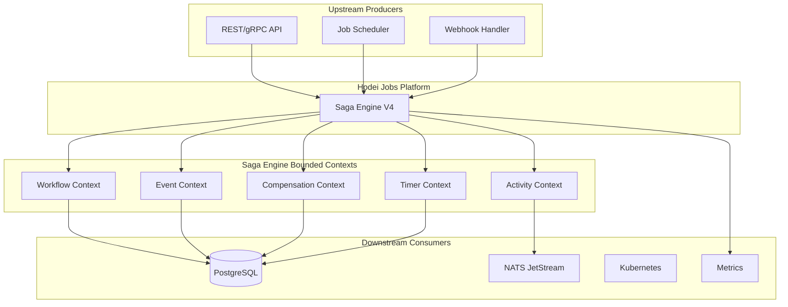

### 2.2 Bounded Context Relationships

```mermaid
graph LR
    subgraph "Core Domain"
        WC[Workflow Context]
        AC[Activity Context]
        EC[Event Context]
        CC[Compensation Context]
        TC[Timer Context]
    end
    
    WC --> AC : "executes"
    WC --> EC : "produces events"
    WC --> CC : "tracks compensation"
    WC --> TC : "schedules delays"
    
    EC --> CC : "replays for rollback"
    AC --> EC : "produces activity events"
    TC --> EC : "produces timer events"
    
    style WC fill:#e1f5fe
    style AC fill:#f3e5f5
    style EC fill:#e8f5e8
    style CC fill:#ffebee
    style TC fill:#fff3e0
```

---

## 3. Aggregate Architecture

### 3.1 Saga Aggregate (Root)

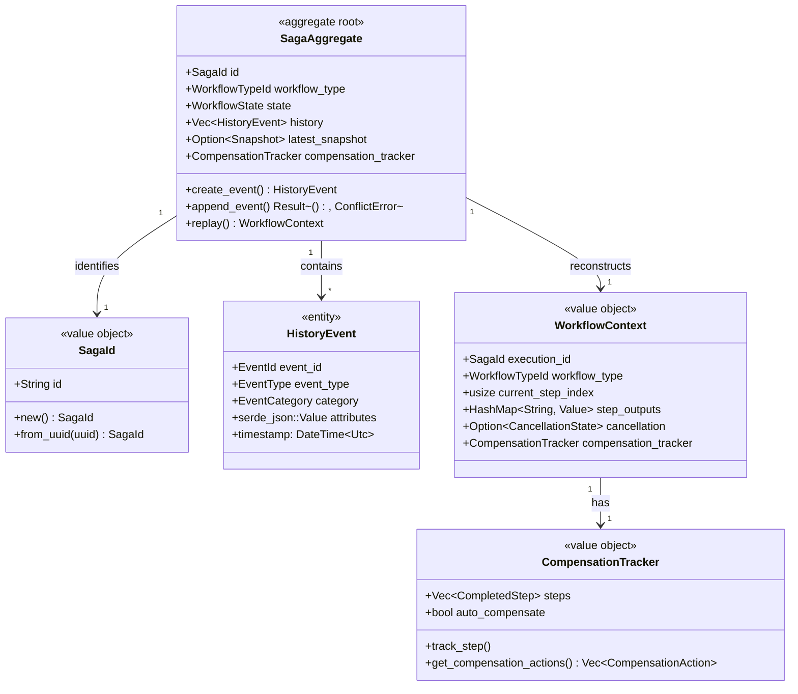

### 3.2 Aggregate Invariants

| Invariant | Description | Enforcement |
|-----------|-------------|-------------|
| Event ID Monotonicity | `event_id[n+1] > event_id[n]` | Optimistic locking in EventStore |
| Immutability | Events never modified/deleted | Append-only storage |
| Compensation Order | Compensation in LIFO order | `get_compensation_actions()` reverses list |
| Saga Finality | Terminal states are final | State machine guards |

---

## 4. Detailed Component Diagram

### 4.1 Core Layer Architecture

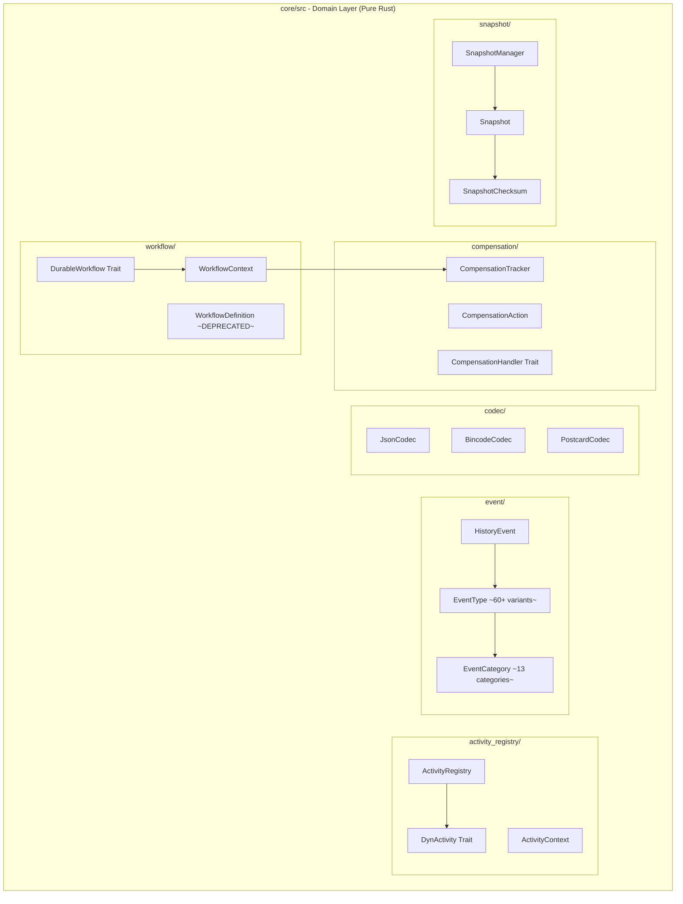

### 4.2 Port/Adapter Layer

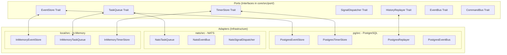

---

## 5. Deployment Architecture

### 5.1 Production Deployment

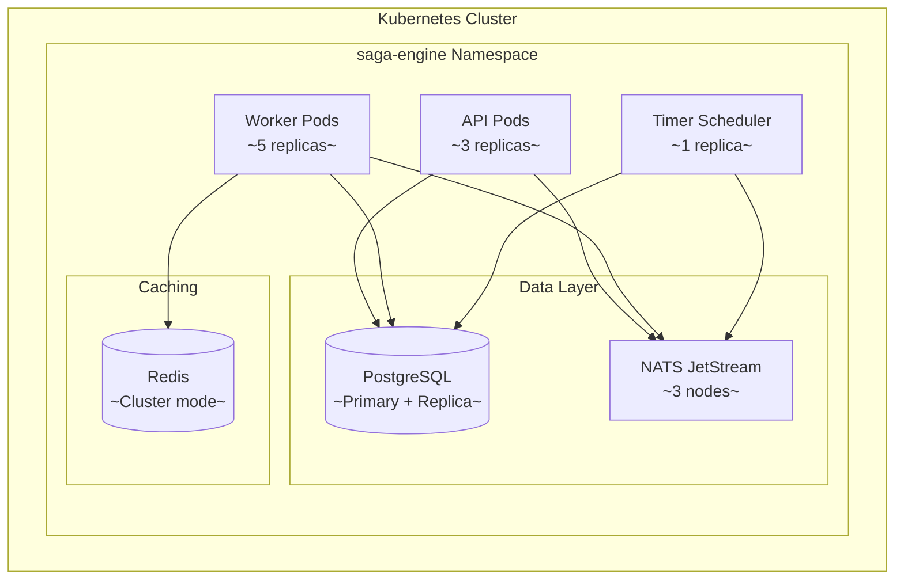

### 5.2 Data Flow During Execution

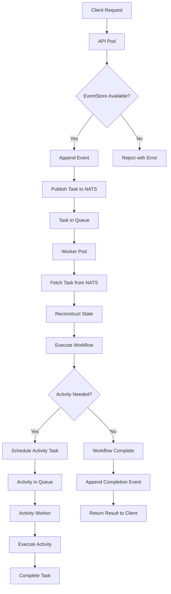

---

## 6. Event Model

### 6.1 Event Categories

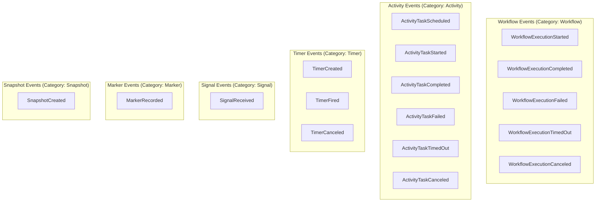

### 6.2 Event Schema

```rust
pub struct HistoryEvent {
    /// Monotonic event ID within saga
    pub event_id: EventId,
    
    /// Saga identifier
    pub saga_id: SagaId,
    
    /// Event type (60+ variants)
    pub event_type: EventType,
    
    /// Event category for filtering
    pub category: EventCategory,
    
    /// Event timestamp
    pub timestamp: DateTime<Utc>,
    
    /// Event payload (flexible JSON)
    pub attributes: Value,
    
    /// Schema version for migrations
    pub event_version: u32,
    
    /// Reset point for optimized replay
    pub is_reset_point: bool,
    
    /// Retry indicator
    pub is_retry: bool,
    
    /// Parent event for event trees
    pub parent_event_id: Option<EventId>,
    
    /// Task queue routing
    pub task_queue: Option<String>,
    
    /// Distributed tracing
    pub trace_id: Option<String>,
}
```

---

## 7. Compensation (Rollback) Model

### 7.1 Compensation Architecture

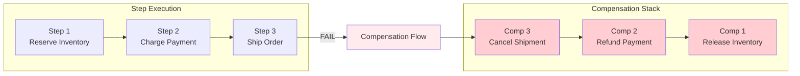

### 7.2 Compensation Data Model

```rust
pub struct CompensationTracker {
    /// Completed steps (thread-safe via Arc<Mutex>)
    steps: Arc<Mutex<Vec<CompletedStep>>>,
    
    /// Auto-compensate on failure flag
    auto_compensate: bool,
}

pub struct CompletedStep {
    pub step_id: String,
    pub activity_type: String,
    pub compensation_activity_type: String,
    pub input: Value,
    pub output: Value,
    pub step_order: u32,
    pub completed_at: DateTime<Utc>,
}

pub struct CompensationAction {
    pub step_id: String,
    pub activity_type: String,
    pub compensation_type: String,
    pub input: Value,
    pub retry_count: u32,
    pub max_retries: u32,
}
```

---

## 8. Concurrency Model

### 8.1 Optimistic Locking

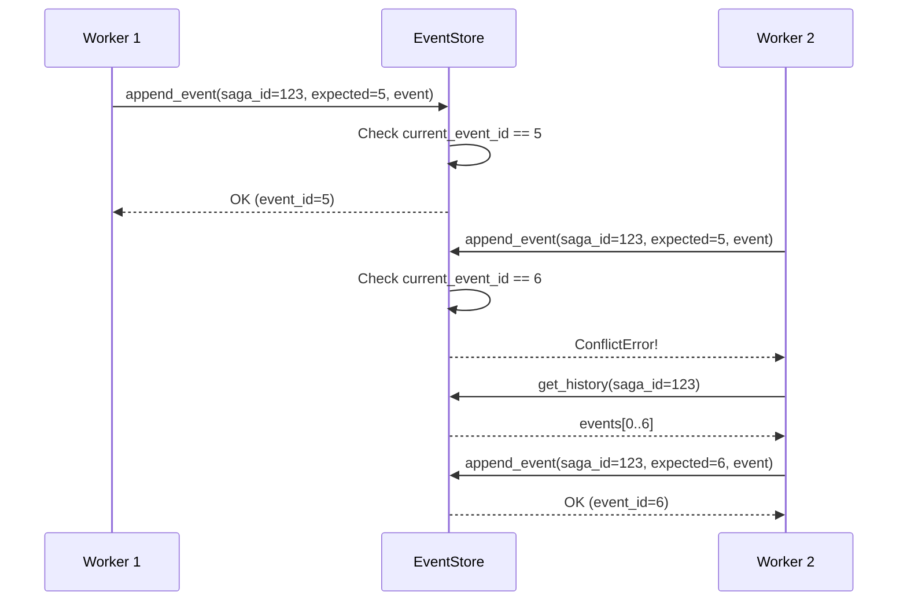

### 8.2 Lock Granularity

| Resource | Lock Type | Scope | Duration |
|----------|-----------|-------|----------|
| Saga Events | Optimistic (version check) | Per saga | Single append |
| Task Queue | Lease-based | Per message | Processing time + ack_wait |
| Timer | Claim-based | Per timer | Until fired |
| Activity Registry | None (read mostly) | Global | N/A |

---

## 9. Scalability Patterns

### 9.1 Horizontal Scaling

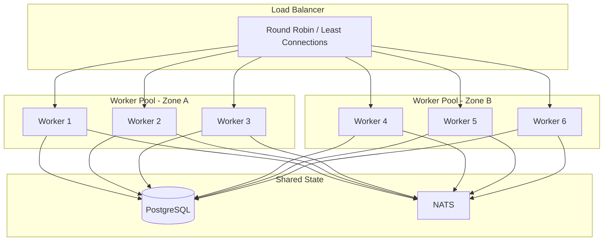

### 9.2 Sharding Strategy

```rust
pub enum ShardingStrategy {
    /// Shard by SagaId hash
    HashBased {
        shard_count: u64,
        hash_fn: fn(&SagaId) -> u64,
    },
    
    /// Shard by WorkflowType
    ByWorkflowType {
        mapping: HashMap<&'static str, u64>,
    },
    
    /// Shard by Tenant/Customer
    ByTenant {
        tenant_extractor: fn(&SagaId) -> String,
    },
}
```

---

## 10. Observability

### 10.1 Metrics

```rust
pub struct SagaEngineMetrics {
    /// Workflow metrics
    workflow_started: Counter,
    workflow_completed: Counter,
    workflow_failed: Counter,
    workflow_duration: Histogram,
    
    /// Activity metrics
    activity_started: Counter,
    activity_completed: Counter,
    activity_failed: Counter,
    activity_duration: Histogram,
    
    /// Event metrics
    events_persisted: Counter,
    event_persist_duration: Histogram,
    
    /// Replay metrics
    replay_duration: Histogram,
    snapshot_count: Gauge,
    
    /// Compensation metrics
    compensation_started: Counter,
    compensation_completed: Counter,
    compensation_failed: Counter,
}
```

### 10.2 Tracing

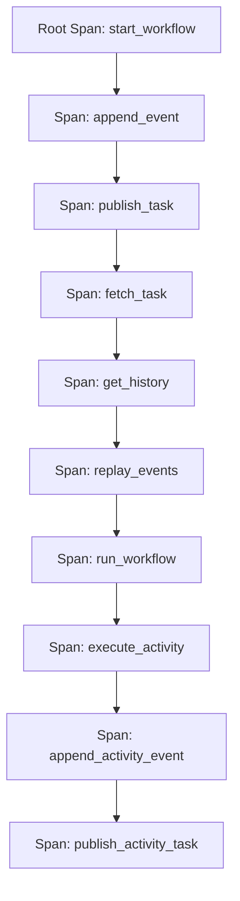

---

## 11. Failure Modes & Recovery

### 11.1 Failure Scenarios

| Scenario | Detection | Recovery Strategy |
|----------|-----------|-------------------|
| Worker crash mid-processing | NATS redeliver | Replay from last event |
| Database connection loss | Connection timeout | Retry with backoff |
| Saga stuck (no progress) | Stall detector | Force terminate or signal |
| Duplicate events | Idempotency keys | Deduplicate via event_id |
| Event store corruption | Checksum verification | Restore from backup |

### 11.2 Watchdog Components

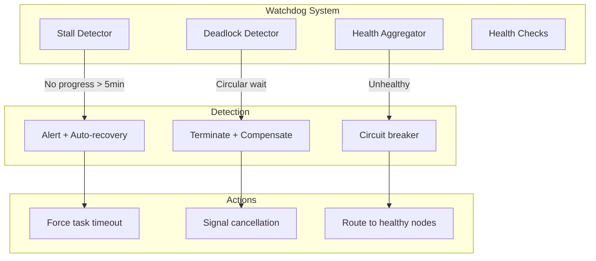

---

## 12. Performance Characteristics

### 12.1 Benchmarks (Typical Results)

| Operation | Latency (p50) | Latency (p99) | Throughput |
|-----------|---------------|---------------|------------|
| Event append (single) | 0.5ms | 2ms | 2,000/sec |
| Event append (batch 10) | 1ms | 5ms | 10,000/sec |
| Workflow replay (100 events) | 5ms | 20ms | N/A |
| Activity scheduling | 1ms | 3ms | 5,000/sec |
| Snapshot creation | 10ms | 50ms | 100/sec |

### 12.2 Optimization Strategies

| Technique | Impact | Trade-off |
|-----------|--------|-----------|
| Batched event inserts | +10x throughput | Slightly higher latency |
| Snapshot every N events | -100x replay time | Storage overhead |
| Parallel activity execution | -N x duration | Complexity in compensation |
| Event encoding (bincode) | +2x serialization | Debugging harder |
| Connection pooling | -90% connection overhead | Memory usage |

---

## 13. Security Model

### 13.1 Authentication & Authorization

```rust
pub struct SagaSecurityConfig {
    /// Authentication provider
    auth_provider: Box<dyn AuthProvider>,
    
    /// Authorization policy
    authorization: AuthorizationPolicy,
    
    /// TLS configuration
    tls: Option<TlsConfig>,
    
    /// Rate limiting
    rate_limit: RateLimitConfig,
}
```

### 13.2 Data Isolation

| Level | Isolation Method |
|-------|-----------------|
| Saga | Each saga has unique UUID |
| Tenant | Sharding by tenant_id |
| Event | Event attributes encrypted at rest |
| Snapshot | Snapshot encryption optional |

---

## 14. Upgrade & Migration Strategy

### 14.1 Version Compatibility Matrix

| Core Version | Postgres Adapter | NATS Adapter | Protocol |
|--------------|------------------|--------------|----------|
| 4.0.x | 4.0.x | 4.0.x | JSON/Bincode |
| 4.1.x | 4.1.x | 4.0.x | +Postcard |
| 4.2.x | 4.2.x | 4.1.x | +Compression |

### 14.2 Rolling Upgrade Procedure

1. **Phase 1**: Deploy new infrastructure adapters (dual-write capable)
2. **Phase 2**: Switch core to use new adapters (feature flag)
3. **Phase 3**: Migrate existing sagas (event replay)
4. **Phase 4**: Remove old adapter code

---

## 15. Decision Log

| Decision | Date | Rationale |
|----------|------|-----------|
| Event Sourcing | 2024-Q1 | Audit trail, replay capability essential |
| Bincode default codec | 2024-Q1 | Performance priority over debuggability |
| PostgreSQL primary store | 2024-Q1 | ACID, mature ecosystem |
| NATS JetStream | 2024-Q2 | At-least-once delivery, low latency |
| Workflow-as-Code | 2024-Q3 | Developer experience, type safety |

---

*Document Version: 1.0.0*
*Last Updated: 2026-01-27*
*Classification: Internal - Architecture*
