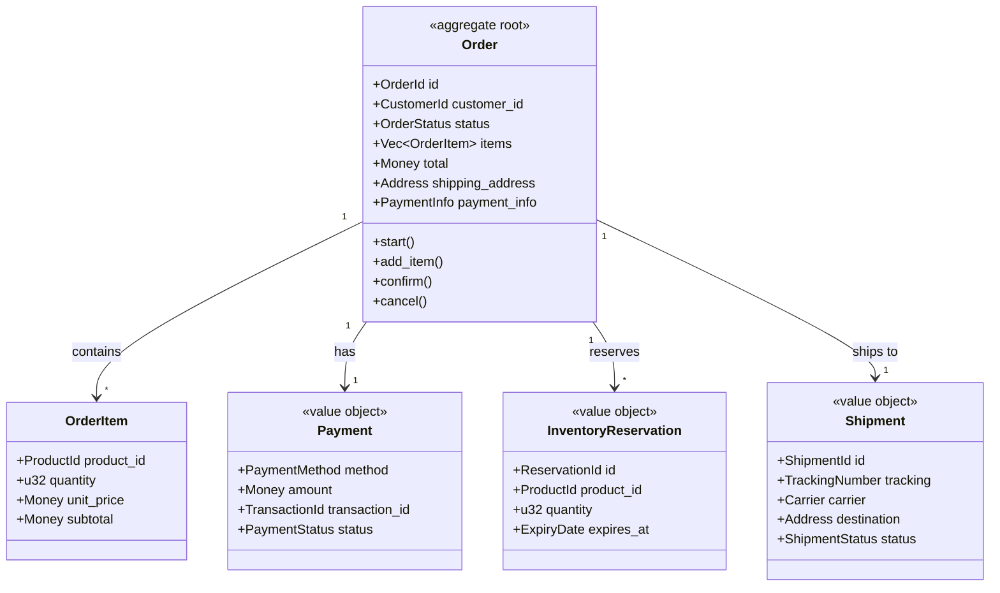

# Saga Engine V4 - Appendix: E-Commerce Example

## Online Sales with DDD Architecture and Code Optimization

---

## 1. Introduction

This appendix presents a **complete online sales system** implemented with Saga Engine V4, applying DDD principles to maximize modularity and minimize code duplication.

### Design Objectives

1. **DRY (Don't Repeat Yourself)**: Reuse generic events and commands
2. **Separation of Responsibilities**: Commands vs Events vs Activities
3. **Multiple Perspectives**: API, Console, Admin
4. **Elegant Compensation**: Automatic rollback without boilerplate

---

## 2. Domain Context (DDD)

### 2.1 E-Commerce Bounded Contexts

```mermaid
graph TB
    subgraph "E-Commerce Platform"
        subgraph "Sales Context"
            OC[Order Context]
            PC[Payment Context]
            IC[Inventory Context]
            SC[Shipping Context]
        end
        
        subgraph "Customer Context"
            CC[Customer Context]
            AC[Address Context]
        end
        
        subgraph "Product Context"
            PRC[Product Context]
            PRC2[Catalog Context]
        end
    end
    
    OC --> PC : "payments"
    OC --> IC : "inventory"
    OC --> SC : "shipping"
    PC --> CC : "customer"
    IC --> PRC : "products"
    
    style OC fill:#e3f2fd
    style PC fill:#f3e5f5
    style IC fill:#e8f5e8
    style SC fill:#fff3e0
```

### 2.2 Domain Aggregates



---

## 3. Unified Events Catalog

### 3.1 Reusable Event Structure

```rust
/// Generic base event types for any domain
#[derive(Debug, Clone, Copy, PartialEq, Eq, saga_engine_core::event::Serialize, saga_engine_core::event::Deserialize)]
pub enum DomainEventType {
    // Lifecycle states
    Created, Updated, Deleted, Activated, Deactivated,
    // Process states
    Started, Completed, Failed, Cancelled,
    // Time events
    Expired, TimeoutReached,
    // Integration events
    IntegrationStarted, IntegrationCompleted, IntegrationFailed,
}

/// Order-specific events
#[derive(Debug, Clone, Copy, PartialEq, Eq, saga_engine_core::event::Serialize, saga_engine_core::event::Deserialize)]
pub enum OrderEventType {
    OrderCreated, ItemAdded, ItemRemoved, OrderConfirmed, OrderShipped,
    OrderDelivered, OrderCompleted, OrderFailed, OrderCancelled,
    PaymentInitiated, PaymentCompleted, PaymentFailed,
    InventoryReserved, InventoryReservationFailed, InventoryReleased,
    ShippingScheduled, ShippingCompleted,
    RefundInitiated, RefundCompleted, RefundFailed,
}
```

### 3.2 Type-Safe Payloads

```rust
#[derive(Debug, Clone, Serialize, Deserialize)]
pub struct BaseEventPayload {
    pub timestamp: chrono::DateTime<chrono::Utc>,
    pub correlation_id: Option<String>,
    pub trace_id: Option<String>,
    pub source: String,
}

#[derive(Debug, Clone, Serialize, Deserialize)]
pub struct OrderCreatedPayload {
    pub order_id: String,
    pub customer_id: String,
    pub item_count: usize,
    pub total_amount: Decimal,
    pub currency: String,
    pub created_at: chrono::DateTime<chrono::Utc>,
}

#[derive(Debug, Clone, Serialize, Deserialize)]
pub struct PaymentCompletedPayload {
    pub order_id: String,
    pub transaction_id: String,
    pub amount: Decimal,
    pub currency: String,
    pub payment_method: String,
}

#[derive(Debug, Clone, Serialize, Deserialize)]
pub struct InventoryReservedPayload {
    pub order_id: String,
    pub reservations: Vec<ReservationDetail>,
    pub total_items: u32,
}

#[derive(Debug, Clone, Serialize, Deserialize)]
pub struct ShippingScheduledPayload {
    pub order_id: String,
    pub shipment_id: String,
    pub carrier: String,
    pub tracking_number: String,
    pub estimated_delivery: chrono::DateTime<chrono::Utc>,
}
```

---

## 4. Unified Commands

### 4.1 Command Bus Architecture

```rust
pub trait Command: Send + Sync + Debug {
    type Result;
    fn command_type(&self) -> &'static str;
    fn aggregate_id(&self) -> &str;
}

pub enum CommandResult<T = ()> {
    Success(T),
    Failure(String),
    ValidationError(Vec<ValidationError>),
}

#[async_trait]
pub trait CommandHandler<C: Command>: Send + Sync {
    async fn handle(&self, command: C) -> CommandResult<C::Result>;
}

/// Order Commands
#[derive(Debug, Clone, Serialize, Deserialize)]
pub struct CreateOrderCommand {
    pub customer_id: String,
    pub items: Vec<OrderItemInput>,
    pub shipping_address: AddressInput,
    pub payment_method: PaymentMethodInput,
    pub idempotency_key: Option<String>,
}

impl Command for CreateOrderCommand {
    type Result = String; // order_id
    fn command_type(&self) -> &'static str { "order.create" }
    fn aggregate_id(&self) -> &str { &self.customer_id }
}

/// Payment Commands
#[derive(Debug, Clone, Serialize, Deserialize)]
pub struct ProcessPaymentCommand {
    pub order_id: String,
    pub customer_id: String,
    pub amount: Decimal,
    pub currency: String,
    pub payment_token: String,
    pub metadata: Value,
}

impl Command for ProcessPaymentCommand {
    type Result = PaymentResult;
    fn command_type(&self) -> &'static str { "payment.process" }
    fn aggregate_id(&self) -> &str { &self.order_id }
}

/// Inventory Commands
#[derive(Debug, Clone, Serialize, Deserialize)]
pub struct ReserveInventoryCommand {
    pub order_id: String,
    pub items: Vec<InventoryReservationInput>,
    pub expires_in_seconds: u32,
}

impl Command for ReserveInventoryCommand {
    type Result = InventoryReservationResult;
    fn command_type(&self) -> &'static str { "inventory.reserve" }
    fn aggregate_id(&self) -> &str { &self.order_id }
}

/// Shipping Commands
#[derive(Debug, Clone, Serialize, Deserialize)]
pub struct ScheduleShippingCommand {
    pub order_id: String,
    pub address: AddressInput,
    pub items: Vec<ShippingItemInput>,
    pub preferences: ShippingPreferences,
}

impl Command for ScheduleShippingCommand {
    type Result = ShippingScheduleResult;
    fn command_type(&self) -> &'static str { "shipping.schedule" }
    fn aggregate_id(&self) -> &str { &self.order_id }
}
```

---

## 5. Optimized Activities

### 5.1 Base Activity Trait with Compensation

```rust
#[async_trait]
pub trait EcommerceActivity<I: Serialize + Deserialize<'static> + Send + Clone, O: Serialize + Deserialize<'static> + Send + Clone>: Activity {
    /// Associated compensation activity (if any)
    const COMPENSATION_ACTIVITY: Option<&'static str> = None;
    
    /// Check if activity can be compensated
    fn can_compensate(&self, _output: &O) -> bool { true }
    
    /// Prepare data for compensation
    fn prepare_compensation_data(&self, _output: &O) -> Option<serde_json::Value> { None }
}

/// Payment Activities
#[derive(Debug)]
pub struct ProcessPaymentActivity;

#[async_trait]
impl EcommerceActivity<ProcessPaymentInput, PaymentOutput> for ProcessPaymentActivity {
    const TYPE_ID: &'static str = "payment.process";
    const COMPENSATION_ACTIVITY: Option<&'static str> = Some("payment.refund");
    
    async fn execute(&self, input: ProcessPaymentInput) -> Result<PaymentOutput, PaymentError> {
        Ok(PaymentOutput {
            transaction_id: format!("txn_{}", uuid::Uuid::new_v4()),
            status: PaymentStatus::Approved,
            approved_amount: input.amount,
            processed_at: chrono::Utc::now(),
        })
    }
}

#[derive(Debug, Clone, Serialize, Deserialize)]
pub struct ProcessPaymentInput {
    pub order_id: String, pub amount: Decimal, pub currency: String,
    pub payment_token: String, pub customer_id: String,
}

#[derive(Debug, Clone, Serialize, Deserialize)]
pub struct PaymentOutput {
    pub transaction_id: String, pub status: PaymentStatus,
    pub approved_amount: Decimal, pub processed_at: chrono::DateTime<chrono::Utc>,
}

#[derive(Debug, Clone, Serialize, Deserialize)]
pub enum PaymentStatus { Approved, Declined, Failed, Pending, Refunded }

#[derive(Debug, thiserror::Error)]
pub enum PaymentError {
    #[error("Payment declined: {0}")] Declined(String),
    #[error("Gateway error: {0}")] GatewayError(String),
    #[error("Invalid token: {0}")] InvalidToken(String),
}

/// Refund Activity (Compensation)
#[derive(Debug)]
pub struct RefundPaymentActivity;

#[async_trait]
impl EcommerceActivity<RefundInput, RefundOutput> for RefundPaymentActivity {
    const TYPE_ID: &'static str = "payment.refund";
    
    async fn execute(&self, input: RefundInput) -> Result<RefundOutput, RefundError> {
        Ok(RefundOutput {
            refund_id: format!("ref_{}", uuid::Uuid::new_v4()),
            original_transaction_id: input.original_transaction_id,
            amount: input.amount,
            status: RefundStatus::Completed,
            processed_at: chrono::Utc::now(),
        })
    }
}

/// Inventory Activities
#[derive(Debug)]
pub struct ReserveInventoryActivity;

#[async_trait]
impl EcommerceActivity<ReserveInventoryInput, ReserveInventoryOutput> for ReserveInventoryActivity {
    const TYPE_ID: &'static str = "inventory.reserve";
    const COMPENSATION_ACTIVITY: Option<&'static str> = Some("inventory.release");
    
    async fn execute(&self, input: ReserveInventoryInput) -> Result<ReserveInventoryOutput, InventoryError> {
        let reservations = self.reserve_items(&input.items, input.expires_in_seconds).await?;
        
        Ok(ReserveInventoryOutput {
            reservation_id: format!("res_{}", uuid::Uuid::new_v4()),
            reservations,
            expires_at: chrono::Utc::now() + chrono::Duration::seconds(input.expires_in_seconds as i64),
        })
    }
    
    fn prepare_compensation_data(&self, output: &ReserveInventoryOutput) -> Option<serde_json::Value> {
        Some(serde_json::json!({
            "reservation_id": output.reservation_id,
            "reservations": output.reservations,
        }))
    }
}

/// Shipping Activities
#[derive(Debug)]
pub struct ScheduleShippingActivity;

#[async_trait]
impl EcommerceActivity<ScheduleShippingInput, ScheduleShippingOutput> for ScheduleShippingActivity {
    const TYPE_ID: &'static str = "shipping.schedule";
    const COMPENSATION_ACTIVITY: Option<&'static str> = Some("shipping.cancel");
    
    async fn execute(&self, input: ScheduleShippingInput) -> Result<ScheduleShippingOutput, ShippingError> {
        Ok(ScheduleShippingOutput {
            shipment_id: format!("ship_{}", uuid::Uuid::new_v4()),
            tracking_number: format!("TRK{}", uuid::Uuid::new_v4().to_string().chars().take(12).collect::<String>()),
            carrier: input.preferences.carrier.unwrap_or_else(|| "default".to_string()),
            estimated_delivery: chrono::Utc::now() + chrono::Duration::days(5),
            label_url: None,
        })
    }
}
```

---

## 6. Order Processing Workflow

```rust
#[derive(Debug)]
pub struct OrderProcessingWorkflow;

#[async_trait]
impl DurableWorkflow for OrderProcessingWorkflow {
    const TYPE_ID: &'static str = "order.processing";
    const VERSION: u32 = 1;
    
    type Input = OrderProcessingInput;
    type Output = OrderProcessingOutput;
    type Error = OrderWorkflowError;
    
    async fn run(&self, ctx: &mut WorkflowContext, input: Self::Input) 
        -> Result<Self::Output, Self::Error> {
        // Initialize compensation tracker
        ctx.init_compensation_tracker_with_auto_compensate(true);
        
        // STEP 1: Create order
        let order = self.create_order(&input).await?;
        ctx.set_step_output("order".to_string(), serde_json::json!(order));
        
        // STEP 2: Reserve inventory (WITH AUTO COMPENSATION)
        let inventory_result = ctx
            .execute_activity(&ReserveInventoryActivity, ReserveInventoryInput {
                order_id: input.order_id.clone(),
                items: input.items.clone(),
                expires_in_seconds: 3600,
            })
            .await.map_err(|e| OrderWorkflowError::ActivityFailed(e.to_string()))?;
        
        ctx.track_compensatable_step_auto(
            "reserve-inventory", "ReserveInventoryActivity",
            serde_json::json!({ "order_id": input.order_id }),
            serde_json::json!(inventory_result), 1,
        );
        
        // STEP 3: Process payment (WITH AUTO COMPENSATION)
        let payment_result = ctx
            .execute_activity(&ProcessPaymentActivity, ProcessPaymentInput {
                order_id: input.order_id.clone(),
                amount: input.total_amount,
                currency: input.currency.clone(),
                payment_token: input.payment_token.clone(),
                customer_id: input.customer_id.clone(),
            })
            .await.map_err(|e| OrderWorkflowError::ActivityFailed(e.to_string()))?;
        
        ctx.track_compensatable_step_auto(
            "process-payment", "ProcessPaymentActivity",
            serde_json::json!({ "order_id": input.order_id, "amount": input.total_amount }),
            serde_json::json!(payment_result), 2,
        );
        
        // STEP 4: Schedule shipping
        let shipping_result = ctx
            .execute_activity(&ScheduleShippingActivity, ScheduleShippingInput {
                order_id: input.order_id.clone(),
                address: input.shipping_address.clone(),
                items: self.items_from_order(&input.items),
                preferences: ShippingPreferences {
                    carrier: None, express: input.express_shipping, signature_required: true,
                },
            })
            .await.map_err(|e| OrderWorkflowError::ActivityFailed(e.to_string()))?;
        
        ctx.track_compensatable_step_auto(
            "schedule-shipping", "ScheduleShippingActivity",
            serde_json::json!({ "order_id": input.order_id }),
            serde_json::json!(shipping_result), 3,
        );
        
        // Complete workflow
        let output = OrderProcessingOutput {
            order_id: input.order_id.clone(),
            status: OrderStatus::Processing,
            transaction_id: payment_result.transaction_id,
            reservation_id: inventory_result.reservation_id,
            shipment_id: shipping_result.shipment_id,
            tracking_number: shipping_result.tracking_number,
            estimated_delivery: shipping_result.estimated_delivery,
            completed_at: chrono::Utc::now(),
        };
        
        ctx.compensation_tracker.take();
        Ok(output)
    }
}

#[derive(Debug, Clone, Serialize, Deserialize)]
pub struct OrderProcessingInput {
    pub order_id: String, pub customer_id: String, pub items: Vec<OrderItemInput>,
    pub total_amount: Decimal, pub currency: String,
    pub shipping_address: AddressInput, pub payment_token: String, pub express_shipping: bool,
}

#[derive(Debug, Clone, Serialize, Deserialize)]
pub struct OrderProcessingOutput {
    pub order_id: String, pub status: OrderStatus, pub transaction_id: String,
    pub reservation_id: String, pub shipment_id: String, pub tracking_number: String,
    pub estimated_delivery: chrono::DateTime<chrono::Utc>, pub completed_at: chrono::DateTime<chrono::Utc>,
}

#[derive(Debug, Clone, Serialize, Deserialize)]
pub enum OrderStatus { Pending, Processing, Confirmed, Shipped, Delivered, Completed, Cancelled, Failed }

#[derive(Debug, thiserror::Error)]
pub enum OrderWorkflowError {
    #[error("Validation failed: {0}")] Validation(String),
    #[error("Activity failed: {0}")] ActivityFailed(String),
    #[error("Compensation required: {0}")] CompensationRequired(String),
    #[error("Timeout: {0}")] Timeout(String),
    #[error("Payment declined: {0}")] PaymentDeclined(String),
    #[error("Insufficient inventory: {0}")] InsufficientInventory(String),
}
```

---

## 7. Command Handlers

```rust
pub struct EcommerceCommandHandler {
    saga_engine: Arc<SagaEngine<Es, Tq, Ts>>,
    activity_registry: Arc<ActivityRegistry>,
}

impl EcommerceCommandHandler {
    pub fn new(saga_engine: Arc<SagaEngine<Es, Tq, Ts>>, activity_registry: Arc<ActivityRegistry>) -> Self {
        Self { saga_engine, activity_registry }
    }
    
    pub fn register_activities(&self) {
        self.activity_registry.register_activity(ProcessPaymentActivity);
        self.activity_registry.register_activity(RefundPaymentActivity);
        self.activity_registry.register_activity(ReserveInventoryActivity);
        self.activity_registry.register_activity(ReleaseInventoryActivity);
        self.activity_registry.register_activity(ScheduleShippingActivity);
        self.activity_registry.register_activity(CancelShippingActivity);
    }
}

#[async_trait]
impl CommandHandler<CreateOrderCommand> for EcommerceCommandHandler {
    async fn handle(&self, command: CreateOrderCommand) -> CommandResult<String> {
        if command.items.is_empty() {
            return CommandResult::ValidationError(vec![ValidationError {
                field: "items", message: "Order must have at least one item", code: "EMPTY_ITEMS",
            }]);
        }
        
        let saga_id = SagaId::new();
        let workflow_input = OrderProcessingInput {
            order_id: saga_id.0.clone(),
            customer_id: command.customer_id,
            items: command.items,
            total_amount: self.calculate_total(&command.items).await?,
            currency: "USD".to_string(),
            shipping_address: command.shipping_address,
            payment_token: command.payment_method.token,
            express_shipping: false,
        };
        
        self.saga_engine.start_workflow::<OrderProcessingWorkflow>(saga_id.clone(), workflow_input)
            .await.map_err(|e| CommandResult::Failure(e.to_string()))?;
        
        CommandResult::Success(saga_id.0)
    }
}
```

---

## 8. Multiple Perspectives

### 8.1 REST API

```rust
#[post("/api/v1/orders")]
async fn create_order(handler: web::Data<EcommerceCommandHandler>, req: web::Json<CreateOrderRequest>) -> impl Responder {
    let command = CreateOrderCommand {
        customer_id: req.customer_id.clone(),
        items: req.items.clone(),
        shipping_address: req.shipping_address.clone(),
        payment_method: PaymentMethodInput { method: "card".to_string(), token: req.payment_token.clone() },
        idempotency_key: None,
    };
    
    match handler.handle(command).await {
        CommandResult::Success(order_id) => HttpResponse::Created().json(json!({
            "order_id": order_id, "status": "processing", "message": "Order created successfully"
        })),
        CommandResult::ValidationError(errors) => HttpResponse::BadRequest().json(json!({ "error": "Validation failed", "details": errors })),
        CommandResult::Failure(msg) => HttpResponse::InternalServerError().json(json!({ "error": msg })),
    }
}

#[get("/api/v1/orders/{order_id}")]
async fn get_order_status(saga_engine: web::Data<Arc<SagaEngine<Es, Tq, Ts>>>, order_id: web::Path<String>) -> impl Responder {
    let saga_id = SagaId(order_id.into_inner());
    match saga_engine.get_workflow_status(&saga_id).await {
        Ok(Some(status)) => HttpResponse::Ok().json(status),
        Ok(None) => HttpResponse::NotFound().json(json!({ "error": "Order not found" })),
        Err(e) => HttpResponse::InternalServerError().json(json!({ "error": e.to_string() })),
    }
}

#[post("/api/v1/orders/{order_id}/cancel")]
async fn cancel_order(handler: web::Data<EcommerceCommandHandler>, order_id: web::Path<String>, req: web::Json<CancelOrderRequest>) -> impl Responder {
    let command = CancelOrderCommand {
        order_id: order_id.into_inner(),
        reason: req.reason.clone(),
        request_refund: req.request_refund,
    };
    match handler.handle(command).await {
        CommandResult::Success(result) => HttpResponse::Ok().json(result),
        CommandResult::Failure(msg) => HttpResponse::InternalServerError().json(json!({ "error": msg })),
        _ => HttpResponse::BadRequest().json(json!({})),
    }
}
```

### 8.2 Admin Console

```rust
#[get("/admin/api/v1/orders")]
async fn list_orders(repo: web::Data<OrderRepository>, query: web::Query<OrderListQuery>) -> impl Responder {
    let orders = repo.find_orders(query.into_inner()).await;
    HttpResponse::Ok().json(orders)
}

#[get("/admin/api/v1/orders/{order_id}/events")]
async fn get_order_events(saga_engine: web::Data<Arc<SagaEngine<Es, Tq, Ts>>>, order_id: web::Path<String>) -> impl Responder {
    let saga_id = SagaId(order_id.into_inner());
    let history = saga_engine.event_store().get_history(&saga_id).await;
    HttpResponse::Ok().json(history)
}

#[post("/admin/api/v1/orders/{order_id}/retry")]
async fn retry_order(saga_engine: web::Data<Arc<SagaEngine<Es, Tq, Ts>>>, order_id: web::Path<String>) -> impl Responder {
    HttpResponse::Ok().json(json!({ "message": "Retry initiated" }))
}
```

### 8.3 CLI

```rust
#[derive(Parser)]
#[command(name = "order")]
pub enum OrderCommands {
    Create {
        #[arg(short, long)] customer_id: String,
        #[arg(short, long, value_parser = parse_items)] items: String,
        #[arg(short, long)] address: String,
        #[arg(short, long)] payment_token: String,
    },
    Status { #[arg(short, long)] order_id: String },
    Cancel { #[arg(short, long)] order_id: String, #[arg(short, long)] reason: String },
    Track { #[arg(short, long)] order_id: String },
}

impl OrderCommands {
    pub async fn execute(&self, handler: &EcommerceCommandHandler) -> Result<(), CliError> {
        match self {
            Self::Create { customer_id, items, address, payment_token } => {
                let order_id = handler.create_order(customer_id, items, address, payment_token).await?;
                println!("Order created: {}", order_id);
                Ok(())
            }
            Self::Status { order_id } => { handler.show_status(order_id).await?; Ok(()) }
            Self::Cancel { order_id, reason } => { handler.cancel_order(order_id, reason).await?; Ok(()) }
            Self::Track { order_id } => { handler.show_tracking(order_id).await?; Ok(()) }
        }
    }
}
```

---

## 9. Optimization Summary

### 9.1 Duplicities Eliminated

| Before (Duplicated) | After (Optimized) |
|---------------------|-------------------|
| Events `PaymentStarted`, `PaymentFinished` | `PaymentInitiated`, `PaymentCompleted` |
| Separate commands per context | `Command` trait unified + specialization |
| Independent activities | `EcommerceActivity` trait with `COMPENSATION_ACTIVITY` |
| Different payloads | `BaseEventPayload` + specific structs |
| Manual handlers | `CommandHandler<C>` generic trait |

### 9.2 Patterns Applied

| Pattern | Application |
|---------|-------------|
| **Template Method** | `EcommerceActivity` defines structure, specialized implementations |
| **Strategy** | `DomainEventType` with dynamic conversions |
| **Command** | Typed commands with `CommandHandler<C>` generic |
| **Event Sourcing** | All changes produce events |
| **Compensation** | Auto-tracking via `track_compensatable_step_auto()` |

---

*Document Version: 1.0.0*
*Example: E-Commerce Order Processing Saga*
*Generated: 2026-01-27*
