# Saga Engine V4 - Developer Manual

## Complete Guide: From Zero to Expert in Saga Orchestration

---

> **What is this document?**
> This manual is designed for developers of all levels. If you've never heard of Event Sourcing or the Saga Pattern, you're in the right place. If you're already an expert, you'll find advanced sections on optimization and specific patterns.
>
> **Our promise**: After completing this manual, you'll be able to design, implement, and debug distributed systems using Saga Engine V4 with confidence.

---

## Table of Contents

1. [Introduction: The Problem We Solve](#1-introduction-the-problem-we-solve)
2. [Fundamental Concepts: Explained for Humans](#2-fundamental-concepts-explained-for-humans)
3. [Hexagonal Architecture: Ports and Adapters](#3-hexagonal-architecture-ports-and-adapters)
4. [Domain-Driven Design (DDD)](#4-domain-driven-design-ddd)
5. [Event Sourcing: Your Complete History](#5-event-sourcing-your-complete-history)
6. [The Saga Pattern: Distributed Transactions](#6-the-saga-pattern-distributed-transactions)
7. [Your First Workflow: Step-by-Step Tutorial](#7-your-first-workflow-step-by-step-tutorial)
8. [Activities: The Building Blocks](#8-activities-the-building-blocks)
9. [Compensation: Smart Rollback](#9-compensation-smart-rollback)
10. [Error Handling and Recovery](#10-error-handling-and-recovery)
11. [Configuration and Performance](#11-configuration-and-performance)
12. [Advanced Patterns and Best Practices](#12-advanced-patterns-and-best-practices)
13. [Quick API Reference](#13-quick-api-reference)

---

## 1. Introduction: The Problem We Solve

### 1.1 The Challenge of Distributed Systems

Imagine you're building an e-commerce system. When a customer makes a purchase, you need to:

1. **Create the order** in your database
2. **Reduce inventory** of the products
3. **Process payment** with the gateway
4. **Schedule shipping** with the carrier
5. **Send confirmation email** to the customer

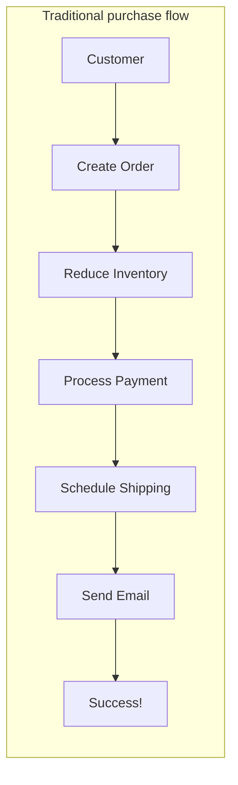

**The problem**: What if step 4 fails (the carrier doesn't respond) after the payment was already processed?

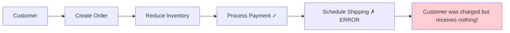

### 1.2 The Solution: Saga Pattern

The **Saga Pattern** is like having a "backup plan" for each step. If something fails, we execute the reverse operations in reverse order:

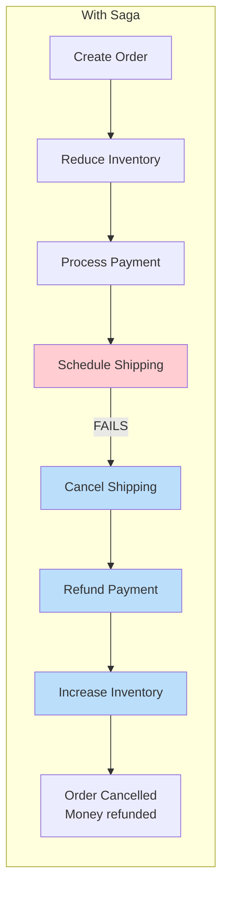

### 1.3 Saga Engine V4: Our Implementation

Saga Engine V4 not only implements the Saga Pattern but adds:

| Feature | Description | Benefit |
|---------|-------------|---------|
| **Event Sourcing** | Save each change as an event | Complete audit, time travel |
| **Durable Execution** | Workflows survive restarts | Enterprise reliability |
| **Automatic Compensation** | Smart rollback | Less code, fewer errors |
| **Pluggable Infrastructure** | PostgreSQL, NATS, etc. | Deployment flexibility |

---

## 2. Fundamental Concepts: Explained for Humans

### 2.1 Event Sourcing: Your Personal Diary

**The diary analogy**: Instead of saving your current balance, the bank saves every transaction you've ever made:

```
2024-01-01: Deposit +1000 USD (Balance: 1000)
2024-01-05: Coffee -5 USD (Balance: 995)
2024-01-10: Rent -800 USD (Balance: 195)
```

To know your current balance, you simply sum all transactions. This is **Event Sourcing**.

**In Saga Engine**:

```rust
// Instead of saving this:
struct Order {
    status: OrderStatus,
    total: Decimal,
}

// We save this:
HistoryEvent {
    event_id: 0,
    event_type: OrderCreated,
    attributes: { "total": 100, "items": [...] }
}

HistoryEvent {
    event_id: 1,
    event_type: PaymentCompleted,
    attributes: { "transaction_id": "txn_123" }
}

HistoryEvent {
    event_id: 2,
    event_type: OrderShipped,
    attributes: { "tracking": "TRK456" }
}
```

**Why is this powerful?**

1. **Complete audit**: You can see exactly what happened and when
2. **Temporal debugging**: Reproduce any moment in the past
3. **New functionality without migration**: Add new events, reconstruct state

### 2.2 Durable Execution: Execution That Survives

**The cookbook analogy**: You're following a complex recipe and note which step you're on. If someone interrupts you, you can continue exactly where you left off because you have everything recorded.

```mermaid
flowchart TB
    subgraph "Without Durable Execution"
        A[Task 1] --> B[Task 2]
        B --> C[Task 3]
        C --> D[Server restart]
        D -.-> E[We lose state!]
    end
    
    subgraph "With Durable Execution"
        F[Task 1] --> G[Record: "Completed Task 1"]
        G --> H[Task 2]
        H --> I[Record: "Completed Task 2"]
        I --> J[Server restart]
        J --> K[Read: "I'm on Task 3"]
        K --> L[Continue from Task 3]
    end
```

### 2.3 Compensation: The Backup Plan

**The IKEA furniture analogy**: When assembling IKEA furniture and a screw doesn't fit, you unscrew everything you previously tightened. That's compensation.

```rust
// Pseudocode for compensation
fn process_order(order) {
    try {
        // Step 1: Create order
        order = create_order(order)
        
        // Step 2: Reserve inventory (may fail)
        inventory = reserve_inventory(order.items)
        
        // Step 3: Process payment (may fail)
        payment = process_payment(order.total)
        
        // Step 4: Send (may fail)
        shipping = send_products(order.address)
        
    } catch error {
        // Something failed! Execute compensations in reverse
        if inventory.exists() {
            release_inventory(inventory)  // Step 4 of rollback
        }
        if payment.exists() {
            refund_payment(payment)       // Step 3 of rollback
        }
        if order.exists() {
            cancel_order(order)           // Step 2 of rollback
        }
        throw error  // Notify the failure
    }
}
```

### 2.4 Essential Vocabulary

| Term | Simple Definition | Real Example |
|------|-------------------|--------------|
| **Saga** | A sequence of transactions with compensations | "Complete purchase process" |
| **Workflow** | The definition of how a saga executes | `OrderProcessingWorkflow` |
| **Activity** | A single operation | `ProcessPaymentActivity` |
| **Event** | Something that already happened | "Payment completed" |
| **Command** | Something we want to happen | "Process payment" |
| **Aggregate** | A domain entity with behavior | `Order`, `Payment` |

---

## 3. Hexagonal Architecture: Ports and Adapters

### 3.1 Why Hexagonal Architecture?

**The original problem**: In traditional architectures, your business logic is coupled to the database, web framework, etc. If you want to switch from MySQL to PostgreSQL, or from REST to gRPC, you need to rewrite a lot of code.

**The Hexagonal solution**: Imagine a pure core (your business logic) connected to the outside world through "ports." "Adapters" connect ports to specific technologies.

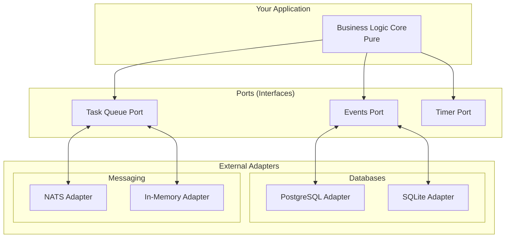

### 3.2 Directory Structure Explained

```
crates/saga-engine/
├── core/src/                    # ⭐ PURE DOMAIN (no external deps)
│   ├── event/                   # Event definitions
│   ├── workflow/                # Workflow definitions
│   ├── activity_registry/       # Activity registration
│   ├── compensation/            # Compensation logic
│   ├── port/                    # ⭐ PORTS (traits/interfaces)
│   ├── codec/                   # Serialization
│   └── snapshot/                # State persistence
│
├── pg/src/                      # PostgreSQL Adapters
│   ├── event_store.rs           # Implements EventStore
│   ├── timer_store.rs           # Implements TimerStore
│   └── replayer.rs              # Implements HistoryReplayer
│
├── nats/src/                    # NATS Adapters
│   ├── task_queue.rs            # Implements TaskQueue
│   ├── event_bus.rs             # Event publishing
│   └── signal_dispatcher.rs     # Signals
│
└── local/src/                   # Adapters for testing
```

**Why this structure?**

1. **core/src is pure**: Knows nothing about PostgreSQL or NATS
2. **Ports define contracts**: What infrastructure must do
3. **Adapters implement contracts**: How each technology does it

### 3.3 Example: The EventStore Port

```rust
// In core/src/port/event_store.rs - INTERFACE ONLY

/// ⭐ This file defines the CONTRACT, not the implementation
/// No database code here

#[async_trait::async_trait]
pub trait EventStore: Send + Sync {
    /// The error type specific to each implementation
    type Error: Display + Debug + Send + Sync + 'static;
    
    /// Save an event to the store
    async fn append_event(
        &self,
        saga_id: &SagaId,
        expected_next_event_id: u64,
        event: &HistoryEvent,
    ) -> Result<u64, EventStoreError<Self::Error>>;
    
    /// Get all events for a saga
    async fn get_history(&self, saga_id: &SagaId) 
        -> Result<Vec<HistoryEvent>, Self::Error>;
    
    /// Save a state snapshot
    async fn save_snapshot(&self, saga_id: &SagaId, event_id: u64, state: &[u8]) 
        -> Result<(), Self::Error>;
    
    /// Get the most recent snapshot
    async fn get_latest_snapshot(&self, saga_id: &SagaId) 
        -> Result<Option<(u64, Vec<u8>)>, Self::Error>;
}
```

```rust
// In pg/src/event_store.rs - CONCRETE IMPLEMENTATION

/// ⭐ Here is the real PostgreSQL code
/// Only needs to implement the trait above

pub struct PostgresEventStore {
    pool: sqlx::Pool<Postgres>,
    codec: Arc<dyn Codec>,
}

#[async_trait::async_trait]
impl EventStore for PostgresEventStore {
    type Error = PostgresEventStoreError;
    
    async fn append_event(
        &self,
        saga_id: &SagaId,
        expected_next_event_id: u64,
        event: &HistoryEvent,
    ) -> Result<u64, PostgresEventStoreError> {
        // ⭐ Real PostgreSQL code here
        // 1. Start transaction
        // 2. Check optimistic version
        // 3. Insert event
        // 4. Commit
    }
    
    // ... rest of methods
}
```

**Key benefit**: Your domain logic can be tested with `InMemoryEventStore` and production uses `PostgresEventStore` without changing a single line of business code.

---

## 4. Domain-Driven Design (DDD)

### 4.1 What is DDD and Why Does It Matter?

**The translator analogy**: Imagine you're building a medical system. If you use technical terms ("the patient presents dyspeptic symptomatology"), all doctors will understand you. If you use generic terms ("the patient has stomach pain"), you lose precision.

DDD helps you speak the same language as domain experts:

| Technical Term | DDD Equivalent |
|----------------|----------------|
| "Orders table" | `Order` Aggregate |
| "Customer ID" | `CustomerId` Value Object |
| "Order status" | `OrderStatus` Enum |

### 4.2 Bounded Contexts

**Simple definition**: Each part of your system has its own "language" and clear responsibilities.

```mermaid
flowchart TB
    subgraph "E-Commerce Platform"
        subgraph "Sales Bounded Context"
            O[Order<br/>"An order has items and a total"]
            P[Payment<br/>"A payment has status and amount"]
        end
        
        subgraph "Inventory Bounded Context"
            I[Inventory<br/>"Inventory has available stock"]
            R[Reservation<br/>"A reservation blocks stock"]
        end
        
        subgraph "Shipping Bounded Context"
            S[Shipment<br/>"A shipment has tracking"]
            C[Carrier<br/>"The carrier delivers the package"]
        end
    end
    
    O --> P : "processes"
    O --> I : "reserves"
    O --> S : "coordinates"
    
    style O fill:#e3f2fd
    style I fill:#e8f5e8
    style S fill:#fff3e0
```

### 4.3 Aggregates

**Definition**: An Aggregate is a cluster of domain objects treated as a single unit. Only one object (the Aggregate Root) can be accessed from outside.

```mermaid
classDiagram
    class Order {
        <<Aggregate Root>>
        +OrderId id
        +OrderStatus status
        +add_item(product, qty)
        +confirm()
        +cancel()
    }
    
    class OrderItem {
        +ProductId product_id
        +u32 quantity
        +Money unit_price
    }
    
    class Payment {
        +PaymentStatus status
        +Money amount
    }
    
    Order "1" --> "*" OrderItem : contains
    Order "1" --> "1" Payment : has
    
    note right of Order
        You can only access OrderItem
        through Order
        (OrderItem doesn't exist alone)
    end note
```

### 4.4 Value Objects

**Definition**: Objects that describe characteristics but have no identity of their own.

```rust
// ❌ BAD: Using primitive types
struct Order {
    customer_id: String,      // What format? UUID? Email?
    total_amount: f64,        // What currency? Precision?
    status: String,           // Valid values?
}

// ✅ GOOD: Value Objects with semantics
struct CustomerId(uuid::Uuid);
struct Money {
    amount: rust_decimal::Decimal,
    currency: &'static str,
}
struct OrderStatus(OrderStatusEnum);

impl CustomerId {
    fn new(id: &str) -> Result<Self, ValidationError> {
        // Format validation
    }
}
```

---

## 5. Event Sourcing: Your Complete History

### 5.1 The Problem with Traditional Approach

**Traditional approach (CRUD)**:

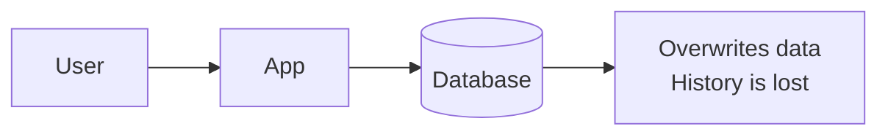

**Event Sourcing approach**:

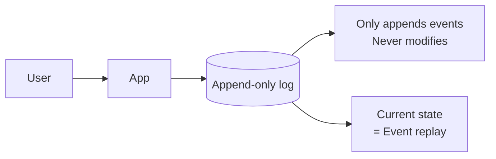

### 5.2 Event Structure

```rust
pub struct HistoryEvent {
    /// ⭐ Unique and monotonic (0, 1, 2, 3...)
    pub event_id: EventId,
    
    /// ⭐ ID of the saga this event belongs to
    pub saga_id: SagaId,
    
    /// ⭐ Type of event (60+ types available)
    pub event_type: EventType,
    
    /// ⭐ Category for filtering
    pub category: EventCategory,
    
    /// ⭐ When it happened
    pub timestamp: DateTime<Utc>,
    
    /// ⭐ Event data (flexible JSON)
    pub attributes: Value,
    
    /// ⭐ Schema version for migrations
    pub event_version: u32,
    
    /// ⭐ Is this a restore point (snapshot)?
    pub is_reset_point: bool,
    
    /// ⭐ For distributed tracing
    pub trace_id: Option<String>,
}
```

### 5.3 Event Categories

| Category | Purpose | Examples |
|----------|---------|----------|
| **Workflow** | Workflow lifecycle events | Started, Completed, Failed |
| **Activity** | Individual activity events | Scheduled, Started, Completed, Failed |
| **Timer** | Timer events | Created, Fired, Canceled |
| **Signal** | External signals received | SignalReceived |
| **Marker** | Special marks in history | MarkerRecorded |
| **Snapshot** | Persisted state | SnapshotCreated |

### 5.4 Replay: Reconstructing State

**The video analogy**: The current state is like the current frame of a video. Events are all previous frames. To get any frame, you play all previous frames.

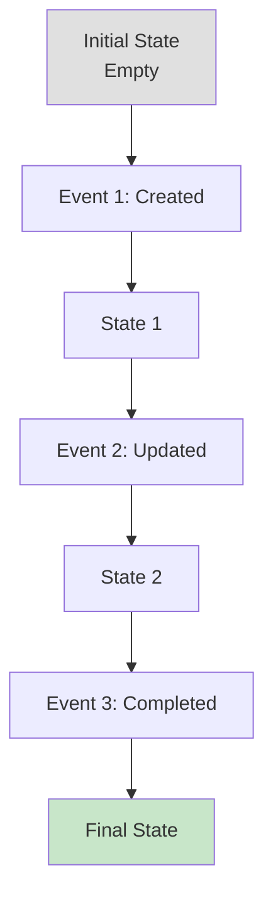

```rust
// Rust replay example
impl OrderAggregate {
    fn replay(events: &[HistoryEvent]) -> Self {
        let mut aggregate = OrderAggregate::default();
        
        for event in events {
            aggregate.apply(event);
        }
        
        aggregate
    }
    
    fn apply(&mut self, event: &HistoryEvent) {
        match event.event_type {
            EventType::OrderCreated => {
                let payload: OrderCreatedPayload = 
                    serde_json::from_value(event.attributes.clone()).unwrap();
                self.id = payload.order_id;
                self.status = OrderStatus::Pending;
                self.total = payload.total_amount;
            }
            EventType::OrderConfirmed => {
                self.status = OrderStatus::Confirmed;
            }
            EventType::OrderCompleted => {
                self.status = OrderStatus::Completed;
            }
            _ => {} // Ignore unknown events
        }
    }
}
```

### 5.5 Snapshots: Replay Optimization

**The problem**: If you have 10,000 events, replaying all each time is slow.

**The solution**: A snapshot is like a "chapter" of the book. You can skip to chapter 5 instead of reading from the beginning.

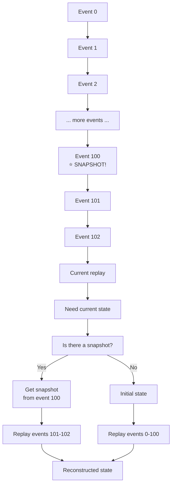

---

## 6. The Saga Pattern: Distributed Transactions

### 6.1 The Problem with ACID Transactions

In a traditional database, a transaction ensures multiple operations complete all or none:

```sql
BEGIN TRANSACTION;
INSERT INTO orders ...;
UPDATE inventory ... WHERE product_id = ...;
UPDATE accounts ... WHERE customer_id = ...;
COMMIT;  -- All or nothing
```

**The problem**: This only works within ONE database. What happens when inventory is in a separate service?

### 6.2 Saga to the Rescue

**Definition**: A Saga is a sequence of local transactions where each transaction updates data and publishes an event. If a transaction fails, the saga executes "compensating transactions" to undo changes.

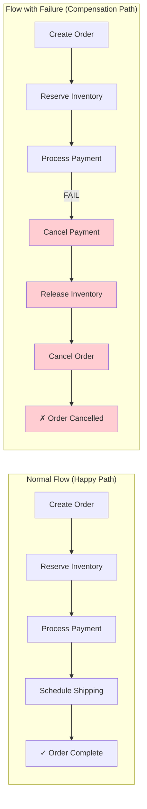

### 6.3 Compensation Order (LIFO)

**Important**: Compensations are executed in **reverse order** (Last In, First Out):

```
Execution order:
1. Create Order     ✅
2. Reserve Inv.     ✅
3. Process Payment  ❌ FAILS HERE

Compensation order:
1. Refund Payment (compensation of step 3)
2. Release Inv.    (compensation of step 2)
3. Cancel Order    (compensation of step 1)
```

### 6.4 Compensation Data

Each step must save enough information to compensate:

```rust
struct CompletedStep {
    step_id: String,                    // Step ID
    activity_type: String,              // What activity ran
    compensation_activity_type: String, // What activity compensates
    input: Value,                       // Original input
    output: Value,                      // Output (needed to compensate)
    step_order: u32,                    // Execution order
    completed_at: DateTime<Utc>,        // When completed
}

// Example:
// Step: "Reserve Inventory"
// Input: { "items": [{"product_id": "A", "qty": 2}] }
// Output: { "reservation_id": "res_123", "reserved": [...] }
// Compensation can use this to release exactly what was reserved
```

---

## 7. Your First Workflow: Step-by-Step Tutorial

### 7.1 Tutorial Goal

We'll build a **Payment Processing Workflow** that:

1. Validates the payment
2. Processes the payment with a gateway
3. Records the result

### 7.2 Step 1: Define Types

```rust
// src/types.rs

use serde::{Deserialize, Serialize};
use thiserror::Error;

/// ⭐ INPUT: What the workflow receives
#[derive(Debug, Clone, Serialize, Deserialize)]
pub struct PaymentInput {
    pub order_id: String,
    pub customer_id: String,
    pub amount: rust_decimal::Decimal,
    pub currency: String,
    pub payment_token: String,
}

/// ⭐ OUTPUT: What the workflow returns
#[derive(Debug, Clone, Serialize, Deserialize)]
pub struct PaymentOutput {
    pub transaction_id: String,
    pub status: PaymentStatus,
    pub approved_amount: rust_decimal::Decimal,
    pub processed_at: chrono::DateTime<chrono::Utc>,
}

#[derive(Debug, Clone, Serialize, Deserialize)]
pub enum PaymentStatus {
    Approved,
    Declined,
    Failed,
    Refunded,
}

/// ⭐ ERROR: Domain-specific error types
#[derive(Debug, Error, Serialize, Deserialize)]
pub enum PaymentError {
    #[error("Payment declined: {0}")]
    Declined(String),
    
    #[error("Gateway error: {0}")]
    GatewayError(String),
    
    #[error("Invalid token: {0}")]
    InvalidToken(String),
    
    #[error("Insufficient funds")]
    InsufficientFunds,
}
```

### 7.3 Step 2: Define the Activity

```rust
// src/activities/process_payment.rs

use async_trait::async_trait;
use saga_engine_core::workflow::Activity;

use crate::types::{PaymentInput, PaymentOutput, PaymentError};

/// ⭐ An Activity is an atomic operation that can fail
/// and be compensated independently
#[derive(Debug)]
pub struct ProcessPaymentActivity;

#[async_trait::async_trait]
impl Activity for ProcessPaymentActivity {
    // ⭐ Unique activity identifier
    const TYPE_ID: &'static str = "payment.process";
    
    // ⭐ Input/output types
    type Input = PaymentInput;
    type Output = PaymentOutput;
    type Error = PaymentError;
    
    async fn execute(&self, input: Self::Input) 
        -> Result<Self::Output, Self::Error> {
        
        // ═══════════════════════════════════════════════════════════
        // REAL BUSINESS LOGIC GOES HERE
        // ═══════════════════════════════════════════════════════════
        
        // 1. Validate the token (simulated)
        if input.payment_token.is_empty() {
            return Err(PaymentError::InvalidToken(
                "Payment token cannot be empty".to_string()
            ));
        }
        
        // 2. Simulate gateway call
        // In production, this would be a real HTTP call
        let gateway_response = simulate_gateway_call(
            &input.payment_token,
            input.amount,
            &input.currency
        ).await?;
        
        // 3. Return result
        Ok(PaymentOutput {
            transaction_id: gateway_response.transaction_id,
            status: map_gateway_status(gateway_response.status),
            approved_amount: gateway_response.approved_amount,
            processed_at: chrono::Utc::now(),
        })
    }
}

// Helper functions
async fn simulate_gateway_call(
    token: &str,
    amount: rust_decimal::Decimal,
    currency: &str,
) -> Result<GatewayResponse, PaymentError> {
    Ok(GatewayResponse {
        transaction_id: format!("txn_{}", uuid::Uuid::new_v4()),
        status: "approved",
        approved_amount: amount,
    })
}

struct GatewayResponse {
    transaction_id: String,
    status: &'static str,
    approved_amount: rust_decimal::Decimal,
}

fn map_gateway_status(status: &'static str) -> PaymentStatus {
    match status {
        "approved" => PaymentStatus::Approved,
        "declined" => PaymentStatus::Declined,
        "failed" => PaymentStatus::Failed,
        _ => PaymentStatus::Failed,
    }
}
```

### 7.4 Step 3: Define the Workflow

```rust
// src/workflows/payment_workflow.rs

use async_trait::async_trait;
use saga_engine_core::workflow::{DurableWorkflow, WorkflowContext};
use saga_engine_core::event::{EventType, EventCategory, HistoryEvent, EventId};
use saga_engine_core::SagaId;

use crate::types::{PaymentInput, PaymentOutput, PaymentError};
use crate::activities::ProcessPaymentActivity;

/// ⭐ The Workflow defines THE SEQUENCE of activities
/// and how to handle errors and compensations
#[derive(Debug)]
pub struct PaymentWorkflow;

#[async_trait::async_trait]
impl DurableWorkflow for PaymentWorkflow {
    // ⭐ Workflow identifiers
    const TYPE_ID: &'static str = "payment.processing";
    const VERSION: u32 = 1;
    
    // ⭐ Input/output/error types
    type Input = PaymentInput;
    type Output = PaymentOutput;
    type Error = PaymentError;
    
    async fn run(
        &self,
        ctx: &mut WorkflowContext,
        input: Self::Input,
    ) -> Result<Self::Output, Self::Error> {
        // ═══════════════════════════════════════════════════════════
        // WORKFLOW LOGIC
        // ═══════════════════════════════════════════════════════════
        
        // 1. Log workflow starting
        tracing::info!(
            saga_id = %ctx.saga_id(),
            order_id = %input.order_id,
            "Starting payment processing"
        );
        
        // 2. Execute payment activity
        // ⭐ ctx handles:
        //   - Recording events before and after
        //   - Retrying if it fails
        //   - Pausing the workflow until done
        let output = ctx
            .execute_activity(&ProcessPaymentActivity, input.clone())
            .await
            .map_err(|e| PaymentError::GatewayError(e.to_string()))?;
        
        // 3. Done, return result
        tracing::info!(
            saga_id = %ctx.saga_id(),
            transaction_id = %output.transaction_id,
            "Payment processed successfully"
        );
        
        Ok(output)
    }
}
```

### 7.5 Step 4: Register in the Engine

```rust
// src/lib.rs

use saga_engine_core::workflow::ActivityRegistry;

pub struct PaymentSagaModule;

impl PaymentSagaModule {
    /// ⭐ Register all activities and workflows
    pub fn register(registry: &mut ActivityRegistry) {
        // Register activities
        registry.register_activity(super::activities::ProcessPaymentActivity);
        
        // Engine will discover workflows automatically
        // through their DurableWorkflow implementations
    }
}
```

### 7.6 Step 5: Use the Workflow

```rust
// src/main.rs

use saga_engine_core::{SagaEngine, SagaEngineConfig};
use saga_engine_core::event::{EventCategory, EventType, HistoryEvent};
use saga_engine_pg::PostgresEventStore;
use saga_engine_nats::NatsTaskQueue;

use crate::types::{PaymentInput, PaymentOutput};
use crate::workflows::PaymentWorkflow;

#[tokio::main]
async fn main() -> Result<(), Box<dyn std::error::Error>> {
    // 1. Configure
    let config = SagaEngineConfig::default();
    
    // 2. Create adapters (external dependencies)
    let event_store = PostgresEventStore::connect("postgresql://...").await?;
    let task_queue = NatsTaskQueue::connect("nats://...").await?;
    let timer_store = PostgresTimerStore::connect("postgresql://...").await?;
    
    // 3. Create the engine
    let engine = SagaEngine::new(
        config,
        event_store,
        task_queue,
        timer_store,
    );
    
    // 4. Register activities
    let mut registry = ActivityRegistry::default();
    PaymentSagaModule::register(&mut registry);
    
    // 5. Create input
    let input = PaymentInput {
        order_id: "order_123".to_string(),
        customer_id: "customer_456".to_string(),
        amount: rust_decimal::Decimal::from(99),
        currency: "USD".to_string(),
        payment_token: "tok_visa_4242".to_string(),
    };
    
    // 6. Start the workflow
    let saga_id = SagaId::new();
    let output = engine
        .start_workflow::<PaymentWorkflow>(saga_id, input)
        .await?;
    
    println!("Payment completed: {:?}", output);
    
    Ok(())
}
```

### 7.7 Flow Summary

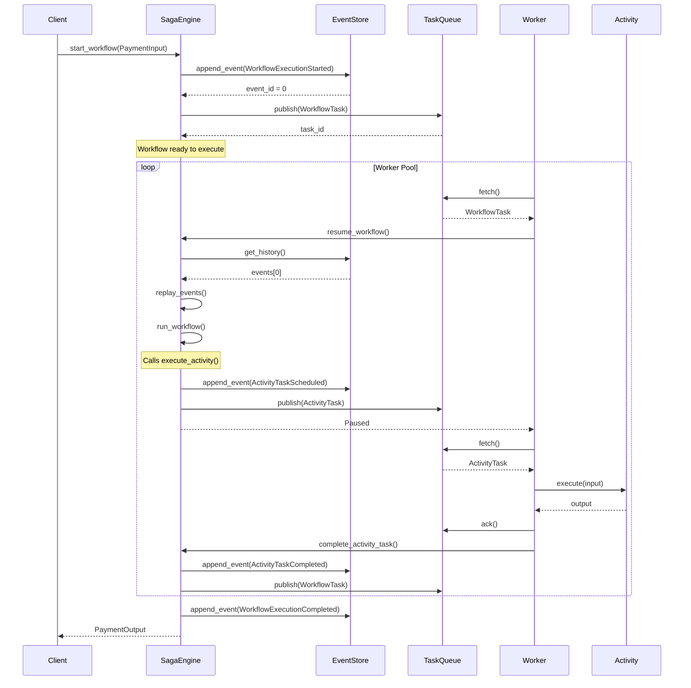

---

## 8. Activities: The Building Blocks

### 8.1 What is an Activity?

An **Activity** is the smallest unit of work in Saga Engine. It's an atomic operation that:

- Receives an **Input**
- Produces an **Output** or an **Error**
- Can be **executed multiple times** (idempotent)
- Can have a **compensating activity**

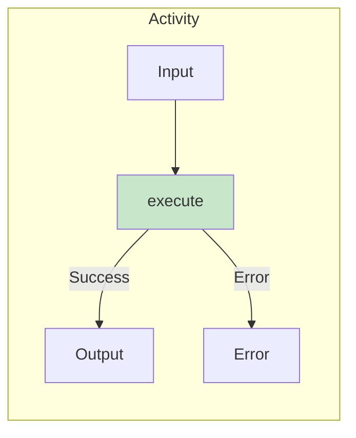

### 8.2 Characteristics of a Good Activity

```rust
// ✅ GOOD: Well-designed activity
struct ReserveInventoryActivity;

#[async_trait::async_trait]
impl Activity for ReserveInventoryActivity {
    const TYPE_ID: &'static str = "inventory.reserve";
    
    type Input = ReserveInventoryInput;
    type Output = ReserveInventoryOutput;
    type Error = InventoryError;
    
    async fn execute(&self, input: Self::Input) 
        -> Result<Self::Output, Self::Error> {
        
        // 1. Idempotent: Running twice doesn't cause problems
        //    (Check if reservation already exists)
        
        // 2. Atomic: Either reserve all or reserve nothing
        
        // 3. Well documented: Clear Input/Output
    }
}
```

### 8.3 Compensable Activities

If an activity modifies the outside world (database, external APIs), it needs compensation:

```rust
// ⭐ Payment activity with its compensation
struct ProcessPaymentActivity;

#[async_trait::async_trait]
impl EcommerceActivity<PaymentInput, PaymentOutput> for ProcessPaymentActivity {
    const TYPE_ID: &'static str = "payment.process";
    
    // ⭐ This activity can be compensated with a refund
    const COMPENSATION_ACTIVITY: Option<&'static str> = Some("payment.refund");
    
    async fn execute(&self, input: PaymentInput) 
        -> Result<PaymentOutput, PaymentError> {
        // Process real payment
    }
    
    // ⭐ Prepare data for compensation
    fn prepare_compensation_data(&self, output: &PaymentOutput) 
        -> Option<serde_json::Value> {
        Some(serde_json::json!({
            "transaction_id": output.transaction_id,
            "amount": output.approved_amount,
        }))
    }
}

struct RefundPaymentActivity;

#[async_trait::async_trait]
impl EcommerceActivity<RefundInput, RefundOutput> for RefundPaymentActivity {
    const TYPE_ID: &'static str = "payment.refund";
    // ⭐ Refunds don't have compensation (we don't refund refunds)
    const COMPENSATION_ACTIVITY: Option<&'static str> = None;
    
    async fn execute(&self, input: RefundInput) 
        -> Result<RefundOutput, RefundError> {
        // Reimburse the money
    }
}
```

### 8.4 Common Activity Catalog

| Activity | Type | Compensation | Use Case |
|----------|------|--------------|----------|
| `ProcessPayment` | Synchronous | `RefundPayment` | Charge card |
| `ReserveInventory` | Synchronous | `ReleaseInventory` | Block stock |
| `SendEmail` | Asynchronous | None | Notifications |
| `CreateFile` | Synchronous | `DeleteFile` | Generate reports |
| `CallExternalAPI` | Synchronous | Depends | Integrations |

---

## 9. Compensation: Smart Rollback

### 9.1 Why Not Use Traditional Transactions?

In distributed systems, there's no global transaction:

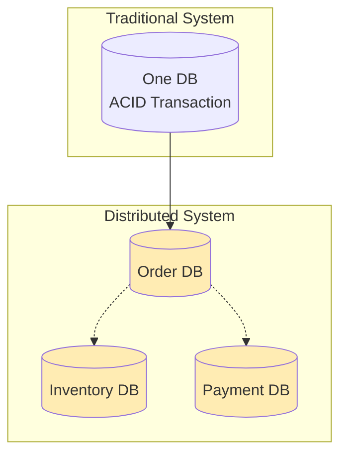

### 9.2 Compensation Pattern

```rust
// ⭐ Track each step to enable compensation
ctx.track_compensatable_step_auto(
    step_id: "reserve-inventory",
    activity_type: "ReserveInventoryActivity",
    input: json!({ "items": [...] }),
    output: json!({ "reservation_id": "res_123" }),
    order: 1,
);
```

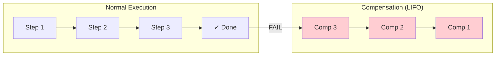

### 9.3 Compensation Data

Each compensation needs sufficient data:

```rust
// ❌ BAD: Insufficient data
ctx.track_compensatable_step(
    "payment",
    "ProcessPayment",
    json!({ "amount": 100 }),  // Only the amount
    // We don't have the transaction_id to refund!
);

// ✅ GOOD: Complete data
ctx.track_compensatable_step(
    "payment",
    "ProcessPayment",
    json!({ "amount": 100 }),
    json!({ 
        "transaction_id": "txn_abc123",
        "gateway": "stripe",
        "last_four": "4242"
    }),
);
```

### 9.4 Compensation with Errors

What if compensation also fails?

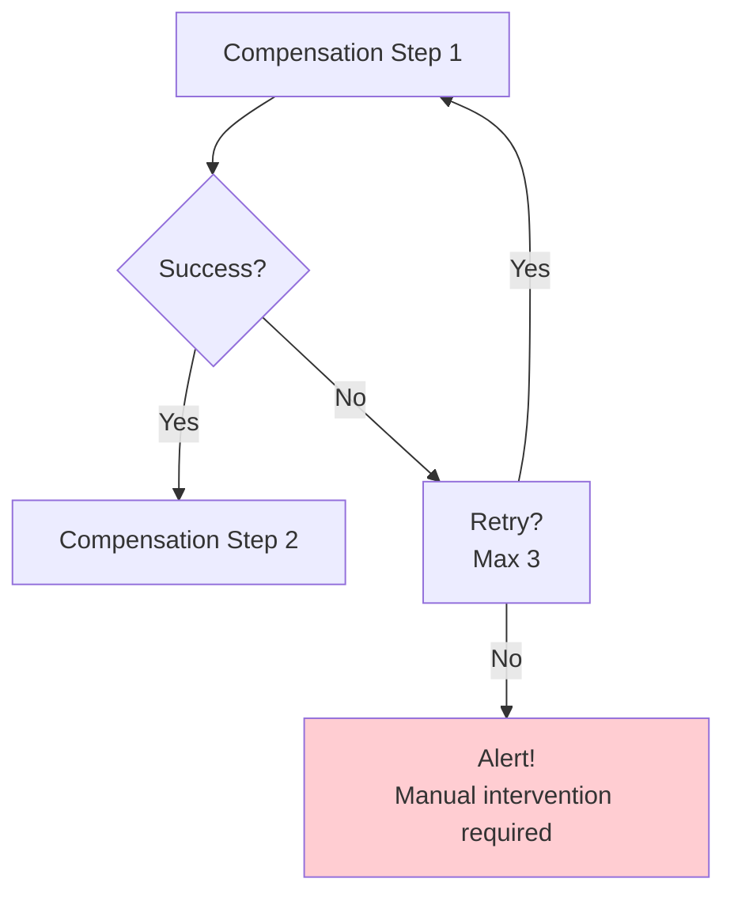

```rust
// ⭐ Configure compensation behavior
ctx.init_compensation_tracker_with_auto_compensate(true);

// ⭐ Optional: Manual retry
let compensation_actions = ctx
    .compensation_tracker
    .get_compensation_actions();

for action in compensation_actions {
    let mut retries = 0;
    loop {
        match execute_compensation(&action).await {
            Ok(()) => break,
            Err(e) if retries < action.max_retries => {
                retries += 1;
                let delay = Duration::from_secs(2_u64.pow(retries));
                tokio::time::sleep(delay).await;
            }
            Err(e) => {
                // ⭐ Alert! Requires manual intervention
                tracing::error!("Compensation failed: {:?}", e);
                return Err(OrderWorkflowError::CompensationRequired(
                    action.step_id.clone()
                ));
            }
        }
    }
}
```

---

## 10. Error Handling and Recovery

### 10.1 Error Hierarchy

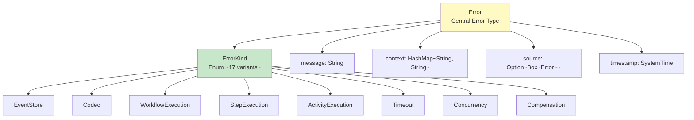

### 10.2 Error Types and Strategies

| Error Kind | Common Cause | Strategy |
|------------|--------------|----------|
| **ActivityExecution** | Bug in activity | Fix code, replay |
| **Timeout** | Slow gateway | Retry with backoff |
| **Concurrency** | Two workers same saga | Automatic replay |
| **Compensation** | Compensation fails | Manual alert |
| **EventStore** | DB temporarily unavailable | Retry with backoff |

### 10.3 Contextual Errors

```rust
// ⭐ Add context for debugging
let error = Error::activity_execution("Activity failed")
    .with_context("saga_id", saga_id.to_string())
    .with_context("activity_type", "ProcessPayment")
    .with_context("attempt", attempt.to_string())
    .with_context("last_error", last_error.to_string());

// Structured result:
// {
//   "kind": "ActivityExecution",
//   "message": "Activity failed",
//   "context": {
//     "saga_id": "abc-123",
//     "activity_type": "ProcessPayment",
//     "attempt": "3"
//   }
// }
```

### 10.4 Automatic Recovery

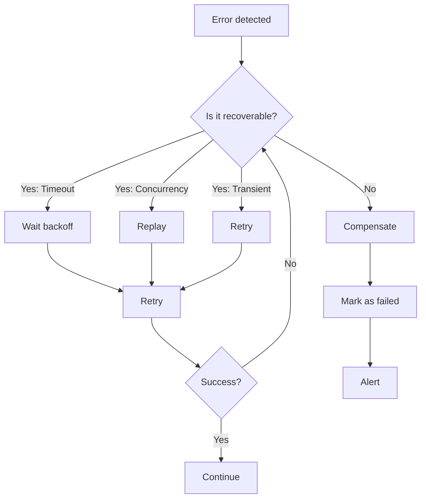

---

## 11. Configuration and Performance

### 11.1 Engine Configuration

```rust
pub struct SagaEngineConfig {
    /// ⭐ Events between snapshots
    /// Typical value: 100-500
    /// - Too low: storage overhead
    /// - Too high: slow replay
    pub max_events_before_snapshot: u64,
    
    /// ⭐ Default activity timeout
    /// Typical value: 300s (5 minutes)
    pub default_activity_timeout: Duration,
    
    /// ⭐ Task queue for workflows
    pub workflow_task_queue: String,
    
    /// ⭐ Max retries for activities
    pub max_activity_retries: u32,
    
    /// ⭐ Retry backoff
    pub retry_backoff_initial: Duration,
    pub retry_backoff_max: Duration,
}
```

### 11.2 Performance Optimization

| Parameter | Recommended Value | Reason |
|-----------|-------------------|--------|
| `max_events_before_snapshot` | 100 | Balance replay vs storage |
| `default_activity_timeout` | 300s | Generous timeout for APIs |
| `max_activity_retries` | 3 | Enough for transient errors |
| `batch_size` | 10 | Throughput vs latency |

### 11.3 Codec Comparison

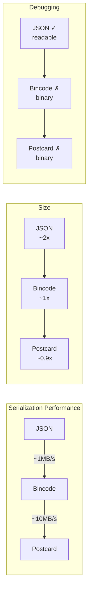

**Recommendation**:
- Development: **JSON** (readable, easy debugging)
- Production: **Bincode** or **Postcard** (10x faster)

---

## 12. Advanced Patterns and Best Practices

### 12.1 Parallel Activities

```rust
#[async_trait::async_trait]
impl DurableWorkflow for ParallelWorkflow {
    async fn run(
        &self,
        ctx: &mut WorkflowContext,
        input: Input,
    ) -> Result<Output, Error> {
        // ⭐ Execute activities in parallel
        let (result_a, result_b) = tokio::join!(
            ctx.execute_activity(&ActivityA, &input),
            ctx.execute_activity(&ActivityB, &input)
        );
        
        let a = result_a?;
        let b = result_b?;
        
        // ⭐ Now execute dependent activity
        ctx.execute_activity(&ActivityC, &(a, b)).await
    }
}
```

### 12.2 Retry Cycles

```rust
// ⭐ Retry with exponential backoff
let max_retries = 3;
let mut last_error = None;

for attempt in 1..=max_retries {
    match ctx.execute_activity(&UnreliableActivity, &input).await {
        Ok(result) => return Ok(result),
        Err(e) => {
            last_error = Some(e);
            if attempt < max_retries {
                let delay = Duration::from_secs(2_u64.pow(attempt - 1));
                tokio::time::sleep(delay).await;
            }
        }
    }
}

Err(last_error.unwrap())
```

### 12.3 Time Handling

```rust
// ⭐ Create a timer to wait
ctx.create_timer(
    "wait_for_approval",
    Duration::from_hours(24),
    Some("approval_timeout".to_string()),
).await?;

// ⭐ Or wait for external signal
let signal = ctx.wait_for_signal("approval_received").await?;
```

### 12.4 Best Practices Checklist

```markdown
## DESIGN
- [ ] Use Value Objects (not primitives)
- [ ] One Aggregate Root per Bounded Context
- [ ] Events named in past tense (OrderCreated, not CreateOrder)
- [ ] Idempotent Activities

## IMPLEMENTATION
- [ ] Compensation for each state-modifying step
- [ ] Appropriate timeouts per activity
- [ ] Rich error context (saga_id, step, etc.)
- [ ] Correctly configured snapshots

## OPERATIONS
- [ ] Monitor workflow durations
- [ ] Alert on stuck workflows
- [ ] Recovery plan for each error type
- [ ] Chaos tests (injected failures)
```

---

## 13. Quick API Reference

### 13.1 Main Traits

```rust
// ⭐ Workflow definition
trait DurableWorkflow {
    const TYPE_ID: &'static str;
    const VERSION: u32;
    type Input: Serialize + DeserializeOwned;
    type Output: Serialize + DeserializeOwned;
    type Error: std::error::Error + Send + Sync;
    
    async fn run(
        &self,
        ctx: &mut WorkflowContext,
        input: Self::Input,
    ) -> Result<Self::Output, Self::Error>;
}

// ⭐ Activity definition  
trait Activity {
    const TYPE_ID: &'static str;
    type Input: Serialize + DeserializeOwned;
    type Output: Serialize + DeserializeOwned;
    type Error: std::error::Error + Send + Sync;
    
    async fn execute(&self, input: Self::Input) 
        -> Result<Self::Output, Self::Error>;
}

// ⭐ Ports (infrastructure)
trait EventStore { ... }
trait TaskQueue { ... }
trait TimerStore { ... }
trait HistoryReplayer { ... }
```

### 13.2 WorkflowContext Methods

```rust
impl WorkflowContext {
    // ⭐ Activity execution
    async fn execute_activity<A: Activity>(
        &mut self,
        activity: &A,
        input: A::Input,
    ) -> Result<A::Output, A::Error>;
    
    // ⭐ Compensation
    fn track_compensatable_step_auto(
        &mut self,
        step_id: &str,
        activity_type: &str,
        input: Value,
        output: Value,
        order: u32,
    );
    
    // ⭐ Timers
    async fn create_timer(
        &mut self,
        timer_id: &str,
        duration: Duration,
        callback: Option<String>,
    ) -> Result<(), Error>;
    
    // ⭐ Signals
    async fn wait_for_signal(&mut self, signal_id: &str) -> Result<Value, Error>;
    
    // ⭐ State
    fn set_step_output(&mut self, key: String, value: Value);
    fn get_step_output(&self, key: &str) -> Option<&Value>;
}
```

### 13.3 Common Events

| Event | Category | Description |
|-------|----------|-------------|
| `WorkflowExecutionStarted` | Workflow | Workflow start |
| `WorkflowExecutionCompleted` | Workflow | Total success |
| `WorkflowExecutionFailed` | Workflow | Unrecoverable failure |
| `ActivityTaskScheduled` | Activity | Activity assigned |
| `ActivityTaskCompleted` | Activity | Success |
| `ActivityTaskFailed` | Activity | Failure |
| `TimerCreated` | Timer | Timer created |
| `TimerFired` | Timer | Timer expired |
| `CompensationStepStarted` | Compensation | Rollback start |
| `CompensationStepCompleted` | Compensation | Rollback success |

---

## Appendix A: Glossary

| Term | Definition |
|------|------------|
| **Aggregate** | Cluster of objects treated as a unit |
| **Bounded Context** | Limit of a specific domain |
| **Domain Event** | Something significant that happened |
| **Event Sourcing** | Saving state as event sequence |
| **Idempotent** | Safe to execute multiple times |
| **Saga** | Distributed transaction with compensations |
| **Snapshot** | Persisted state for replay optimization |
| **Value Object** | Object without identity describing characteristics |

---

## Appendix B: Additional Resources

### Recommended Reading
- "Domain-Driven Design" - Eric Evans
- "Implementing Domain-Driven Design" - Vaughn Vernon
- "Enterprise Integration Patterns" - Gregor Hohpe

### Links
- [Saga Pattern - Microsoft](https://learn.microsoft.com/en-us/azure/architecture/patterns/saga-pattern)
- [Event Sourcing - Martin Fowler](https://martinfowler.com/eaaDev/EventSourcing.html)

---

*Manual Version: 2.0.0*
*Last Updated: 2026-01-28*
*Language: English*
