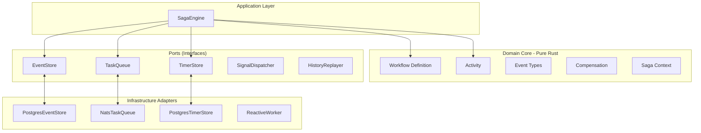
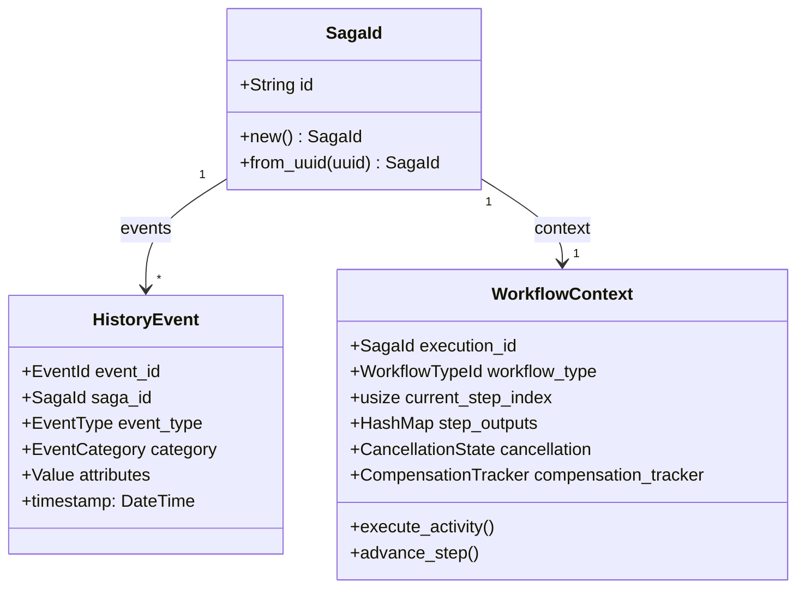
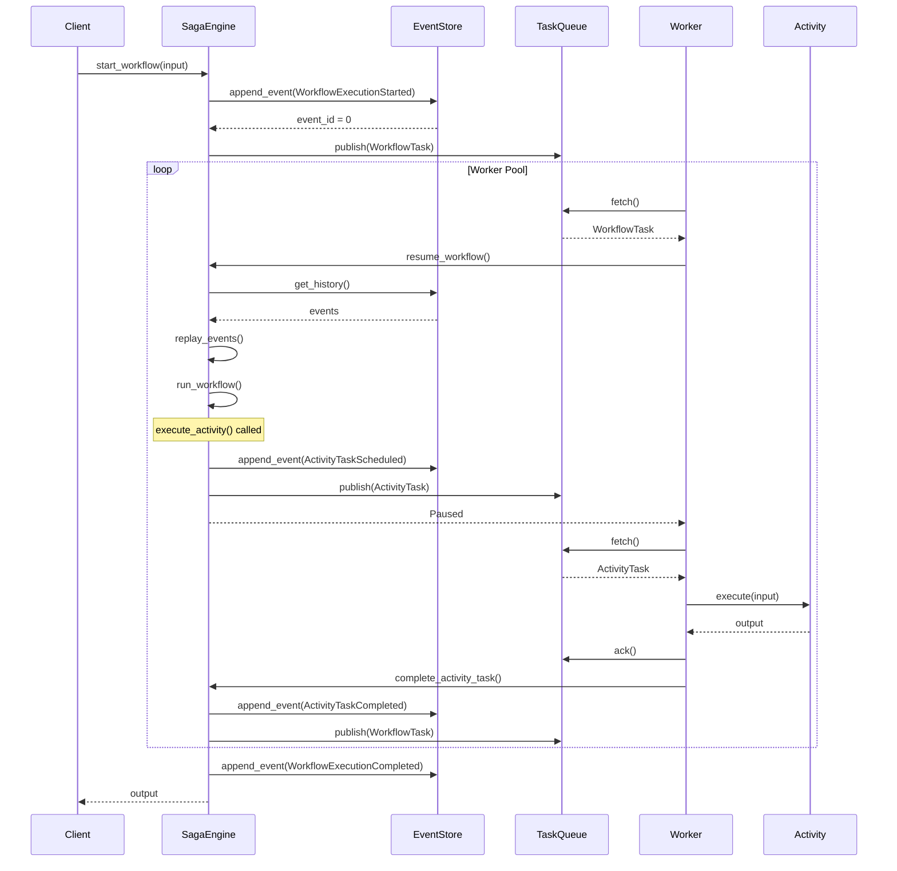
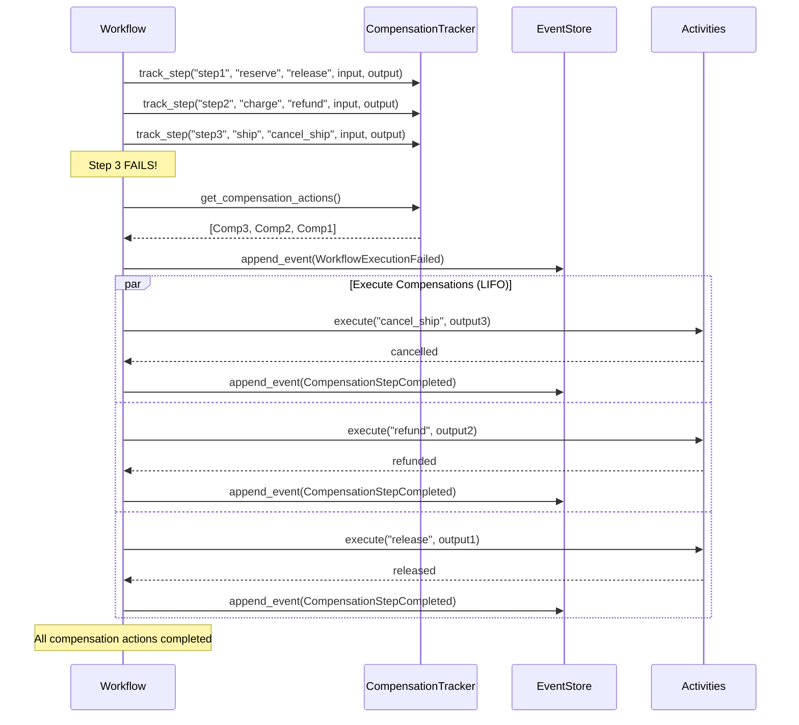

# Saga Engine V4 - Developer Manual

## 1. Introduction

**Saga Engine** is a production-ready workflow orchestration system built on **Event Sourcing** and **Durable Execution** principles. It implements the Saga pattern for distributed transactions with automatic compensation/rollback capabilities.

### Key Features

- **Event Sourcing**: Complete audit trail through immutable events
- **Durable Execution**: Workflows survive process restarts
- **Automatic Compensation**: LIFO rollback on failure
- **Pluggable Infrastructure**: PostgreSQL, NATS, SQLite backends
- **Workflow-as-Code**: Define workflows as Rust code, not declarative DSLs

---

## 2. Architecture Overview

### 2.1 Hexagonal Architecture (Ports & Adapters)



### 2.2 Directory Structure

```
crates/saga-engine/
├── core/src/                    # Domain Core (Pure Rust, 0 infra deps)
│   ├── event/                   # Event types, HistoryEvent
│   ├── workflow/                # WorkflowDefinition, DurableWorkflow
│   ├── activity_registry/       # Activity registration
│   ├── compensation/            # Compensation tracking
│   ├── port/                    # Port traits (EventStore, TaskQueue, etc)
│   ├── codec/                   # Serialization (JsonCodec, BincodeCodec)
│   └── snapshot/                # Snapshot management
│
├── pg/src/                      # PostgreSQL Adapters
│   ├── event_store.rs           # PostgresEventStore
│   ├── timer_store.rs           # PostgresTimerStore
│   ├── replayer.rs              # PostgresReplayer
│   └── engine.rs                # PostgresSagaEngine (Facade)
│
├── nats/src/                    # NATS Adapters
│   ├── task_queue.rs            # NatsTaskQueue (JetStream)
│   ├── event_bus.rs             # NatsEventBus
│   └── signal_dispatcher.rs     # NatsSignalDispatcher
│
├── sqlite/src/                  # SQLite Adapters (Testing)
│
└── local/src/                   # In-Memory Adapters (Testing)
```

---

## 3. DDD Analysis

### 3.1 Bounded Contexts

| Context | Purpose | Core Entities | Ubiquitous Language |
|---------|---------|---------------|---------------------|
| **Saga Context** | Workflow orchestration | Saga, SagaId, SagaEngine | Saga, Execution, Workflow |
| **Event Context** | Event sourcing | HistoryEvent, EventType, EventCategory | Event, EventId, Category |
| **Activity Context** | Activity execution | Activity, ActivityRegistry, ActivityTypeId | Activity, Task, Handler |
| **Compensation Context** | Rollback handling | CompensationTracker, CompensationAction | Compensation, Rollback, Undo |
| **Timer Context** | Time-based triggers | DurableTimer, TimerStore, TimerType | Timer, Timeout, Delay |

### 3.2 Aggregates

#### Saga Aggregate (Root: SagaId)



**Aggregate Invariants**:
- Event IDs must be monotonically increasing within a saga
- Events cannot be modified or deleted (immutability)
- Compensation actions execute in LIFO order

### 3.3 Value Objects

| Value Object | Type | Purpose |
|--------------|------|---------|
| `SagaId` | `struct SagaId(String)` | Unique saga identifier |
| `EventId` | `struct EventId(u64)` | Monotonic event ID within saga |
| `WorkflowTypeId` | `struct WorkflowTypeId(String)` | Workflow type identifier |
| `ActivityTypeId` | `struct ActivityTypeId(String)` | Activity type identifier |
| `TaskId` | `struct TaskId(String)` | Unique task identifier |
| `DurableTimer` | `struct DurableTimer` | Persistent timer |

### 3.4 Domain Events (Event Types)

```rust
// Workflow Events
WorkflowExecutionStarted
WorkflowExecutionCompleted
WorkflowExecutionFailed
WorkflowExecutionTimedOut
WorkflowExecutionCanceled

// Activity Events  
ActivityTaskScheduled
ActivityTaskStarted
ActivityTaskCompleted
ActivityTaskFailed
ActivityTaskTimedOut
ActivityTaskCanceled

// Timer Events
TimerCreated
TimerFired
TimerCanceled

// Signal Events
SignalReceived

// Marker Events
MarkerRecorded
```

---

## 4. Ports (Interfaces)

All ports are defined in `core/src/port/` as Rust traits.

### 4.1 EventStore Port

```rust
#[async_trait::async_trait]
pub trait EventStore: Send + Sync {
    type Error: Display + Debug + Send + Sync + 'static;
    
    async fn append_event(
        &self,
        saga_id: &SagaId,
        expected_next_event_id: u64,
        event: &HistoryEvent,
    ) -> Result<u64, EventStoreError<Self::Error>>;
    
    async fn get_history(&self, saga_id: &SagaId) 
        -> Result<Vec<HistoryEvent>, Self::Error>;
    
    async fn save_snapshot(&self, saga_id: &SagaId, event_id: u64, state: &[u8]) 
        -> Result<(), Self::Error>;
    
    async fn get_latest_snapshot(&self, saga_id: &SagaId) 
        -> Result<Option<(u64, Vec<u8>)>, Self::Error>;
}
```

**Concurrency Model**: Optimistic locking via `expected_next_event_id`

### 4.2 TaskQueue Port

```rust
#[async_trait::async_trait]
pub trait TaskQueue: Send + Sync {
    type Error: Debug + Send + Sync + 'static;
    
    async fn publish(&self, task: &Task, subject: &str) 
        -> Result<TaskId, TaskQueueError<Self::Error>>;
    
    async fn fetch(&self, consumer_name: &str, max_messages: u64, timeout: Duration) 
        -> Result<Vec<TaskMessage>, TaskQueueError<Self::Error>>;
    
    async fn ack(&self, message_id: &str) 
        -> Result<(), TaskQueueError<Self::Error>>;
    
    async fn nak(&self, message_id: &str, delay: Option<Duration>) 
        -> Result<(), TaskQueueError<Self::Error>>;
}
```

### 4.3 TimerStore Port

```rust
#[async_trait::async_trait]
pub trait TimerStore: Send + Sync {
    type Error: Debug + Send + Sync + 'static;
    
    async fn create_timer(&self, timer: &DurableTimer) 
        -> Result<(), TimerStoreError<Self::Error>>;
    
    async fn get_expired_timers(&self, limit: u64) 
        -> Result<Vec<DurableTimer>, TimerStoreError<Self::Error>>;
    
    async fn claim_timers(&self, timer_ids: &[String], scheduler_id: &str) 
        -> Result<Vec<DurableTimer>, TimerStoreError<Self::Error>>;
}
```

### 4.4 HistoryReplayer Port

```rust
#[async_trait::async_trait]
pub trait HistoryReplayer<T>: Send + Sync {
    type Error: Display + Debug + Send + Sync + 'static;
    
    async fn replay(&self, state: T, events: &[HistoryEvent], config: Option<ReplayConfig>)
        -> Result<ReplayResult<T>, ReplayError<Self::Error>>;
    
    async fn get_current_state(&self, saga_id: &SagaId, config: Option<ReplayConfig>)
        -> Result<ReplayResult<T>, ReplayError<Self::Error>>;
}
```

---

## 5. Workflow Definition

### 5.1 DurableWorkflow Trait (Workflow-as-Code)

```rust
use saga_engine_core::workflow::{DurableWorkflow, WorkflowContext};

struct MyWorkflow;

#[async_trait::async_trait]
impl DurableWorkflow for MyWorkflow {
    const TYPE_ID: &'static str = "my-workflow";
    const VERSION: u32 = 1;
    
    type Input = MyInput;
    type Output = MyOutput;
    type Error = std::io::Error;
    
    async fn run(
        &self,
        ctx: &mut WorkflowContext,
        input: Self::Input,
    ) -> Result<Self::Output, Self::Error> {
        // Step 1: Execute activity
        let result_a = ctx.execute_activity(&ActivityA, &input).await?;
        
        // Step 2: Execute another activity
        let result_b = ctx.execute_activity(&ActivityB, &result_a).await?;
        
        // Return final output
        Ok(result_b)
    }
}
```

### 5.2 Activity Definition

```rust
use saga_engine_core::workflow::Activity;

#[derive(Debug)]
struct PaymentActivity;

#[async_trait::async_trait]
impl Activity for PaymentActivity {
    const TYPE_ID: &'static str = "process-payment";
    
    type Input = PaymentInput;
    type Output = PaymentOutput;
    type Error = PaymentError;
    
    async fn execute(&self, input: Self::Input) 
        -> Result<Self::Output, Self::Error> {
        // Payment processing logic
        Ok(PaymentOutput { transaction_id: "txn-123".into() })
    }
}
```

---

## 6. Call Flows

### 6.1 Workflow Execution Flow



### 6.2 Compensation Flow (Rollback)



---

## 7. Use Cases

### 7.1 Start a New Workflow

```rust
use saga_engine_core::{SagaEngine, SagaId, SagaEngineConfig};
use saga_engine_core::event::{EventCategory, EventType, HistoryEvent};

async fn start_workflow<W: DurableWorkflow>(
    engine: &SagaEngine<impl EventStore, impl TaskQueue, impl TimerStore>,
    input: W::Input,
) -> Result<SagaId, SagaEngineError> {
    let saga_id = SagaId::new();
    
    // Create start event
    let event = HistoryEvent::new(
        EventId(0),
        saga_id.clone(),
        EventType::WorkflowExecutionStarted,
        EventCategory::Workflow,
        serde_json::json!({ "input": input }),
    );
    
    // Persist event
    engine.event_store.append_events(&saga_id, 0, &[event]).await?;
    
    // Schedule first task
    let task = Task::new(
        "workflow-execute".to_string(),
        saga_id.clone(),
        uuid::Uuid::new_v4().to_string(),
        vec![],
    );
    
    engine.task_queue.publish(&task, "workflows").await?;
    
    Ok(saga_id)
}
```

### 7.2 Execute Activity with Compensation

```rust
#[async_trait::async_trait]
impl DurableWorkflow for OrderWorkflow {
    async fn run(
        &self,
        ctx: &mut WorkflowContext,
        input: OrderInput,
    ) -> Result<OrderOutput, std::io::Error> {
        // Initialize compensation tracker
        ctx.init_compensation_tracker();
        
        // Step 1: Reserve inventory
        let reservation = ctx
            .execute_activity(&ReserveInventory, &input.items)
            .await?;
        
        ctx.track_compensatable_step_auto(
            "reserve-inventory",
            "ReserveInventory",
            serde_json::json!({ "items": input.items }),
            serde_json::json!({ "reservation_id": reservation.id }),
            1,
        );
        
        // Step 2: Process payment
        let payment = ctx
            .execute_activity(&ProcessPayment, &input.payment_info)
            .await?;
        
        ctx.track_compensatable_step_auto(
            "process-payment",
            "ProcessPayment",
            serde_json::json!({ "amount": input.amount }),
            serde_json::json!({ "transaction_id": payment.transaction_id }),
            2,
        );
        
        // Step 3: Ship order
        let shipment = ctx
            .execute_activity(&ShipOrder, &reservation)
            .await?;
        
        Ok(OrderOutput { reservation, payment, shipment })
    }
}
```

---

## 8. Error Handling

### 8.1 Error Kinds

```rust
#[derive(Debug, Clone, PartialEq, Serialize, Deserialize)]
pub enum ErrorKind {
    EventStore,
    Codec,
    WorkflowExecution,
    StepExecution,
    ActivityExecution,
    TimerStore,
    SignalDispatcher,
    TaskQueue,
    Snapshot,
    Replay,
    Configuration,
    Validation,
    Timeout,
    Cancelled,
    Concurrency,
    Compensation,
    Unknown,
}
```

### 8.2 Contextual Errors

```rust
let error = Error::workflow_execution("Saga failed at step 3")
    .with_context("saga_id", saga_id.to_string())
    .with_context("step", "payment-processing")
    .with_context("attempt", attempt.to_string());

// Error structure for debugging
let structured = error.to_structured();
// { message: "Saga failed...", kind: WorkflowExecution, context: {...} }
```

---

## 9. Testing

### 9.1 In-Memory Testing

```rust
use saga_engine_core::port::{EventStore, TaskQueue, TimerStore};
use saga_engine_testing::{InMemoryEventStore, InMemoryTaskQueue};

#[tokio::test]
async fn test_workflow_execution() {
    let event_store = Arc::new(InMemoryEventStore::new());
    let task_queue = Arc::new(InMemoryTaskQueue::new());
    let timer_store = Arc::new(InMemoryTimerStore::new());
    
    let engine = SagaEngine::new(
        SagaEngineConfig::default(),
        event_store.clone(),
        task_queue.clone(),
        timer_store,
    );
    
    let saga_id = engine.start_workflow::<MyWorkflow>(input).await?;
    
    // Verify event was persisted
    let history = event_store.get_history(&saga_id).await?;
    assert_eq!(history.len(), 1);
    assert_eq!(history[0].event_type, EventType::WorkflowExecutionStarted);
}
```

---

## 10. Configuration Reference

### 10.1 SagaEngineConfig

```rust
pub struct SagaEngineConfig {
    /// Maximum events before forcing a snapshot (default: 100)
    pub max_events_before_snapshot: u64,
    
    /// Default activity timeout (default: 300 seconds)
    pub default_activity_timeout: Duration,
    
    /// Task queue for workflow tasks (default: "saga-workflows")
    pub workflow_task_queue: String,
}
```

### 10.2 SnapshotConfig

```rust
pub struct SnapshotConfig {
    /// Events between snapshots (default: 100, 0 = disabled)
    pub interval: u64,
    
    /// Maximum snapshots per saga (default: 5)
    pub max_snapshots: u32,
    
    /// Enable SHA-256 checksums (default: true)
    pub enable_checksum: bool,
}
```

---

## 11. Best Practices

1. **Use DurableWorkflow**: Prefer `DurableWorkflow` over deprecated `WorkflowDefinition`
2. **Track Compensation**: Always call `track_compensatable_step_auto()` for steps that need rollback
3. **Idempotent Activities**: Activities should be safe to retry
4. **Snapshot Configuration**: Tune `max_events_before_snapshot` for your throughput needs
5. **Error Context**: Use `with_context()` to add debugging info to errors
6. **Version Workflows**: Increment `VERSION` when changing workflow logic

---

## 12. Migration Guide (v3 to v4)

| v3 Pattern | v4 Pattern |
|------------|------------|
| `WorkflowDefinition` steps list | `DurableWorkflow` async `run()` |
| `ActivityStep::new("name", Activity)` | `ctx.execute_activity(&Activity, input)` |
| `WorkflowExecutor::new(workflow)` | `SagaEngine::start_workflow()` |
| Manual compensation tracking | `ctx.track_compensatable_step_auto()` |

```rust
// v3 (Deprecated)
impl WorkflowDefinition for MyWorkflow {
    fn steps(&self) -> &[Box<dyn DynWorkflowStep>] {
        vec![Box::new(ActivityStep::new("step1", ActivityA))]
    }
}

// v4 (Recommended)
#[async_trait::async_trait]
impl DurableWorkflow for MyWorkflow {
    async fn run(&self, ctx: &mut WorkflowContext, input: Self::Input) 
        -> Result<Self::Output, Self::Error> {
        ctx.execute_activity(&ActivityA, &input).await
    }
}
```

---

*Generated: 2026-01-27 | Version: 1.0.0*
