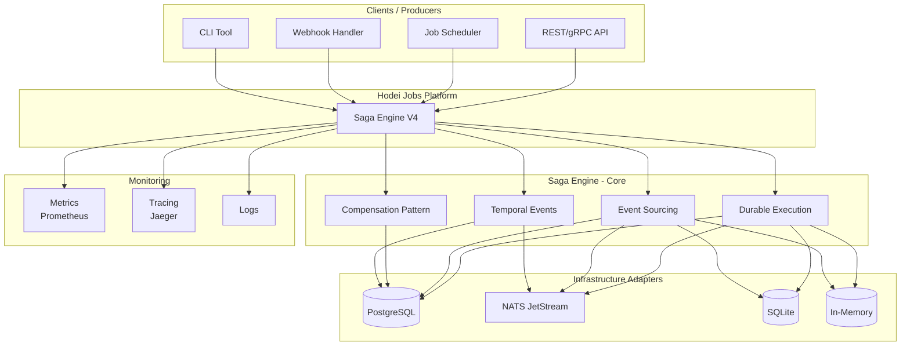
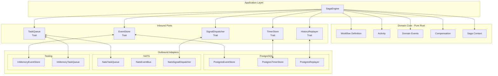
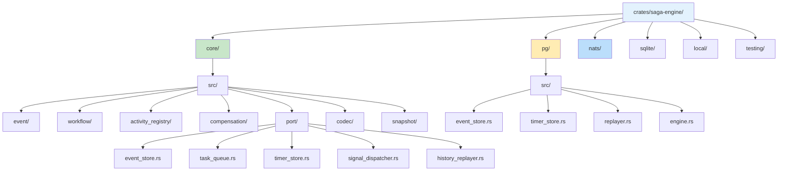
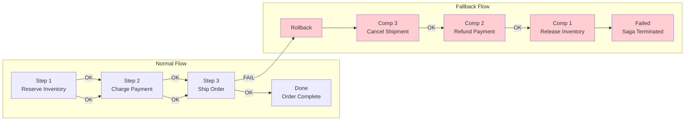
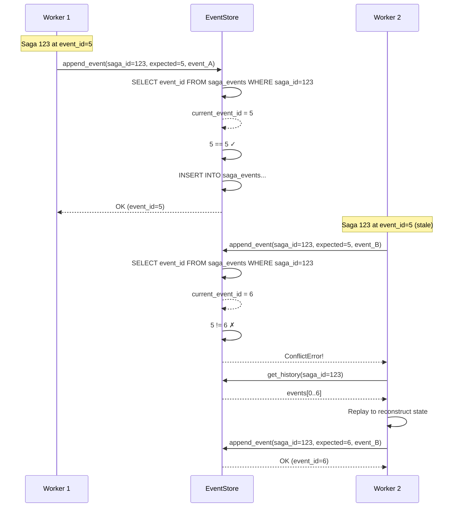
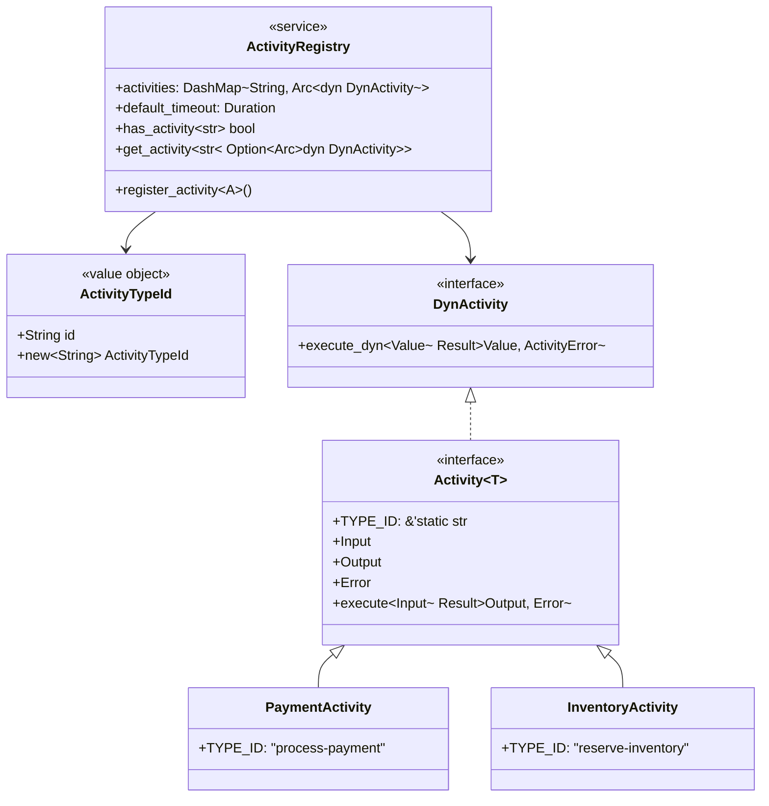
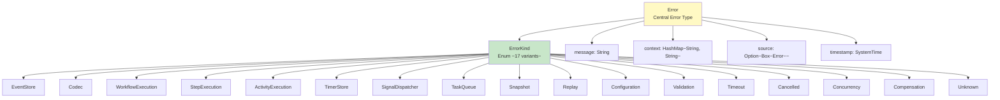
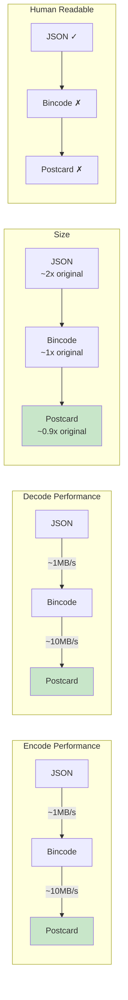
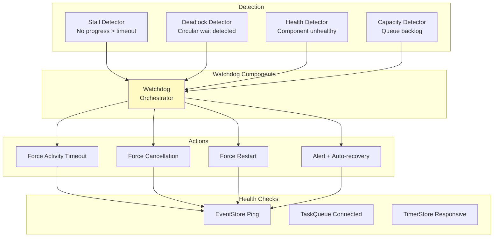

# Saga Engine V4 - Architecture Diagrams

This document contains Saga Engine architecture diagrams in Mermaid format.

---

## 1. General Context Diagram



---

## 2. Hexagonal Architecture (Ports & Adapters)



---

## 3. Directory Structure



---

## 4. Execution Flow Diagram

```mermaid
sequenceDiagram
    autonumber
    participant C as Client
    participant SE as SagaEngine
    participant ES as EventStore
    participant TQ as TaskQueue
    participant W as Worker
    participant A as Activity
    
    C->>SE: start_workflow(input)
    SE->>ES: append_event(WorkflowExecutionStarted)
    ES-->>SE: event_id = 0
    
    SE->>TQ: publish(WorkflowTask)
    TQ-->>
    
    Note over SE: Workflow scheduledSE: task_id
    
    loop Worker Pool
        W->>TQ: fetch()
        TQ-->>W: WorkflowTask
        W->>SE: resume_workflow()
        
        SE->>ES: get_history()
        ES-->>SE: events[]
        
        SE->>SE: replay_events()
        SE->>SE: run_workflow()
        
        Note over SE: execute_activity() called
        
        SE->>ES: append_event(ActivityTaskScheduled)
        SE->>TQ: publish(ActivityTask)
        SE-->>W: Paused
        
        W->>TQ: fetch()
        TQ-->>W: ActivityTask
        W->>A: execute(input)
        A-->>W: output
        W->>TQ: ack()
        
        W->>SE: complete_activity_task()
        SE->>ES: append_event(ActivityTaskCompleted)
        SE->>TQ: publish(WorkflowTask)
    end
    
    SE->>ES: append_event(WorkflowExecutionCompleted)
    SE-->>C: output
```

---

## 5. Event Model

```mermaid
graph TD
    HE[HistoryEvent<br/>SAGA History] --> ET[EventType<br/>Event Type]
    HE --> EC[EventCategory<br/>Category]
    HE --> ATTR[Attributes<br/>JSON Payload]
    
    ET --> WE[Workflow Events<br/>7 types]
    ET --> AE[Activity Events<br/>6 types]
    ET --> TE[Timer Events<br/>3 types]
    ET --> SE[Signal Events<br/>1 type]
    ET --> ME[Marker Events<br/>1 type]
    ET --> SNE[Snapshot Events<br/>1 type]
    ET --> CE[Command Events<br/>3 types]
    ET --> CWE[Child Workflow Events<br/>9 types]
    ET --> LAE[Local Activity Events<br/>6 types]
    ET --> SEE[Side Effect Events<br/>1 type]
    ET --> UE[Update Events<br/>5 types]
    ET --> SAE[Search Attribute Events<br/>1 type]
    ET --> NE[Nexus Events<br/>7 types]
    
    EC --> WC[Workflow]
    EC --> AC[Activity]
    EC --> TC[Timer]
    EC --> SC[Signal]
    EC --> MC[Marker]
    EC --> SnC[Snapshot]
    EC --> CC[Command]
    EC --> CwC[ChildWorkflow]
    EC --> LAC[LocalActivity]
    EC --> SeC[SideEffect]
    EC --> UC[Update]
    EC --> SaC[SearchAttribute]
    EC --> NC[Nexus]
    
    style HE fill:#fff9c4
    style ET fill:#c8e6c9
    style EC fill:#bbdefb
```



---

## 6. Compensation (Rollback Pattern)



---

## 7. Workflow State Diagram


---

## 8. Concurrency: Optimistic Locking



---

## 9. Snapshot Strategy

```mermaid
flowchart TB
    subgraph "State Reconstruction"
        A[Start replay] --> B{Snapshot exists?}
        B -->|Yes| C[Get snapshot<br/>last_event_id=50]
        B -->|No| D[Empty initial state]
        
        C --> E[get_history_from(event_id=50)]
        D --> F[get_history()]
        
        E --> G[Events 51..100]
        F --> H[Events 0..100]
        
        G --> I[replayer.replay(snapshot, events)]
        H --> I
        
        I --> J[Reconstructed state<br/>at event 100]
    end
    
    subgraph "Snapshot Creation"
        K[New event appended] --> L[Counter++]
        L --> M{counter >= interval?}
        M -->|Yes| N[Create snapshot]
        M -->|No| O[Continue]
        N --> P[Save to EventStore]
        P --> Q[Reset counter]
    end
    
    style C fill:#c8e6c9
    style N fill:#bbdefb
```

---

## 10. Timer Architecture

```mermaid
flowchart TD
    subgraph "Timer Scheduler"
        TS[Timer Scheduler<br/>Polling Loop]
    end
    
    subgraph "Timer Store"
        TS --> TSQ[Timer Store Query<br/>SELECT WHERE fire_at <= NOW()]
        TSQ --> CLAIM[claim_timers()<br/>UPDATE status = Processing]
        CLAIM --> TIMERS[Expired Timers List]
    end
    
    subgraph "Event Processing"
        TIMERS --> LOOP[For each timer]
        LOOP --> E1[append_event(TimerFired)]
        E1 --> E2[SignalDispatcher.notify()]
        E2 --> E3[Workflow resumes]
    end
    
    subgraph "Timer Types"
        TT1[WorkflowTimeout<br/>SAGA level]
        TT2[ActivityTimeout<br/>ACTIVITY level]
        TT3[Sleep<br/>User delay]
        TT4[RetryBackoff<br/>Exponential backoff]
        TT5[Scheduled<br/>Cron-style]
    end
    
    TT1 --> TS
    TT2 --> TS
    TT3 --> TS
    TT4 --> TS
    TT5 --> TS
```

---

## 11. Task Queue (NATS JetStream)

```mermaid
flowchart TB
    subgraph "Publish Path"
        P[Publisher] --> EN[Encode Task<br/>JSON/Bincode]
        EN --> PUB[Publish to Subject<br/>saga.tasks.workflow-id]
        PUB --> JS[NATS JetStream]
        JS --> STREAM[Stream: SAGA_TASKS]
    end
    
    subgraph "Consumer Path"
        WORKER[Worker] --> FETCH[pull().max_messages(N)]
        FETCH --> SUB[Subscribe Consumer<br/>Durable: saga-workers]
        SUB --> JS
        JS --> MSGS[Batch Messages]
        MSGS --> WORKER
        WORKER --> ACK[ack() or nak(delay)]
        ACK --> JS
    end
    
    subgraph "Message Lifecycle"
        NEW[New Message] --> PROCESS[Processing]
        PROCESS --> ACKED[Acked<br/>Removed from queue]
        PROCESS --> NAKED[Nak'd<br/>Redeliver after delay]
        PROCESS --> TERM[Terminated<br/>To DLQ]
    end
    
    style STREAM fill:#bbdefb
    style SUB fill:#c8e6c9
```

---

## 12. Activity Registry



---

## 13. Error Hierarchy



---

## 14. Codec Performance Comparison



---

## 15. Watchdog System



---

*Document Version: 1.0.0*
*Format: Mermaid.js*
*Generated: 2026-01-27*
