# Saga Engine V4 - Architecture Diagrams Manual

## Complete Visual Guide: Understanding Architecture Through Diagrams

---

> **What is this document?**
> This manual uses Mermaid diagrams to visualize Saga Engine V4's key concepts. Each diagram includes a detailed explanation of what it represents, why it matters, and how components relate to each other.
>
> **How to use this manual**:
> 1. Read each diagram's description
> 2. Observe how components connect
> 3. Check the referenced source code for implementation details

---

## Table of Contents

1. [General System Context](#1-general-system-context)
2. [Hexagonal Architecture (Ports & Adapters)](#2-hexagonal-architecture-ports--adapters)
3. [Directory Structure](#3-directory-structure)
4. [Workflow Execution Flow](#4-workflow-execution-flow)
5. [Event Model](#5-event-model)
6. [Compensation (Rollback) Pattern](#6-compensation-rollback-pattern)
7. [Workflow State Diagram](#7-workflow-state-diagram)
8. [Concurrency: Optimistic Locking](#8-concurrency-optimistic-locking)
9. [Snapshot Strategy](#9-snapshot-strategy)
10. [Timer Architecture](#10-timer-architecture)
11. [Task Queue with NATS JetStream](#11-task-queue-with-nats-jetstream)
12. [Activity Registry](#12-activity-registry)
13. [Error Hierarchy](#13-error-hierarchy)
14. [Codec Comparison](#14-codec-comparison)
15. [Watchdog System](#15-watchdog-system)
16. [How to Read and Create Mermaid Diagrams](#16-how-to-read-and-create-mermaid-diagrams)

---

## 1. General System Context

### 1.1 Panoramic View

This diagram shows how Saga Engine V4 fits into the Hodei Jobs platform and its external dependencies.

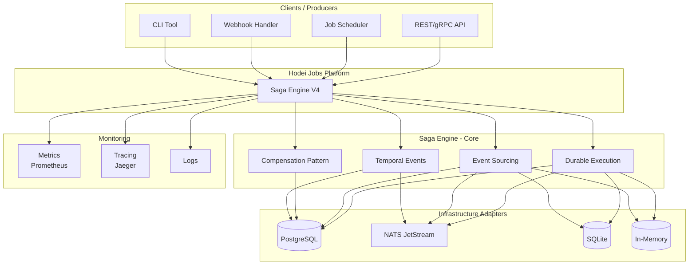

**Detailed explanation**:

| Component | Description | Role |
|-----------|-------------|------|
| **API/Scheduler/Webhook/CLI** | Workflow producers | Initiate new workflows |
| **Durable Execution** | Execution engine | Ensure workflows complete |
| **Event Sourcing** | Event persistence | Record every change |
| **Compensation Pattern** | Failure handling | Rollback on error |
| **Temporal Events** | Timers and delays | Schedule future actions |
| **PostgreSQL** | Primary persistence | Store events and state |
| **NATS JetStream** | Message queues | Transmit tasks |
| **SQLite/In-Memory** | Testing adapters | Enable testing |

### 1.2 Main Data Flow

```
Producers → Saga Engine → Infrastructure → Consumers

  API           Durable              PostgreSQL        Metrics
  Scheduler  →  Execution      →      NATS        →   Tracing
  Webhook        Event                 SQLite          Logs
  CLI            Sourcing
                 Compensation
                 Timers
```

---

## 2. Hexagonal Architecture (Ports & Adapters)

### 2.1 The Ports and Adapters Pattern

This diagram shows how Saga Engine separates business logic from infrastructure.

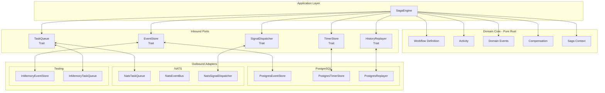

**Key concepts**:

- **Domain Core (Green)**: Pure business logic, no external dependencies
- **Inbound Ports (Yellow)**: Contracts (traits) defining what the domain needs
- **Outbound Adapters (Blue/Orange)**: Concrete implementations for each technology

### 2.2 Benefits of This Architecture

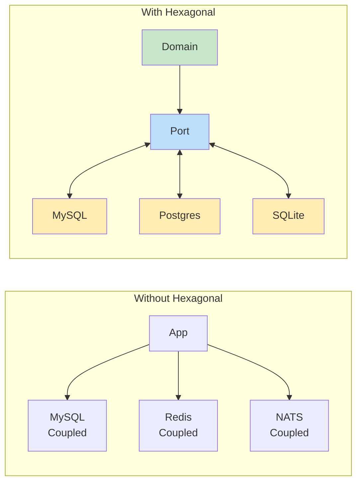

**Decoupling**: You can change the database without modifying the domain.

---

## 3. Directory Structure

### 3.1 Code Organization

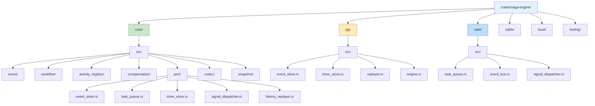

**Color legend**:

| Color | Meaning | Content |
|-------|---------|---------|
| **Light blue** | Root | Entry point |
| **Green** | Core domain | Pure logic |
| **Yellow** | PostgreSQL | Persistent implementation |
| **Blue** | NATS | Messaging implementation |

### 3.2 Layer Correspondence

```
┌─────────────────────────────────────────────┐
│           Application Layer                  │
│           (SagaEngine facade)                │
├─────────────────────────────────────────────┤
│              Domain Core                     │
│  ┌──────────┬──────────┬──────────┐        │
│  │ workflow │ activity │event     │        │
│  └──────────┴──────────┴──────────┘        │
├─────────────────────────────────────────────┤
│              Ports (Traits)                  │
│  ┌──────────┬──────────┬──────────┐        │
│  │EventStore│TaskQueue │TimerStore│        │
│  └──────────┴──────────┴──────────┘        │
├─────────────────────────────────────────────┤
│          Adapters (Infrastructure)           │
│  ┌──────────┬──────────┬──────────┐        │
│  │Postgres  │  NATS    │ InMemory │        │
│  └──────────┴──────────┴──────────┘        │
└─────────────────────────────────────────────┘
```

---

## 4. Workflow Execution Flow

### 4.1 Complete Sequence

This step-by-step sequence diagram shows how a workflow executes.

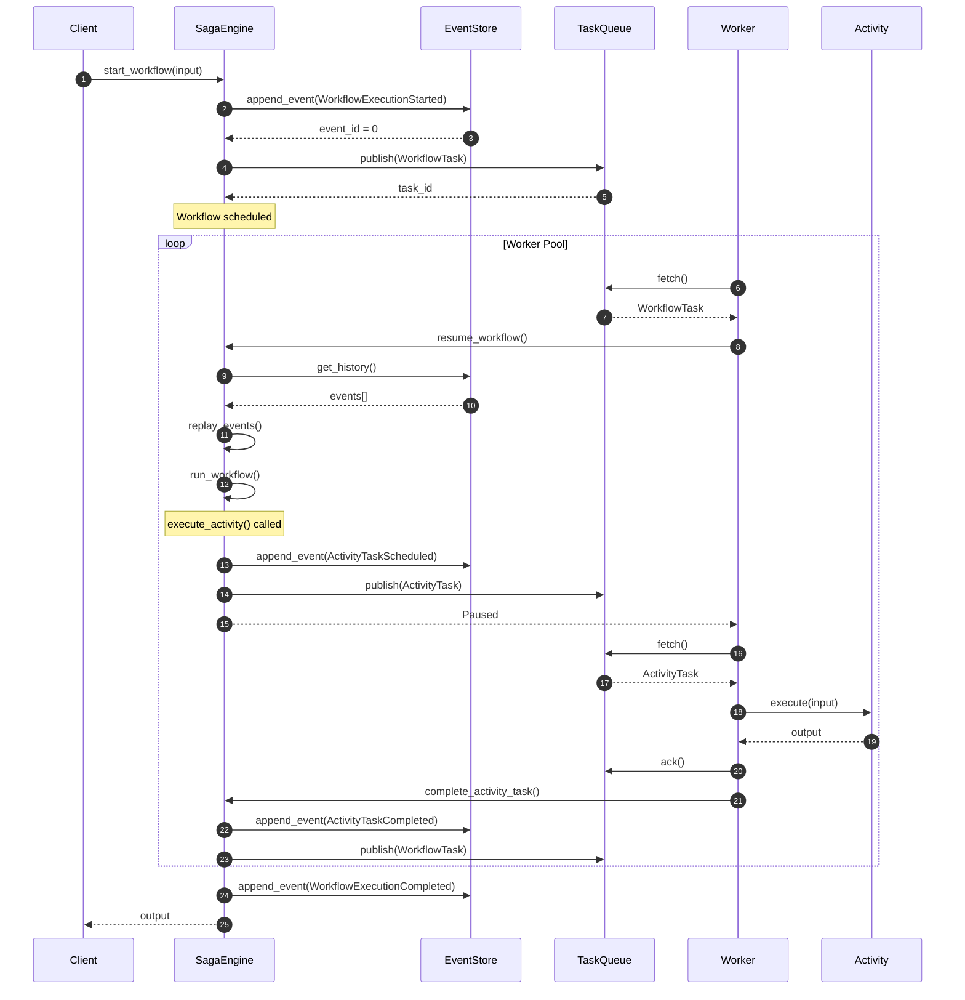

### 4.2 Step by Step

| Step | Description | What Happens |
|------|-------------|--------------|
| 1 | **Start Workflow** | Client sends input to engine |
| 2 | **Record Initial Event** | `WorkflowExecutionStarted` is persisted |
| 3 | **Publish Task** | Task goes to NATS queue |
| 4 | **Worker Fetches** | A worker picks up the task |
| 5 | **Replay** | State is reconstructed from events |
| 6 | **Execute Workflow** | Workflow logic runs |
| 7 | **Schedule Activity** | An activity is scheduled |
| 8 | **Worker Processes** | Activity executes |
| 9 | **Activity Completed** | Result is recorded |
| 10 | **Workflow Continues** | Workflow resumes |
| 11 | **Workflow Complete** | Final event is recorded |

### 4.3 Durability Guaranteed

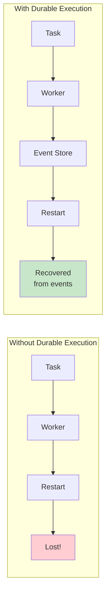

---

## 5. Event Model

### 5.1 Event Taxonomy

```mermaid
graph TD
    HE[HistoryEvent<br/>SAGA History] --> ET[EventType<br/>Event Type]
    HE --> EC[EventCategory<br/>Category]
    HE --> ATTR[Attributes<br/>JSON Payload]
    
    ET --> WE[Workflow Events<br/>7 types]
    ET --> AE[Activity Events<br/>6 types]
    ET --> TE[Timer Events<br/>3 types]
    ET --> SE[Signal Events<br/>1 type]
    ET --> ME[Marker Events<br/>1 type]
    ET --> SNE[Snapshot Events<br/>1 type]
    ET --> CE[Command Events<br/>3 types]
    ET --> CWE[Child Workflow Events<br/>9 types]
    ET --> LAE[Local Activity Events<br/>6 types]
    ET --> SEE[Side Effect Events<br/>1 type]
    ET --> UE[Update Events<br/>5 types]
    ET --> SAE[Search Attribute Events<br/>1 type]
    ET --> NE[Nexus Events<br/>7 types]
    
    EC --> WC[Workflow]
    EC --> AC[Activity]
    EC --> TC[Timer]
    EC --> SC[Signal]
    EC --> MC[Marker]
    EC --> SnC[Snapshot]
    EC --> CC[Command]
    EC --> CwC[ChildWorkflow]
    EC --> LAC[LocalActivity]
    EC --> SeC[SideEffect]
    EC --> UC[Update]
    EC --> SaC[SearchAttribute]
    EC --> NC[Nexus]
    
    style HE fill:#fff9c4
    style ET fill:#c8e6c9
    style EC fill:#bbdefb
```

### 5.2 Category Details

| Category | Main Events | Purpose |
|----------|-------------|---------|
| **Workflow** | Started, Completed, Failed, TimedOut, Canceled | Workflow lifecycle |
| **Activity** | Scheduled, Started, Completed, Failed, TimedOut, Canceled | Activity execution |
| **Timer** | Created, Fired, Canceled | Timers |
| **Signal** | SignalReceived | External signals |
| **Marker** | MarkerRecorded | Special marks |
| **Snapshot** | SnapshotCreated | State snapshots |

### 5.3 JSON Event Example

```json
{
  "event_id": 15,
  "saga_id": "saga-123e4567-e89b-12d3-a456-426614174000",
  "event_type": "ActivityTaskCompleted",
  "category": "Activity",
  "timestamp": "2024-01-15T10:30:00.000Z",
  "attributes": {
    "activity_type": "ProcessPayment",
    "input": { "order_id": "order-456", "amount": 99.99 },
    "output": { "transaction_id": "txn-abc123" }
  },
  "event_version": 1,
  "is_reset_point": false,
  "is_retry": false,
  "trace_id": "span-abc123def456"
}
```

---

## 6. Compensation (Rollback) Pattern

### 6.1 Normal vs. Compensation Flow

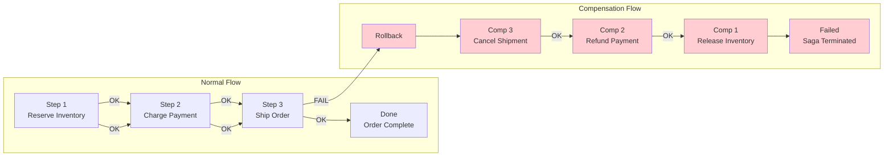

### 6.2 Compensation Order (LIFO)

```mermaid
flowchart TD
    A[Execution order] --> B[1. Reserve Inventory]
    B --> C[2. Charge Payment]
    C --> D[3. Ship Order]
    D -->|FAILS| E[Fault detected]
    
    E --> F[Compensation order]
    F --> G[1. Cancel Shipment<br/>(compensation of step 3)]
    G --> H[2. Refund Payment<br/>(compensation of step 2)]
    H --> I[3. Release Inventory<br/>(compensation of step 1)]
    
    style E fill:#ffcdd2
    style F fill:#ffecb3
    style G fill:#ffcdd2
    style H fill:#ffcdd2
    style I fill:#ffcdd2
```

**Important**: Compensations execute in **reverse order** (LIFO - Last In, First Out).

### 6.3 Compensation Data Model

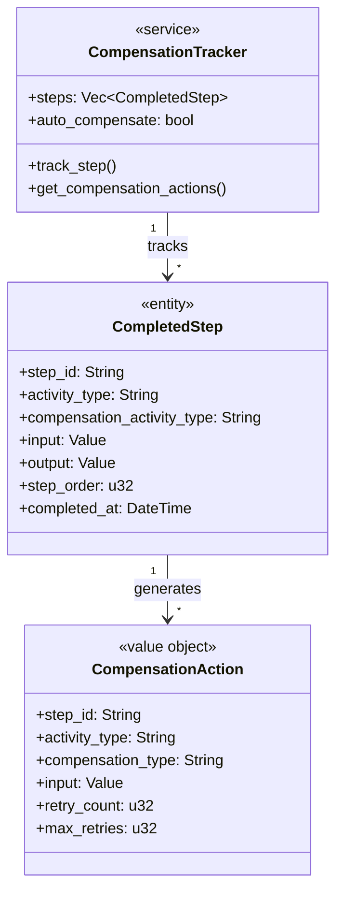

---

## 7. Workflow State Diagram

### 7.1 State Machine

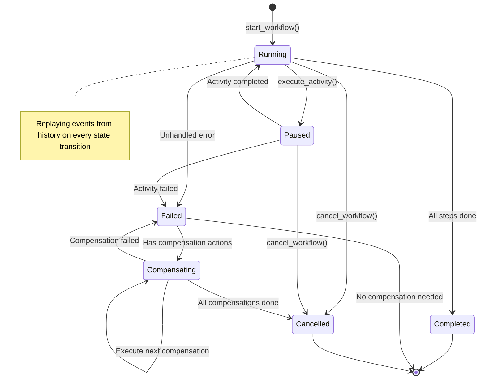

### 7.2 State Transitions

| From | To | Trigger |
|------|-----|---------|
| Initial | Running | `start_workflow()` |
| Running | Paused | `execute_activity()` |
| Running | Completed | All steps done |
| Running | Failed | Unhandled error |
| Running | Cancelled | `cancel_workflow()` |
| Paused | Running | Activity completed |
| Paused | Failed | Activity failed |
| Failed | Compensating | Has compensations |
| Failed | Terminal | No compensations |
| Compensating | Cancelled | All done |
| Compensating | Failed | Compensation failed |

### 7.3 Replay on Every Transition

```mermaid
flowchart TD
    A[Current state] --> B[New transition]
    B --> C[get_history() from DB]
    C --> D[Reconstruct state]
    D --> E[Apply transition]
    E --> F[New state]
    
    style C fill:#bbdefb
    style D fill:#c8e6c9
```

---

## 8. Concurrency: Optimistic Locking

### 8.1 How It Works

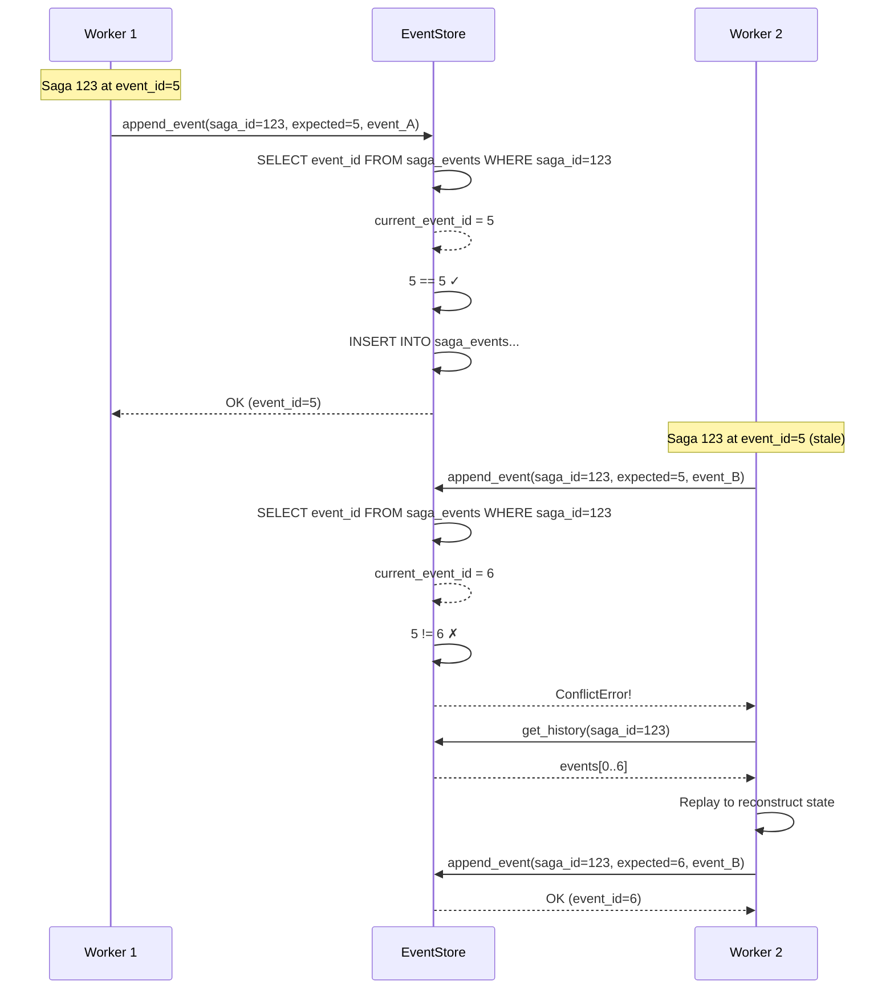

### 8.2 Why Optimistic Over Pessimistic

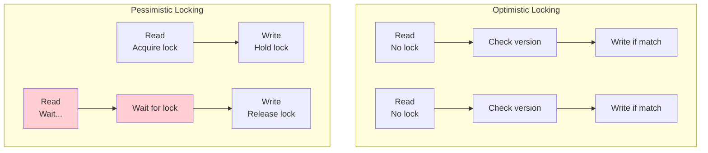

| Aspect | Optimistic | Pessimistic |
|--------|------------|-------------|
| **Throughput** | High | Low (contention) |
| **Complexity** | Handle conflicts | Simpler code |
| **When to use** | Low contention | High contention |
| **Saga Engine** | ✅ Chosen | ❌ |

---

## 9. Snapshot Strategy

### 9.1 The Full Replay Problem

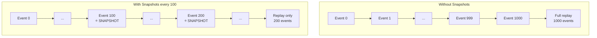

### 9.2 Snapshot Flow

```mermaid
flowchart TB
    subgraph "State Reconstruction"
        A[Start replay] --> B{Snapshot exists?}
        B -->|Yes| C[Get snapshot<br/>last_event_id=50]
        B -->|No| D[Empty initial state]
        
        C --> E[get_history_from(event_id=50)]
        D --> F[get_history()]
        
        E --> G[Events 51..100]
        F --> H[Events 0..100]
        
        G --> I[replayer.replay(snapshot, events)]
        H --> I
        
        I --> J[Reconstructed state<br/>at event 100]
    end
    
    subgraph "Snapshot Creation"
        K[New event appended] --> L[Counter++]
        L --> M{Counter >= interval?}
        M -->|Yes| N[Create snapshot]
        M -->|No| O[Continue]
        N --> P[Save to EventStore]
        P --> Q[Reset counter]
    end
    
    style C fill:#c8e6c9
    style N fill:#bbdefb
```

### 9.3 Snapshot Configuration

```rust
pub struct SnapshotConfig {
    /// Events between snapshots (default: 100)
    pub interval: u64,
    
    /// Maximum snapshots per saga (default: 5)
    pub max_snapshots: u32,
    
    /// Enable SHA-256 checksums (default: true)
    pub enable_checksum: bool,
}
```

---

## 10. Timer Architecture

### 10.1 Timer System Components

```mermaid
flowchart TD
    subgraph "Timer Scheduler"
        TS[Timer Scheduler<br/>Polling Loop]
    end
    
    subgraph "Timer Store"
        TS --> TSQ[Timer Store Query<br/>SELECT WHERE fire_at <= NOW()]
        TSQ --> CLAIM[claim_timers()<br/>UPDATE status = Processing]
        CLAIM --> TIMERS[Expired Timers List]
    end
    
    subgraph "Event Processing"
        TIMERS --> LOOP[For each timer]
        LOOP --> E1[append_event(TimerFired)]
        E1 --> E2[SignalDispatcher.notify()]
        E2 --> E3[Workflow resumes]
    end
    
    subgraph "Timer Types"
        TT1[WorkflowTimeout<br/>SAGA level]
        TT2[ActivityTimeout<br/>ACTIVITY level]
        TT3[Sleep<br/>User delay]
        TT4[RetryBackoff<br/>Exponential backoff]
        TT5[Scheduled<br/>Cron-style]
    end
    
    TT1 --> TS
    TT2 --> TS
    TT3 --> TS
    TT4 --> TS
    TT5 --> TS
```

### 10.2 Timer Types

| Type | Description | Use Case |
|------|-------------|----------|
| **WorkflowTimeout** | Saga-level timeout | Cancel abandoned sagas |
| **ActivityTimeout** | Per-activity timeout | Fail-fast on slow activities |
| **Sleep** | User-defined delay | Wait before continuing |
| **RetryBackoff** | Exponential backoff | Retry with delay |
| **Scheduled** | Cron-style | Scheduled jobs |

### 10.3 Timer Flow

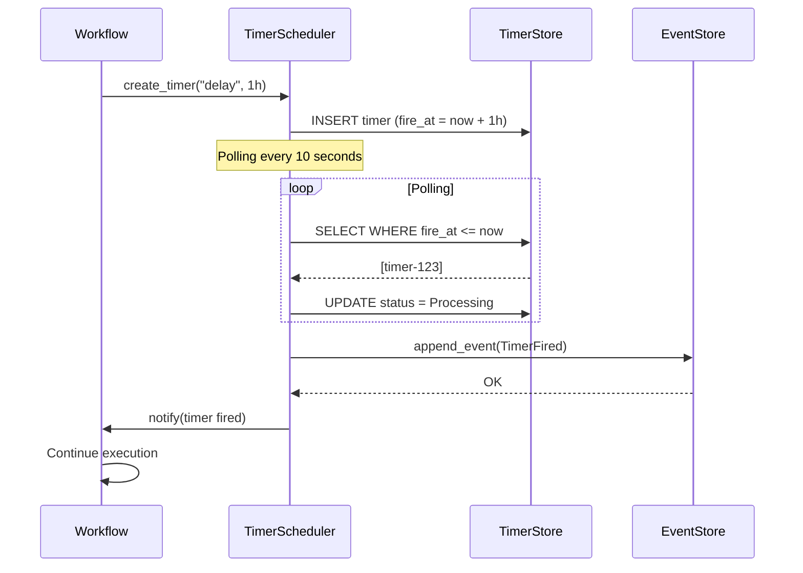

---

## 11. Task Queue with NATS JetStream

### 11.1 Queue Architecture

```mermaid
flowchart TB
    subgraph "Publish Path"
        P[Publisher] --> EN[Encode Task<br/>JSON/Bincode]
        EN --> PUB[Publish to Subject<br/>saga.tasks.workflow-id]
        PUB --> JS[NATS JetStream]
        JS --> STREAM[Stream: SAGA_TASKS]
    end
    
    subgraph "Consumer Path"
        WORKER[Worker] --> FETCH[pull().max_messages(N)]
        FETCH --> SUB[Subscribe Consumer<br/>Durable: saga-workers]
        SUB --> JS
        JS --> MSGS[Batch Messages]
        MSGS --> WORKER
        WORKER --> ACK[ack() or nak(delay)]
        ACK --> JS
    end
    
    subgraph "Message Lifecycle"
        NEW[New Message] --> PROCESS[Processing]
        PROCESS --> ACKED[Acked<br/>Removed from queue]
        PROCESS --> NAKED[Nak'd<br/>Redeliver after delay]
        PROCESS --> TERM[Terminated<br/>To DLQ]
    end
    
    style STREAM fill:#bbdefb
    style SUB fill:#c8e6c9
```

### 11.2 NATS JetStream Concepts

| Concept | Description |
|---------|-------------|
| **Stream** | Message persistence (like a Kafka topic) |
| **Consumer** | Subscription with state (tracked offset) |
| **Durable Consumer** | Consumer that persists its position |
| **Ack/NAK** | Confirm or reject message |
| **Pull Consumer** | Worker explicitly requests messages |

### 11.3 Delivery Guarantees

```mermaid
flowchart LR
    subgraph "At-Least-Once Delivery"
        A[Publisher] -->|1| N[NATS]
        N -->|2| W1[Worker 1]
        N -->|3| W2[Worker 2]
        W1 -->|4| ACK[NATS]
        W2 -->|5| NAK[NATS]
        ACK -->|6| Remove
        NAK -->|7| Redeliver to W2
    end
```

---

## 12. Activity Registry

### 12.1 Registry Class Diagram

```mermaid
classDiagram
    class ActivityRegistry {
        <<service>>
        +activities: DashMap~String, Arc~dyn DynActivity~~
        +default_timeout: Duration
        +register_activity~A~()
        +has_activity~str~ bool
        +get_activity~str~ Option~Arc~dyn DynActivity~~
    }
    
    class ActivityTypeId {
        <<value object>>
        +String id
        +new~String~ ActivityTypeId
    }
    
    class DynActivity {
        <<interface>>
        +execute_dyn~Value~ Result~Value, ActivityError~
    }
    
    class Activity~T~ {
        <<interface>>
        +TYPE_ID: &'static str
        +Input
        +Output
        +Error
        +execute~Input~ Result~Output, Error~
    }
    
    class PaymentActivity {
        +TYPE_ID: "process-payment"
    }
    
    class InventoryActivity {
        +TYPE_ID: "reserve-inventory"
    }
    
    ActivityRegistry --> ActivityTypeId
    ActivityRegistry --> DynActivity
    DynActivity <|.. Activity~T~
    Activity~T~ <|-- PaymentActivity
    Activity~T~ <|-- InventoryActivity
```

### 12.2 Activity Registration

```rust
// ⭐ Register an activity
registry.register_activity(PaymentActivity);
registry.register_activity(ReserveInventoryActivity);
registry.register_activity(ShipOrderActivity);

// ⭐ Use the activity
let activity = registry.get_activity("process-payment");
let result = activity.execute(input).await;
```

---

## 13. Error Hierarchy

### 13.1 Error Structure

```mermaid
graph TD
    E[Error<br/>Central Error Type] --> EK[ErrorKind<br/>Enum ~17 variants~]
    E --> EM[message: String]
    E --> EC[context: HashMap~String, String~]
    E --> ES[source: Option~Box~Error~~]
    E --> ET[timestamp: SystemTime]
    
    EK --> EK1[EventStore]
    EK --> EK2[Codec]
    EK --> EK3[WorkflowExecution]
    EK --> EK4[StepExecution]
    EK --> EK5[ActivityExecution]
    EK --> EK6[TimerStore]
    EK --> EK7[SignalDispatcher]
    EK --> EK8[TaskQueue]
    EK --> EK9[Snapshot]
    EK --> EK10[Replay]
    EK --> EK11[Configuration]
    EK --> EK12[Validation]
    EK --> EK13[Timeout]
    EK --> EK14[Cancelled]
    EK --> EK15[Concurrency]
    EK --> EK16[Compensation]
    EK --> EK17[Unknown]
    
    style E fill:#fff9c4
    style EK fill:#c8e6c9
```

### 13.2 Error Types and Causes

| Error Kind | Typical Cause | Strategy |
|------------|---------------|----------|
| **EventStore** | DB temporarily unavailable | Retry with backoff |
| **WorkflowExecution** | Bug in workflow logic | Fix code |
| **ActivityExecution** | Bug in activity or external service | Fix or retry |
| **Timeout** | Activity too slow | Increase timeout |
| **Concurrency** | Two workers same saga | Automatic replay |
| **Compensation** | Compensation failed | Manual intervention |
| **Validation** | Invalid input | Validate before |

---

## 14. Codec Comparison

### 14.1 Serialization Performance

```mermaid
graph LR
    subgraph "Encode Performance"
        E1[JSON] -->|~1MB/s| E2[Bincode]
        E2 -->|~10MB/s| E3[Postcard]
    end
    
    subgraph "Decode Performance"
        D1[JSON] -->|~1MB/s| D2[Bincode]
        D2 -->|~10MB/s| D3[Postcard]
    end
    
    subgraph "Size"
        S1[JSON<br/>~2x original] --> S2[Bincode<br/>~1x original]
        S2 --> S3[Postcard<br/>~0.9x original]
    end
    
    subgraph "Human Readable"
        H1[JSON ✓] --> H2[Bincode ✗]
        H2 --> H3[Postcard ✗]
    end
    
    style E3 fill:#c8e6c9
    style D3 fill:#c8e6c9
    style S3 fill:#c8e6c9
```

### 14.2 Recommendations

| Scenario | Recommended Codec | Reason |
|----------|-------------------|--------|
| Development | JSON | Readable, easy debugging |
| Production | Bincode | Performance/size balance |
| High throughput | Postcard | Maximum speed |
| Limited storage | Postcard | Smallest size |

---

## 15. Watchdog System

### 15.1 Watchdog Architecture

```mermaid
flowchart TB
    subgraph "Watchdog Components"
        WD[Watchdog<br/>Orchestrator]
    end
    
    subgraph "Detection"
        SD[Stall Detector<br/>No progress > timeout]
        DD[Deadlock Detector<br/>Circular wait detected]
        HD[Health Detector<br/>Component unhealthy]
        CD[Capacity Detector<br/>Queue backlog]
    end
    
    subgraph "Actions"
        FA[Force Activity Timeout]
        FC[Force Cancellation]
        FR[Force Restart]
        AA[Alert + Auto-recovery]
    end
    
    subgraph "Health Checks"
        HC1[EventStore Ping]
        HC2[TaskQueue Connected]
        HC3[TimerStore Responsive]
    end
    
    SD --> WD
    DD --> WD
    HD --> WD
    CD --> WD
    
    WD --> FA
    WD --> FC
    WD --> FR
    WD --> AA
    
    FA --> HC1
    FC --> HC1
    FR --> HC1
    AA --> HC1
    
    style WD fill:#fff9c4
```

### 15.2 Detectors and Responses

| Detector | What It Detects | Response |
|----------|-----------------|----------|
| **Stall Detector** | Saga no progress for time | Alert + force timeout |
| **Deadlock Detector** | Circular waits | Terminate + compensate |
| **Health Detector** | Component unresponsive | Circuit breaker |
| **Capacity Detector** | Queue saturated | Scale workers |

---

## 16. How to Read and Create Mermaid Diagrams

### 16.1 Mermaid Quick Guide

```mermaid
flowchart TD
    A[Start] --> B{Decision?}
    B -->|Yes| C[Do something]
    B -->|No| D[Do other thing]
    C --> E[End]
    D --> E
```

**Basic syntax**:

| Type | Syntax | Description |
|------|--------|-------------|
| Node | `A[Name]` | Node with text |
| Arrow | `A --> B` | Connection |
| Decision | `B{?}` | Decision diamond |
| Subgraph | `subgraph X ... end` | Grouping |
| Style | `style A fill:#color` | Color |

### 16.2 Semantic Colors

| Color | Meaning | Usage |
|-------|---------|-------|
| **Green** | Success, happy path | Normal flow |
| **Red** | Error, failure | Failures, rollbacks |
| **Yellow** | Wait, pause | Intermediate states |
| **Blue** | Process, data | Processes, databases |
| **Orange** | Decision | Decision points |

### 16.3 Sequence Diagram Syntax

```mermaid
sequenceDiagram
    participant A as Actor
    participant S as System
    
    A->>S: Request
    S-->>A: Response
```

**Sequence syntax**:

| Element | Syntax |
|---------|--------|
| Participant | `participant X as Alias` |
| Sync message | `A->>B: message` |
| Async message | `A-->>B: message` |
| Note | `Note over A,B: text` |
| Loop | `loop Label ... end` |
| Alt | `alt Condition ... else ... end` |

---

## Appendix: Complete Architecture in One View

```mermaid
graph TB
    subgraph "Client Layer"
        API[REST/gRPC API]
        CLI[CLI]
    end
    
    subgraph "Application Layer"
        SE[SagaEngine]
    end
    
    subgraph "Domain Layer"
        WF[Workflows]
        AC[Activities]
        EV[Events]
        CP[Compensation]
    end
    
    subgraph "Ports Layer"
        ES[EventStore Port]
        TQ[TaskQueue Port]
        TS[TimerStore Port]
    end
    
    subgraph "Adapters Layer"
        PGE[Postgres Adapter]
        NAT[NATS Adapter]
        INM[InMemory Adapter]
    end
    
    API --> SE
    CLI --> SE
    SE --> WF
    SE --> AC
    WF --> EV
    AC --> EV
    WF --> CP
    
    WF --> ES
    AC --> TQ
    CP --> TS
    
    ES <--> PGE
    TQ <--> NAT
    TS <--> INM
```

---

*Document Version: 2.0.0*
*Format: Mermaid.js*
*Generated: 2026-01-28*
*Language: English*
