# Casos de Uso

**Versión**: 8.0  
**Última Actualización**: 2025-12-18

## Diagrama General de Casos de Uso


```mermaid
graph TB
    subgraph "Actores"
        USER[Usuario/Cliente]
        WORKER[Worker Agent]
        SCHEDULER[Smart Scheduler]
        ADMIN[Administrador]
        PROVIDER[Provider - Docker/K8s/Firecracker]
    end

    subgraph "Gestión de Jobs"
        UC1[Crear Job con CommandType]
        UC2[Encolar Job]
        UC3[Asignar Job a Worker]
        UC4[Ejecutar Comando Shell/Script]
        UC5[Streaming de Logs]
        UC6[Reportar Resultado]
        UC7[Cancelar Job]
        UC8[Reintentar Job Fallido]
    end

    subgraph "Gestión de Workers - PRD v6.0"
        UC9[Registrar Worker con OTP]
        UC10[Conectar WorkerStream]
        UC11[Recibir RunJobCommand]
        UC12[Enviar Heartbeat/Logs/Results]
        UC13[Desregistrar Worker]
    end

    subgraph "Provider Management"
        UC14[Crear Worker On-Demand]
        UC15[Generar OTP Token]
        UC16[Destruir Worker]
        UC17[Health Check Provider]
    end

    subgraph "Scheduling"
        UC18[Programar Job con Constraints]
        UC19[Provisioning On-Demand]
        UC20[Matching Job-Worker]
    end

    USER --> UC1
    USER --> UC7
    USER --> UC5
    
    SCHEDULER --> UC2
    SCHEDULER --> UC3
    SCHEDULER --> UC18
    SCHEDULER --> UC19
    SCHEDULER --> UC20
    
    WORKER --> UC9
    WORKER --> UC10
    WORKER --> UC11
    WORKER --> UC12
    WORKER --> UC4
    WORKER --> UC6
    WORKER --> UC13
    
    PROVIDER --> UC14
    PROVIDER --> UC15
    PROVIDER --> UC16
    PROVIDER --> UC17
    
    ADMIN --> UC17
```

## Nuevos Casos de Uso - Worker Agent v8.0

### Casos de Uso de Performance (T1.1-T1.10)

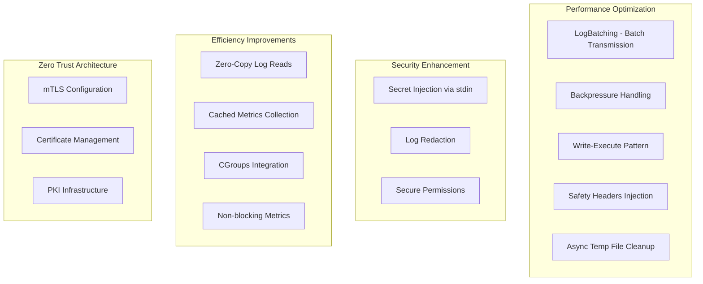
```mermaid
graph TB
    subgraph "Performance Optimization"
        UC21[LogBatching - Batch Transmission]
        UC22[Backpressure Handling]
        UC23[Write-Execute Pattern]
        UC24[Safety Headers Injection]
        UC25[Async Temp File Cleanup]
    end
    
    subgraph "Security Enhancement"
        UC26[Secret Injection via stdin]
        UC27[Log Redaction]
        UC28[Secure Permissions]
    end
    
    subgraph "Efficiency Improvements"
        UC29[Zero-Copy Log Reads]
        UC30[Cached Metrics Collection]
        UC31[CGroups Integration]
        UC32[Non-blocking Metrics]
    end
    
    subgraph "Zero Trust Architecture"
        UC33[mTLS Configuration]
        UC34[Certificate Management]
        UC35[PKI Infrastructure]
    end
```

---

## UC1: Crear y Encolar Job

**Actor Principal:** Usuario/Cliente

**Descripción:** El usuario crea un nuevo job especificando el comando a ejecutar y los recursos necesarios.

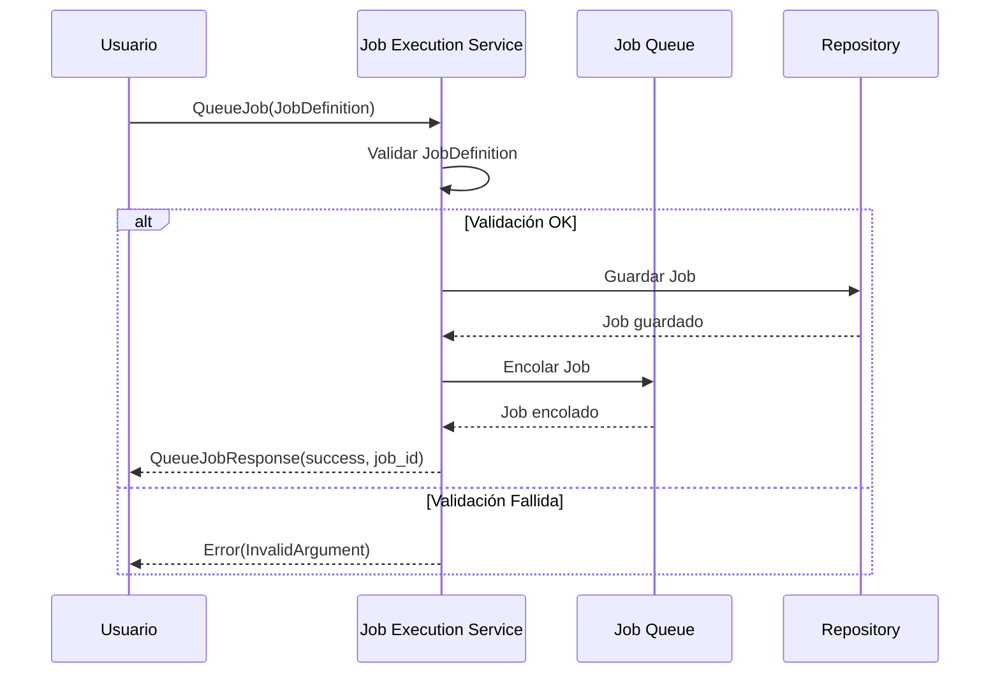
```mermaid
sequenceDiagram
    participant U as Usuario
    participant API as Job Execution Service
    participant Q as Job Queue
    participant DB as Repository

    U->>API: QueueJob(JobDefinition)
    API->>API: Validar JobDefinition
    
    alt Validación OK
        API->>DB: Guardar Job
        DB-->>API: Job guardado
        API->>Q: Encolar Job
        Q-->>API: Job encolado
        API-->>U: QueueJobResponse(success, job_id)
    else Validación Fallida
        API-->>U: Error(InvalidArgument)
    end
```

**Precondiciones:**
- El cliente está autenticado
- La definición del job es válida

**Postcondiciones:**
- El job está creado en estado `Pending`
- El job está en la cola de ejecución

**Flujo Principal:**
1. El usuario envía `QueueJobRequest` con `JobDefinition`
2. El sistema valida la definición
3. El sistema crea el job con estado `Pending`
4. El sistema encola el job
5. El sistema retorna el `job_id`

---

## UC2: Asignar Job a Worker

**Actor Principal:** Scheduler

**Descripción:** El scheduler asigna un job pendiente a un worker disponible.

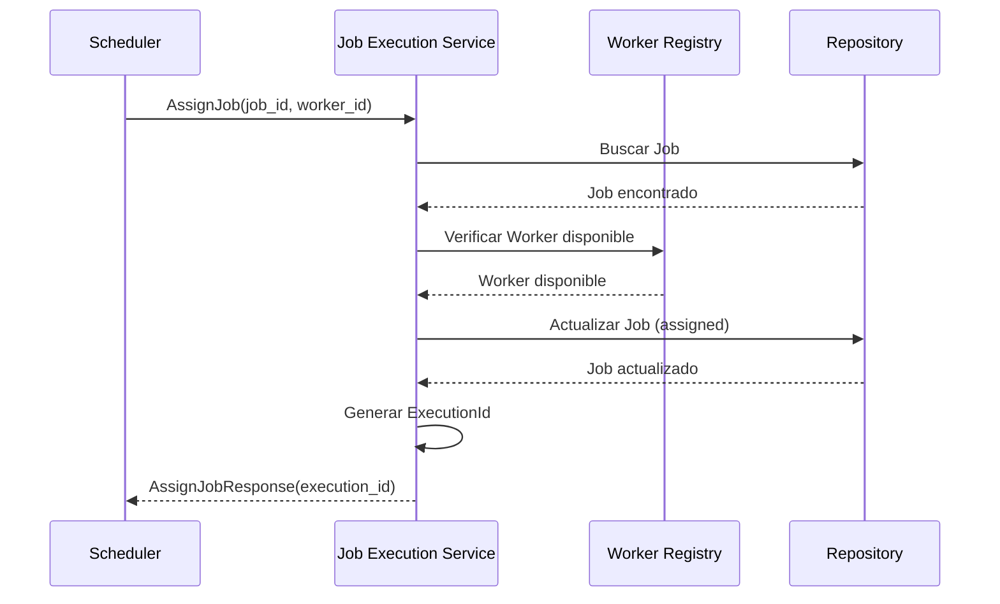
```mermaid
sequenceDiagram
    participant S as Scheduler
    participant API as Job Execution Service
    participant W as Worker Registry
    participant DB as Repository

    S->>API: AssignJob(job_id, worker_id)
    API->>DB: Buscar Job
    DB-->>API: Job encontrado
    
    API->>W: Verificar Worker disponible
    W-->>API: Worker disponible
    
    API->>DB: Actualizar Job (assigned)
    DB-->>API: Job actualizado
    
    API->>API: Generar ExecutionId
    API-->>S: AssignJobResponse(execution_id)
```

**Precondiciones:**
- El job existe y está en estado `Pending`
- El worker existe y está disponible

**Postcondiciones:**
- El job tiene asignado un `execution_id`
- El job está asociado al worker

---

## UC3: Ejecutar Job (Ciclo Completo)

**Actor Principal:** Worker

**Descripción:** Un worker ejecuta un job asignado desde inicio hasta finalización.

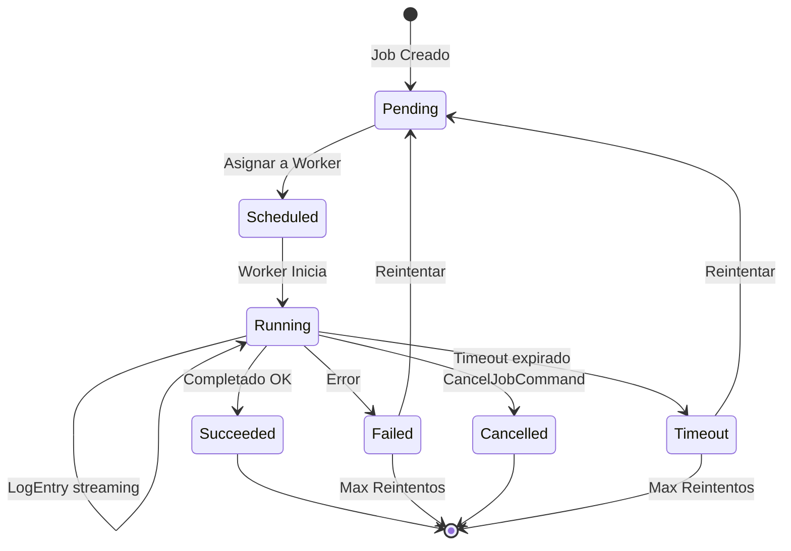
```mermaid
stateDiagram-v2
    [*] --> Pending: Job Creado
    Pending --> Scheduled: Asignar a Worker
    Scheduled --> Running: Worker Inicia
    Running --> Running: LogEntry streaming
    Running --> Succeeded: Completado OK
    Running --> Failed: Error
    Running --> Cancelled: CancelJobCommand
    Running --> Timeout: Timeout expirado
    
    Failed --> Pending: Reintentar
    Timeout --> Pending: Reintentar
    
    Succeeded --> [*]
    Failed --> [*]: Max Reintentos
    Cancelled --> [*]
    Timeout --> [*]: Max Reintentos
```

### Estados de Job (PRD v6.0)

| Estado | Descripción |
|--------|-------------|
| `Pending` | Job creado, en cola |
| `Scheduled` | Asignado a worker, esperando inicio |
| `Running` | Ejecutándose en worker |
| `Succeeded` | Completado exitosamente |
| `Failed` | Error durante ejecución |
| `Cancelled` | Cancelado por usuario |
| `Timeout` | Expiró por timeout |

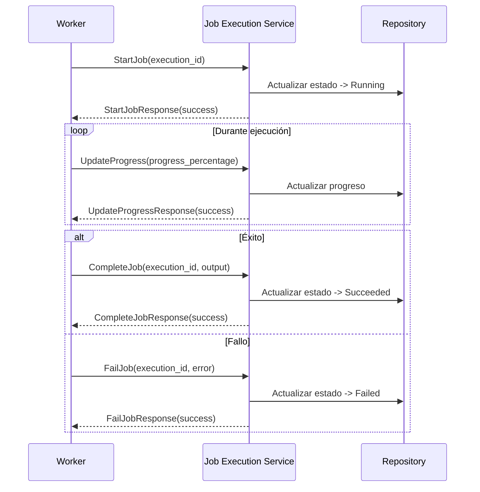
```mermaid
sequenceDiagram
    participant W as Worker
    participant API as Job Execution Service
    participant DB as Repository

    W->>API: StartJob(execution_id)
    API->>DB: Actualizar estado -> Running
    API-->>W: StartJobResponse(success)

    loop Durante ejecución
        W->>API: UpdateProgress(progress_percentage)
        API->>DB: Actualizar progreso
        API-->>W: UpdateProgressResponse(success)
    end

    alt Éxito
        W->>API: CompleteJob(execution_id, output)
        API->>DB: Actualizar estado -> Succeeded
        API-->>W: CompleteJobResponse(success)
    else Fallo
        W->>API: FailJob(execution_id, error)
        API->>DB: Actualizar estado -> Failed
        API-->>W: FailJobResponse(success)
    end
```

---

## UC4: Registrar Worker con OTP (PRD v6.0)

**Actor Principal:** Worker Agent

**Descripción:** Un worker se registra usando un token OTP generado por el servidor durante el provisioning.

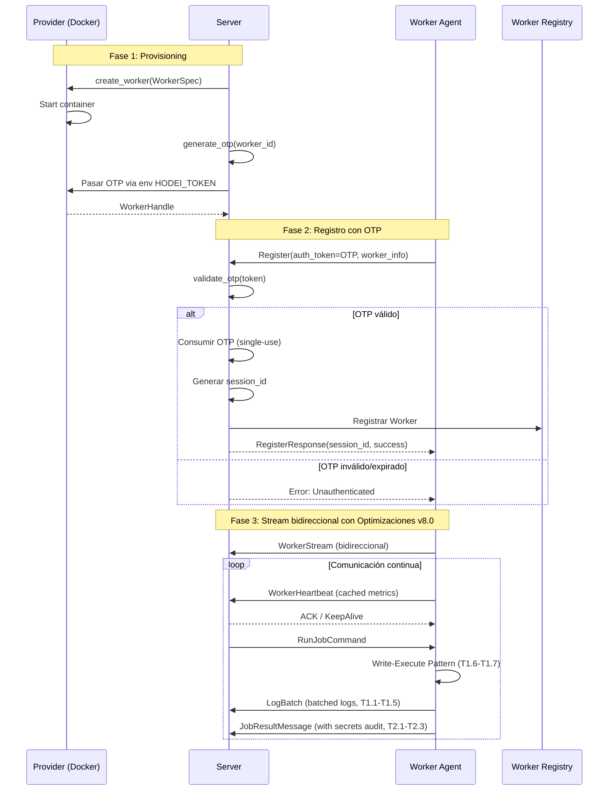
```mermaid
sequenceDiagram
    participant P as Provider (Docker)
    participant S as Server
    participant W as Worker Agent
    participant REG as Worker Registry

    Note over P,S: Fase 1: Provisioning
    S->>P: create_worker(WorkerSpec)
    P->>P: Start container
    S->>S: generate_otp(worker_id)
    S->>P: Pasar OTP via env HODEI_TOKEN
    P-->>S: WorkerHandle

    Note over S,W: Fase 2: Registro con OTP
    W->>S: Register(auth_token=OTP, worker_info)
    S->>S: validate_otp(token)
    alt OTP válido
        S->>S: Consumir OTP (single-use)
        S->>S: Generar session_id
        S->>REG: Registrar Worker
        S-->>W: RegisterResponse(session_id, success)
    else OTP inválido/expirado
        S-->>W: Error: Unauthenticated
    end

    Note over S,W: Fase 3: Stream bidireccional con Optimizaciones v8.0
    W->>S: WorkerStream (bidireccional)
    loop Comunicación continua
        W->>S: WorkerHeartbeat (cached metrics)
        S-->>W: ACK / KeepAlive
        S->>W: RunJobCommand
        W->>W: Write-Execute Pattern (T1.6-T1.7)
        W->>S: LogBatch (batched logs, T1.1-T1.5)
        W->>S: JobResultMessage (with secrets audit, T2.1-T2.3)
    end
```

**OTP Token:**
- Formato UUID v4
- Expiración: 5 minutos
- Single-use (se invalida tras registro)
- Generado por servidor, pasado via `HODEI_TOKEN`

**WorkerInfo incluye:**
- `worker_id`, `name`, `version`
- `hostname`, `ip_address`
- `capacity`: CPU, memoria, disco, GPU
- `capabilities`: ["docker", "shell"]
- `labels`, `taints`, `tolerations`

---

## UC5: Heartbeat de Worker

**Actor Principal:** Worker

**Descripción:** El worker envía periódicamente su estado al sistema.

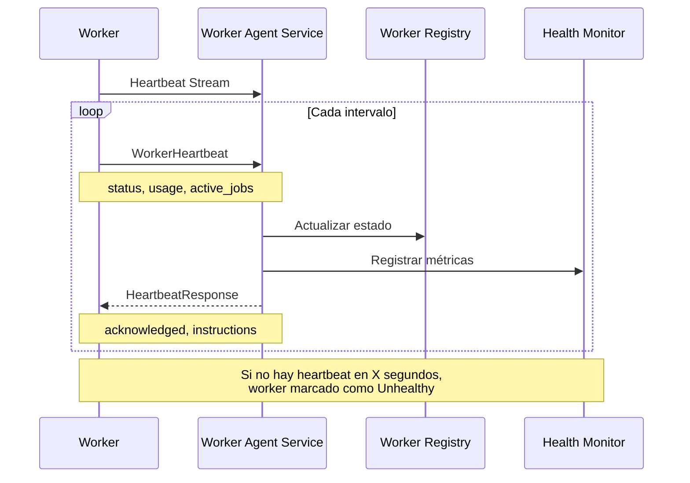
```mermaid
sequenceDiagram
    participant W as Worker
    participant API as Worker Agent Service
    participant REG as Worker Registry
    participant MON as Health Monitor

    W->>API: Heartbeat Stream
    
    loop Cada intervalo
        W->>API: WorkerHeartbeat
        Note over W,API: status, usage, active_jobs
        
        API->>REG: Actualizar estado
        API->>MON: Registrar métricas
        
        API-->>W: HeartbeatResponse
        Note over API,W: acknowledged, instructions
    end

    Note over W,MON: Si no hay heartbeat en X segundos,<br/>worker marcado como Unhealthy
```

---

## UC6: Programar Job con Scheduler

**Actor Principal:** Scheduler

**Descripción:** El scheduler decide el mejor worker para ejecutar un job.

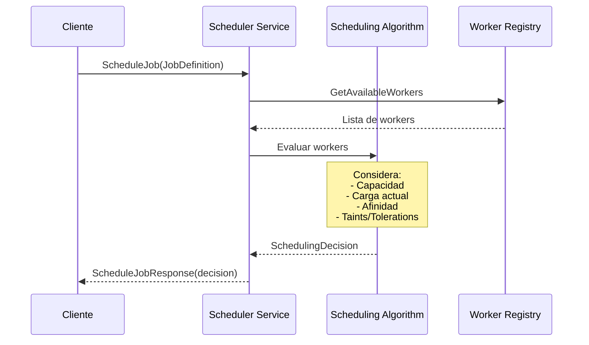
```mermaid
sequenceDiagram
    participant C as Cliente
    participant API as Scheduler Service
    participant ALG as Scheduling Algorithm
    participant W as Worker Registry

    C->>API: ScheduleJob(JobDefinition)
    API->>W: GetAvailableWorkers
    W-->>API: Lista de workers
    
    API->>ALG: Evaluar workers
    Note over ALG: Considera:<br/>- Capacidad<br/>- Carga actual<br/>- Afinidad<br/>- Taints/Tolerations
    
    ALG-->>API: SchedulingDecision
    API-->>C: ScheduleJobResponse(decision)
```

**Estrategias de Scheduling:**

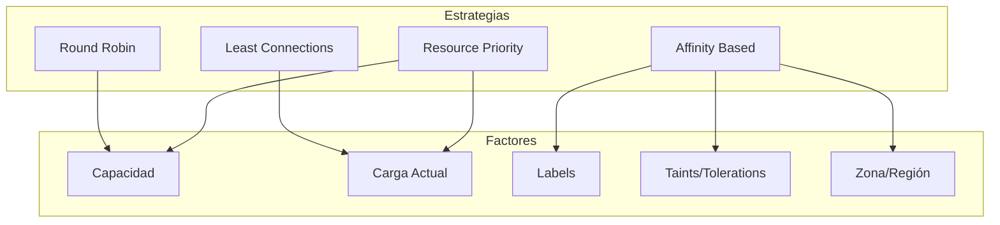
```mermaid
graph TB
    subgraph "Estrategias"
        RR[Round Robin]
        LC[Least Connections]
        RP[Resource Priority]
        AF[Affinity Based]
    end

    subgraph "Factores"
        CAP[Capacidad]
        LOAD[Carga Actual]
        LABEL[Labels]
        TAINT[Taints/Tolerations]
        ZONE[Zona/Región]
    end

    RR --> CAP
    LC --> LOAD
    RP --> CAP
    RP --> LOAD
    AF --> LABEL
    AF --> TAINT
    AF --> ZONE
```

---

## UC7: Cancelar Job

**Actor Principal:** Usuario

**Descripción:** El usuario cancela un job en ejecución o pendiente.

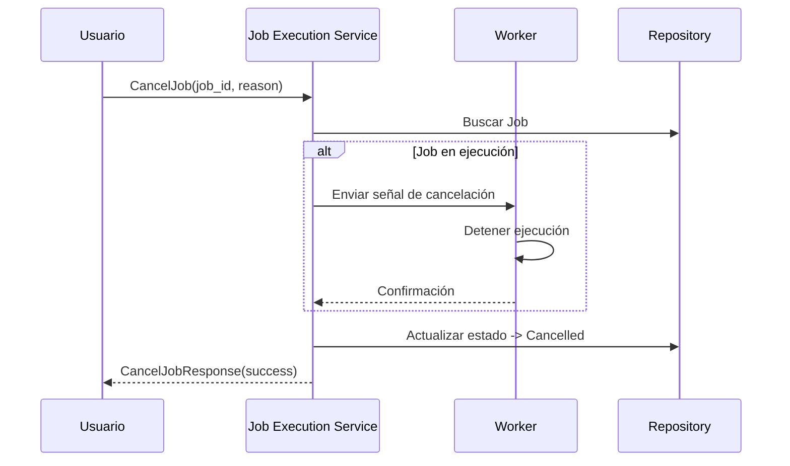
```mermaid
sequenceDiagram
    participant U as Usuario
    participant API as Job Execution Service
    participant W as Worker
    participant DB as Repository

    U->>API: CancelJob(job_id, reason)
    API->>DB: Buscar Job
    
    alt Job en ejecución
        API->>W: Enviar señal de cancelación
        W->>W: Detener ejecución
        W-->>API: Confirmación
    end
    
    API->>DB: Actualizar estado -> Cancelled
    API-->>U: CancelJobResponse(success)
```

---

## UC8: Monitorizar Métricas

**Actor Principal:** Administrador

**Descripción:** El administrador obtiene métricas del sistema en tiempo real.

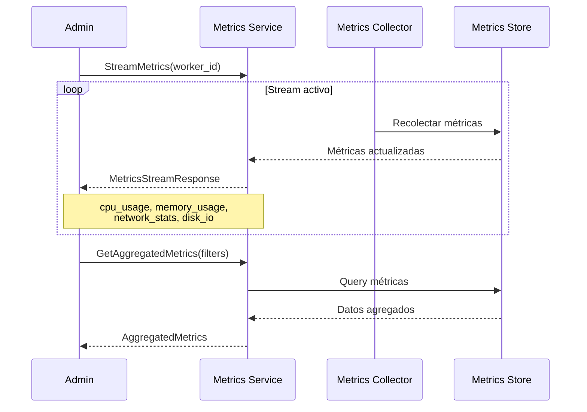
```mermaid
sequenceDiagram
    participant A as Admin
    participant API as Metrics Service
    participant COL as Metrics Collector
    participant STORE as Metrics Store

    A->>API: StreamMetrics(worker_id)
    
    loop Stream activo
        COL->>STORE: Recolectar métricas
        STORE-->>API: Métricas actualizadas
        API-->>A: MetricsStreamResponse
        Note over API,A: cpu_usage, memory_usage,<br/>network_stats, disk_io
    end

    A->>API: GetAggregatedMetrics(filters)
    API->>STORE: Query métricas
    STORE-->>API: Datos agregados
    API-->>A: AggregatedMetrics
```

---

## UC9: Reintentar Job Fallido

**Actor Principal:** Sistema/Usuario

**Descripción:** Un job fallido se reintenta automáticamente o manualmente.

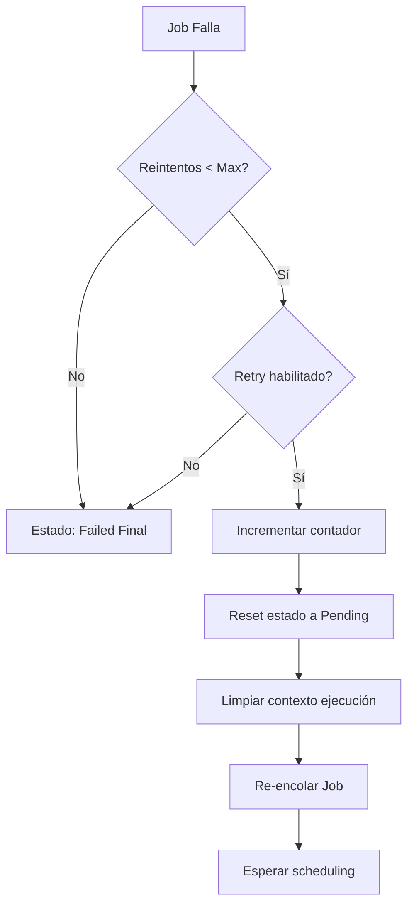
```mermaid
flowchart TD
    A[Job Falla] --> B{Reintentos < Max?}
    B -->|Sí| C{Retry habilitado?}
    B -->|No| D[Estado: Failed Final]
    C -->|Sí| E[Incrementar contador]
    C -->|No| D
    E --> F[Reset estado a Pending]
    F --> G[Limpiar contexto ejecución]
    G --> H[Re-encolar Job]
    H --> I[Esperar scheduling]
```

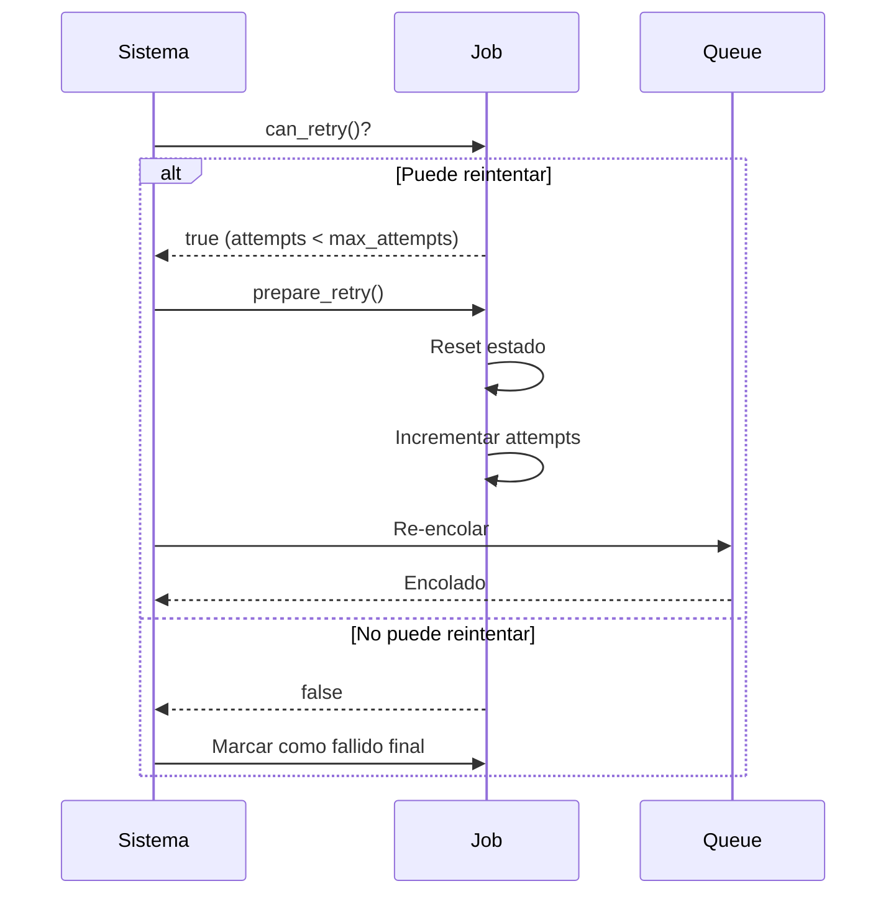
```mermaid
sequenceDiagram
    participant SYS as Sistema
    participant JOB as Job
    participant Q as Queue

    SYS->>JOB: can_retry()?
    
    alt Puede reintentar
        JOB-->>SYS: true (attempts < max_attempts)
        SYS->>JOB: prepare_retry()
        JOB->>JOB: Reset estado
        JOB->>JOB: Incrementar attempts
        SYS->>Q: Re-encolar
        Q-->>SYS: Encolado
    else No puede reintentar
        JOB-->>SYS: false
        SYS->>JOB: Marcar como fallido final
    end
```

---

## UC Nuevo: LogBatching para Optimización de Performance (T1.1-T1.5)

**Actor Principal:** Worker Agent

**Descripción:** El worker implementa batching de logs para reducir 90-99% la sobrecarga de red.

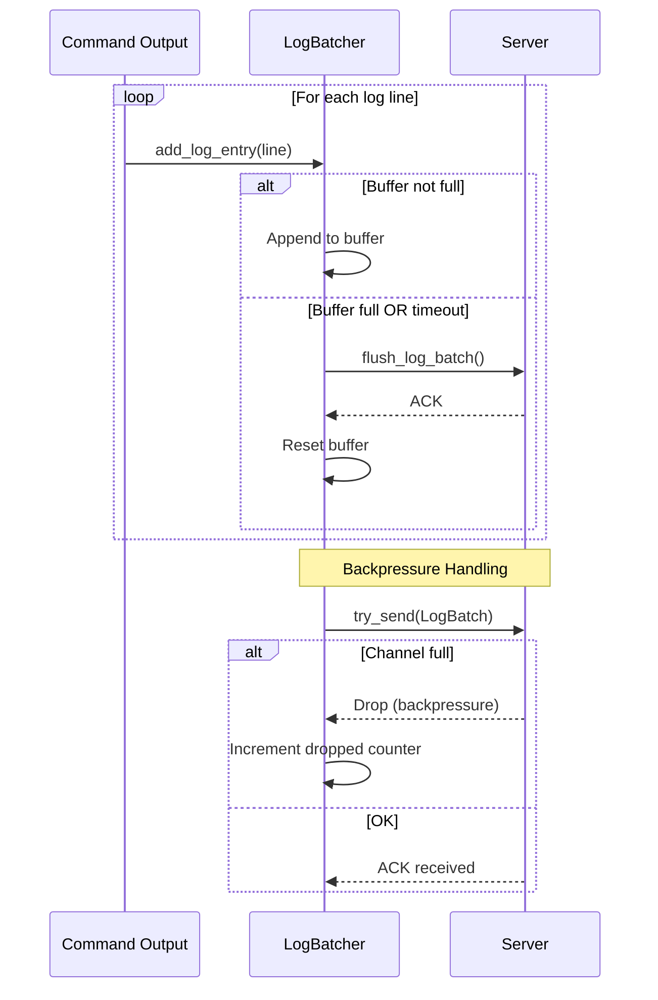
```mermaid
sequenceDiagram
    participant C as Command Output
    participant L as LogBatcher
    participant S as Server
    
    loop For each log line
        C->>L: add_log_entry(line)
        
        alt Buffer not full
            L->>L: Append to buffer
        else Buffer full OR timeout
            L->>S: flush_log_batch()
            S-->>L: ACK
            L->>L: Reset buffer
        end
    end
    
    Note over L,S: Backpressure Handling
    L->>S: try_send(LogBatch)
    alt Channel full
        S-->>L: Drop (backpressure)
        L->>L: Increment dropped counter
    else OK
        S-->>L: ACK received
    end
```

**Beneficios:**
- Reducción 90-99% en llamadas gRPC
- Backpressure handling con `try_send()`
- Flush automático por capacidad o tiempo
- Thread-safe con `Arc<Mutex<>>`

---

## UC Nuevo: Write-Execute Pattern para Scripts (T1.6-T1.7)

**Actor Principal:** Worker Agent

**Descripción:** Ejecución robusta de scripts usando patrón inspirado en Jenkins/K8s.

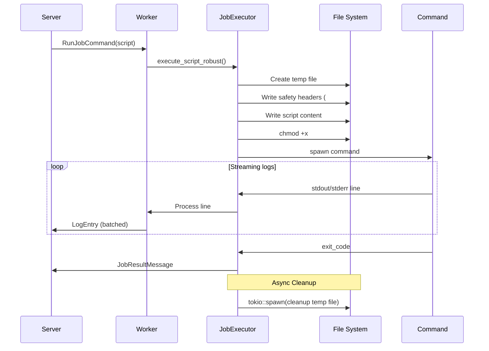
```mermaid
sequenceDiagram
    participant S as Server
    participant W as Worker
    participant E as JobExecutor
    participant FS as File System
    participant C as Command
    
    S->>W: RunJobCommand(script)
    W->>E: execute_script_robust()
    
    E->>FS: Create temp file
    E->>FS: Write safety headers (#!/bin/bash, set -euo pipefail)
    E->>FS: Write script content
    E->>FS: chmod +x
    
    E->>C: spawn command
    
    loop Streaming logs
        C->>E: stdout/stderr line
        E->>W: Process line
        W->>S: LogEntry (batched)
    end
    
    C->>E: exit_code
    E->>S: JobResultMessage
    
    Note over E,FS: Async Cleanup
    E->>FS: tokio::spawn(cleanup temp file)
```

**Características:**
- Safety headers automáticos
- Gestión segura de archivos temporales
- Cleanup asíncrono no bloqueante
- Robustez en ejecución

---

## UC Nuevo: Secret Injection via stdin (T2.1-T2.3)

**Actor Principal:** Worker Agent

**Descripción:** Inyección segura de secretos via stdin sin exposición en logs.

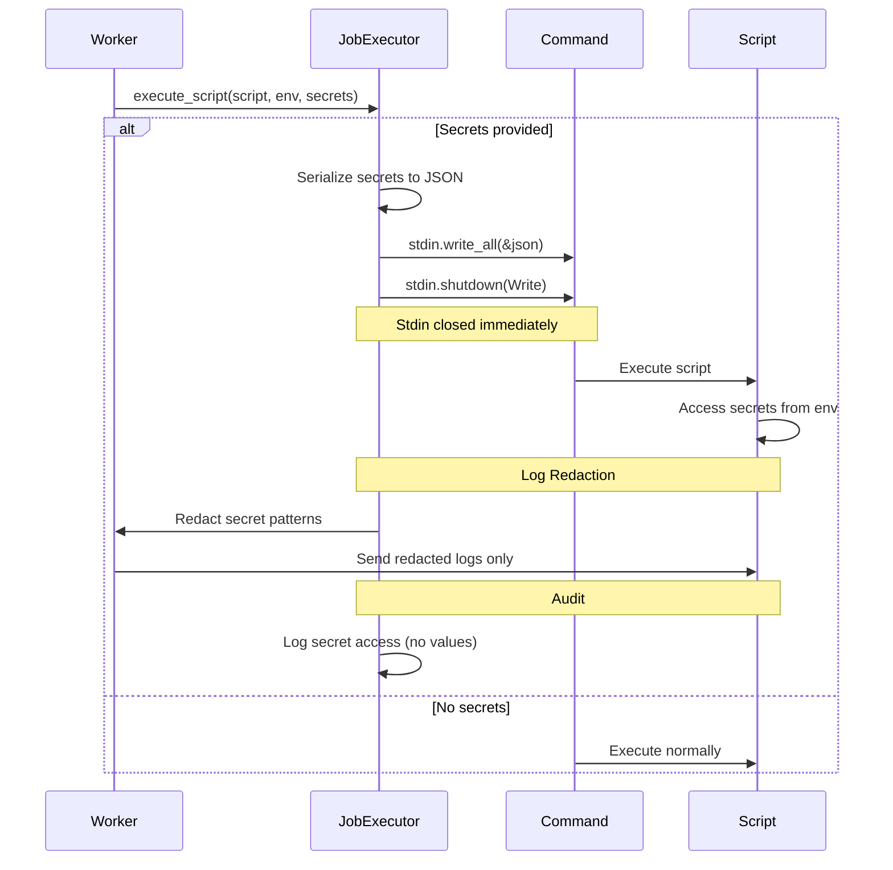
```mermaid
sequenceDiagram
    participant W as Worker
    participant E as JobExecutor
    participant C as Command
    participant S as Script
    
    W->>E: execute_script(script, env, secrets)
    
    alt Secrets provided
        E->>E: Serialize secrets to JSON
        E->>C: stdin.write_all(&json)
        E->>C: stdin.shutdown(Write)
        
        Note over E,C: Stdin closed immediately
        
        C->>S: Execute script
        S->>S: Access secrets from env
        
        Note over E,S: Log Redaction
        E->>W: Redact secret patterns
        W->>S: Send redacted logs only
        
        Note over E,S: Audit
        E->>E: Log secret access (no values)
    else No secrets
        C->>S: Execute normally
    end
```

**Seguridad:**
- Secrets via stdin (no disk)
- Redacción automática en logs
- Auditoría sin valores
- Cumplimiento compliance

---

## UC Nuevo: Zero-Copy I/O para Logs (T3.1-T3.2)

**Actor Principal:** Worker Agent

**Descripción:** Lectura zero-copy de logs usando FramedRead + BytesCodec.

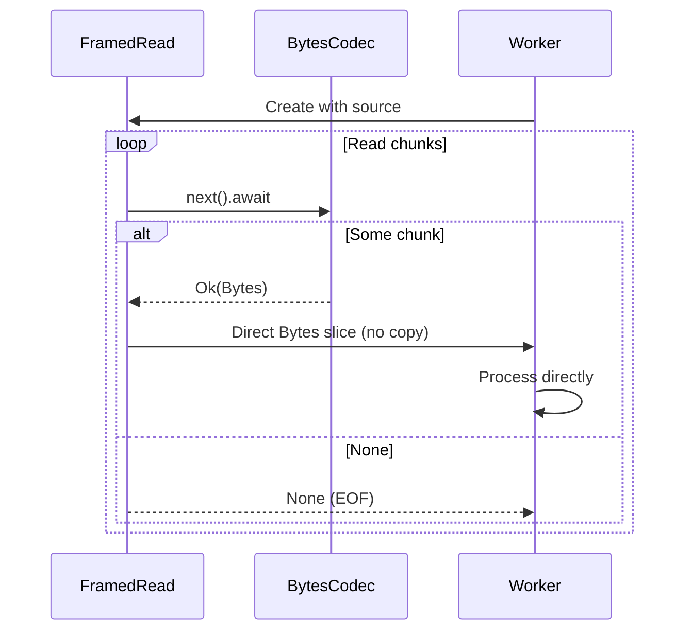
```mermaid
sequenceDiagram
    participant F as FramedRead
    participant B as BytesCodec
    participant W as Worker
    
    W->>F: Create with source
    
    loop Read chunks
        F->>B: next().await
        
        alt Some chunk
            B-->>F: Ok(Bytes)
            F->>W: Direct Bytes slice (no copy)
            W->>W: Process directly
        else None
            F-->>W: None (EOF)
        end
    end
```

**Beneficios:**
- Zero-copy de datos
- Bytes slice directo
- Sin allocaciones heap
- Mejor performance memoria

---

## UC Nuevo: Métricas Asíncronas con Cache TTL (T3.3-T3.5)

**Actor Principal:** Worker Agent

**Descripción:** Sistema de métricas con cache de 35s y tareas bloqueantes.

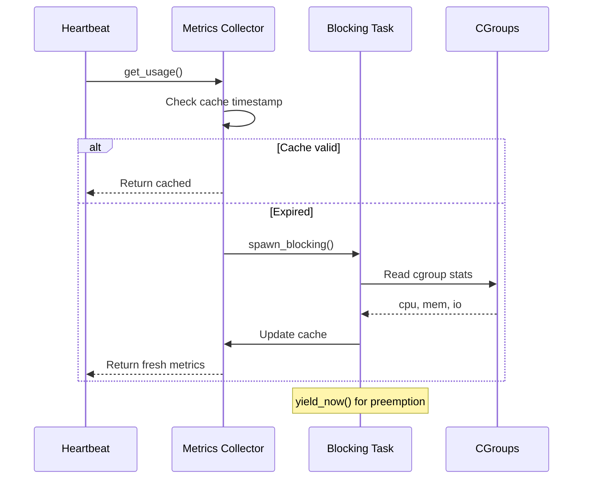
```mermaid
sequenceDiagram
    participant H as Heartbeat
    participant M as Metrics Collector
    participant T as Blocking Task
    participant C as CGroups
    
    H->>M: get_usage()
    M->>M: Check cache timestamp
    
    alt Cache valid
        M-->>H: Return cached
    else Expired
        M->>T: spawn_blocking()
        T->>C: Read cgroup stats
        C-->>T: cpu, mem, io
        T->>M: Update cache
        M-->>H: Return fresh metrics
    end
    
    Note over T: yield_now() for preemption
```

**Características:**
- Cache TTL 35 segundos
- spawn_blocking para I/O intensivo
- yield_now para preemption
- Integración cgroups

---

## UC Nuevo: mTLS Certificate Management (T4.1-T4.5)

**Actor Principal:** Worker Agent / System

**Descripción:** Infraestructura completa mTLS para Zero Trust security.

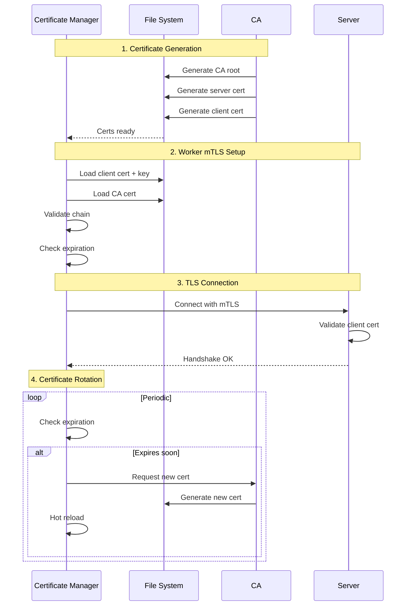
```mermaid
sequenceDiagram
    participant CM as Certificate Manager
    participant FS as File System
    participant CA as CA
    participant S as Server
    
    Note over CA,CM: 1. Certificate Generation
    CA->>FS: Generate CA root
    CA->>FS: Generate server cert
    CA->>FS: Generate client cert
    FS-->>CM: Certs ready
    
    Note over CM,S: 2. Worker mTLS Setup
    CM->>FS: Load client cert + key
    CM->>FS: Load CA cert
    CM->>CM: Validate chain
    CM->>CM: Check expiration
    
    Note over CM,S: 3. TLS Connection
    CM->>S: Connect with mTLS
    S->>S: Validate client cert
    S-->>CM: Handshake OK
    
    Note over CM,CM: 4. Certificate Rotation
    loop Periodic
        CM->>CM: Check expiration
        alt Expires soon
            CM->>CA: Request new cert
            CA->>FS: Generate new cert
            CM->>CM: Hot reload
        end
    end
```

**Infraestructura:**
- PKI completa con CA
- Certificados cliente/servidor
- Rotación automática
- Monitoreo expiración

---

## Matriz de Casos de Uso por Actor (PRD v8.0)

| Caso de Uso | Usuario | Worker Agent | Scheduler | Provider | Admin |
|-------------|---------|--------------|-----------|----------|-------|
| Crear Job con CommandType | ✅ | | | | |
| Encolar Job | ✅ | | ✅ | | |
| Asignar Job | | | ✅ | | |
| **Registrar con OTP** | | ✅ | | | |
| **Conectar WorkerStream** | | ✅ | | | |
| Recibir RunJobCommand | | ✅ | | | |
| Ejecutar Shell/Script | | ✅ | | | |
| Enviar LogEntry | | ✅ | | | |
| Enviar JobResult | | ✅ | | | |
| Enviar Heartbeat | | ✅ | | | |
| Cancelar Job | ✅ | | | | ✅ |
| Desregistrar Worker | | ✅ | | | ✅ |
| **Crear Worker On-Demand** | | | ✅ | ✅ | |
| **Generar OTP Token** | | | | ✅ | |
| Destruir Worker | | | ✅ | ✅ | |
| Health Check Provider | | | | ✅ | ✅ |
| Stream Logs | ✅ | | | | ✅ |
| Ver Métricas | | | | | ✅ |

### Casos de Uso Nuevos v8.0

| Caso de Uso v8.0 | Usuario | Worker Agent | Scheduler | Provider | Admin |
|------------------|---------|--------------|-----------|----------|-------|
| **LogBatching** | | ✅ | | | |
| **Backpressure Handling** | | ✅ | | | |
| **Write-Execute Pattern** | | ✅ | | | |
| **Safety Headers Injection** | | ✅ | | | |
| **Async Temp File Cleanup** | | ✅ | | | |
| **Secret Injection via stdin** | | ✅ | | | |
| **Log Redaction** | | ✅ | | | |
| **Secure Permissions** | | ✅ | | | |
| **Zero-Copy I/O** | | ✅ | | | |
| **Cached Metrics (35s TTL)** | | ✅ | | | |
| **CGroups Integration** | | ✅ | | | |
| **Non-blocking Metrics** | | ✅ | | | |
| **mTLS Configuration** | | ✅ | | | ✅ |
| **Certificate Management** | | ✅ | | | ✅ |
| **PKI Infrastructure** | | | | | ✅ |

---

## UC Nuevo: Ejecución de Job via Stream (PRD v8.0)

**Actor Principal:** Worker Agent

**Descripción:** El worker recibe un comando de ejecución via stream bidireccional y reporta logs y resultado.

```mermaid
sequenceDiagram
    participant S as Server
    participant W as Worker Agent
    participant E as JobExecutor

    Note over S,W: Worker conectado via WorkerStream
    
    S->>W: RunJobCommand(job_id, CommandSpec)
    W->>W: Parsear CommandSpec

    alt Shell Command
        W->>E: execute_shell(cmd, args)
    else Script Command
        W->>E: execute_script_robust(interpreter, content) [T1.6-T1.7]

        Note over E: Write-Execute Pattern
        E->>FS: Create temp file
        E->>FS: Write safety headers
        E->>FS: Write script
        E->>FS: chmod +x
        E->>C: Execute

        Note over E,C: Secret Injection (T2.1-T2.3)
        alt Secrets provided
            E->>C: stdin.write_all(JSON secrets)
            E->>C: stdin.shutdown()
        end
    end

    loop Durante ejecución
        E-->>W: stdout/stderr line
        W->>W: Redact secrets (T2.2)
        W->>L: Add to LogBatcher (T1.1-T1.5)
        L->>S: LogBatch (batched)
        S-->>W: ACK
    end

    alt Éxito
        E-->>W: exit_code = 0
        W->>S: JobResultMessage(success=true, exit_code=0)
    else Error
        E-->>W: exit_code != 0
        W->>S: JobResultMessage(success=false, error_message)
    end

    Note over E,FS: Async Cleanup
    E->>FS: tokio::spawn(remove temp file)

    S-->>W: ACK
```

**CommandSpec:**
```protobuf
message CommandSpec {
    oneof command_type {
        ShellCommand shell = 1;  // cmd + args
        ScriptCommand script = 2; // interpreter + content
    }
}
```

---

## UC10: Provisioning de Worker con Provider

**Actor Principal:** Scheduler / WorkerProvisioningService

**Descripción:** El sistema provisiona un nuevo worker usando uno de los providers disponibles (Docker, Kubernetes, Firecracker).

```mermaid
sequenceDiagram
    participant S as Scheduler
    participant PS as ProvisioningService
    participant PR as Provider Registry
    participant P as Provider (Docker/K8s/FC)
    participant W as Worker Agent

    S->>PS: provision_worker(requirements)
    PS->>PR: select_provider(requirements)
    PR-->>PS: best_provider
    
    PS->>PS: generate_otp(worker_id)
    PS->>P: create_worker(WorkerSpec)
    
    alt Docker
        P->>P: docker run with env vars
    else Kubernetes
        P->>P: create Pod with env vars
    else Firecracker
        P->>P: start microVM with boot args
    end
    
    P-->>PS: WorkerHandle
    PS-->>S: WorkerHandle + OTP
    
    Note over P,W: Worker boots and connects
    W->>S: Register(OTP)
```

### Selección de Provider

| Criterio | Docker | Kubernetes | Firecracker |
|----------|--------|------------|-------------|
| Startup rápido | ✅ ~1s | ⚠️ ~5-15s | ✅ ~125ms |
| GPU support | ✅ | ✅ | ❌ |
| Aislamiento | Container | Container | Hardware |
| Escalabilidad | Host | Cluster | Host |

### WorkerSpec

```rust
pub struct WorkerSpec {
    pub worker_id: WorkerId,
    pub image: String,           // Container image or rootfs
    pub server_address: String,  // Control plane address
    pub resources: ResourceRequirements,
    pub labels: HashMap<String, String>,
    pub environment: HashMap<String, String>,
}
```

---

## UC11: Health Check de Provider

**Actor Principal:** Sistema / Admin

**Descripción:** Verificar el estado de salud de un provider.

```mermaid
sequenceDiagram
    participant A as Admin/System
    participant P as Provider
    participant I as Infrastructure

    A->>P: health_check()
    
    alt Docker
        P->>I: docker info
    else Kubernetes
        P->>I: kubectl cluster-info
    else Firecracker
        P->>I: check /dev/kvm + binaries
    end
    
    I-->>P: status
    
    alt Healthy
        P-->>A: HealthStatus::Healthy
    else Degraded
        P-->>A: HealthStatus::Degraded { reason }
    else Unhealthy
        P-->>A: HealthStatus::Unhealthy { reason }
    end
```

### HealthStatus

```rust
pub enum HealthStatus {
    Healthy,
    Degraded { reason: String },
    Unhealthy { reason: String },
    Unknown,
}
```
