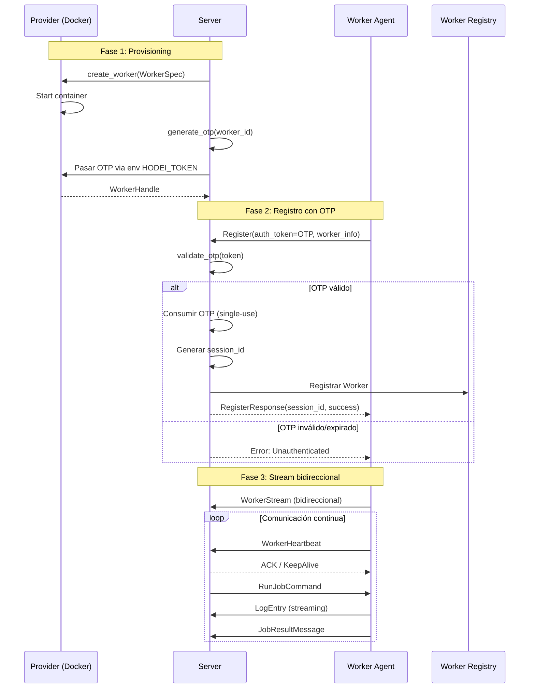
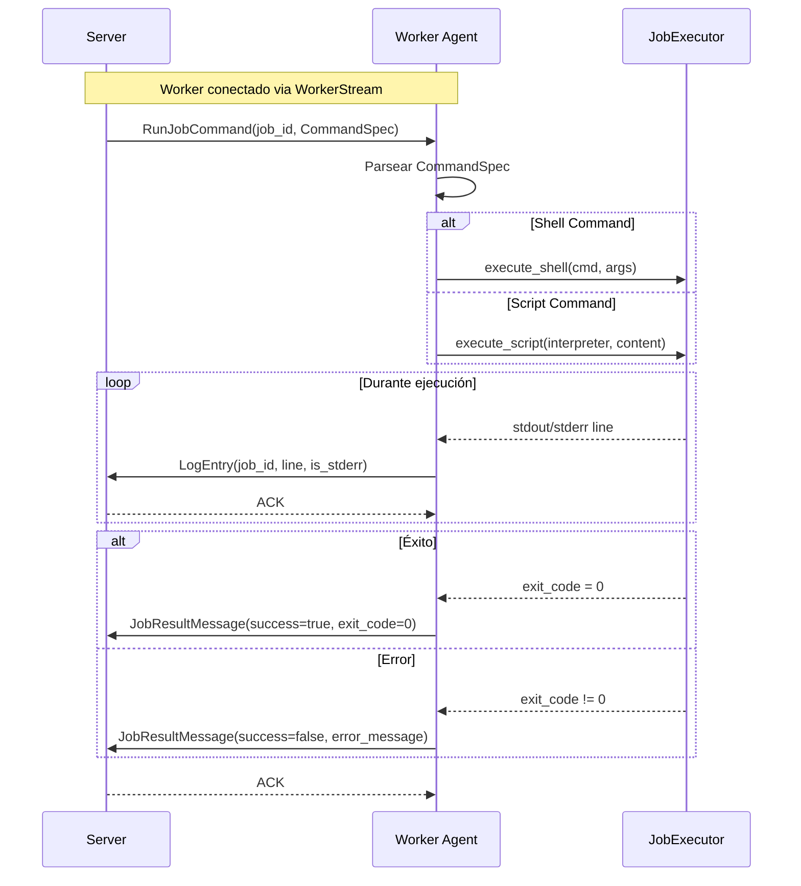
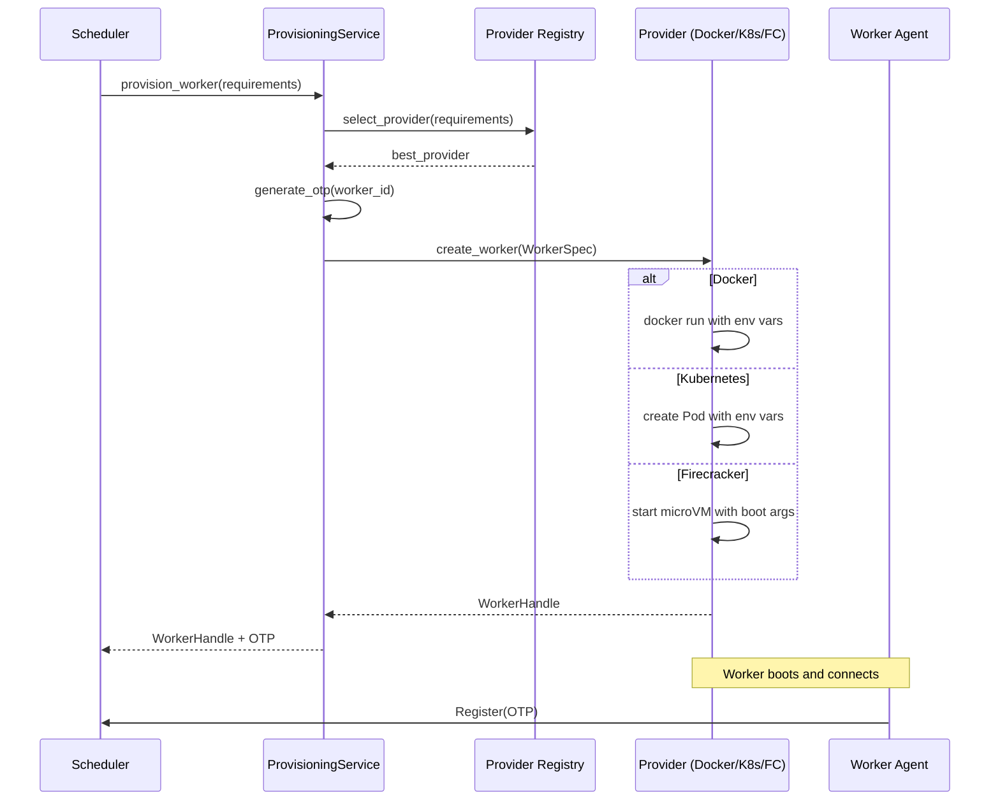
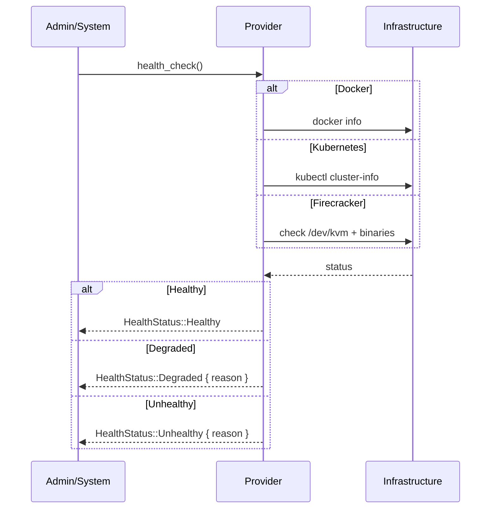

# Casos de Uso

**Versión**: 7.0  
**Última Actualización**: 2025-12-14

## Diagrama General de Casos de Uso


---

## UC1: Crear y Encolar Job

**Actor Principal:** Usuario/Cliente

**Descripción:** El usuario crea un nuevo job especificando el comando a ejecutar y los recursos necesarios.


**Precondiciones:**
- El cliente está autenticado
- La definición del job es válida

**Postcondiciones:**
- El job está creado en estado `Pending`
- El job está en la cola de ejecución

**Flujo Principal:**
1. El usuario envía `QueueJobRequest` con `JobDefinition`
2. El sistema valida la definición
3. El sistema crea el job con estado `Pending`
4. El sistema encola el job
5. El sistema retorna el `job_id`

---

## UC2: Asignar Job a Worker

**Actor Principal:** Scheduler

**Descripción:** El scheduler asigna un job pendiente a un worker disponible.


**Precondiciones:**
- El job existe y está en estado `Pending`
- El worker existe y está disponible

**Postcondiciones:**
- El job tiene asignado un `execution_id`
- El job está asociado al worker

---

## UC3: Ejecutar Job (Ciclo Completo)

**Actor Principal:** Worker

**Descripción:** Un worker ejecuta un job asignado desde inicio hasta finalización.


### Estados de Job (PRD v6.0)

| Estado | Descripción |
|--------|-------------|
| `Pending` | Job creado, en cola |
| `Scheduled` | Asignado a worker, esperando inicio |
| `Running` | Ejecutándose en worker |
| `Succeeded` | Completado exitosamente |
| `Failed` | Error durante ejecución |
| `Cancelled` | Cancelado por usuario |
| `Timeout` | Expiró por timeout |


---

## UC4: Registrar Worker con OTP (PRD v6.0)

**Actor Principal:** Worker Agent

**Descripción:** Un worker se registra usando un token OTP generado por el servidor durante el provisioning.



**OTP Token:**
- Formato UUID v4
- Expiración: 5 minutos
- Single-use (se invalida tras registro)
- Generado por servidor, pasado via `HODEI_TOKEN`

**WorkerInfo incluye:**
- `worker_id`, `name`, `version`
- `hostname`, `ip_address`
- `capacity`: CPU, memoria, disco, GPU
- `capabilities`: ["docker", "shell"]
- `labels`, `taints`, `tolerations`

---

## UC5: Heartbeat de Worker

**Actor Principal:** Worker

**Descripción:** El worker envía periódicamente su estado al sistema.


---

## UC6: Programar Job con Scheduler

**Actor Principal:** Scheduler

**Descripción:** El scheduler decide el mejor worker para ejecutar un job.


**Estrategias de Scheduling:**


---

## UC7: Cancelar Job

**Actor Principal:** Usuario

**Descripción:** El usuario cancela un job en ejecución o pendiente.


---

## UC8: Monitorizar Métricas

**Actor Principal:** Administrador

**Descripción:** El administrador obtiene métricas del sistema en tiempo real.


---

## UC9: Reintentar Job Fallido

**Actor Principal:** Sistema/Usuario

**Descripción:** Un job fallido se reintenta automáticamente o manualmente.


---

## Matriz de Casos de Uso por Actor (PRD v6.0)

| Caso de Uso | Usuario | Worker Agent | Scheduler | Provider | Admin |
|-------------|---------|--------------|-----------|----------|-------|
| Crear Job con CommandType | ✅ | | | | |
| Encolar Job | ✅ | | ✅ | | |
| Asignar Job | | | ✅ | | |
| **Registrar con OTP** | | ✅ | | | |
| **Conectar WorkerStream** | | ✅ | | | |
| Recibir RunJobCommand | | ✅ | | | |
| Ejecutar Shell/Script | | ✅ | | | |
| Enviar LogEntry | | ✅ | | | |
| Enviar JobResult | | ✅ | | | |
| Enviar Heartbeat | | ✅ | | | |
| Cancelar Job | ✅ | | | | ✅ |
| Desregistrar Worker | | ✅ | | | ✅ |
| **Crear Worker On-Demand** | | | ✅ | ✅ | |
| **Generar OTP Token** | | | | ✅ | |
| Destruir Worker | | | ✅ | ✅ | |
| Health Check Provider | | | | ✅ | ✅ |
| Stream Logs | ✅ | | | | ✅ |
| Ver Métricas | | | | | ✅ |

---

## UC Nuevo: Ejecución de Job via Stream (PRD v6.0)

**Actor Principal:** Worker Agent

**Descripción:** El worker recibe un comando de ejecución via stream bidireccional y reporta logs y resultado.



**CommandSpec:**
```protobuf
message CommandSpec {
    oneof command_type {
        ShellCommand shell = 1;  // cmd + args
        ScriptCommand script = 2; // interpreter + content
    }
}
```

---

## UC10: Provisioning de Worker con Provider

**Actor Principal:** Scheduler / WorkerProvisioningService

**Descripción:** El sistema provisiona un nuevo worker usando uno de los providers disponibles (Docker, Kubernetes, Firecracker).



### Selección de Provider

| Criterio | Docker | Kubernetes | Firecracker |
|----------|--------|------------|-------------|
| Startup rápido | ✅ ~1s | ⚠️ ~5-15s | ✅ ~125ms |
| GPU support | ✅ | ✅ | ❌ |
| Aislamiento | Container | Container | Hardware |
| Escalabilidad | Host | Cluster | Host |

### WorkerSpec

```rust
pub struct WorkerSpec {
    pub worker_id: WorkerId,
    pub image: String,           // Container image or rootfs
    pub server_address: String,  // Control plane address
    pub resources: ResourceRequirements,
    pub labels: HashMap<String, String>,
    pub environment: HashMap<String, String>,
}
```

---

## UC11: Health Check de Provider

**Actor Principal:** Sistema / Admin

**Descripción:** Verificar el estado de salud de un provider.



### HealthStatus

```rust
pub enum HealthStatus {
    Healthy,
    Degraded { reason: String },
    Unhealthy { reason: String },
    Unknown,
}
```
