# Workflows del Sistema

**Versión**: 8.0  
**Última Actualización**: 2025-12-18

## Índice

1. [Worker Agent Startup](#worker-agent-startup)
2. [Job Execution Workflow](#job-execution-workflow)
3. [Log Streaming Workflow](#log-streaming-workflow)
4. [Metrics Collection Workflow](#metrics-collection-workflow)
5. [Secret Injection Workflow](#secret-injection-workflow)
6. [Certificate Management Workflow](#certificate-management-workflow)

---

## Worker Agent Startup

### Flujo Completo de Inicialización

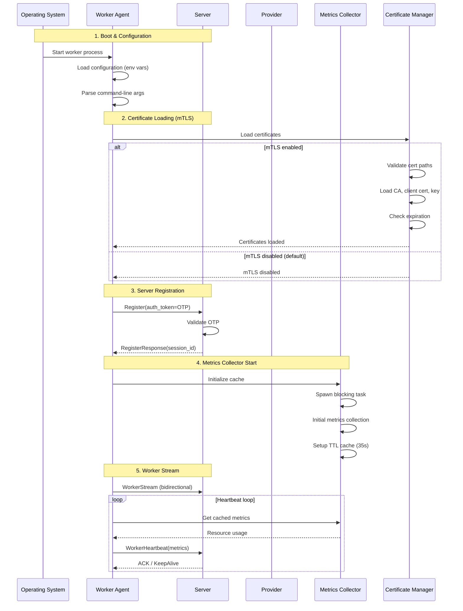
```mermaid
sequenceDiagram
    participant OS as Operating System
    participant W as Worker Agent
    participant S as Server
    participant P as Provider
    participant M as Metrics Collector
    participant C as Certificate Manager

    Note over OS,S: 1. Boot & Configuration
    OS->>W: Start worker process
    W->>W: Load configuration (env vars)
    W->>W: Parse command-line args

    Note over W,S: 2. Certificate Loading (mTLS)
    W->>C: Load certificates
    alt mTLS enabled
        C->>C: Validate cert paths
        C->>C: Load CA, client cert, key
        C->>C: Check expiration
        C-->>W: Certificates loaded
    else mTLS disabled (default)
        C-->>W: mTLS disabled
    end

    Note over W,S: 3. Server Registration
    W->>S: Register(auth_token=OTP)
    S->>S: Validate OTP
    S-->>W: RegisterResponse(session_id)

    Note over W,M: 4. Metrics Collector Start
    W->>M: Initialize cache
    M->>M: Spawn blocking task
    M->>M: Initial metrics collection
    M->>M: Setup TTL cache (35s)

    Note over W,S: 5. Worker Stream
    W->>S: WorkerStream (bidirectional)
    loop Heartbeat loop
        W->>M: Get cached metrics
        M-->>W: Resource usage
        W->>S: WorkerHeartbeat(metrics)
        S-->>W: ACK / KeepAlive
    end
```

### Inicialización de Componentes

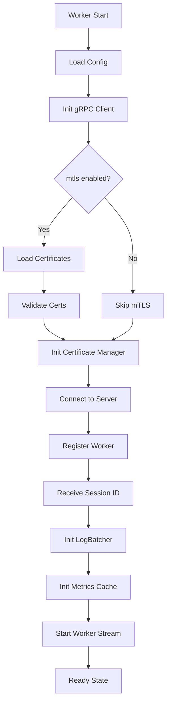
```mermaid
flowchart TD
    A[Worker Start] --> B[Load Config]
    B --> C[Init gRPC Client]
    C --> D{mtls enabled?}
    
    D -->|Yes| E[Load Certificates]
    D -->|No| F[Skip mTLS]
    
    E --> G[Validate Certs]
    G --> H[Init Certificate Manager]
    F --> H
    
    H --> I[Connect to Server]
    I --> J[Register Worker]
    J --> K[Receive Session ID]
    
    K --> L[Init LogBatcher]
    L --> M[Init Metrics Cache]
    M --> N[Start Worker Stream]
    
    N --> O[Ready State]
```

---

## Job Execution Workflow

### Write-Execute Pattern Completo

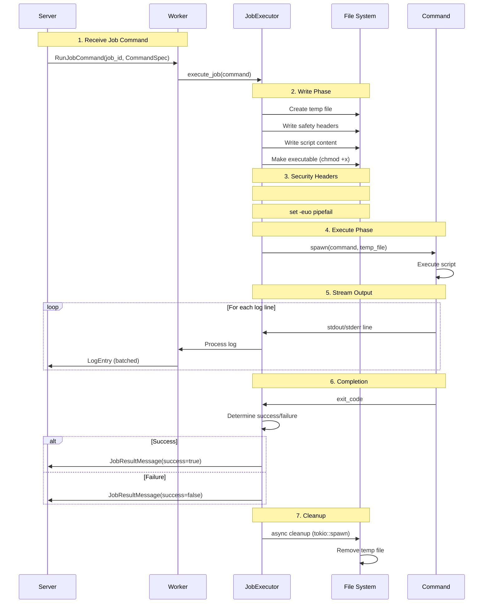
```mermaid
sequenceDiagram
    participant S as Server
    participant W as Worker
    participant E as JobExecutor
    participant FS as File System
    participant C as Command

    Note over S,W: 1. Receive Job Command
    S->>W: RunJobCommand(job_id, CommandSpec)
    W->>E: execute_job(command)

    Note over E,FS: 2. Write Phase
    E->>FS: Create temp file
    E->>FS: Write safety headers
    E->>FS: Write script content
    E->>FS: Make executable (chmod +x)
    
    Note over E,FS: 3. Security Headers
    Note over E,FS: #!/bin/bash
    Note over E,FS: set -euo pipefail

    Note over E,C: 4. Execute Phase
    E->>C: spawn(command, temp_file)
    C->>C: Execute script

    Note over C,E: 5. Stream Output
    loop For each log line
        C->>E: stdout/stderr line
        E->>W: Process log
        W->>S: LogEntry (batched)
    end

    Note over C,E: 6. Completion
    C->>E: exit_code
    E->>E: Determine success/failure
    
    alt Success
        E->>S: JobResultMessage(success=true)
    else Failure
        E->>S: JobResultMessage(success=false)
    end

    Note over E,FS: 7. Cleanup
    E->>FS: async cleanup (tokio::spawn)
    FS->>FS: Remove temp file
```

### Safety Headers Injection

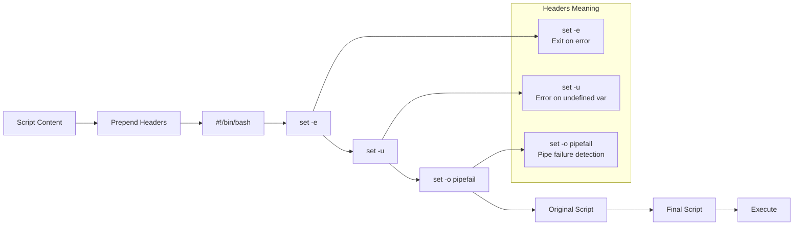
```mermaid
flowchart LR
    A[Script Content] --> B[Prepend Headers]
    
    B --> C[#!/bin/bash]
    C --> D[set -e]
    D --> E[set -u]
    E --> F[set -o pipefail]
    F --> G[Original Script]
    
    G --> H[Final Script]
    H --> I[Execute]
    
    subgraph "Headers Meaning"
        J[set -e<br/>Exit on error]
        K[set -u<br/>Error on undefined var]
        L[set -o pipefail<br/>Pipe failure detection]
    end
    
    D --> J
    E --> K
    F --> L
```

---

## Log Streaming Workflow

### LogBatcher con Backpressure

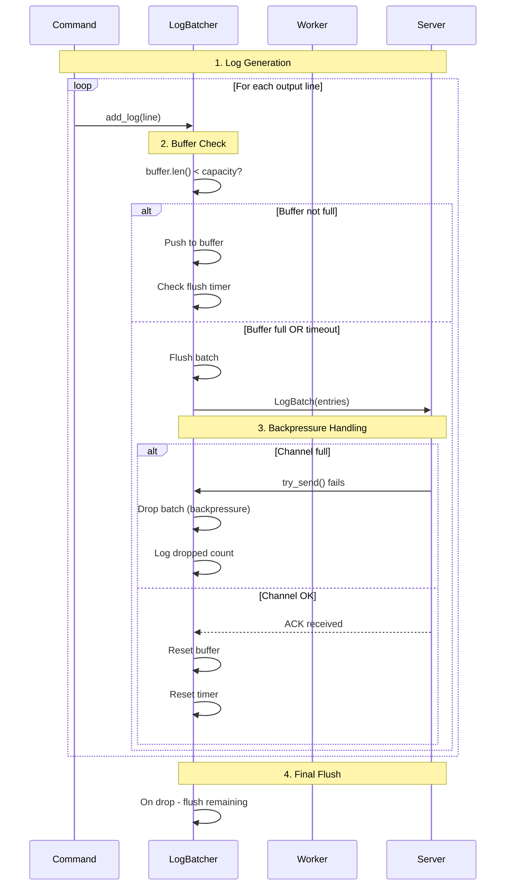
```mermaid
sequenceDiagram
    participant C as Command
    participant L as LogBatcher
    participant W as Worker
    participant S as Server

    Note over C,S: 1. Log Generation
    loop For each output line
        C->>L: add_log(line)

        Note over L: 2. Buffer Check
        L->>L: buffer.len() < capacity?
        
        alt Buffer not full
            L->>L: Push to buffer
            L->>L: Check flush timer
        else Buffer full OR timeout
            L->>L: Flush batch
            L->>S: LogBatch(entries)
            
            Note over L,S: 3. Backpressure Handling
            alt Channel full
                S->>L: try_send() fails
                L->>L: Drop batch (backpressure)
                L->>L: Log dropped count
            else Channel OK
                S-->>L: ACK received
                L->>L: Reset buffer
                L->>L: Reset timer
            end
        end
    end

    Note over L,S: 4. Final Flush
    L->>L: On drop - flush remaining
```

### LogBatch Structure

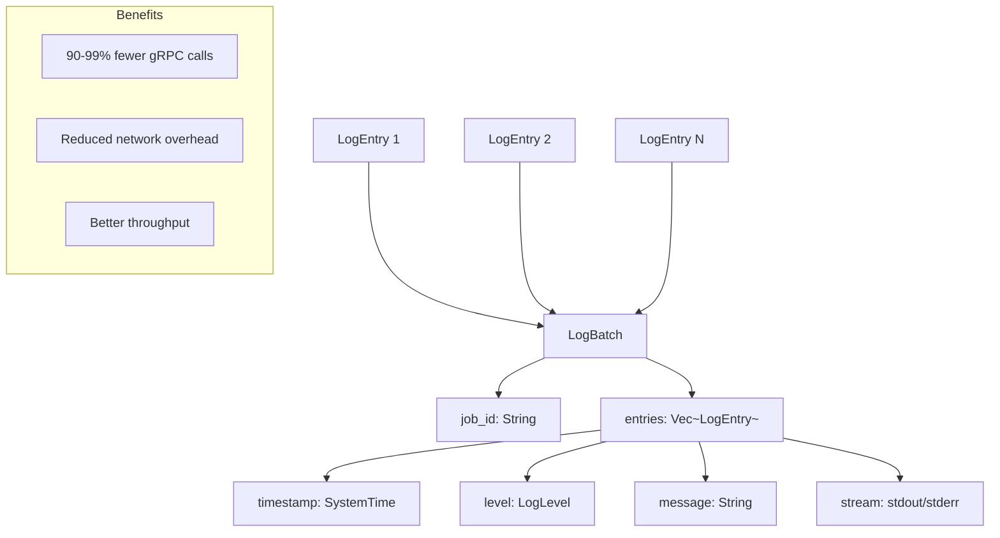
```mermaid
graph TD
    A[LogEntry 1] --> D[LogBatch]
    B[LogEntry 2] --> D
    C[LogEntry N] --> D
    
    D --> E[job_id: String]
    D --> F[entries: Vec~LogEntry~]
    
    F --> G[timestamp: SystemTime]
    F --> H[level: LogLevel]
    F --> I[message: String]
    F --> J[stream: stdout/stderr]
    
    subgraph "Benefits"
        K[90-99% fewer gRPC calls]
        L[Reduced network overhead]
        M[Better throughput]
    end
```

---

## Metrics Collection Workflow

### Cached Resource Usage con TTL

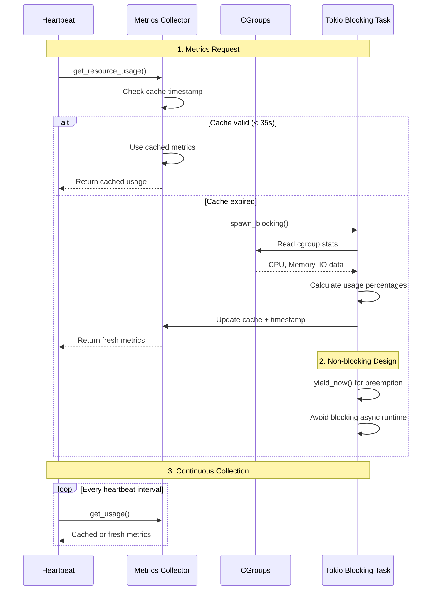
```mermaid
sequenceDiagram
    participant H as Heartbeat
    participant M as Metrics Collector
    participant C as CGroups
    participant T as Tokio Blocking Task

    Note over H,T: 1. Metrics Request
    H->>M: get_resource_usage()
    M->>M: Check cache timestamp
    
    alt Cache valid (< 35s)
        M->>M: Use cached metrics
        M-->>H: Return cached usage
    else Cache expired
        M->>T: spawn_blocking()
        T->>C: Read cgroup stats
        C-->>T: CPU, Memory, IO data
        
        T->>T: Calculate usage percentages
        T->>M: Update cache + timestamp
        M-->>H: Return fresh metrics
        
        Note over T: 2. Non-blocking Design
        T->>T: yield_now() for preemption
        T->>T: Avoid blocking async runtime
    end

    Note over H,T: 3. Continuous Collection
    loop Every heartbeat interval
        H->>M: get_usage()
        M-->>H: Cached or fresh metrics
    end
```

### CGroups Integration

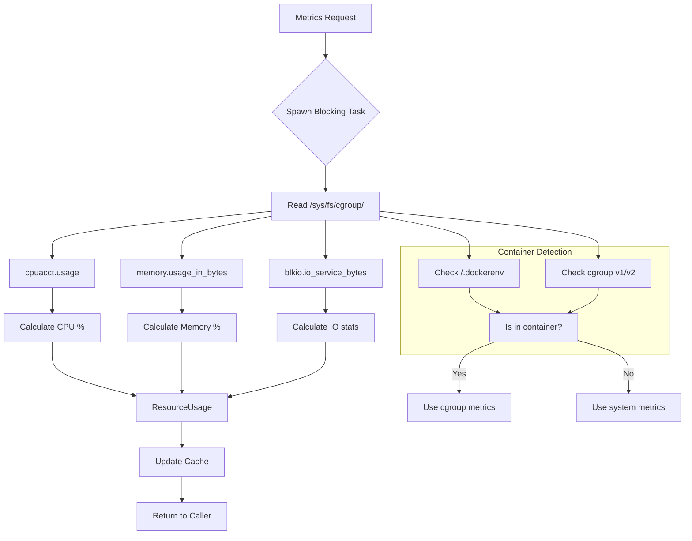
```mermaid
flowchart TD
    A[Metrics Request] --> B{Spawn Blocking Task}
    
    B --> C[Read /sys/fs/cgroup/]
    C --> D[cpuacct.usage]
    C --> E[memory.usage_in_bytes]
    C --> F[blkio.io_service_bytes]
    
    D --> G[Calculate CPU %]
    E --> H[Calculate Memory %]
    F --> I[Calculate IO stats]
    
    G --> J[ResourceUsage]
    H --> J
    I --> J
    
    J --> K[Update Cache]
    K --> L[Return to Caller]
    
    subgraph "Container Detection"
        M[Check /.dockerenv]
        N[Check cgroup v1/v2]
        O[Is in container?]
    end
    
    C --> M
    C --> N
    M --> O
    N --> O
    
    O -->|Yes| P[Use cgroup metrics]
    O -->|No| Q[Use system metrics]
```

---

## Secret Injection Workflow

### Secure Secret Transmission

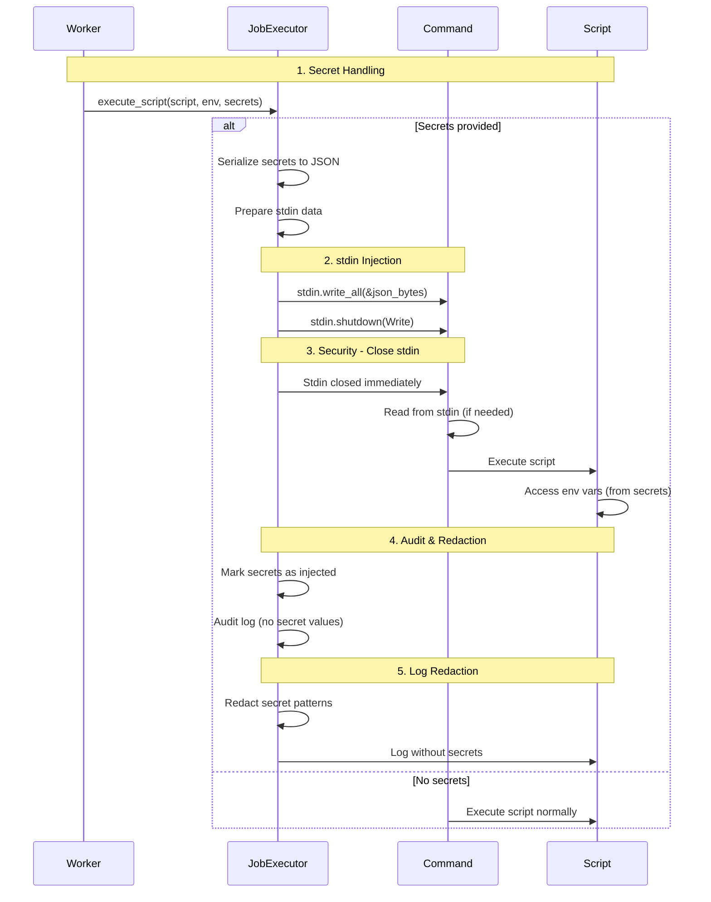
```mermaid
sequenceDiagram
    participant W as Worker
    participant E as JobExecutor
    participant C as Command
    participant S as Script

    Note over W,S: 1. Secret Handling
    W->>E: execute_script(script, env, secrets)
    
    alt Secrets provided
        E->>E: Serialize secrets to JSON
        E->>E: Prepare stdin data
        
        Note over E,C: 2. stdin Injection
        E->>C: stdin.write_all(&json_bytes)
        E->>C: stdin.shutdown(Write)
        
        Note over E,C: 3. Security - Close stdin
        E->>C: Stdin closed immediately
        C->>C: Read from stdin (if needed)
        
        C->>S: Execute script
        S->>S: Access env vars (from secrets)
        
        Note over E,S: 4. Audit & Redaction
        E->>E: Mark secrets as injected
        E->>E: Audit log (no secret values)
        
        Note over E,S: 5. Log Redaction
        E->>E: Redact secret patterns
        E->>S: Log without secrets
    else No secrets
        C->>S: Execute script normally
    end
```

### Secret Security Model

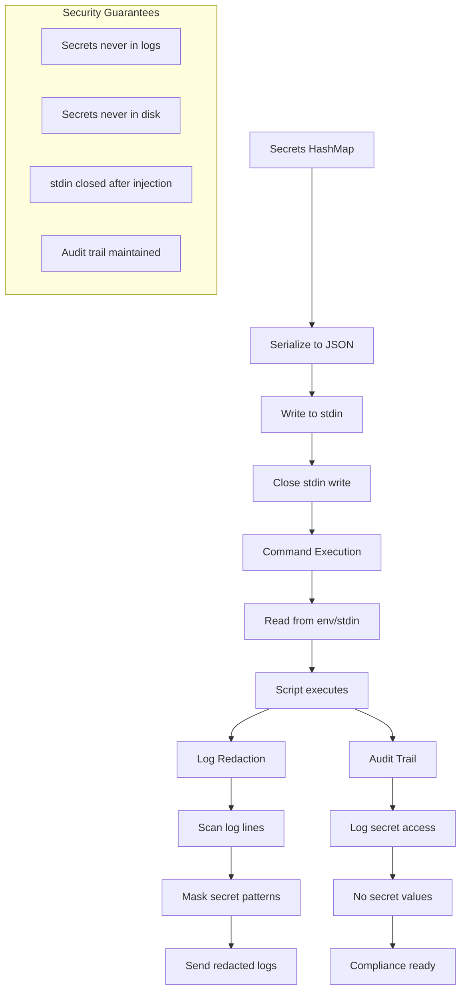
```mermaid
flowchart TD
    A[Secrets HashMap] --> B[Serialize to JSON]
    B --> C[Write to stdin]
    C --> D[Close stdin write]
    
    D --> E[Command Execution]
    E --> F[Read from env/stdin]
    F --> G[Script executes]
    
    H[Log Redaction] --> I[Scan log lines]
    I --> J[Mask secret patterns]
    J --> K[Send redacted logs]
    
    L[Audit Trail] --> M[Log secret access]
    M --> N[No secret values]
    N --> O[Compliance ready]
    
    subgraph "Security Guarantees"
        P[Secrets never in logs]
        Q[Secrets never in disk]
        R[stdin closed after injection]
        S[Audit trail maintained]
    end
    
    G --> H
    G --> L
```

---

## Certificate Management Workflow

### mTLS Certificate Lifecycle

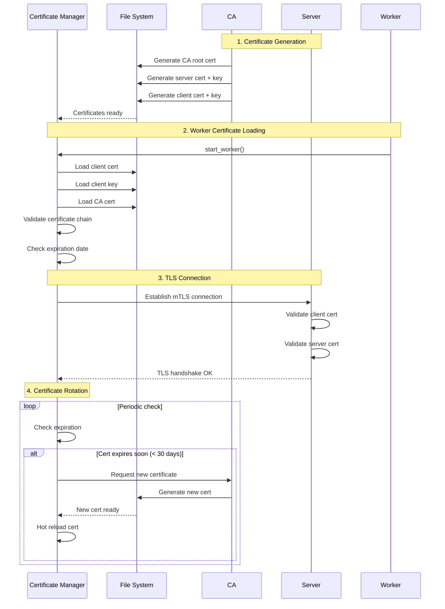
```mermaid
sequenceDiagram
    participant C as Certificate Manager
    participant FS as File System
    participant CA as CA
    participant S as Server
    participant W as Worker

    Note over CA,S: 1. Certificate Generation
    CA->>FS: Generate CA root cert
    CA->>FS: Generate server cert + key
    CA->>FS: Generate client cert + key
    FS-->>C: Certificates ready

    Note over C,W: 2. Worker Certificate Loading
    W->>C: start_worker()
    C->>FS: Load client cert
    C->>FS: Load client key
    C->>FS: Load CA cert
    C->>C: Validate certificate chain
    C->>C: Check expiration date

    Note over C,S: 3. TLS Connection
    C->>S: Establish mTLS connection
    S->>S: Validate client cert
    S->>S: Validate server cert
    S-->>C: TLS handshake OK

    Note over C,C: 4. Certificate Rotation
    loop Periodic check
        C->>C: Check expiration
        alt Cert expires soon (< 30 days)
            C->>CA: Request new certificate
            CA->>FS: Generate new cert
            FS-->>C: New cert ready
            C->>C: Hot reload cert
        end
    end
```

### Certificate Rotation

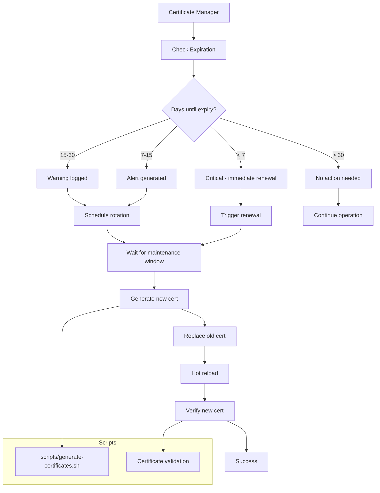
```mermaid
flowchart TD
    A[Certificate Manager] --> B[Check Expiration]
    
    B --> C{Days until expiry?}
    
    C -->|> 30| D[No action needed]
    C -->|15-30| E[Warning logged]
    C -->|7-15| F[Alert generated]
    C -->|< 7| G[Critical - immediate renewal]
    
    E --> H[Schedule rotation]
    F --> H
    G --> I[Trigger renewal]
    
    H --> J[Wait for maintenance window]
    I --> J
    J --> K[Generate new cert]
    K --> L[Replace old cert]
    L --> M[Hot reload]
    M --> N[Verify new cert]
    
    N --> O[Success]
    D --> P[Continue operation]
    
    subgraph "Scripts"
        Q[scripts/generate-certificates.sh]
        R[Certificate validation]
    end
    
    K --> Q
    N --> R
```

---

## Deployment Workflows

### Docker Deployment

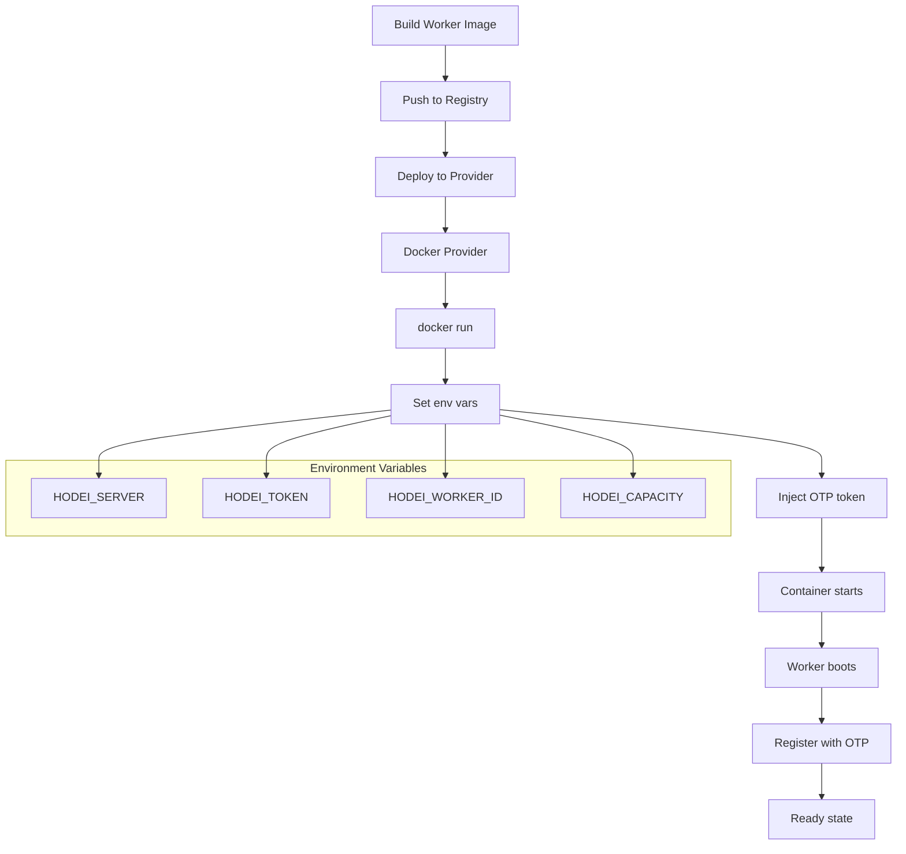
```mermaid
flowchart TD
    A[Build Worker Image] --> B[Push to Registry]
    B --> C[Deploy to Provider]
    
    C --> D[Docker Provider]
    D --> E[docker run]
    E --> F[Set env vars]
    F --> G[Inject OTP token]
    
    G --> H[Container starts]
    H --> I[Worker boots]
    I --> J[Register with OTP]
    J --> K[Ready state]
    
    subgraph "Environment Variables"
        L[HODEI_SERVER]
        M[HODEI_TOKEN]
        N[HODEI_WORKER_ID]
        O[HODEI_CAPACITY]
    end
    
    F --> L
    F --> M
    F --> N
    F --> O
```

### Kubernetes Deployment

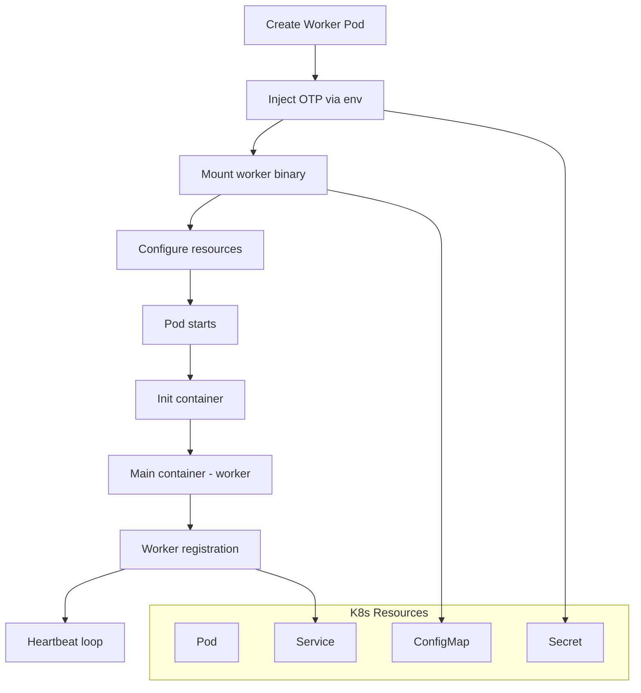
```mermaid
flowchart TD
    A[Create Worker Pod] --> B[Inject OTP via env]
    B --> C[Mount worker binary]
    C --> D[Configure resources]
    
    D --> E[Pod starts]
    E --> F[Init container]
    F --> G[Main container - worker]
    
    G --> H[Worker registration]
    H --> I[Heartbeat loop]
    
    subgraph "K8s Resources"
        J[Pod]
        K[Service]
        L[ConfigMap]
        M[Secret]
    end
    
    B --> M
    C --> L
    H --> K
```

---

## Error Handling Workflows

### Worker Disconnection Recovery

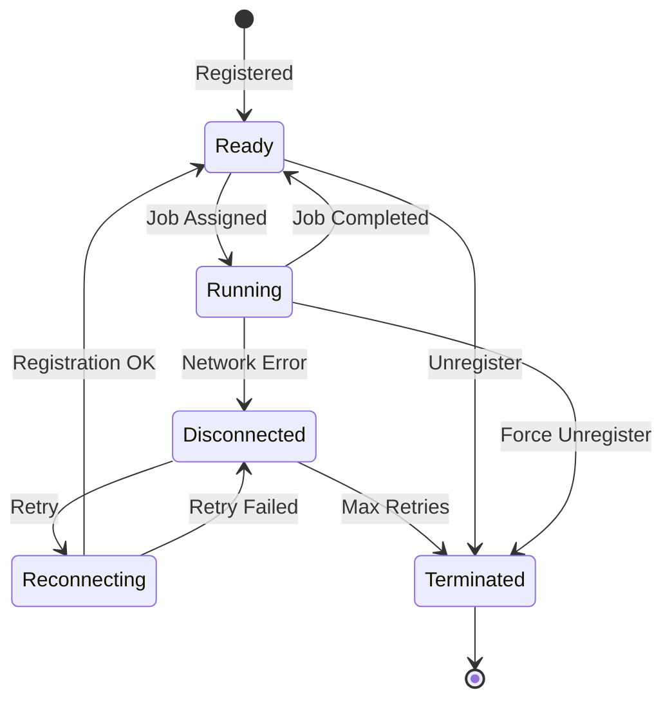
```mermaid
stateDiagram-v2
    [*] --> Ready: Registered
    
    Ready --> Running: Job Assigned
    Running --> Ready: Job Completed
    
    Running --> Disconnected: Network Error
    Disconnected --> Reconnecting: Retry
    
    Reconnecting --> Ready: Registration OK
    Reconnecting --> Disconnected: Retry Failed
    
    Disconnected --> Terminated: Max Retries
    Terminated --> [*]
    
    Ready --> Terminated: Unregister
    Running --> Terminated: Force Unregister
```

### Backpressure Handling

```mermaid
flowchart TD
    A[LogBatcher] --> B{try_send() result}
    
    B -->|OK| C[Message sent]
    B -->|Full| D[Drop message]
    B -->|Closed| E[Channel closed]
    
    D --> F[Increment dropped counter]
    F --> G[Log warning]
    G --> H[Continue operation]
    
    C --> I[Continue batching]
    E --> J[Flush remaining logs]
    J --> K[Shutdown batcher]
    
    subgraph "Metrics"
        L[dropped_messages_total]
        M[channel_capacity]
        N[buffer_fill_ratio]
    end
    
    F --> L
    D --> M
    C --> N
```

---

## Testing Workflows

### Performance Testing

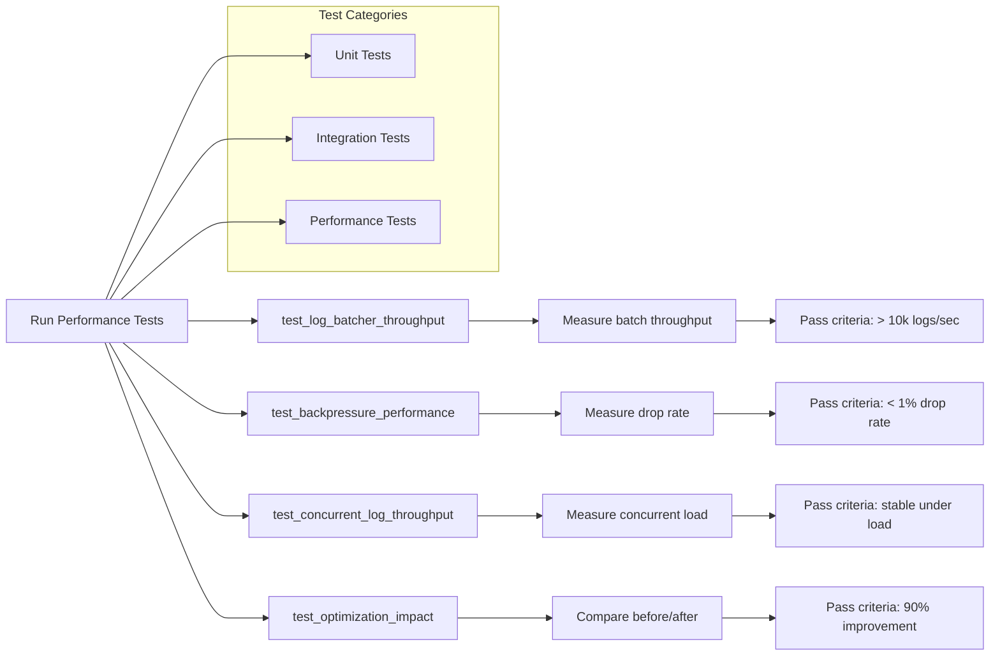
```mermaid
flowchart LR
    A[Run Performance Tests] --> B[test_log_batcher_throughput]
    A --> C[test_backpressure_performance]
    A --> D[test_concurrent_log_throughput]
    A --> E[test_optimization_impact]
    
    B --> F[Measure batch throughput]
    C --> G[Measure drop rate]
    D --> H[Measure concurrent load]
    E --> I[Compare before/after]
    
    F --> J[Pass criteria: > 10k logs/sec]
    G --> K[Pass criteria: < 1% drop rate]
    H --> L[Pass criteria: stable under load]
    I --> M[Pass criteria: 90% improvement]
    
    subgraph "Test Categories"
        N[Unit Tests]
        O[Integration Tests]
        P[Performance Tests]
    end
    
    A --> N
    A --> O
    A --> P
```

### Security Testing

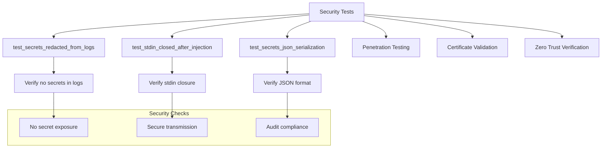
```mermaid
flowchart TD
    A[Security Tests] --> B[test_secrets_redacted_from_logs]
    A --> C[test_stdin_closed_after_injection]
    A --> D[test_secrets_json_serialization]
    
    B --> E[Verify no secrets in logs]
    C --> F[Verify stdin closure]
    D --> G[Verify JSON format]
    
    subgraph "Security Checks"
        H[No secret exposure]
        I[Secure transmission]
        J[Audit compliance]
    end
    
    E --> H
    F --> I
    G --> J
    
    K[Penetration Testing]
    L[Certificate Validation]
    M[Zero Trust Verification]
    
    A --> K
    A --> L
    A --> M
```
