# Flujos de Trabajo

**Versión**: 7.0  
**Última Actualización**: 2025-12-14

## Flujo Completo de Ejecución de Job

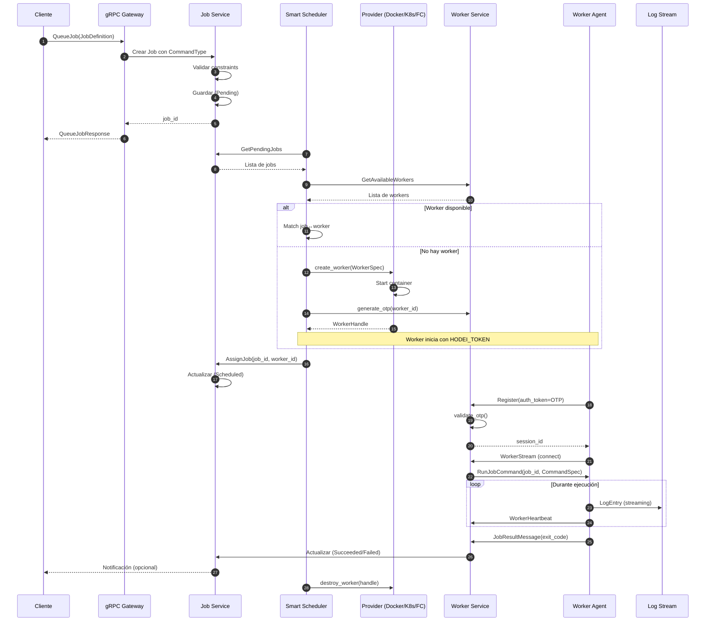
```mermaid
sequenceDiagram
    autonumber
    participant C as Cliente
    participant GW as gRPC Gateway
    participant JS as Job Service
    participant SS as Smart Scheduler
    participant P as Provider (Docker/K8s/FC)
    participant WS as Worker Service
    participant W as Worker Agent
    participant LS as Log Stream

    %% Fase 1: Creación
    C->>GW: QueueJob(JobDefinition)
    GW->>JS: Crear Job con CommandType
    JS->>JS: Validar constraints
    JS->>JS: Guardar (Pending)
    JS-->>GW: job_id
    GW-->>C: QueueJobResponse

    %% Fase 2: Scheduling + Provisioning
    SS->>JS: GetPendingJobs
    JS-->>SS: Lista de jobs
    SS->>WS: GetAvailableWorkers
    WS-->>SS: Lista de workers
    
    alt Worker disponible
        SS->>SS: Match job↔worker
    else No hay worker
        SS->>P: create_worker(WorkerSpec)
        P->>P: Start container
        SS->>WS: generate_otp(worker_id)
        P-->>SS: WorkerHandle
        Note over SS,W: Worker inicia con HODEI_TOKEN
    end
    
    SS->>JS: AssignJob(job_id, worker_id)
    JS->>JS: Actualizar (Scheduled)

    %% Fase 3: Worker Registration (OTP)
    W->>WS: Register(auth_token=OTP)
    WS->>WS: validate_otp()
    WS-->>W: session_id

    %% Fase 4: Bidirectional Stream
    W->>WS: WorkerStream (connect)
    WS->>W: RunJobCommand(job_id, CommandSpec)
    
    loop Durante ejecución
        W->>LS: LogEntry (streaming)
        W->>WS: WorkerHeartbeat
    end

    %% Fase 5: Resultado
    W->>WS: JobResultMessage(exit_code)
    WS->>JS: Actualizar (Succeeded/Failed)
    JS-->>C: Notificación (opcional)

    %% Fase 6: Cleanup (opcional)
    SS->>P: destroy_worker(handle)
```

---

## Flujo de Registro y Gestión de Worker (PRD v6.0)

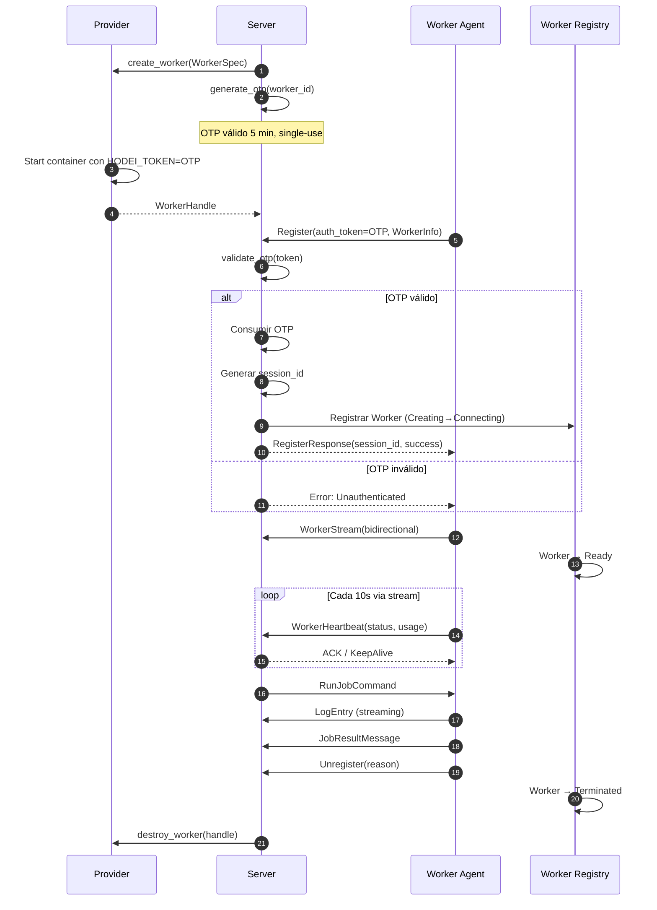
```mermaid
sequenceDiagram
    autonumber
    participant P as Provider
    participant S as Server
    participant W as Worker Agent
    participant REG as Worker Registry

    %% Fase 1: Provisioning con OTP
    S->>P: create_worker(WorkerSpec)
    S->>S: generate_otp(worker_id)
    Note over S: OTP válido 5 min, single-use
    P->>P: Start container con HODEI_TOKEN=OTP
    P-->>S: WorkerHandle

    %% Fase 2: Registro con OTP
    W->>S: Register(auth_token=OTP, WorkerInfo)
    S->>S: validate_otp(token)
    alt OTP válido
        S->>S: Consumir OTP
        S->>S: Generar session_id
        S->>REG: Registrar Worker (Creating→Connecting)
        S-->>W: RegisterResponse(session_id, success)
    else OTP inválido
        S-->>W: Error: Unauthenticated
    end

    %% Fase 3: Stream bidireccional
    W->>S: WorkerStream(bidirectional)
    REG->>REG: Worker → Ready
    
    loop Cada 10s via stream
        W->>S: WorkerHeartbeat(status, usage)
        S-->>W: ACK / KeepAlive
    end

    %% Fase 4: Comandos via stream
    S->>W: RunJobCommand
    W->>S: LogEntry (streaming)
    W->>S: JobResultMessage

    %% Fase 5: Shutdown
    W->>S: Unregister(reason)
    REG->>REG: Worker → Terminated
    S->>P: destroy_worker(handle)
```

### Estados de Worker (PRD v6.0)

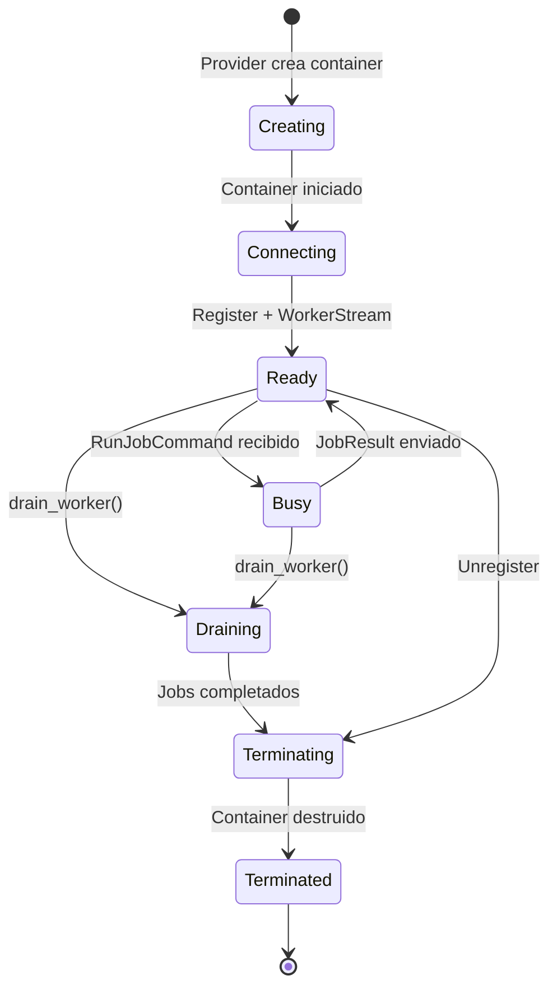
```mermaid
stateDiagram-v2
    [*] --> Creating: Provider crea container
    Creating --> Connecting: Container iniciado
    Connecting --> Ready: Register + WorkerStream
    Ready --> Busy: RunJobCommand recibido
    Busy --> Ready: JobResult enviado
    Ready --> Draining: drain_worker()
    Busy --> Draining: drain_worker()
    Draining --> Terminating: Jobs completados
    Ready --> Terminating: Unregister
    Terminating --> Terminated: Container destruido
    Terminated --> [*]
```

---

## Flujo de Manejo de Errores y Reintentos

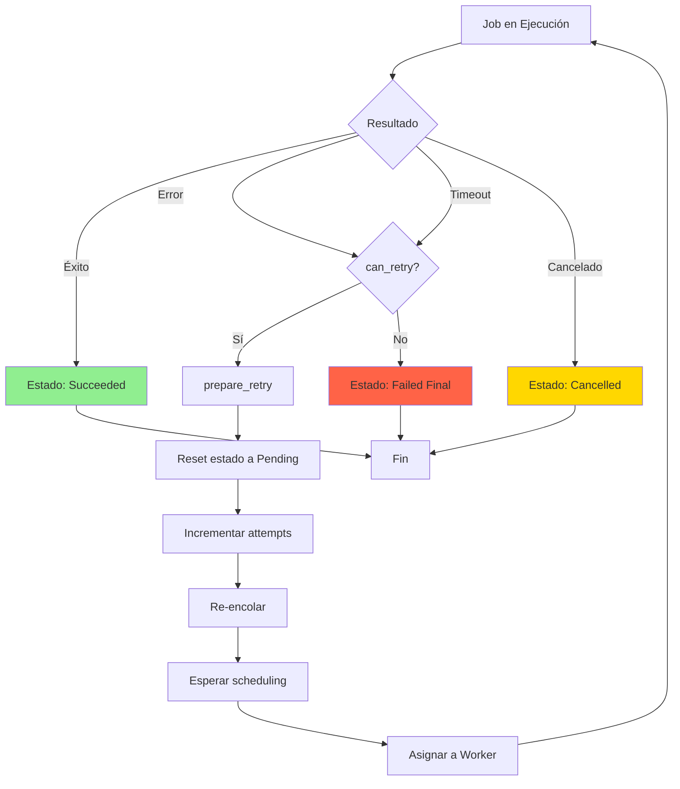
```mermaid
flowchart TD
    START[Job en Ejecución] --> EXEC{Resultado}
    
    EXEC -->|Éxito| SUCCESS[Estado: Succeeded]
    EXEC -->|Error| CHECK_RETRY{can_retry?}
    EXEC -->|Timeout| CHECK_RETRY
    EXEC -->|Cancelado| CANCELLED[Estado: Cancelled]
    
    CHECK_RETRY -->|Sí| PREP[prepare_retry]
    CHECK_RETRY -->|No| FAILED[Estado: Failed Final]
    
    PREP --> RESET[Reset estado a Pending]
    RESET --> INC[Incrementar attempts]
    INC --> QUEUE[Re-encolar]
    QUEUE --> WAIT[Esperar scheduling]
    WAIT --> ASSIGN[Asignar a Worker]
    ASSIGN --> START
    
    SUCCESS --> END[Fin]
    CANCELLED --> END
    FAILED --> END
    
    style SUCCESS fill:#90EE90
    style CANCELLED fill:#FFD700
    style FAILED fill:#FF6347
```

---

## Flujo de Scheduling Inteligente

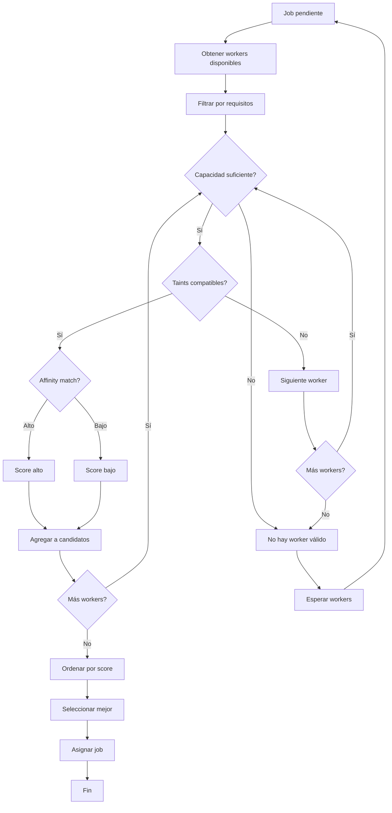
```mermaid
flowchart TD
    START[Job pendiente] --> GET_WORKERS[Obtener workers disponibles]
    GET_WORKERS --> FILTER[Filtrar por requisitos]
    
    FILTER --> CHECK_CAP{Capacidad suficiente?}
    CHECK_CAP -->|No| REJECT[No hay worker válido]
    CHECK_CAP -->|Sí| CHECK_TAINT{Taints compatibles?}
    
    CHECK_TAINT -->|No| NEXT_WORKER[Siguiente worker]
    CHECK_TAINT -->|Sí| CHECK_AFF{Affinity match?}
    
    NEXT_WORKER --> CHECK_MORE{Más workers?}
    CHECK_MORE -->|Sí| CHECK_CAP
    CHECK_MORE -->|No| REJECT
    
    CHECK_AFF -->|Alto| HIGH_SCORE[Score alto]
    CHECK_AFF -->|Bajo| LOW_SCORE[Score bajo]
    
    HIGH_SCORE --> ADD_LIST[Agregar a candidatos]
    LOW_SCORE --> ADD_LIST
    
    ADD_LIST --> MORE_WORKERS{Más workers?}
    MORE_WORKERS -->|Sí| CHECK_CAP
    MORE_WORKERS -->|No| SORT[Ordenar por score]
    
    SORT --> SELECT[Seleccionar mejor]
    SELECT --> ASSIGN[Asignar job]
    ASSIGN --> END[Fin]
    
    REJECT --> WAIT[Esperar workers]
    WAIT --> START
```

### Algoritmo de Scoring

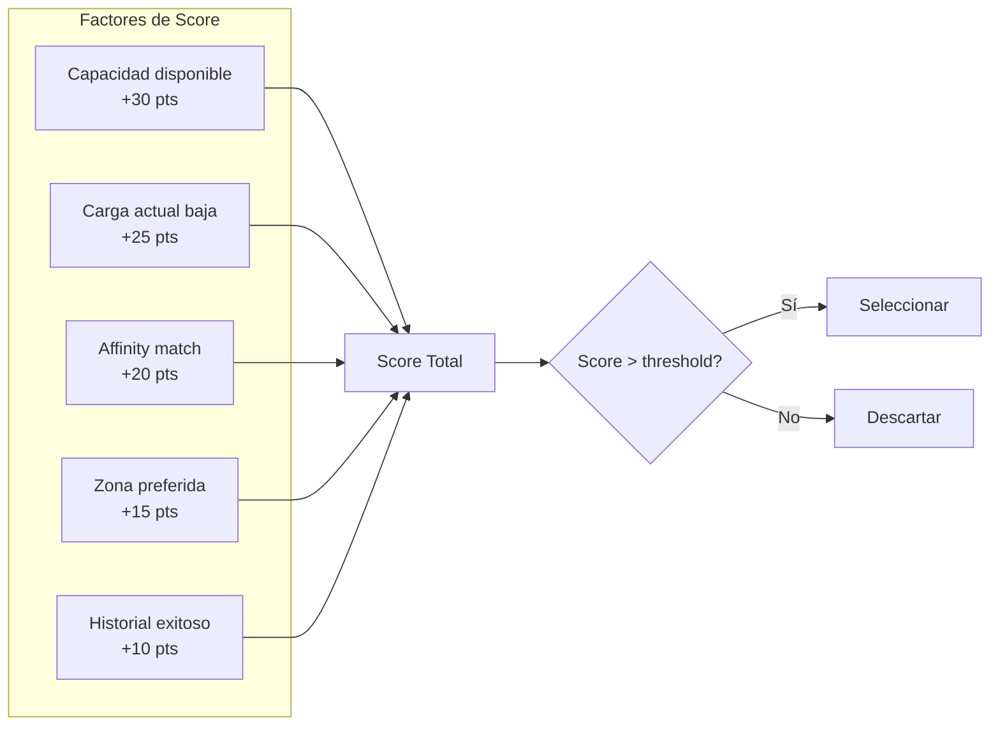
```mermaid
graph LR
    subgraph "Factores de Score"
        A[Capacidad disponible<br/>+30 pts]
        B[Carga actual baja<br/>+25 pts]
        C[Affinity match<br/>+20 pts]
        D[Zona preferida<br/>+15 pts]
        E[Historial exitoso<br/>+10 pts]
    end
    
    A --> TOTAL[Score Total]
    B --> TOTAL
    C --> TOTAL
    D --> TOTAL
    E --> TOTAL
    
    TOTAL --> DECISION{Score > threshold?}
    DECISION -->|Sí| SELECT[Seleccionar]
    DECISION -->|No| SKIP[Descartar]
```

---

## Flujo de Streaming de Métricas

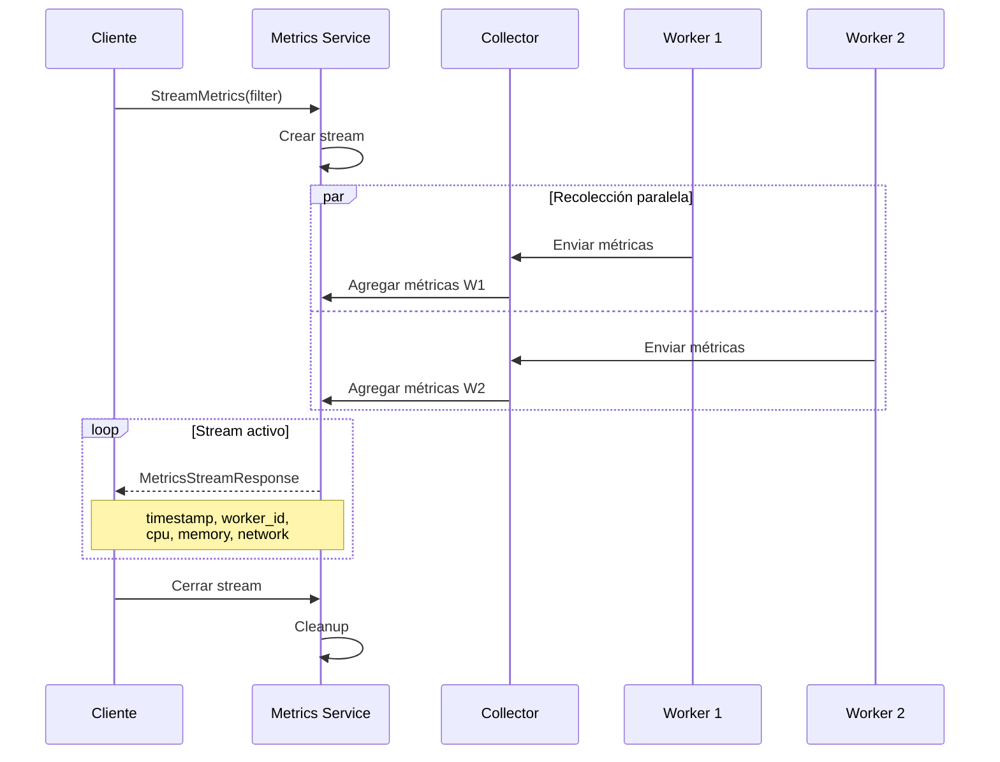
```mermaid
sequenceDiagram
    participant C as Cliente
    participant MS as Metrics Service
    participant COL as Collector
    participant W1 as Worker 1
    participant W2 as Worker 2

    C->>MS: StreamMetrics(filter)
    MS->>MS: Crear stream
    
    par Recolección paralela
        W1->>COL: Enviar métricas
        COL->>MS: Agregar métricas W1
    and
        W2->>COL: Enviar métricas
        COL->>MS: Agregar métricas W2
    end
    
    loop Stream activo
        MS-->>C: MetricsStreamResponse
        Note over MS,C: timestamp, worker_id,<br/>cpu, memory, network
    end
    
    C->>MS: Cerrar stream
    MS->>MS: Cleanup
```

---

## Flujo de Cancelación de Job

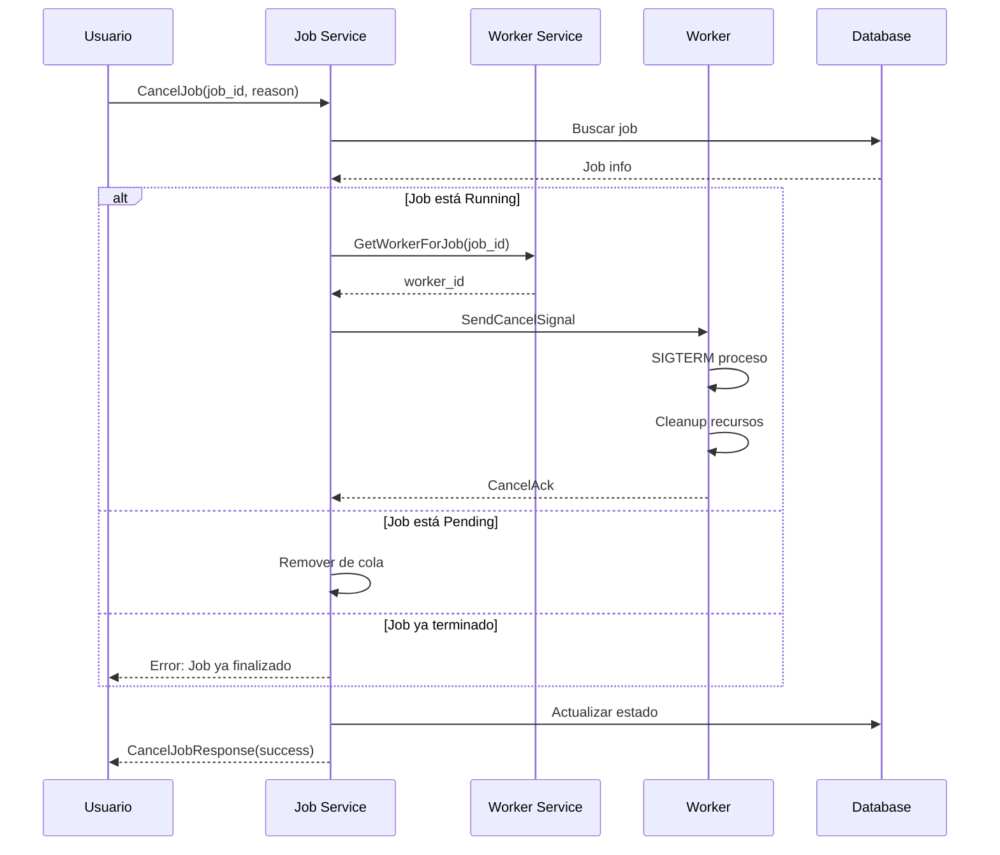
```mermaid
sequenceDiagram
    participant U as Usuario
    participant JS as Job Service
    participant WS as Worker Service
    participant W as Worker
    participant DB as Database

    U->>JS: CancelJob(job_id, reason)
    JS->>DB: Buscar job
    DB-->>JS: Job info
    
    alt Job está Running
        JS->>WS: GetWorkerForJob(job_id)
        WS-->>JS: worker_id
        JS->>W: SendCancelSignal
        W->>W: SIGTERM proceso
        W->>W: Cleanup recursos
        W-->>JS: CancelAck
    else Job está Pending
        JS->>JS: Remover de cola
    else Job ya terminado
        JS-->>U: Error: Job ya finalizado
    end
    
    JS->>DB: Actualizar estado
    JS-->>U: CancelJobResponse(success)
```

---

## Flujo de Alta Disponibilidad

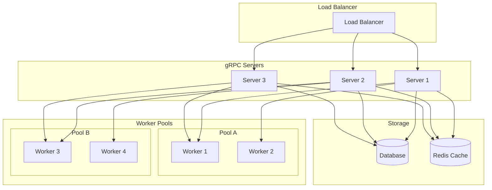
```mermaid
flowchart TD
    subgraph "Load Balancer"
        LB[Load Balancer]
    end
    
    subgraph "gRPC Servers"
        S1[Server 1]
        S2[Server 2]
        S3[Server 3]
    end
    
    subgraph "Worker Pools"
        subgraph "Pool A"
            W1[Worker 1]
            W2[Worker 2]
        end
        subgraph "Pool B"
            W3[Worker 3]
            W4[Worker 4]
        end
    end
    
    subgraph "Storage"
        DB[(Database)]
        CACHE[(Redis Cache)]
    end
    
    LB --> S1
    LB --> S2
    LB --> S3
    
    S1 --> W1
    S1 --> W2
    S2 --> W3
    S2 --> W4
    S3 --> W1
    S3 --> W3
    
    S1 --> DB
    S2 --> DB
    S3 --> DB
    
    S1 --> CACHE
    S2 --> CACHE
    S3 --> CACHE
```

### Manejo de Fallos

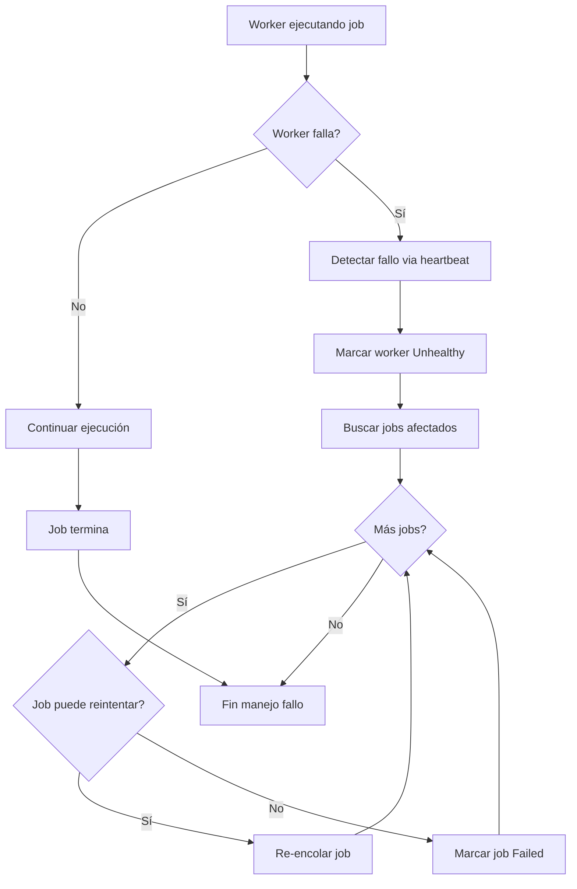
```mermaid
flowchart TD
    START[Worker ejecutando job] --> FAIL{Worker falla?}
    
    FAIL -->|No| CONTINUE[Continuar ejecución]
    FAIL -->|Sí| DETECT[Detectar fallo via heartbeat]
    
    DETECT --> MARK[Marcar worker Unhealthy]
    MARK --> FIND[Buscar jobs afectados]
    FIND --> LOOP{Más jobs?}
    
    LOOP -->|Sí| CHECK{Job puede reintentar?}
    LOOP -->|No| END[Fin manejo fallo]
    
    CHECK -->|Sí| REQUEUE[Re-encolar job]
    CHECK -->|No| MARK_FAILED[Marcar job Failed]
    
    REQUEUE --> LOOP
    MARK_FAILED --> LOOP
    
    CONTINUE --> FINISH[Job termina]
    FINISH --> END
```

---

## Estados del Sistema (PRD v6.0)

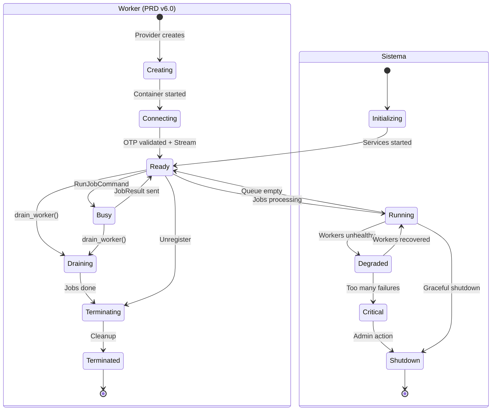
```mermaid
stateDiagram-v2
    state "Sistema" as SYS {
        [*] --> Initializing
        Initializing --> Ready: Services started
        Ready --> Running: Jobs processing
        Running --> Ready: Queue empty
        Running --> Degraded: Workers unhealthy
        Degraded --> Running: Workers recovered
        Degraded --> Critical: Too many failures
        Critical --> Shutdown: Admin action
        Running --> Shutdown: Graceful shutdown
        Shutdown --> [*]
    }
    
    state "Worker (PRD v6.0)" as WRK {
        [*] --> Creating: Provider creates
        Creating --> Connecting: Container started
        Connecting --> Ready: OTP validated + Stream
        Ready --> Busy: RunJobCommand
        Busy --> Ready: JobResult sent
        Ready --> Draining: drain_worker()
        Busy --> Draining: drain_worker()
        Draining --> Terminating: Jobs done
        Ready --> Terminating: Unregister
        Terminating --> Terminated: Cleanup
        Terminated --> [*]
    }
```

---

## Flujo de Log Streaming (PRD v6.0)

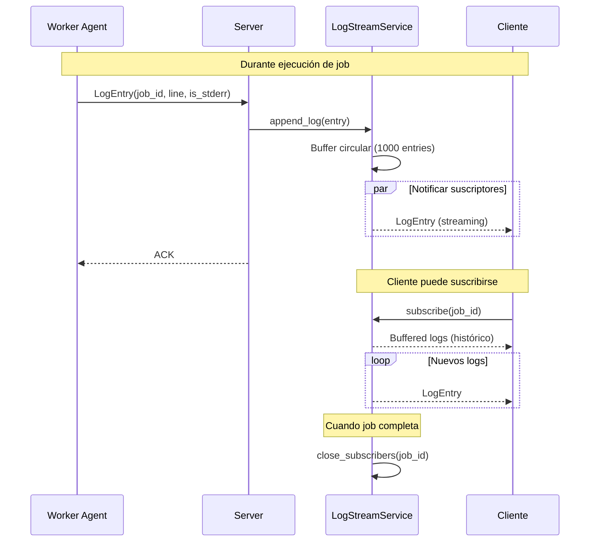
```mermaid
sequenceDiagram
    participant W as Worker Agent
    participant S as Server
    participant LS as LogStreamService
    participant C as Cliente

    Note over W,C: Durante ejecución de job
    
    W->>S: LogEntry(job_id, line, is_stderr)
    S->>LS: append_log(entry)
    LS->>LS: Buffer circular (1000 entries)
    
    par Notificar suscriptores
        LS-->>C: LogEntry (streaming)
    end
    S-->>W: ACK
    
    Note over C,LS: Cliente puede suscribirse
    C->>LS: subscribe(job_id)
    LS-->>C: Buffered logs (histórico)
    loop Nuevos logs
        LS-->>C: LogEntry
    end
    
    Note over LS: Cuando job completa
    LS->>LS: close_subscribers(job_id)
```

### LogStreamService API

| Método | Descripción |
|--------|-------------|
| `append_log(entry)` | Añadir log al buffer |
| `subscribe(job_id)` | Suscribirse a logs de un job |
| `get_logs(job_id, limit)` | Obtener logs históricos |
| `clear_logs(job_id)` | Limpiar buffer tras completar |

---

## Flujo de Provisioning On-Demand

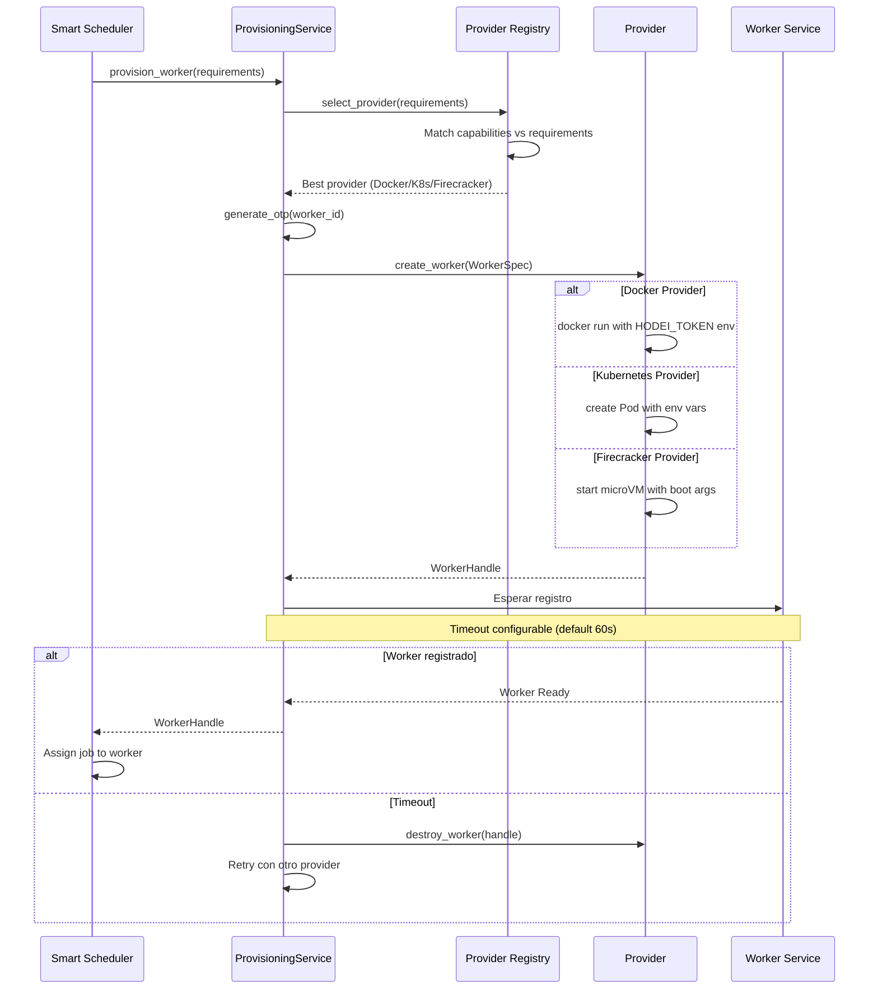
```mermaid
sequenceDiagram
    participant SS as Smart Scheduler
    participant PS as ProvisioningService
    participant PR as Provider Registry
    participant P as Provider
    participant WS as Worker Service

    SS->>PS: provision_worker(requirements)
    PS->>PR: select_provider(requirements)
    PR->>PR: Match capabilities vs requirements
    PR-->>PS: Best provider (Docker/K8s/Firecracker)

    PS->>PS: generate_otp(worker_id)
    PS->>P: create_worker(WorkerSpec)
    
    alt Docker Provider
        P->>P: docker run with HODEI_TOKEN env
    else Kubernetes Provider
        P->>P: create Pod with env vars
    else Firecracker Provider
        P->>P: start microVM with boot args
    end
    
    P-->>PS: WorkerHandle

    PS->>WS: Esperar registro
    Note over PS,WS: Timeout configurable (default 60s)
    
    alt Worker registrado
        WS-->>PS: Worker Ready
        PS-->>SS: WorkerHandle
        SS->>SS: Assign job to worker
    else Timeout
        PS->>P: destroy_worker(handle)
        PS->>PS: Retry con otro provider
    end
```

---

## Flujo de Provisioning por Provider

### Docker Provider

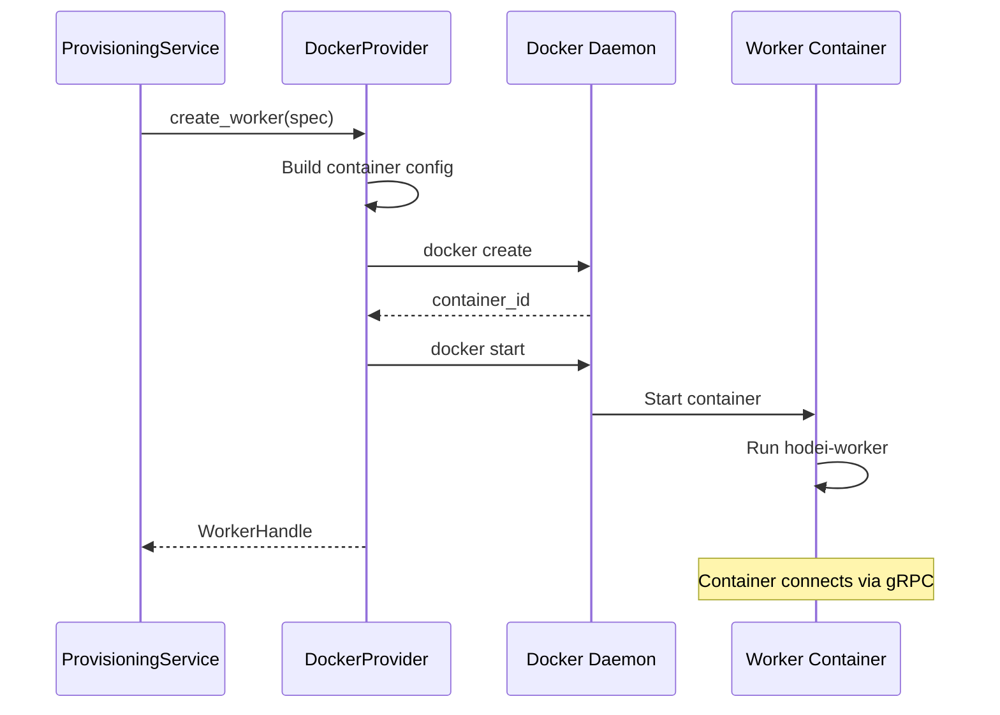
```mermaid
sequenceDiagram
    participant PS as ProvisioningService
    participant DP as DockerProvider
    participant D as Docker Daemon
    participant W as Worker Container

    PS->>DP: create_worker(spec)
    DP->>DP: Build container config
    DP->>D: docker create
    D-->>DP: container_id
    DP->>D: docker start
    D->>W: Start container
    W->>W: Run hodei-worker
    DP-->>PS: WorkerHandle
    
    Note over W: Container connects via gRPC
```

### Kubernetes Provider

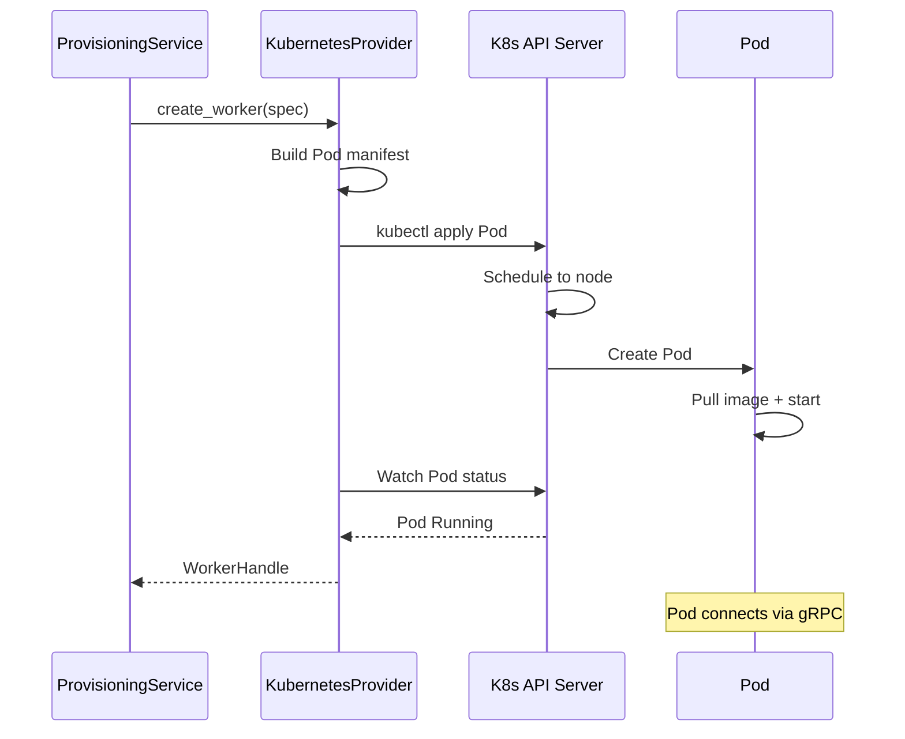
```mermaid
sequenceDiagram
    participant PS as ProvisioningService
    participant KP as KubernetesProvider
    participant K as K8s API Server
    participant P as Pod

    PS->>KP: create_worker(spec)
    KP->>KP: Build Pod manifest
    KP->>K: kubectl apply Pod
    K->>K: Schedule to node
    K->>P: Create Pod
    P->>P: Pull image + start
    KP->>K: Watch Pod status
    K-->>KP: Pod Running
    KP-->>PS: WorkerHandle
    
    Note over P: Pod connects via gRPC
```

### Firecracker Provider

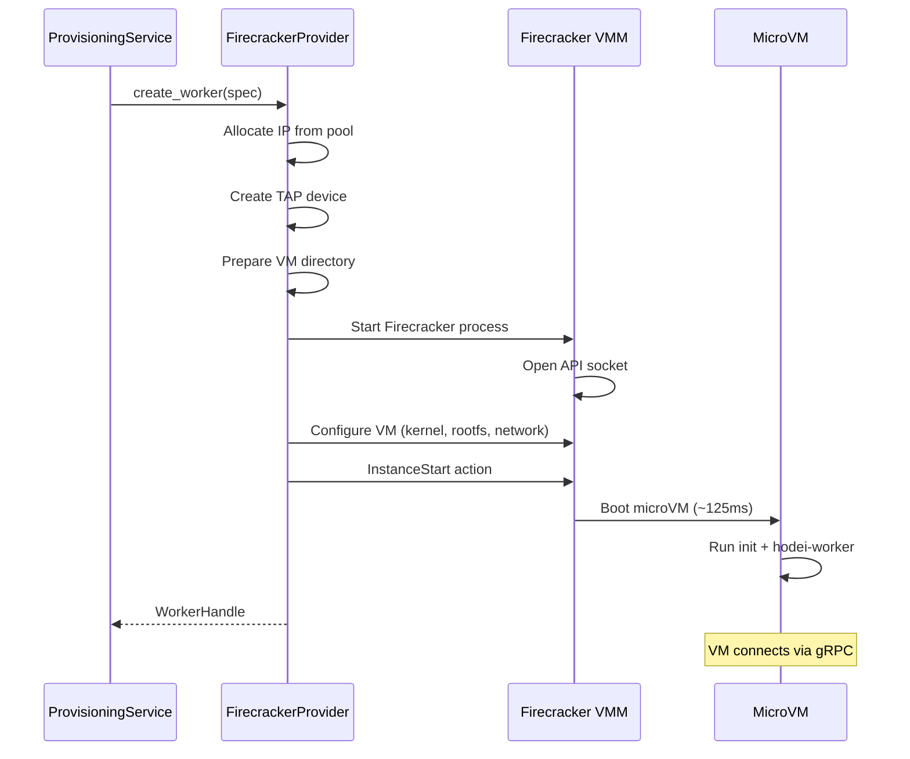
```mermaid
sequenceDiagram
    participant PS as ProvisioningService
    participant FP as FirecrackerProvider
    participant FC as Firecracker VMM
    participant VM as MicroVM

    PS->>FP: create_worker(spec)
    FP->>FP: Allocate IP from pool
    FP->>FP: Create TAP device
    FP->>FP: Prepare VM directory
    FP->>FC: Start Firecracker process
    FC->>FC: Open API socket
    FP->>FC: Configure VM (kernel, rootfs, network)
    FP->>FC: InstanceStart action
    FC->>VM: Boot microVM (~125ms)
    VM->>VM: Run init + hodei-worker
    FP-->>PS: WorkerHandle
    
    Note over VM: VM connects via gRPC
```

---

## Comparación de Tiempos de Provisioning

| Fase | Docker | Kubernetes | Firecracker |
|------|--------|------------|-------------|
| Crear recurso | ~100ms | ~500ms | ~50ms |
| Pull/Prepare | ~0-30s* | ~0-60s* | ~0ms** |
| Boot | ~500ms | ~2-10s | ~125ms |
| Connect gRPC | ~100ms | ~100ms | ~100ms |
| **Total (warm)** | **~1s** | **~5-15s** | **~300ms** |

\* Depende de si imagen está cacheada  
\** Rootfs ya preparado localmente
